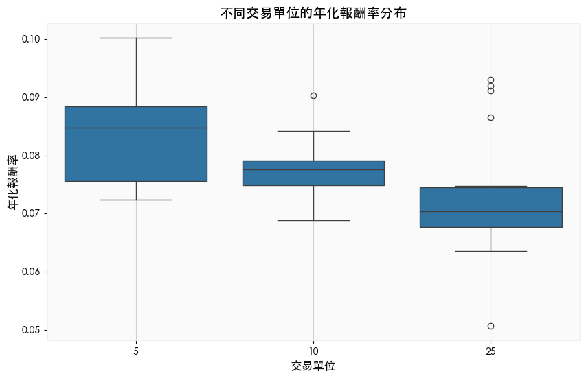

# 網格交易

<br>

## 規劃最佳組合

_使用 `seaborn` 繪圖_

<br>

1. 安裝套件。

    ```bash
    pip install seaborn
    ```

<br>

2. 年化報酬率隨網格間距變化關係圖；網格策略的核心參數主要有網格間距、網格單位、上下網格差距比；網格間距越大，交易頻率越低，單筆利潤可能越高，但可能錯過細小波動的收益；網格單位越大，資金占用越高，但對單次波動的收益更敏感；上下網格差距比的目的是讓網格交易更加靈活地應對市場的非對稱波動，上漲網格是當價格上漲並達到設定的 `網格間距` 時觸發 `賣出` 操作，下跌網格是當價格下跌並達到設定的 `網格間距` 時觸發 `買入` 操作，上下網格差距比是指上漲網格間距與下跌網格間距的比例，用於設定不對稱的交易區間，能夠在不同市場條件下提高網格策略的適用性與收益穩定性。

    ```python
    import seaborn as sns
    from matplotlib import rcParams

    # 設定支持中文顯示的字體
    rcParams['font.family'] = 'Heiti TC'
    # 確保負號正常顯示
    rcParams['axes.unicode_minus'] = False

    # 繪製網格間距與平均年化報酬率圖
    # 將數據分組並計算平均
    grouped = pdf.groupby('網格間距')['年化報酬率'].mean()

    # 繪製圖表
    plt.figure(figsize=(10, 6))
    plt.plot(grouped.index, grouped.values, marker='o')
    plt.xlabel("網格間距", fontsize=12)
    plt.ylabel("平均年化報酬率", fontsize=12)
    plt.title("網格間距與平均年化報酬率", fontsize=14)
    plt.grid()
    plt.show()
    ```

    

<br>

3. 透過箱型圖觀察不同交易單位的年化報酬率分布；以此圖分析，交易單位較小的中位數較高，且數據分布集中，表明這個策略在大多數情況下能產生較高且穩定的收益；而交易單位較大時可能因市場波動不充分而導致更大的收益波動，可能適合偏好捕捉高風險高收益的投資者。

    ```python
    plt.figure(figsize=(10, 6))
    sns.boxplot(data=pdf, x='交易單位', y='年化報酬率')
    plt.title("不同交易單位的年化報酬率分布", fontsize=14)
    plt.xlabel("交易單位", fontsize=12)
    plt.ylabel("年化報酬率", fontsize=12)
    plt.grid()
    plt.show()
    ```

    

<br>

## 進階操作

1. 計算 `Sharpe Ratio（夏普比率）` 作為風險調整後的績效評估指標。

    ```python
    # 計算標準差作為波動率
    pdf['波動率'] = pdf['年化報酬率'].std()
    # 計算 Sharpe Ratio（夏普比率）
    pdf['夏普比率'] = pdf['年化報酬率'] / pdf['波動率']

    # 按夏普比率排序，找到最佳策略組合
    pdf.sort_values(by='夏普比率', ascending=False, inplace=True)

    # 查看排名前 5 的策略
    print(pdf.head())
    ```

    

<br>

2. 計算回測過程中的 `最大回撤（Maximum Drawdown, MDD）` 衡量策略的資金回撤風險；以結果分析，表示在回測期間內投資組合的資金曲線相對於最高點曾經下降過 `20.16`。

    ```python
    # 計算累進資金曲線
    # 累進資金是隨著每筆交易累積的資金曲線，計算方式為累積所有的 單筆報酬
    position_table['累進資金'] = position_table['單筆報酬'].cumsum()

    # 計算最大回撤
    cumulative_return = position_table['累進資金']
    # 計算累進資金曲線到每個時點為止的 `歷史最高值`
    # 這代表投資人面臨的 `資金損失幅度`
    drawdown = cumulative_return - cumulative_return.cummax()
    # 取回撤中的最小值，也就是 `最負值`
    # 即累進資金曲線距離其歷史最高點的最大損失幅度
    max_drawdown = drawdown.min()

    print(f"最大回撤 (MDD): {max_drawdown}")
    ```

    

<br>

3. 使用 `熱力圖（Heatmap）` 可視化性能；其中X軸是 `上下網格差距比率`、Y軸是 `網格間距`，而顏色梯度是 `年化報酬率`。

    ```python
    # Pivot table 格式化數據
    heatmap_data = pdf.pivot_table(
        values='年化報酬率', 
        index='網格間距', 
        columns='上下網格差距比率'
    )

    # 繪製熱力圖
    plt.figure(figsize=(10, 8))
    sns.heatmap(
        heatmap_data, 
        annot=True, 
        fmt=".2f", 
        cmap="YlGnBu"
    )
    plt.title("網格間距與上下網格差距比對年化報酬率的影響", fontsize=14)
    plt.xlabel("上下網格差距比率", fontsize=12)
    plt.ylabel("網格間距", fontsize=12)
    plt.show()
    ```

    

<br>

4. 將市場數據劃分為 `多頭`、`空頭` 和 `震盪市`，並分別測試策略性能；根據價格的長期變化來判斷市場情境，並對網格間距進行調整。這樣可以有效應對不同的市場波動特徵，提升網格策略的適用性和回報穩定性。

    ```python
    # 定義市場情境
    def market_condition(data):
        if data['close'].iloc[-1] > data['close'].iloc[0] * 1.2:
            return "多頭"
        elif data['close'].iloc[-1] < data['close'].iloc[0] * 0.8:
            return "空頭"
        else:
            return "震盪市"

    # 根據市場情境劃分數據
    condition = market_condition(data)
    print(f"市場情境: {condition}")

    # 在不同市場情境下測試策略
    if condition == "多頭":
        # 窄間距
        grid_gap = 0.02
    elif condition == "空頭":
        # 寬間距
        grid_gap = 0.05
    else:
        # 平衡間距
        grid_gap = 0.03
    ```

    

<br>

5. 按年份分組計算每年的年化報酬率，分析策略在不同年份的穩定性。

    ```python
    # 添加年份列
    position_table['年份'] = position_table['進場時間'].dt.year

    # 計算每年的年化報酬率
    yearly_performance = (
        position_table.groupby('年份')['單筆報酬率']
        .sum() + 1
    ) ** (1 / len(position_table['年份'].unique())) - 1

    print("逐年年化報酬率:")
    print(yearly_performance)
    ```

    

<br>

6. 繪製逐年年化報酬率柱狀圖。

    ```python
    yearly_performance.plot(kind='bar', figsize=(10, 6), color='skyblue')
    plt.title("逐年年化報酬率", fontsize=14)
    plt.xlabel("年份", fontsize=12)
    plt.ylabel("年化報酬率", fontsize=12)
    plt.grid()
    plt.show()
    ```

    

<br>

## 進階觀察

1. 根據參數的不同，分析 `高風險` 和 `低風險` 策略的回報與穩定性；從風險與收益的角度來看，兩者的年化報酬率幾乎一致，那選擇低風險策略是更明智的決定。

    ```python
    # 高風險策略：網格間距大，交易單位大
    high_risk = pdf[(pdf['網格間距'] >= 0.08) & (pdf['交易單位'] >= 10)]

    # 低風險策略：網格間距小，交易單位小
    low_risk = pdf[(pdf['網格間距'] <= 0.04) & (pdf['交易單位'] <= 5)]

    # 比較年化報酬率
    plt.figure(figsize=(10, 6))
    plt.bar(['高風險策略', '低風險策略'], [high_risk['年化報酬率'].mean(), low_risk['年化報酬率'].mean()], color=['red', 'green'])
    plt.title("高風險與低風險策略的年化報酬率比較", fontsize=14)
    plt.ylabel("平均年化報酬率", fontsize=12)
    plt.grid()
    plt.show()
    ```

    

<br>

2. 繪製策略整個回測過程中的累計盈虧變化。

    ```python
    # 計算累計盈虧
    position_table['累計盈虧'] = position_table['單筆報酬'].cumsum()

    # 繪製累計盈虧曲線
    plt.figure(figsize=(12, 6))
    plt.plot(
        position_table['進場時間'], 
        position_table['累計盈虧'], 
        label='累計盈虧', 
        color='blue'
    )
    plt.title("累計盈虧曲線", fontsize=14)
    plt.xlabel("進場時間", fontsize=12)
    plt.ylabel("累計盈虧", fontsize=12)
    plt.grid()
    plt.legend()
    plt.show()
    ```

    

<br>

___

_END_