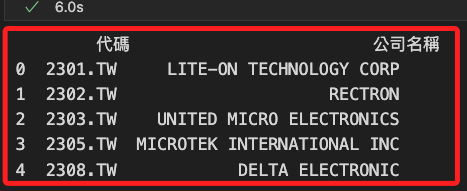
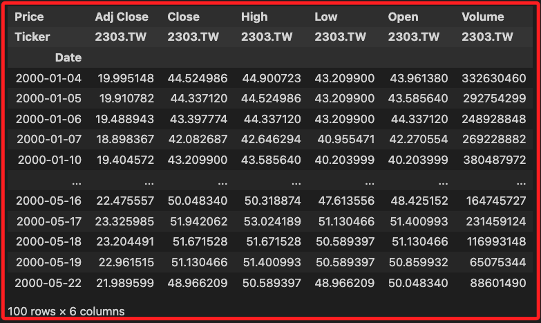
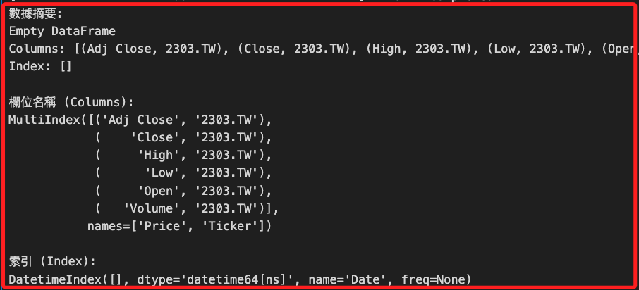
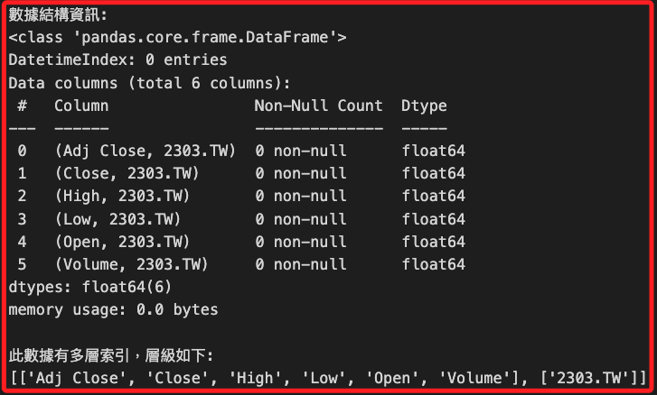

# yfinance

<br>

## 準備工作

1. 安裝套件。

    ```bash
    pip install yfinance -q
    ```

<br>

## 取得資料

1. 輸入範圍依實際股票代碼查詢套件股票代碼，這裡已 `2300 ~ 2310` 為例；特別注意，透過內建模組 `logging` 忽略錯誤部分。

    ```python
    import yfinance as yf
    import pandas as pd
    import logging

    # 禁止不必要的錯誤日誌
    logging.getLogger("yfinance").setLevel(logging.CRITICAL)
    # 測試 2300.TW 到 2309.TW
    codes = [f"{i}.TW" for i in range(2300, 2310)]
    valid_codes = []

    for code in codes:
        try:
            stock = yf.Ticker(code)
            info = stock.info
            # 檢查是否包含 'shortName'
            if 'shortName' in info:
                valid_codes.append({
                    "代碼": code, 
                    "公司名稱": info['shortName']
                })
        except Exception:
            # 忽略錯誤，繼續處理其他代碼
            continue

    # 將結果轉為 DataFrame
    df_valid_codes = pd.DataFrame(valid_codes)

    # 顯示結果
    print(df_valid_codes)
    ```

    

<br>

2. 使用模組取得指定標的的數據，這裡已 `2303.TW` 為例。

    ```python
    # 商品名稱
    prod = "2303.TW"
    # 取得全部資料
    data = yf.download(prod, period="max")
    # 擷取資料開頭
    data.head(100)
    ```

    

<br>

## 數據結構

1. 透過以下代碼來觀察返回的數據結構。

    ```python
    import pandas as pd
    import yfinance as yf

    # 下載數據，使用代碼範例 2303.TW
    symbol = "2303.TW"
    # 載入數據
    data = yf.download(symbol, period="100d")

    # 查看數據的基本結構
    print("數據摘要:")
    print(data.head())

    # 查看欄位名稱
    print("\n欄位名稱 (Columns):")
    print(data.columns)

    # 查看索引
    print("\n索引 (Index):")
    print(data.index)

    # 查看數據框架的結構
    print("\n數據結構資訊:")
    data.info()

    # 查看是否存在多層索引
    if isinstance(data.columns, pd.MultiIndex):
        print("\n此數據有多層索引，層級如下:")
        print(data.columns.levels)
    else:
        print("\n此數據為單層索引")
    ```

    

<br>

2. 結構。

    

<br>

___

_END_