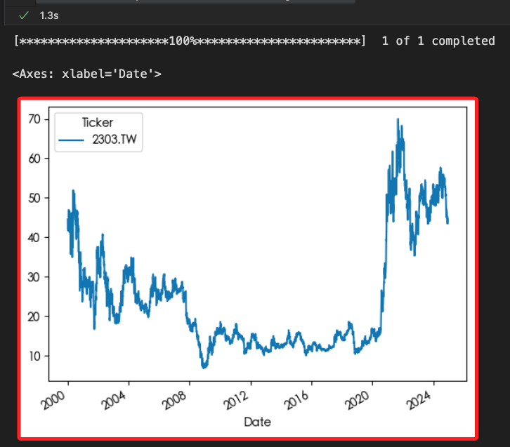
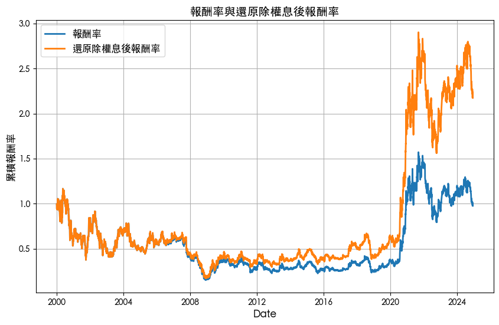

# 基礎繪圖

<br>

## 準備工作

1. 安裝套件。

    ```bash
    pip install matplotlib -q
    ```

<br>

2. 查看支援的字型。

    ```python
    import matplotlib.font_manager
    print([
        f.name for f in matplotlib.font_manager.fontManager.ttflist
    ])
    ```

    

<br>

## 腳本

1. 載入套件與字型。

    ```python
    import yfinance as yf
    import pandas as pd
    import matplotlib

    # 更改為可用字型名稱
    matplotlib.rc('font', family='Heiti TC')
    ```

<br>

2. 繪製折線圖。

    ```python
    # 商品名稱
    prod = "2303.TW"
    # 取得全部資料
    data = yf.download(prod, period="max")
    # 繪製折線圖
    data['Close'].plot(label='收盤價',legend=True)
    ```

    

<br>

3. 繪製多條線。

    ```python
    import matplotlib.pyplot as plt

    # 建立一個新圖表
    plt.figure(figsize=(10, 6))

    # 使用 plt.plot 繪圖
    plt.plot(
        (data['Close'].pct_change() + 1).cumprod(), 
        label='報酬率', 
        linewidth=2
    )
    # 繪製第二條線
    plt.plot(
        (data['Adj Close'].pct_change() + 1).cumprod(), 
        label='還原除權息後報酬率', 
        linewidth=2
    )

    # 添加標題和標籤
    plt.title("報酬率與還原除權息後報酬率", fontsize=14)
    plt.xlabel("Date", fontsize=12)
    plt.ylabel("累積報酬率", fontsize=12)

    # 添加圖例
    plt.legend(fontsize=12)

    # 添加網格
    plt.grid()

    # 顯示圖表
    plt.show()
    ```

    

<br>

___

_END_