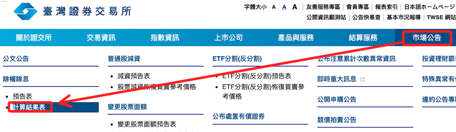
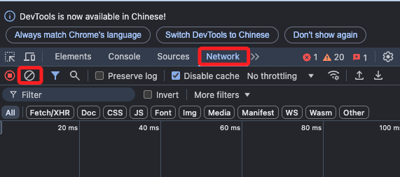
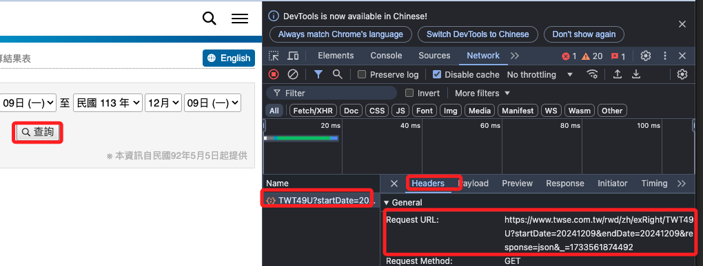
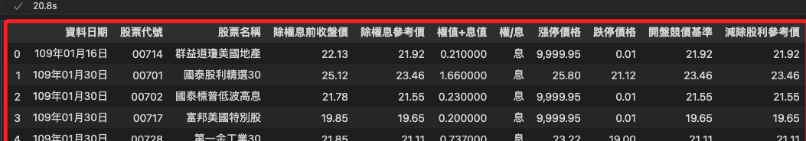

# 除權息

<br>

## 步驟

1. 進入至交所網站，在 `市場公告` 中點擊 `計算結果表`。

    

<br>

2. 點擊 `F12`，接著同樣切換到 `Network` 並清除內容。

    

<br>

3. 點擊 `查看` 來取得 URL。

    

<br>

4. 編輯這個網址，將其中的日期以變數帶入。

    ```python
    startDate = '20200101'
    endDate = datetime.now().strftime('%Y%m%d')

    URL = f'https://www.twse.com.tw/rwd/zh/exRight/TWT49U?startDate={startDate}&endDate={endDate}&response=json&_=1733561874492'
    ```

    

<br>

___

_END_