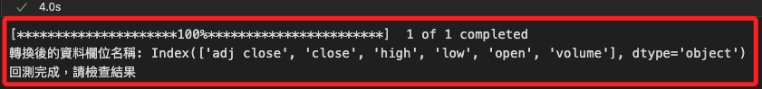
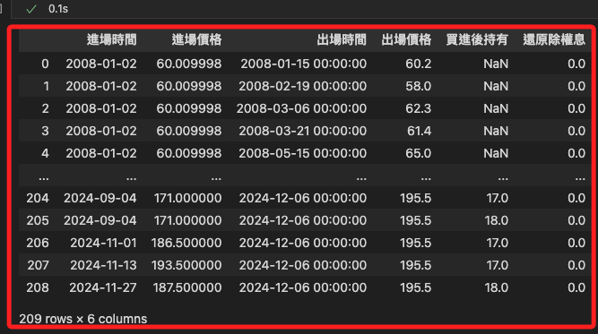
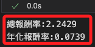

# 調整回測參數

<br>

## 說明

1. 載入庫及字型。

    ```python
    import mplfinance as mpf
    import matplotlib.pyplot as plt
    import pandas as pd
    import yfinance as yf
    from grid_backtest import trade

    # 設定全局字體以支援中文
    plt.rcParams['font.sans-serif'] = ['Microsoft JhengHei']
    ```

<br>

2. 網格交易參數設定。

    ```python
    # 金融商品設定
    symbol = '0050'
    # 設定初始部位 50%
    init_ratio = 50
    # 設定網格間距
    grid_gap = round(0.025, 2)
    # 設定交易單位 5%
    grid_unit = 5

    # 初始部位是幾個交易單位
    if init_ratio % grid_unit != 0:
        raise ValueError(
            "***出現錯誤，初始部位要可以被交易單位整除***"
        )
    init_unit = int(init_ratio / grid_unit)
    # 上漲跟下跌網格差距比率
    up_down_grid_gap_diff = 2
    ```

<br>

3. 網格交易策略演算法。

    ```python
    # 取得要回測的歷史資料
    data = yf.download(f'{symbol}.TW')

    # 確認並處理 MultiIndex 或欄位後綴
    if isinstance(data.columns, pd.MultiIndex):
        # 將 MultiIndex 轉換為單層索引，並移除後綴
        data.columns = ['_'.join(col).lower() for col in data.columns]
    else:
        data.columns = [col.split('_')[0].lower() for col in data.columns]

    # 簡化欄位名稱，移除後綴 '_0050.tw'
    data.columns = [col.split('_')[0] for col in data.columns]

    # 輸出轉換後的欄位名稱
    print("轉換後的資料欄位名稱:", data.columns)

    # 處理缺失值，填充數據
    data = data.replace(0, None).infer_objects(copy=False).ffill()

    # 確保所需欄位存在
    required_columns = ['open', 'high', 'low', 'close', 'volume']
    missing_columns = [col for col in required_columns if col not in data.columns]

    if missing_columns:
        raise ValueError(f"缺少必要欄位：{missing_columns}")

    # 期初買入張數
    init_time = data.index[0]
    init_price = data.loc[init_time, 'open']
    trade_position = trade(init_time, init_price, init_unit)

    # 依照迴圈來跑網格
    for index, row in data.iterrows():
        # 優先處理賣出的情況
        while row['open'] >= init_price * (1 + grid_gap * up_down_grid_gap_diff):
            init_price *= (1 + grid_gap * up_down_grid_gap_diff)
            trade_position.cover(index, row['open'])
        while row['high'] >= init_price * (1 + grid_gap * up_down_grid_gap_diff):
            init_price *= (1 + grid_gap * up_down_grid_gap_diff)
            trade_position.cover(index, init_price)
        # 處理買進的情況
        while row['open'] <= init_price * (1 - grid_gap):
            init_price *= (1 - grid_gap)
            if trade_position.position() < 100 / grid_unit:
                trade_position.order(index, row['open'])
        while row['low'] <= init_price * (1 - grid_gap):
            init_price *= (1 - grid_gap)
            if trade_position.position() < 100 / grid_unit:
                trade_position.order(index, init_price)

    # 最後一天的資料，把所有部位出場
    while trade_position.position() > 0:
        trade_position.cover(index, row['close'])

    # 結果處理完成
    print("回測完成，請檢查結果")
    ```

    

<br>

4. 還原。

    ```python
    # 還原除權息
    trade_position.restoreReturn(symbol)
    # 檢查進出紀錄
    trade_position.position_table
    ```

    

<br>

5. 報酬率計算。

    ```python
    position_table = trade_position.position_table
    position_table["單筆報酬"] = (
        position_table["出場價格"]
        - position_table["進場價格"]
        + position_table["還原除權息"]
    )
    position_table["單筆報酬率"] = (
        position_table["單筆報酬"] / position_table["進場價格"] * (grid_unit / 100)
    )
    total_return = (position_table["單筆報酬率"]).sum() + 1
    print(f"總報酬率:{round(total_return-1,4)}")
    yearly_return = total_return ** (1 / (data.shape[0] / 252)) - 1
    print(f"年化報酬率:{round(yearly_return,4)}")
    ```

    

<br>

## 繪圖

1. 代碼。

    ```python
    import matplotlib.pyplot as plt
    from matplotlib import font_manager as fm

    # 指定字體文件路徑，避免使用系統默認字體顯示問題
    # 更改為實際的字體文件路徑
    font_path = "./STHeiti Medium.ttc"
    font_prop = fm.FontProperties(fname=font_path)

    # 全局設置字體，避免每次都顯式指定
    plt.rcParams['font.family'] = font_prop.get_name()
    # 解決負號顯示問題
    plt.rcParams['axes.unicode_minus'] = False

    # 繪製報酬率累進圖和資金使用率圖
    fig, ax1 = plt.subplots(figsize=(12, 6))

    # 繪製累進報酬率
    line1, = ax1.plot(
        position_table.set_index('進場時間')['單筆報酬率'].cumsum(),
        label='報酬率累進圖',
        color='blue',
        linewidth=2
    )
    ax1.set_ylabel("累進報酬率 (%)", fontsize=12)
    ax1.set_xlabel("進場時間", fontsize=12)
    ax1.grid(visible=True, linestyle="--", alpha=0.5)

    # 設置第二個軸，繪製資金使用率
    ax2 = ax1.twinx()
    line2, = ax2.plot(
        position_table.set_index('進場時間')['買進後持有'],
        label='資金使用率',
        color='orange',
        linewidth=2
    )
    ax2.set_ylabel("資金使用率 (%)", fontsize=12)

    # 合併圖例，並將其放置於圖形右側
    lines = [line1, line2]
    labels = [line.get_label() for line in lines]
    ax1.legend(
        lines, 
        labels, 
        loc="upper left", 
        fontsize=10, 
        # 調整到圖形外部
        bbox_to_anchor=(1.05, 1),
        borderaxespad=0
    )

    # 增加右側空間
    plt.subplots_adjust(right=0.8)

    # 設置標題
    plt.title("報酬率與資金使用率", fontsize=14)

    # 顯示圖表
    plt.tight_layout()
    plt.show()
    ```

    

    2. 繪製K線圖與下單點位。

    ```python
    # 確保索引類型一致
    position_table["進場時間"] = pd.to_datetime(position_table["進場時間"])
    position_table["出場時間"] = pd.to_datetime(position_table["出場時間"])
    data.index = pd.to_datetime(data.index)

    # 第一次合併數據，處理進場價格
    entry_prices = position_table.groupby("進場時間")["進場價格"].first()
    data1 = pd.concat([data, entry_prices], axis=1)

    # 第二次合併數據，處理出場價格
    exit_prices = position_table.set_index("出場時間")["出場價格"].groupby("出場時間").first()
    data1 = pd.concat([data1, exit_prices], axis=1)

    # 確保進場價格和出場價格為數值型，避免數據類型不一致問題
    data1["進場價格"] = pd.to_numeric(data1["進場價格"], errors="coerce")
    data1["出場價格"] = pd.to_numeric(data1["出場價格"], errors="coerce")

    # 添加繪圖參數
    addp = []
    addp.append(
        mpf.make_addplot(
            data1["進場價格"], 
            scatter=True, 
            marker="^", 
            color="r"
        )
    )
    addp.append(
        mpf.make_addplot(
            data1["出場價格"], 
            scatter=True, 
            marker="v", 
            color="g"
        )
    )

    # 設置顏色和樣式
    mcolor = mpf.make_marketcolors(
        up="red", 
        down="green", 
        inherit=True
    )
    mstyle = mpf.make_mpf_style(
        base_mpf_style="yahoo", 
        marketcolors=mcolor
    )

    # 繪製蠟燭圖
    mpf.plot(
        data, 
        type="candle", 
        addplot=addp, 
        style=mstyle, 
        warn_too_much_data=999999
    )
    ```

    

<br>

___

_END_