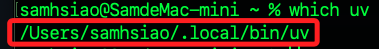
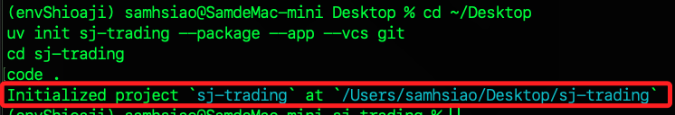
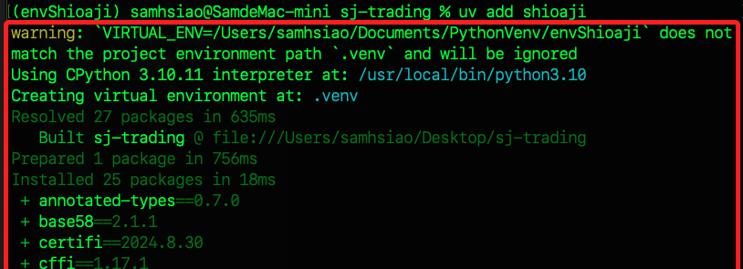
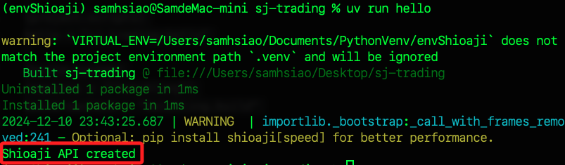
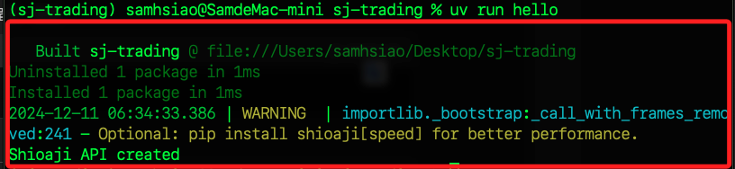
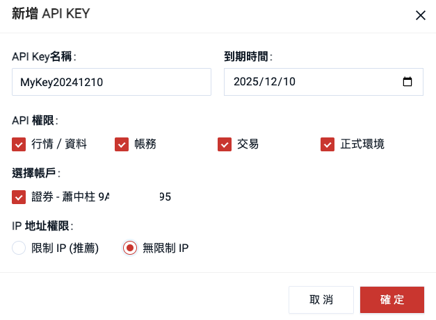

# 紀錄

<br>

## 準備工作

1. 假如在其他虛擬環境中，先退出當前虛擬環境，若無則跳過。

    ```bash
    deactivate
    ```

<br>

2. 透過指令自動化安裝 `uv`；啟動新的虛擬環境後，在任意路徑進行安裝。

    ```bash
    curl -LsSf https://astral.sh/uv/install.sh | sh
    ```

    

<br>

3. 透過驗證版本確認安裝已完成。

    ```bash
    uv --version
    ```

    

<br>

## 查看腳本

_若想查看這個安裝腳本內容，可下載查看_

<br>

1. 下載腳本到桌面。

    ```bash
    cd ~/Desktop && curl -LsSf https://astral.sh/uv/install.sh -o install.sh
    ```

<br>

2. 查看。

    ```bash
    cat install.sh
    ```

<br>

## 解除安裝

1. 檢查安裝路徑。

    ```bash
    which uv
    ```

    

<br>

2. 查看安裝資料夾與文件。

    ```bash
    ls ~/.local/bin/uv
    ls ~/.local/bin/uvx
    ls ~/.config/uv
    ```

<br>

3. 刪除安裝資料夾。

    ```bash
    rm -rf ~/.local/bin/uv
    rm -rf ~/.local/bin/uvx
    ```

<br>

4. 刪除配置文件。

    ```bash
    rm -rf ~/.config/uv
    ```

<br>

## 繼續

1. 透過 `uv` 初始化專案資料，並隨即在資料夾中啟動 VSCode；這裡示範建立在桌面。

    ```bash
    cd ~/Desktop
    uv init sj-trading --package --app --vcs git
    cd sj-trading
    code .
    ```

    

<br>

2. 可查看專案結構。

    ```bash
    tree
    ```

    

<br>

3. 建立文件 `.uv/config.json`。

    ```bash
    mkdir -p .uv && touch .uv/config.json
    ```

<br>

4. 編輯 `.uv/config.json` 內容。

    ```json
    {
        "python": "/Users/samhsiao/Documents/PythonVenv/envShioaji/bin/python"
    }
    ```

<br>

5. 在專案根目錄運行指令。

    ```bash
    uv add shioaji
    ```

    

<br>

6. 前面的步驟會自動建立虛擬環境 `.venv`。

    

<br>

## 環境變數

1. 在當前專案資料夾的 `.venv/bin` 開啟終端機，運行指令查詢路徑。

    ```bash
    pwd
    ```

<br>

2. 將路徑寫入設定文件，路徑尾綴加上 `activate`。

    ```bash
    code ~/.zshrc
    ```

<br>

3. 立即套用。

    ```bash
    source ~/.zshrc
    ```

<br>

## 編輯專案

1. 編輯 `src/sj_trading/__init__.py`。

    ```python
    import shioaji as sj

    def main() -> None:
        print("Hello from sj-trading!")

    def hello():
        get_shioaji_client()

    def get_shioaji_client() -> sj.Shioaji:
        api = sj.Shioaji()
        print("Shioaji API created")
        return api
    ```

<br>

2. 修正 `pyproject.toml`。

    ```toml
    [project]
    name = "sj-trading"
    version = "0.1.0"
    description = "Add your description here"
    readme = "README.md"
    authors = [
        { name = "samhsiao6238", email = "samhsiao6238@gmail.com" }
    ]
    requires-python = ">=3.10"
    dependencies = [
        "shioaji>=1.2.5",
    ]

    [project.scripts]
    hello = "sj_trading:hello"

    [build-system]
    requires = ["hatchling"]
    build-backend = "hatchling.build"
    ```

    

<br>

## 安裝套件

1. 手動安裝 pip。

    ```bash
    python -m ensurepip --upgrade
    ```

<br>

2. 確認。

    ```bash
    python -m pip --version
    ```

3. 升級。

    ```bash
    python -m pip install --upgrade pip
    ```

4. 套件。

    ```bash
    python -m pip install shioaji python-dotenv
    ```

<br>

## 測試

1. 在專案根目錄中運行指令。

    ```bash
    uv run hello
    ```

    

## 證卷

1. 新增 API Key。

    

<br>

2. 確定。

    

<br>

## 編輯專案

1. 在專案根目錄添加文件 `.env`，並編輯 `.gitignore`，加入 `.env`。

    ```json
    .env
    ```

<br>

2. 編輯 `.env` 文件，貼上以下內容；其中 `CA_PASSWORD` 就是用戶的身分證字號，第一碼大寫；如有必要可參考 [官網影片](https://www.youtube.com/watch?v=0tPCZiRsz-U&t=84s)。

    ```bash
    API_KEY=<輸入-API_Key>
    SECRET_KEY=<輸入-Secret_Key>
    CA_CERT_PATH=Sinopac.pfx
    CA_PASSWORD=<輸入用戶密碼>
    ```

<br>

## 編輯腳本

1. 導入套件。

    ```python
    import os
    from dotenv import load_dotenv
    ```

<br>

2. 載入環境變數。

    ```python
    load_dotenv()
    ```

<br>

3. 編輯既有的 `main()` 函數，覆蓋原本內容即可。

    ```python
    def main():
        api = sj.Shioaji(simulation=True)
        api.login(
            api_key=os.environ["API_KEY"],
            secret_key=os.environ["SECRET_KEY"],
            fetch_contract=False
        )
        api.activate_ca(
            ca_path=os.environ["CA_CERT_PATH"],
            ca_passwd=os.environ["CA_PASSWORD"],
        )
        print("login and activate ca success")
    ```

<br>

4. 編輯 `pyproject.toml`，在 `[project.scripts]` 區塊加入指令。

    ```toml
    [project.scripts]
    main = "sj_trading:main"
    hello = "sj_trading:hello"
    ```

<br>

5. 測試登入。

    ```bash
    uv run main
    ```

    

<br>

___

_END_