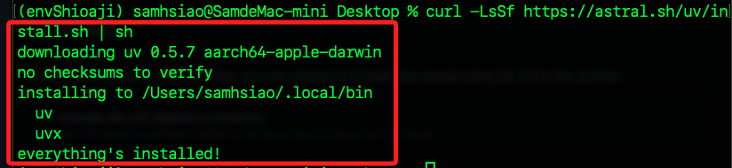
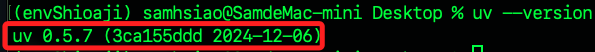
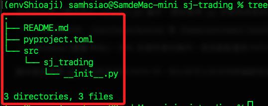
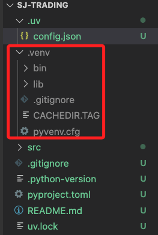

# 紀錄

<br>

## 準備工作

1. 假如在其他虛擬環境中，先退出當前虛擬環境，若無則跳過。

```bash
deactivate
```

<br>

2. 透過指令自動化安裝 `uv`；啟動新的虛擬環境後，在任意路徑進行安裝。

```bash
curl -LsSf https://astral.sh/uv/install.sh | sh
```



<br>

3. 透過驗證版本確認安裝已完成。

```bash
uv --version
```



<br>

## 查看腳本

_若想查看這個安裝腳本內容，可下載查看_

1. 下載腳本到桌面。

```bash
cd ~/Desktop && curl -LsSf https://astral.sh/uv/install.sh -o install.sh
```

<br>

2. 查看。

```bash
cat install.sh
```

<br>

## 解除安裝

1. 檢查安裝路徑。

```bash
which uv
```


<br>

2. 查看安裝資料夾與文件。

```bash
ls ~/.local/bin/uv
ls ~/.local/bin/uvx
ls ~/.config/uv
```

<br>

3. 刪除安裝資料夾。

```bash
rm -rf ~/.local/bin/uv
rm -rf ~/.local/bin/uvx
```

<br>

4. 刪除配置文件。

```bash
rm -rf ~/.config/uv
```

<br>

## 繼續

1. 透過 `uv` 初始化專案資料，並隨即在資料夾中啟動 VSCode；這裡示範建立在桌面。

```bash
cd ~/Desktop
uv init sj-trading --package --app --vcs git
cd sj-trading
code .
```


<br>

2. 可查看專案結構。

```bash
tree
```



<br>

3. 建立文件 `.uv/config.json`。

```bash
mkdir -p .uv && touch .uv/config.json
```

<br>

4. 編輯 `.uv/config.json` 內容。

```json
{
    "python": "/Users/samhsiao/Documents/PythonVenv/envShioaji/bin/python"
}
```

<br>

5. 在專案根目錄運行指令。

```bash
uv add shioaji
```


<br>

6. 前面的步驟會自動建立虛擬環境 `.venv`。



## 環境變數

1. 在當前專案資料夾的 `.venv/bin` 開啟終端機，運行指令查詢路徑。

```bash
pwd
```

<br>

2. 將路徑寫入設定文件，路徑尾綴加上 `activate`。

```bash
code ~/.zshrc
```

<br>

3. 立即套用。

```bash
source ~/.zshrc
```

<br>

## 編輯專案

1. 編輯 `src/sj_trading/__init__.py`。

```python
import shioaji as sj

def main() -> None:
    print("Hello from sj-trading!")

def hello():
    get_shioaji_client()

def get_shioaji_client() -> sj.Shioaji:
    api = sj.Shioaji()
    print("Shioaji API created")
    return api
```

<br>

2. 修正 `pyproject.toml`。

```toml
[project]
name = "sj-trading"
version = "0.1.0"
description = "Add your description here"
readme = "README.md"
authors = [
    { name = "samhsiao6238", email = "samhsiao6238@gmail.com" }
]
requires-python = ">=3.10"
dependencies = [
    "shioaji>=1.2.5",
]

[project.scripts]
hello = "sj_trading:hello"

[build-system]
requires = ["hatchling"]
build-backend = "hatchling.build"
```


<br>

## 安裝套件

1. 更新。

```bash
pip install --upgrade pip
```

<br>

2. 套件。

```bash
pip install shioaji python-dotenv
```

<br>

## 證卷

1. 新增 API Key。


<br>

2. 確定。


<br>
