# 建立環境

_開啟新的終端機、建立全新虛擬環境_

<br>

## 準備工作

1. 開啟新的終端機後，假如顯示在其他虛擬環境中，先退出當前虛擬環境，若無則跳過該步驟。

    ```bash
    deactivate
    ```

<br>

2. 透過自動化指令安裝 `uv`，在任意路徑安裝即可。

    ```bash
    curl -LsSf https://astral.sh/uv/install.sh | sh
    ```

    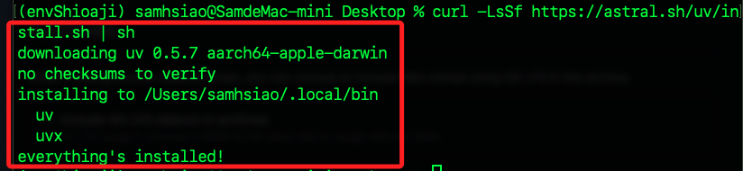

<br>

3. 透過驗證版本確認安裝已完成。

    ```bash
    uv --version
    ```

    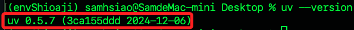

<br>

## 簡介 `uv`

_適合需要輕量級依賴管理的 Python 開發_

<br>

1. uv 是一個現代化的 Python 依賴管理工具，提供了簡單的方式來管理 Python 的依賴項目和虛擬環境，類似於 poetry 或 pipenv。

<br>

2. 支援 pyproject.toml 作為依賴描述文件，符合 PEP 517/518 標準。

<br>

3. 以上自動化指令會下載 install.sh 腳本，執行後會檢查系統環境並安裝最新的 uv 工具，同時也會添加到系統的 PATH 中。

<br>

## 查看腳本

_若想查看這個安裝腳本內容可下載查看，實作可略過該步驟_

<br>

1. 下載腳本到桌面。

    ```bash
    cd ~/Desktop && curl -LsSf https://astral.sh/uv/install.sh -o install.sh
    ```

<br>

2. 查看。

    ```bash
    cat install.sh
    ```

<br>

3. 完成後刪除這個腳本。

    ```bash
    rm -rf ~/Desktop/install.sh
    ```

<br>

## 解除安裝

_提供清理這個環境的操作說明，有需要時可按步驟操作_

<br>

1. 確認安裝路徑。

    ```bash
    which uv
    ```

    

<br>

2. 確認安裝資料夾與文件。

    ```bash
    ls ~/.local/bin/uv
    ls ~/.local/bin/uvx
    ls ~/.config/uv
    ```

    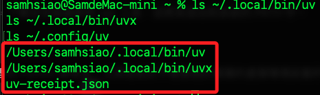

<br>

3. 刪除安裝資料夾與配置文件。

    ```bash
    rm -rf ~/.local/bin/uv
    rm -rf ~/.local/bin/uvx
    rm -rf ~/.config/uv
    ```

<br>

4. 刪除專案資料夾，這裡是建立在桌面。

    ```bash
    rm -rf ~/Desktop/sj-trading
    ```

<br>

## 建立專案

1. 透過 `uv` 工具初始化專案環境，同時將預設的 `.git` 刪除，接著在資料夾中啟動 VSCode；這裡示範建立在桌面。

    ```bash
    cd ~/Desktop
    uv init sj-trading --package --app --vcs git
    cd sj-trading
    rm -rf .git
    code .
    ```

    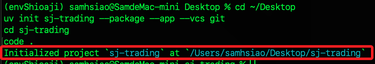

<br>

2. 在終端機運行令查看專案結構。

    ```bash
    tree
    ```

    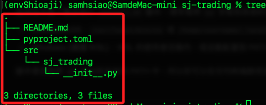

<br>

3. 在專案資料夾中手動建立設置文件 `.uv/config.json`。

    ```bash
    mkdir -p .uv && touch .uv/config.json
    ```

<br>

4. 進入 VSCode，編輯 `.uv/config.json` 貼上以下內容，用以指定 Python 解釋器路徑；這是用來簡化後續可能產生的種種環境衝突。

    ```json
    {
        "python": "/Users/samhsiao/Documents/PythonVenv/envShioaji/bin/python"
    }
    ```

<br>

5. 回到終端機，在專案根目錄運行指令，這會安裝 shioaji 套件，與直接使用 `pip install shioaji` 不同，`uv add` 會結合專案的依賴管理機制，將套件與專案緊密關聯，方便版本控制與環境重現。

    ```bash
    uv add shioaji
    ```

    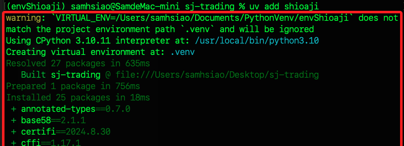

<br>

6. 前面的步驟會自動建立虛擬環境 `.venv`。

    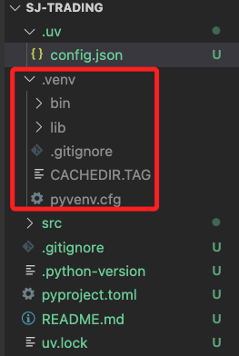

<br>

7. 在 VSCode 中若出現彈窗，直接關閉即可。

    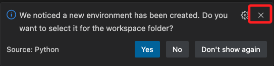

<br>

## 環境變數

1. 在專案資料夾內的 `.venv/bin` 開啟終端機。

    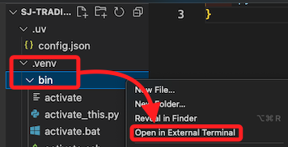

<br>

2. 運行指令查詢路徑。

    ```bash
    pwd
    ```

    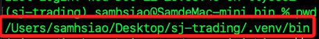

<br>

3. 開啟環境設定文件。

    ```bash
    code ~/.zshrc
    ```

<br>

4. 將路徑以以下格式寫入設定文件，路徑尾綴加上 `activate`

    ```bash
    source /Users/<填入自己的路徑名稱>/Desktop/sj-trading/.venv/bin/activate
    ```
    
    

<br>

5. 儲存並立即套用。

    ```bash
    source ~/.zshrc
    ```

    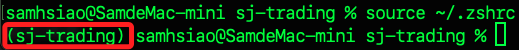

<br>

## 編輯腳本

_回到 VSCode_

<br>

1. 編輯 `src/sj_trading/__init__.py`，完全覆蓋預設內容即可。

    ```python
    import shioaji as sj

    def main() -> None:
        print("Hello from sj-trading!")

    def hello():
        get_shioaji_client()

    def get_shioaji_client() -> sj.Shioaji:
        api = sj.Shioaji()
        print("Shioaji API created")
        return api
    ```

<br>

2. 查看腳本 `pyproject.toml`，這時應該會類似以下內容。

    ```toml
    [project]
    name = "sj-trading"
    version = "0.1.0"
    description = "Add your description here"
    readme = "README.md"
    authors = [
        { name = "samhsiao6238", email = "samhsiao6238@gmail.com" }
    ]
    requires-python = ">=3.10"
    dependencies = [
        "shioaji>=1.2.5",
    ]

    [project.scripts]
    sj-trading = "sj_trading:main"

    [build-system]
    requires = ["hatchling"]
    build-backend = "hatchling.build"
    ```

<br>

3. 編輯 `[project.scripts]` 部分，添加以下代碼，其餘不變。

    ```toml
    [project.scripts]
    hello = "sj_trading:hello"
    sj-trading = "sj_trading:main"
    ```

<br>

4. 運行以下測試代碼，最末行會顯示 `Shioaji API created` 代表運行成功。

    ```bash
    uv run hello
    ```

    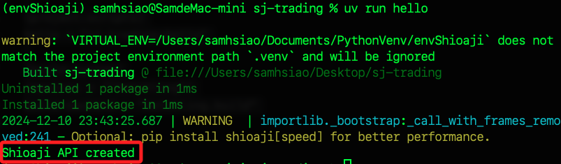

<br>

## 安裝套件

1. 手動安裝或升級 pip；這是初始化或修復 pip 工具的指令，當 Python 在某些精簡版中不自帶 pip 時，ensurepip 是用於從內建資源中提取並安裝 pip 的唯一方法。

    ```bash
    python -m ensurepip --upgrade
    ```

    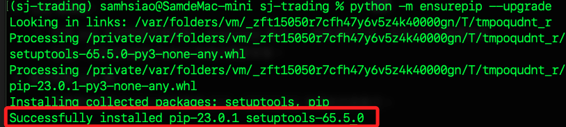

<br>

2. 確認安裝完成。

    ```bash
    python -m pip --version
    ```

    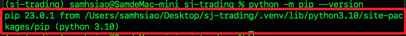

<br>

3. 升級。

    ```bash
    python -m pip install --upgrade pip
    ```

<br>

4. 使用 pip 安裝套件。

    ```bash
    python -m pip install shioaji python-dotenv
    ```

<br>

5. 可再次測試是否正常運作。

    ```bash
    uv run hello
    ```

    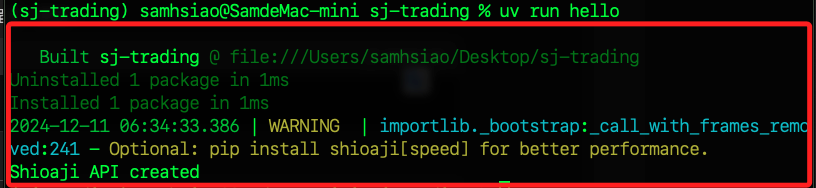

<br>

___

_接續下一單元_