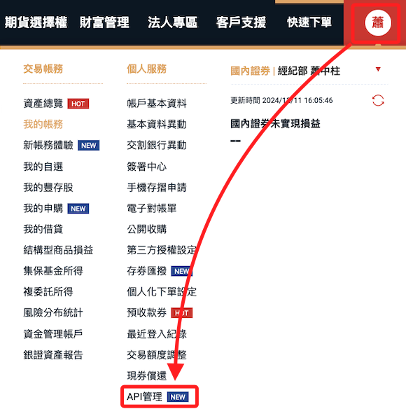
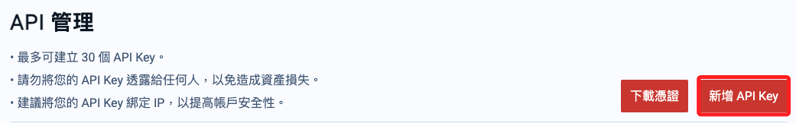
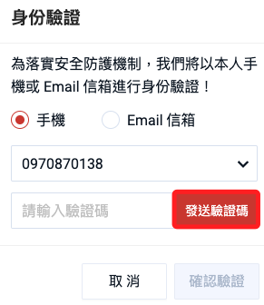
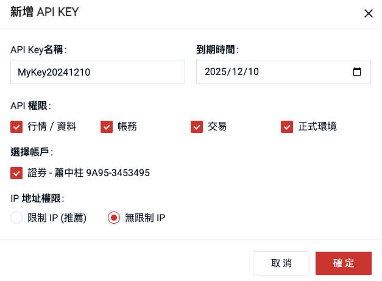
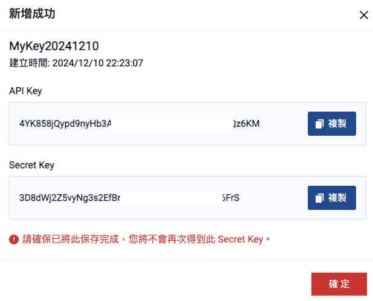
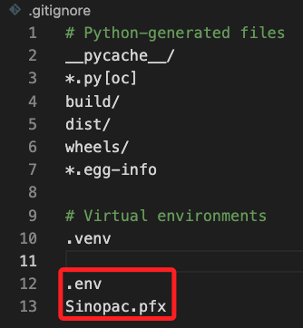
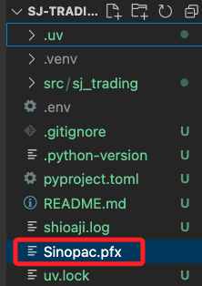
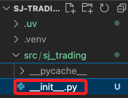
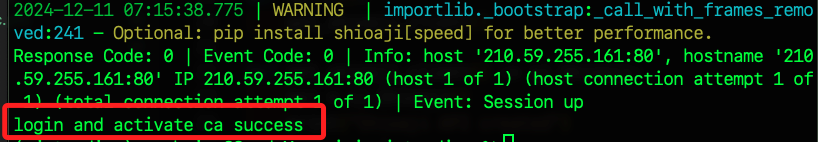

# API Key

_登入 [官網](https://www.sinotrade.com.tw/newweb/)_

<br>

## 管理 API Key

1. 登入官網後，展開功能，選取 `API 管理`。

    

<br>

2. 新增 API Key。

    

<br>

3. 先進行相關驗證。

    

<br>

4. 建立新的 API Key。

    

<br>

5. 完成後複製密鑰並且下載憑證。

    

<br>

## 編輯敏感資訊

1. 確認回到專案根目錄。

    ```bash
    cd ~/Desktop/sj-trading
    ```

<br>

2. 在專案根目錄添加文件 `.env`。

    ```json
    touch .env
    ```

<br>

3. 在 VSCode 中編輯既有文件 `.gitignore`，寫入 `.env`、`Sinopac.pfx` 避免將敏感資訊上傳；特別注意，這個步驟很重要，在寫入敏感資訊前務必確認已完成；補充說明，雖然當前並未建立同步，但這步驟是編程工作的良好習慣。

    ```json
    .env
    Sinopac.pfx
    ```

    

<br>

4. 將下載的憑證拖曳到專案資料夾中。

    

<br>

5. 編輯 `.env` 文件，貼上以下內容；其中 `CA_PASSWORD` 就是用戶的身分證字號，第一碼大寫；如有必要可參考 [官網影片](https://www.youtube.com/watch?v=0tPCZiRsz-U&t=84s)；`LINE_NOTIFY=` 部分暫時保持空白。

    ```bash
    API_KEY=<輸入-API_Key>
    SECRET_KEY=<輸入-Secret_Key>
    CA_CERT_PATH=Sinopac.pfx
    CA_PASSWORD=<輸入用戶密碼>
    LINE_NOTIFY=
    ```

<br>

## 編輯腳本

1. 再次開啟預設建立的 `__init__.py` 腳本進行編輯，依循後續步驟指引添加代碼。

    

<br>

2. 導入套件。

    ```python
    import os
    from dotenv import load_dotenv
    ```

<br>

3. 載入環境變數。

    ```python
    load_dotenv()
    ```

<br>

4. 編輯既有的 `main()` 函數，覆蓋原本內容即可。

    ```python
    def main():
        api = sj.Shioaji(simulation=True)
        api.login(
            api_key=os.environ["API_KEY"],
            secret_key=os.environ["SECRET_KEY"],
            fetch_contract=False
        )
        api.activate_ca(
            ca_path=os.environ["CA_CERT_PATH"],
            ca_passwd=os.environ["CA_PASSWORD"],
        )
        print("login and activate ca success")
    ```

<br>

5. 完成的腳本如下。

    ```python
    import shioaji as sj
    import os
    from dotenv import load_dotenv

    load_dotenv()

    def main():
        api = sj.Shioaji(simulation=True)
        api.login(
            api_key=os.environ["API_KEY"],
            secret_key=os.environ["SECRET_KEY"],
            fetch_contract=False
        )
        api.activate_ca(
            ca_path=os.environ["CA_CERT_PATH"],
            ca_passwd=os.environ["CA_PASSWORD"],
        )
        print("login and activate ca success")

    def hello():
        get_shioaji_client()

    def get_shioaji_client() -> sj.Shioaji:
        api = sj.Shioaji()
        print("Shioaji API created")
        return api
    ```

<br>

6. 編輯 `pyproject.toml`，在 `[project.scripts]` 區塊加入 `main = "sj_trading:main"`。

    ```toml
    [project.scripts]
    main = "sj_trading:main"
    hello = "sj_trading:hello"
    sj-trading = "sj_trading:main"
    ```

<br>

## 測試

_關閉原本的 VSCode 與終端機視窗，重新啟動專案_

<br>

1. 運行以下指令測試登入。

    ```bash
    uv run main
    ```

    

<br>

___

_延續以下單元繼續進行登入操作_