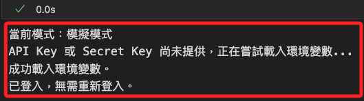
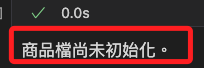
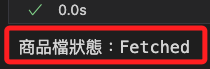

# 登入流程

_永豐金 Shioaji API 的登入流程，以下將使用 Jupyter Notebook 進行運作，可參考 [官方文件](https://sinotrade.github.io/)。_

<br>

## 準備工作

_以下將完整介紹使用 API 進行登入的各種設置，部分函數會進行封裝便於重用，也會獨立介紹不同的 API 方法，這些方法可能用於後續封裝的函數中_

<br>

1. 新增 `.ipynb` 文件，任意命名如 `ex01.ipynb`。

    ```bash
    touch ex01.ipynb
    ```

<br>

2. 開啟前述步驟所建立的腳本，點擊右上 `Select Kernel` 選取正確核心 `.venv`。

    

<br>

3. 載入 `shioaji` 模組並查詢版本。

    ```python
    import shioaji as sj

    print(sj.__version__)
    ```

    

<br>

4. 初始化 Shioaji API。

    ```python
    # 初始化 Shioaji API
    def init_Shioaji(simulation=True):
        try:
            # 預設模擬環境，可顯式設置為正式環境
            api = sj.Shioaji(simulation=simulation)
            print("Shioaji API 初始化成功。")
            return api
        except Exception as e:
            print(f"Shioaji API 初始化失敗：{e}")
            return None

    # 初始化，並傳出全局變數 api
    api = init_Shioaji()
    ```

<br>

5. 載入環境變數。

    ```python
    # 載入環境變數
    def load_env_variables():
        import os
        from dotenv import load_dotenv
        load_dotenv()

        api_key = os.environ["API_KEY"]
        secret_key = os.environ["SECRET_KEY"]
        if not api_key or not secret_key:
            raise ValueError(
                "API_KEY 或 SECRET_KEY 環境變數缺失，"
                "請檢查 .env 文件。"
            )
        return api_key, secret_key

    # 載入環境變數，並傳出全局變數
    api_key, secret_key = load_env_variables()
    ```

<br>

## 登入帳號

_特別注意，這裡檢查的並非連線數，API 對於單一帳號的連線數有限制，但並無對應的函數可查詢連線數。_

<br>

1. 檢查 API 登入狀態，如果已登入返回 True，否則返回 False。

    ```python
    # 檢查登入狀態
    def check_login_status(api):
        try:
            accounts = api.list_accounts()
            if accounts:
                return True
            return False
        except AttributeError:
            return False
        except Exception as e:
            print(f"檢查登入狀態時發生錯誤：{e}")
            return False

    # 檢查登入狀態，這個函數將被其他函數調用，所以不輸出累贅資訊
    check_login_status(api)
    ```

<br>

2. 嘗試並檢查是否登入 Shioaji 帳號，若未傳入 API，將進行初始化，若已登入則直接返回 API 物件；參數 `simulation` 預設值為 `True`，代表 `模擬模式`，若要正式下單則需顯式設置為 `False`，代表 `正式模式`；特別注意，帳號登入後無法切換模式，如需切換必須重新初始化 API 並再次登入。

    ```python
    # 登入帳號並檢查是否已登入
    def login_Shioaji(
        api=None,
        api_key=None, 
        secret_key=None, 
        simulation=True
    ):
        try:
            # 如果未傳入 API，則進行初始化
            if api is None:
                print("API 尚未初始化，正在初始化 Shioaji API...")
                api = init_Shioaji(simulation=simulation)
                if api is None:
                    print("API 初始化失敗，無法登入。")
                    return None

            # 如果未傳入 API Key 或 Secret Key，則嘗試載入環境變數
            if not api_key or not secret_key:
                print("API Key 或 Secret Key 尚未提供，正在嘗試載入環境變數...")
                try:
                    api_key, secret_key = load_env_variables()
                    print("成功載入環境變數。")
                except Exception as e:
                    print(f"載入環境變數失敗，請確認 .env 文件是否存在且正確：{e}")
                    return None

            # 調用自訂函數檢查是否已登入
            if check_login_status(api):
                print("已登入，無需重新登入。")
                return api

            # 如果尚未登入，執行登入
            print("尚未登入，嘗試登入中...")
            try:
                accounts = api.login(
                    api_key=api_key, 
                    secret_key=secret_key
                )
                print("登入成功，帳號資訊：", accounts)
                return api
            except Exception as e:
                print(f"登入失敗，請檢查憑據或網絡狀態：{e}")
                return None

        except Exception as e:
            print(f"Shioaji API 初始化或登入過程中發生錯誤：{e}")
            return None

    # 登入，傳入環境變數，並傳出全局變數 api
    api = login_Shioaji(api, api_key=api_key, secret_key=secret_key)
    ```

    

<br>

3. 調用時若未傳入環境變數，則會重新載入。

    ```python
    # 登入，重新載入環境變數，並傳出全局變數 api
    api = login_Shioaji(api)
    ```

    

<br>

## 狀態一致性

_若存在其他實例可能修改內部狀態時，可調用 `update_status` 確保內部狀態一致。_

<br>

1. 更新內部狀態。

    ```python
    # 更新內部狀態
    api.update_status()
    ```

<br>

## 檢查簽署

1. 使用 `list_accounts()` 列出所有帳號時，預設在輸出鍵 `signed` 中已有該帳號是否通過簽署的資訊，完成者會顯示 `signed=True`。

    ```python
    api.list_accounts()
    ```

    

<br>

2. 遍歷以上列出的帳號，檢查帳號是否完成簽署。

    ```python
    # 檢查簽署狀態
    def check_unsigned_accounts(api):
        # 取得全部帳號
        accounts = api.list_accounts()
        if accounts:
            print(f"已登入，共有 {len(accounts)} 個帳戶。")
        else:
            print("未登入。")
            # 若未登入則直接返回
            return
        # 檢查未簽署的帳號
        unsigned_accounts = [
            account 
            for account in accounts 
            if not getattr(account, 'signed', False)
        ]

        if unsigned_accounts:
            print("未完成簽署的帳號:")
            for account in unsigned_accounts:
                print(
                    f"person_id='{account.person_id}' "
                    f"broker_id='{account.broker_id}' "
                    f"account_id='{account.account_id}' "
                    f"username='{account.username}'"
                )

            # 嘗試執行其他方式
            for account in unsigned_accounts:
                print(
                    f"請手動簽署帳號 {account.account_id} "
                    "或檢查 API 文件。"
                )
        else:
            print("所有帳號已完成簽署。")

    # 檢查是否有尚未簽署的帳號
    check_unsigned_accounts(api)
    ```

    

<br>

## 登出

1. 登出全部 API 連線，依據參數 `reset_api` 決定是否在登出後重置 API，預設值為 `True`。

    ```python
    # 登出全部連線
    def logout_all_connections(api, reset_api=True):
        try:
            # 檢查是否已登入
            if not check_login_status(api):
                print("未偵測到登入帳戶，無需登出。")
                # 返回原始 API 實例以繼續操作
                return api

            print("已登入，正在執行登出操作...")
            try:
                # 執行登出操作
                api.logout()
                print("登出成功，所有連線已釋放。")
            except Exception as e:
                print(f"登出失敗：{e}")
                # 如果登出失敗，返回原始 API 實例
                return api

            # 根據參數選擇是否重置 API 實例
            if reset_api:
                print("正在重置 API 實例...")
                # 重新初始化 API
                api = sj.Shioaji()
                print("API 實例已重置，並準備重新使用。")
            else:
                print("選擇不重置 API 實例，登出後保留原始 API。")
            # 返回重置後的或原始的 API
            return api

        except Exception as e:
            print(f"登出過程中發生錯誤：{e}")
            return None

    # 登出全部連線後重置 API
    api = logout_all_connections(api)
    ```

    

<br>

2. 登出所有連線但保留原始 API，也就是不刪除線有設定與資訊，僅執行登出；當有內存泄漏疑慮或釋放資源需求時，建議重置 API。

    ```python
    # 登出所有連線但保留原始 API
    logout_all_connections(api, reset_api=False)
    ```

<br>

## 其他登入參數：fetch_contract

_是否從伺服器下載 `商品檔`，也就是 `合約資料`_

<br>

1. 是否從伺服器下載商品檔 `fetch_contract`，預設為 `True`；若在需要快速登入的情境中可設置為 `False`，此時調用與合約相關的 API 會報錯。

    ```python
    accounts = api.login(
        api_key=api_key,
        secret_key=secret_key,
        # 是否從伺服器下載商品檔，這裡設定為 False
        fetch_contract=False
    )
    # 帳號資訊
    print(accounts)
    ```

<br>

2. 查看狀態。

    ```python
    def check_contracts_status():
        try:
            print(f"商品檔狀態：{api.Contracts.status}")
        except AttributeError:
            print("商品檔尚未初始化。")
    
    # 調用函數
    check_contracts_status()
    ```

    

<br>

3. 在登入時若未下載合約資料，可在需要時以手動方式下載所需的合約資料。

    ```python
    api.fetch_contracts()
    ```

<br>

4. 下載後可再次查看狀態。

    ```python
    check_contracts_status()
    ```

    

<br>

## 其他登入參數：subscribe_trade

_是否訂閱委託/成交回報_

<br>

1. 是否訂閱 `委託/成交回報`，預設為 `True`。

    ```python
    accounts = api.login(
        api_key=api_key,
        secret_key=secret_key,
        # 是否訂閱委託/成交回報
        subscribe_trade=False
    )
    # 帳號資訊
    print(accounts)
    ```

<br>

2. 延續上一點，若登入時不訂閱委託成交回報，可在需要時透過代碼手動訂閱。

    ```python
    def manual_subscribe_trade():
        try:
            api.subscribe_trade()
            print("已手動訂閱成交回報")
        except Exception as e:
            print(f"手動訂閱成交回報時發生錯誤：{e}")
    
    # 調用
    manual_subscribe_trade()
    ```

<br>

3. 另外，也可透過啟用憑證來自動下載委託成交回報。

    ```python
    try:
        api.activate_ca(
            # 憑證檔案的路徑
            ca_path=os.environ["CA_CERT_PATH"],
            # 憑證密碼
            ca_passwd=os.environ["CA_PASSWORD"]
        )
        print("CA 啟用成功，已自動訂閱成交回報")
    except Exception as e:
        print(f"CA 啟用失敗：{e}")
    ```

<br>

4. 特別注意，`Shioaji` 沒有直接的方法來檢查是否訂閱了成交回報，但可透過設置回調函數來監控成交回報，如果有回報進來，代表訂閱成功。

    ```python
    # 定義回調函數
    @api.on_event
    def trade_callback(topic: str, data: dict):
        print(f"成交回報：{topic}, 資料：{data}")

    # 設置回調函數
    api.set_event_callback(trade_callback)
    print("成交回報監控已啟用")
    ```

<br>

## 其他登入參數：關於時間

1. 設定 API 請求的有效執行時間窗口，用於控制 API 請求從客戶端發出到伺服器進行驗證並執行操作的最大容忍時間，單位為毫秒（ms），用於登入請求或任何需要與伺服器通信的操作，特別是在高延遲網路環境下適用，例如跨國連線。

    ```python
    accounts = api.login(
        api_key=api_key,
        secret_key=secret_key,
        # 調整有效執行時間為 60 秒
        receive_window=60000
    )
    # 帳號資訊
    print(accounts)
    ```

<br>

2. 在登入過程中，設置 API 客戶端是否應等待所有合約資料下載完成，並設置下載的超時時間，單位為毫秒（ms）；尤其在登入後需要立即使用完整合約資料的情境下，設置一個合理的超時時間可確保下載完成。

    ```python
    accounts = api.login(
        api_key=api_key, 
        secret_key=secret_key,
        # 等待下載完成
        contracts_timeout=10000,
    )
    ```

<br>

## 回調函數

1. 登入後，若下載了指定類型的合約資料如股票、期貨、選擇權等，會觸發 `contracts_cb` 回調函數處理合約資料（contracts）的下載完成事件，以下代碼是使用匿名函數 `Lambda` 的範例，下載後會輸出該合約類型下載完成的消息；特別注意，前面已經說過，下載是預設為 `True`，所以這裡並未設定參數 `fetch_contract`。

    ```python
    api.login(
        api_key=api_key,
        secret_key=secret_key,
        # 自訂回調函數
        contracts_cb=lambda security_type: print(f"{repr(security_type)} fetch done.")
    )
    ```

<br>

2. 若下載完成後要處理較為複雜的任務，可以自訂回調函數，直接將函數以參數形式傳入；這種方法適合在程式初始化或物件建立時以函數參數指定對應的回調函式，優點是清楚、直接，但在大型程式或多個事件回呼同時使用時，程式碼可讀性可能較差。

    ```python
    # 自訂回調函數
    def on_contracts_fetch(security_type):
        print(f"合約類型 {security_type} 下載完成。")
        # 可添加其他邏輯

    api.login(
        api_key=api_key,
        secret_key=secret_key,
        contracts_cb=on_contracts_fetch
    )
    ```

<br>

3. 除了直接傳入參數外，也可透過 `裝飾器（Decorator）` 進行註冊，透過裝飾器可直觀看出這個函數是用來處理 `quote` 事件，而不必在其他程式碼區段再回頭查找，當有多個相似事件回調時，不用在各個初始化區段都指定 callback 函數，反而可以讓程式中各片段直接標記自己的事件處理邏輯；另外，框架本身可透過裝飾器在底層進行動態綁定、註冊、甚至加入中介邏輯，而無需在使用者端反覆傳入特定參數。

    ```python
    # 使用裝飾器註冊回調函式，當特定事件發生時會呼叫此函式
    @api.quote.on_quote
    def quote_callback(topic: str, quote: dict):
        """
        當接收到行情報價更新時被呼叫的回調函式。
        參數:
            topic (str): 行情主題(如股票代碼)。
            quote (dict): 該主題下的最新行情資訊(以字典格式表示)。
        """
        # 在這裡實作接收到行情資料後的處理邏輯
        # 例如：將報價資訊印出、儲存至資料庫、更新前端介面等
        print(f"Topic: {topic}, Quote: {quote}")

    # 登入並指定其他回調函式或參數（若需要）
    # 與使用 contracts_cb 時類似，我們也可在登入時指定其他回調或參數
    api.login(
        api_key=api_key,
        secret_key=secret_key,
        # 若有其他回調可在此透過參數形式註冊
        # contracts_cb=on_contracts_fetch
    )
    ```

<br>

___

_接續以下單元_