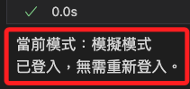

# 登入流程

_永豐金 Shioaji API 的登入流程，以下將使用 Jupyter Notebook 進行運作，可參考 [官方文件](https://sinotrade.github.io/)。_

<br>

## 準備工作

1. 新增 `.ipynb` 文件，任意命名如 `ex01.ipynb`。

    ```bash
    touch ex01.ipynb
    ```

<br>

2. 開啟前述步驟所建立的腳本，點擊右上 `Select Kernel` 選取正確核心 `.venv`。

    

<br>

3. 查詢 `shioaji` 版本。

    ```python
    import shioaji as sj

    print(sj.__version__)
    ```

    

<br>

4. 載入環境變數。

    ```python
    import os
    from dotenv import load_dotenv
    load_dotenv()

    api_key = os.environ["API_KEY"]
    secret_key = os.environ["SECRET_KEY"]
    ```

<br>

## 登入帳號

1. 初始化 Shioaji API 並登入，參數 `simulation` 預設值為 `True`，代表 `模擬模式`，若要正式下單則需顯式設置為 `False`，代表 `正式模式`；特別注意，帳號登入後無法切換模式，如需切換必須重新初始化 API 並再次登入。

    ```python
    # 顯式設置為 False 或 True
    api = sj.Shioaji(simulation=False)

    # 登入，並傳出帳號資訊
    accounts = api.login(
        api_key=api_key,
        secret_key=secret_key
    )

    # 帳號資訊
    print(accounts)
    ```

    

<br>

## 其他登入參數

_除了 `simulation` 以外的參數介紹_

<br>

1. 是否從伺服器下載商品檔 `fetch_contract`，預設為 `True`。

    ```python
    accounts = api.login(
        api_key=api_key,
        secret_key=secret_key,
        # 是否從伺服器下載商品檔
        fetch_contract=True
    )
    # 帳號資訊
    print(accounts)
    ```

<br>

2. 是否訂閱 `委託/成交回報`，預設為 `True`。

    ```python
    accounts = api.login(
        api_key=api_key,
        secret_key=secret_key,
        # 是否訂閱委託/成交回報
        subscribe_trade=True
    )
    # 帳號資訊
    print(accounts)
    ```

<br>

3. 設定 API 請求的有效執行時間窗口，用於控制 API 請求從客戶端發出到伺服器進行驗證並執行操作的最大容忍時間，單位為毫秒（ms），用於登入請求或任何需要與伺服器通信的操作，特別是在高延遲網路環境下適用，例如跨國連線。

    ```python
    accounts = api.login(
        api_key=api_key,
        secret_key=secret_key,
        # 調整有效執行時間為 60 秒
        receive_window=60000
    )
    # 帳號資訊
    print(accounts)
    ```

<br>

4. 在登入過程中，設置 API 客戶端是否應等待所有合約資料下載完成，並設置下載的超時時間，單位為毫秒（ms）；尤其在登入後需要立即使用完整合約資料的情境下，設置一個合理的超時時間可確保下載完成。

    ```python
    accounts = api.login(
        api_key=api_key, 
        secret_key=secret_key,
        # 等待下載完成
        contracts_timeout=10000,
    )
    ```

<br>

5. 登入後，若下載了指定類型的合約資料如股票、期貨、選擇權等，會觸發 `contracts_cb` 回調函數處理合約資料（contracts）的下載完成事件，以下代碼是使用匿名函數 `Lambda` 的範例，下載後會輸出該合約類型下載完成的消息；特別注意，前面已經說過，下載是預設為 `True`，所以這裡並未設定參數 `fetch_contract`。

    ```python
    api.login(
        api_key=api_key,
        secret_key=secret_key,
        # 自訂回調函數
        contracts_cb=lambda security_type: print(f"{repr(security_type)} fetch done.")
    )
    ```

<br>

6. 若下載完成後要處理較為複雜的任務，可以自訂回調函數，直接將函數以參數形式傳入；這種方法適合在程式初始化或物件建立時以函數參數指定對應的回調函式，優點是清楚、直接，但在大型程式或多個事件回呼同時使用時，程式碼可讀性可能較差。

    ```python
    # 自訂回調函數
    def on_contracts_fetch(security_type):
        print(f"合約類型 {security_type} 下載完成。")
        # 可添加其他邏輯

    api.login(
        api_key=api_key,
        secret_key=secret_key,
        contracts_cb=on_contracts_fetch
    )
    ```

<br>

7. 除了直接傳入參數外，也可透過 `裝飾器（Decorator）` 進行註冊，透過裝飾器可直觀看出這個函數是用來處理 `quote` 事件，而不必在其他程式碼區段再回頭查找，當有多個相似事件回調時，不用在各個初始化區段都指定 callback 函數，反而可以讓程式中各片段直接標記自己的事件處理邏輯；另外，框架本身可透過裝飾器在底層進行動態綁定、註冊、甚至加入中介邏輯，而無需在使用者端反覆傳入特定參數。

    ```python
    # 使用裝飾器註冊回調函式，當特定事件發生時會呼叫此函式
    @api.quote.on_quote
    def quote_callback(topic: str, quote: dict):
        """
        當接收到行情報價更新時被呼叫的回調函式。
        參數:
            topic (str): 行情主題(如股票代碼)。
            quote (dict): 該主題下的最新行情資訊(以字典格式表示)。
        """
        # 在這裡實作接收到行情資料後的處理邏輯
        # 例如：將報價資訊印出、儲存至資料庫、更新前端介面等
        print(f"Topic: {topic}, Quote: {quote}")

    # 登入並指定其他回調函式或參數（若需要）
    # 與使用 contracts_cb 時類似，我們也可在登入時指定其他回調或參數
    api.login(
        api_key=api_key,
        secret_key=secret_key,
        # 若有其他回調可在此透過參數形式註冊
        # contracts_cb=on_contracts_fetch
    )
    ```

<br>

## 手動訂閱     

1. 登入時若未下載商品合約資料，可透過調用函數進行。

    ```python
    api.fetch_contracts()
    ```

<br>

## 檢查簽署

1. 列出所有帳號，輸出中會註明該帳號是否已經通過簽署，完成者會顯示 `signed=True`。

    ```python
    accounts = api.list_accounts()
    print(accounts)
    ```

    

<br>

2. 檢查帳號是否完成簽署。

    ```python
    # 檢查未簽署的帳號
    unsigned_accounts = [
        account 
        for account in accounts 
        if not getattr(account, 'signed', False)
    ]

    if unsigned_accounts:
        print("未完成簽署的帳號:")
        for account in unsigned_accounts:
            print(
                f"person_id='{account.person_id}' "
                f"broker_id='{account.broker_id}' "
                f"account_id='{account.account_id}' "
                f"username='{account.username}'"
            )

        # 嘗試執行其他方式
        for account in unsigned_accounts:
            print(
                f"請手動簽署帳號 {account.account_id} "
                "或檢查 API 文件。"
            )
    else:
        print("所有帳號已完成簽署。")
    ```

    

<br>

## 檢查登入狀態

1. 確定是否已成功登入。

    ```python
    try:
        accounts = api.list_accounts()
        if accounts:
            print(f"已登入，共有 {len(accounts)} 個帳戶。")
        else:
            print("未登入。")
    except Exception as e:
        print(f"檢查登入狀態時發生錯誤：{e}")
    ```

<br>

2. 檢查服務器的連線狀態。

    ```python
    try:
        server_status = api.update_status()
        print(f"服務器狀態：{server_status}")
    except Exception as e:
        print(f"檢查服務器狀態時發生錯誤：{e}")
    ```

<br>

3. 確保只執行必要的登入操作。

    ```python
    def ensure_login(api=api, api_key=api_key, secret_key=secret_key):
        try:
            accounts = api.list_accounts()
            if accounts:
                print(f"已登入，使用帳戶：{accounts}")
            else:
                print("尚未登入，嘗試登入中...")
                api.login(api_key, secret_key)
                print("登入成功！")
        except Exception as e:
            print(f"檢查或登入時發生錯誤：{e}")

    # 使用
    ensure_login()
    ```

<br>

4. 檢查登入數。

    ```python
    try:
        accounts = api.list_accounts()
        if accounts:
            print(f"已登入，共有 {len(accounts)} 個帳戶。")
        else:
            print("未登入。")
    except Exception as e:
        print(f"檢查登入狀態時發生錯誤：{e}")
    ```

<br>

5. 登出全部連線。

    ```python
    def logout_all_connections():
        # 必須在使用前聲明 global
        global api
        try:
            # 檢查是否已登入
            try:
                accounts = api.list_accounts()
                if accounts:
                    print(f"已登入帳戶數量：{len(accounts)}，開始登出...")
                else:
                    print("未偵測到登入帳戶，無需登出。")
                    return
            except Exception as e:
                print(f"檢查登入狀態時發生錯誤，可能未登入或已超時：{e}")
                return

            # 執行登出操作
            try:
                api.logout()
                print("登出成功，所有連線已釋放。")
            except Exception as e:
                print(f"登出失敗：{e}")

            # 重置 API 實例，刪除舊的 API 實例
            del api
            # 重新初始化 API 實例
            api = sj.Shioaji()
            print("API 實例已重置。")
        except Exception as e:
            print(f"登出操作時發生錯誤：{e}")

    # 調用函數
    logout_all_connections()

    # 再次檢查登入狀態
    try:
        accounts = api.list_accounts()
        if accounts:
            print(f"已登入，共有 {len(accounts)} 個帳戶。")
        else:
            print("未登入。")
    except Exception as e:
        print(f"檢查登入狀態時發生錯誤：{e}")
    ```

<br>

___

_接續以下單元_