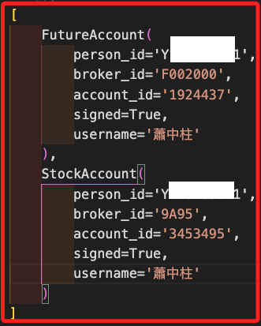

# 登入流程

_永豐金 Shioaji API 的登入流程，以下將使用 Jupyter Notebook 進行運作，可參考 [官方文件](https://sinotrade.github.io/tutor/order/CA/#activate-ca)。_

<br>

## 初始化 API

1. 新增 `.ipynb` 文件，任意命名如 `ex01.ipynb`。

    ```bash
    touch ex01.ipynb
    ```

<br>

2. 開啟前述步驟所建立的腳本，點擊右上 `Select Kernel` 選取正確核心 `.venv`。

    

<br>

3. 初始化後進行登入，相關密鑰會讀取 `.env` 文件中的設定。

    ```python
    import shioaji as sj
    import os
    from dotenv import load_dotenv
    load_dotenv()

    api_key = os.environ["API_KEY"]
    secret_key = os.environ["SECRET_KEY"]

    # 初始化 Shioaji API
    # 預設為模擬模式（simulation=True）
    # api = sj.Shioaji()
    # 顯示設置為正式模式
    api = sj.Shioaji(simulation=False)

    # 使用 API 金鑰與密鑰登入
    accounts = api.login(
        api_key=api_key,
        secret_key=secret_key
    )

    # 帳號資訊
    print(accounts)
    ```

    

<br>

##  登入參數

_可自訂更詳細的參數；以下代碼供參考，可不用實作_

<br>

1. 是否從伺服器下載商品檔 `fetch_contract`，預設為 `True`。

    ```python
    accounts = api.login(
        api_key=api_key,
        secret_key=secret_key,
        # 是否從伺服器下載商品檔
        fetch_contract=True
    )
    # 帳號資訊
    print(accounts)
    ```

<br>

2. 是否訂閱 `委託/成交回報`，預設為 `True`。

    ```python
    accounts = api.login(
        api_key=api_key,
        secret_key=secret_key,
        # 是否訂閱委託/成交回報
        subscribe_trade=True
    )
    # 帳號資訊
    print(accounts)
    ```

<br>

3. 設定 API 請求的有效執行時間窗口，用於控制 API 請求從客戶端發出到伺服器進行驗證並執行操作的最大容忍時間，單位為毫秒（ms），用於登入請求或任何需要與伺服器通信的操作，特別是在高延遲網路環境下適用，例如跨國連線。

    ```python
    accounts = api.login(
        api_key=api_key,
        secret_key=secret_key,
        # 調整有效執行時間為 60 秒
        receive_window=60000
    )
    # 帳號資訊
    print(accounts)
    ```

<br>

4. 在登入過程中，設置 API 客戶端是否應等待所有合約資料下載完成，並設置下載的超時時間，單位為毫秒（ms）；尤其在登入後需要立即使用完整合約資料的情境下，設置一個合理的超時時間可確保下載完成。

    ```python
    accounts = api.login(
        api_key=api_key, 
        secret_key=secret_key,
        # 等待下載完成
        contracts_timeout=10000,
    )
    ```

<br>

5. 登入後，若下載了指定類型的合約資料如股票、期貨、選擇權等，會觸發 `contracts_cb` 回調函數處理合約資料（contracts）的下載完成事件，以下代碼是使用匿名函數 `Lambda` 的範例，下載後會輸出該合約類型下載完成的消息；特別注意，前面已經說過，下載是預設為 `True`，所以這裡並未設定參數 `fetch_contract`。

    ```python
    api.login(
        api_key=api_key,
        secret_key=secret_key,
        # 自訂回調函數
        contracts_cb=lambda security_type: print(f"{repr(security_type)} fetch done.")
    )
    ```

<br>

6. 若下載完成後要處理較為複雜的任務，可以自訂回調函數。

    ```python
    # 自訂回調函數
    def on_contracts_fetch(security_type):
        print(f"合約類型 {security_type} 下載完成。")
        # 可添加其他邏輯

    api.login(
        api_key=api_key,
        secret_key=secret_key,
        contracts_cb=on_contracts_fetch
    )
    ```

<br>

## 檢查簽署

1. 列出所有帳號，輸出中會註明該帳號是否已經通過簽署，完成者會顯示 `signed=True`。

    ```python
    accounts = api.list_accounts()
    print(accounts)
    ```

    

<br>

2. 檢查帳號是否完成簽署。

    ```python
    # 檢查未簽署的帳號
    unsigned_accounts = [
        account 
        for account in accounts 
        if not getattr(account, 'signed', False)
    ]

    if unsigned_accounts:
        print("未完成簽署的帳號:")
        for account in unsigned_accounts:
            print(
                f"person_id='{account.person_id}' "
                f"broker_id='{account.broker_id}' "
                f"account_id='{account.account_id}' "
                f"username='{account.username}'"
            )

        # 嘗試執行其他方式
        for account in unsigned_accounts:
            print(
                f"請手動簽署帳號 {account.account_id} "
                "或檢查 API 文件。"
            )
    else:
        print("所有帳號已完成簽署。")
    ```

    

<br>

## 檢查登入狀態

1. 確定是否已成功登入。

    ```python
    try:
        accounts = api.list_accounts()
        if accounts:
            print(f"已登入，共有 {len(accounts)} 個帳戶。")
        else:
            print("未登入。")
    except Exception as e:
        print(f"檢查登入狀態時發生錯誤：{e}")
    ```

<br>

2. 檢查服務器的連線狀態。

    ```python
    try:
        server_status = api.update_status()
        print(f"服務器狀態：{server_status}")
    except Exception as e:
        print(f"檢查服務器狀態時發生錯誤：{e}")
    ```

<br>

3. 確保只執行必要的登入操作。

    ```python
    def ensure_login(api=api, api_key=api_key, secret_key=secret_key):
        try:
            accounts = api.list_accounts()
            if accounts:
                print(f"已登入，使用帳戶：{accounts}")
            else:
                print("尚未登入，嘗試登入中...")
                api.login(api_key, secret_key)
                print("登入成功！")
        except Exception as e:
            print(f"檢查或登入時發生錯誤：{e}")

    # 使用
    ensure_login()
    ```

<br>

4. 檢查登入數。

    ```python
    try:
        accounts = api.list_accounts()
        if accounts:
            print(f"已登入，共有 {len(accounts)} 個帳戶。")
        else:
            print("未登入。")
    except Exception as e:
        print(f"檢查登入狀態時發生錯誤：{e}")
    ```

<br>

5. 登出全部連線。

    ```python
    def logout_all_connections():
        try:
            # 檢查是否已登入
            try:
                accounts = api.list_accounts()
                if accounts:
                    print(f"已登入帳戶數量：{len(accounts)}，開始登出...")
                else:
                    print("未偵測到登入帳戶，無需登出。")
                    return
            except Exception as e:
                print(f"檢查登入狀態時發生錯誤，可能未登入或已超時：{e}")

            # 執行登出操作
            try:
                api.logout()
                print("登出成功，所有連線已釋放。")
            except Exception as e:
                print(f"登出失敗：{e}")
        
        except Exception as e:
            print(f"初始化 API 時發生錯誤：{e}")

    # 調用函數
    logout_all_connections()
    ```

<br>

___

_接續以下單元_