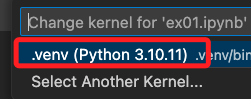
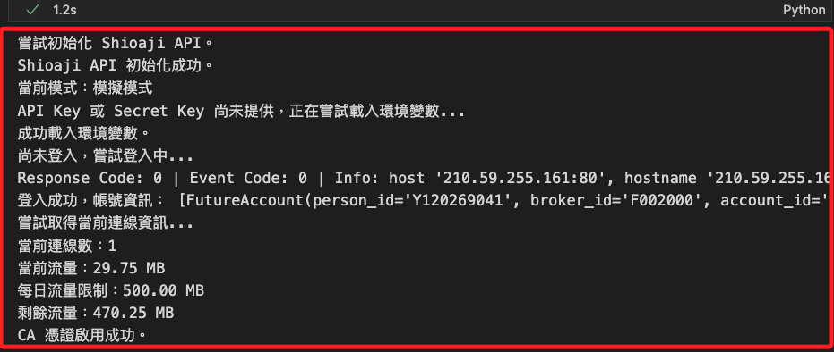
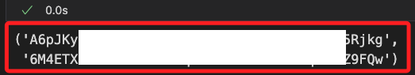
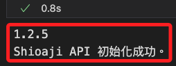
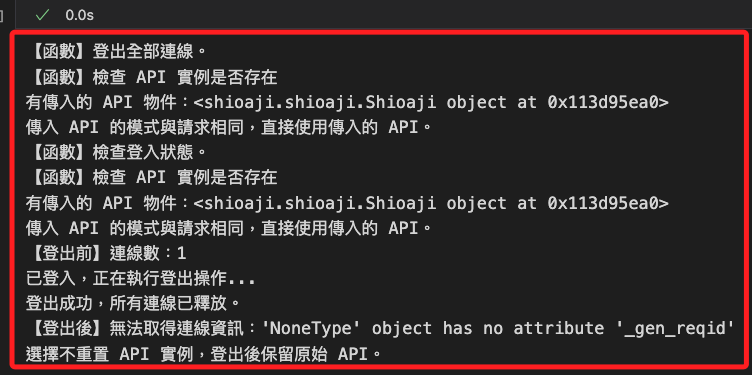
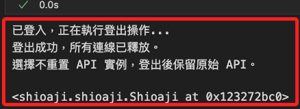

# 登入與登出

_說明永豐金 `Shioaji API` 的 `登入與登出`，以下將使用 `Jupyter Notebook` 進行運作，可參考 [官方文件](https://sinotrade.github.io/)。_

<br>

## 準備工作

_以下將完整介紹使用 API 進行登入的各種設置，部分函數會進行封裝便於重用，也會獨立介紹不同的 API 方法，這些方法可能用於後續封裝的函數中_

<br>

1. 新增兩個文件，第一個是模組文件 `MyShioaji.py`，用於寫入函數後導入腳本中使用，第二個是操作腳本 `.ipynb`，可任意命名如 `ex01.ipynb`。

    ```bash
    touch MyShioaji.py ex01.ipynb
    ```

<br>

2. 開啟模組文件 `MyShioaji.py`，先載入 `shioaji` 模組，並透過代碼查詢版本。

    ```python
    import shioaji as sj

    print(sj.__version__)
    ```

<br>

3. 開啟腳本 `ex01.ipynb`，點擊右上 `Select Kernel` 選取正確核心 `.venv`。

    

<br>

4. 導入自訂模組，目前模組僅導入官方套件，尚無寫入其他代碼。

    ```python
    import MyShioaji as msj
    ```

    

<br>

## 關於自訂函數

_重點提示_

<br>

1. 在 Python 函數定義中，所有 `不帶預設值` 的參數代表的是 `必填參數`，規範上必須放在帶有預設值的參數之前，所以在自定義函數時，雖然將 api 放置在第一個參數比較易讀，但因為 api 帶有預設值 `None`，是一個可選參數，所以將必填參數 `symbol` 及 `price` 放在 `api` 之前。

<br>

## 編輯模組

_編輯 `MyShioaji.py`，先建立幾個基本的函數；將以下函數複製並貼在模組內即可。_

<br>

1. 重新載入 `MyShioaji` 模組，預設使用初次導入時的別名 `msj`；因為後續步驟會有多次編輯模組的需求，避免每次重啟核心造成多次連線，所以封裝重載模組的函數。

    ```python
    # 重新載入 `MyShioaji` 模組
    def reload_module(module_alias= "MyShioaji"):
        print("【函數】重新載入模組。")
        import sys
        import importlib
        # 假如模組名稱存在
        if module_alias in sys.modules:
            importlib.reload(sys.modules[module_alias])
            print(f"已成功重載模組：{module_alias}")
        else:
            print(f"未在 sys.modules 中找到模組別名：{module_alias}")

    ```

<br>

2. 載入環境變數。

    ```python
    # 載入環境變數
    def load_env_variables():
        print("【函數】載入環境變數。")
        import os
        from dotenv import load_dotenv
        # 添加參數可動態覆蓋
        load_dotenv(override=True)

        api_key = os.environ["API_KEY"]
        secret_key = os.environ["SECRET_KEY"]
        if not api_key or not secret_key:
            raise ValueError(
                "API_KEY 或 SECRET_KEY 環境變數缺失，"
                "請檢查 .env 文件。"
            )
        return api_key, secret_key

    ```

<br>

3. 初始化 Shioaji API，預設模式為 `True`，與官方 API 相同，代表 `模擬模式`；每次初始化前先檢查全域變數 api 是否存在且不是 None，假如存在且已登入則先執行登出後清除該對象；除此，也會檢查本次初始化指定的模式是否與模組中其他函式所指定的模式相容，若不相容則視為重新初始化。

    ```python
    # 初始化 Shioaji API
    def init_Shioaji(simulation=True):
        print("【函數】初始化 API 實例。")
        # 1. 檢查全域是否已有 api
        if 'api' in globals() and globals()['api'] is not None:
            old_api = globals()['api']
            # 若舊的 api 仍處於登入狀態，先登出
            if check_login_status(old_api):
                print("偵測到舊 API 已登入，先執行登出...")
                try:
                    # 調用自訂函數進行登出
                    logout_all_connections(old_api, reset_api=False)
                except Exception as e:
                    print(f"無法登出原有的 API：{e}")
            # 將舊的 api 清除
            print("清除原有的 API 實例。")
            # 將全域變數設置為 None
            globals()['api'] = None

        # 2. 重建 Shioaji API 實例
        try:
            api = sj.Shioaji(simulation=simulation)
            # 存入全域變數並回傳
            globals()['api'] = api
            print("Shioaji API 初始化成功。")
            return api
        except Exception as e:
            print(f"Shioaji API 初始化失敗：{e}")
            return None
    
    ```

<br>

4. 嘗試並檢查是否登入 Shioaji 帳號，若未傳入 API，將進行初始化，若已登入則直接返回 API 物件；參數 `simulation` 預設值為 `True`，代表 `模擬模式`，若要正式下單則需顯式設置為 `False`，代表 `正式模式`；特別注意，帳號登入後無法切換模式，如需切換必須重新初始化 API 並再次登入。

    ```python
    # 登入帳號並檢查是否已登入
    def login_Shioaji(
        api=None,
        api_key=None, 
        secret_key=None, 
        simulation=True
    ):
        print("【函數】登入帳號。")
        try:
            # 確保 API 已初始化，傳遞 simulation 模式
            api = _get_or_init_api(api, simulation=simulation)

            # 檢查 API 是否已初始化
            if not api:
                raise ValueError("API 初始化失敗，無法進行登入。")

            # 顯示當前使用模式
            mode = "模擬模式" if simulation else "正式模式"
            print(f"當前模式：{mode}")
            
            # 調用自訂函數檢查是否已登入
            if check_login_status(api):
                print("已登入，無需重新登入。")
                return api

            # 如果尚未登入，執行登入
            print("尚未登入，嘗試登入中...")

            # 如果未傳入 API Key 或 Secret Key，則嘗試載入環境變數
            if not api_key or not secret_key:
                print("API Key 或 Secret Key 尚未提供，正在嘗試載入環境變數...")
                try:
                    api_key, secret_key = load_env_variables()
                    print("成功載入環境變數。")
                except Exception as e:
                    print(f"載入環境變數失敗，請確認 .env 文件是否存在且正確：{e}")
                    return None

            try:
                # 調用 API 的登入函數，必須傳入憑證
                accounts = api.login(
                    api_key=api_key, 
                    secret_key=secret_key
                )
                print("登入成功，帳號資訊：", accounts)
                # 登入成功後再檢查連線
                _monitor_connections(
                    api, output_connections=True
                )
                return api
            except Exception as e:
                print(f"登入失敗，請檢查憑據或網絡狀態：{e}")
                return None

        except Exception as e:
            print(f"Shioaji API 初始化或登入過程中發生錯誤：{e}")
            return None
    
    ```

<br>

5. 檢查 API 是否存在，且模式是否與請求相同；特別注意，無論是全域存在 API 對象、或有傳入 API 對象，只要模式與本次請求不同，皆視作滿足重建的需求；命名時使用前綴下底線，這在 Python 命名慣例中代表這是模組內部使用的私有函數。

    ```python
    # 檢查 API 是否存在，且模式是否與請求相同
    def _get_or_init_api(api=None, simulation=True):
        print("【函數】檢查 API 實例是否存在。")
        # 1. 若參數傳入了 api，先檢查模式是否一致
        if api is not None:
            print(f"有傳入的 API 物件：{api}")
            # 檢查 api 物件是否有名為 "simulation" 的屬性，且模式相同
            if hasattr(api, "simulation") and api.simulation == simulation:
                print("傳入 API 的模式與請求相同，直接使用傳入的 API。")
                return api
            else:
                print("傳入 API 的模式與請求不符，需重新建立 API。")
                # 如果傳入的 api 仍在登入狀態，先登出
                if check_login_status(api):
                    print("傳入 API 處於登入狀態，執行登出...")
                    try:
                        logout_all_connections(api, reset_api=False)
                    except Exception as e:
                        print(f"無法登出傳入 API：{e}")
                # 若全域變數也是同一物件，也一起清除
                if 'api' in globals() and globals()['api'] is api:
                    print("清除全域變數中的 API 物件...")
                    globals()['api'] = None
                # 重新初始化
                return init_Shioaji(simulation=simulation)

        # 2. 若外部沒傳入 api，檢查全域變數
        if 'api' in globals() and globals()['api'] is not None:
            print("API 全域變數存在。")
            current_api = globals()['api']
            # 檢查模式是否一致
            if current_api.simulation == simulation:
                print("請求的 API 模式不變，繼續使用當前全域 API 對象。")
                return current_api
            else:
                print("全域 API 的模式與請求不符，準備重新初始化...")
                # 若舊 API 還在登入狀態，先登出
                if check_login_status(current_api):
                    print("舊 API 處於登入狀態，執行登出...")
                    try:
                        logout_all_connections(
                            current_api, reset_api=False
                        )
                    except Exception as e:
                        print(f"無法登出舊 API：{e}")
                # 清除全域
                print("清除舊的全域 API 實例...")
                globals()['api'] = None

        # 3. 若目前沒有可用的 API，或者已被清除，就重新初始化
        print("沒有取得可用的 API 實例，嘗試進行初始化。")
        # init_Shioaji 裡面會存入全域
        new_api = init_Shioaji(simulation=simulation)
        return new_api

    ```

<br>

6. 啟用憑證，該函數會返回布林值，可供其他程序調用；補充説明，正式模式才需要啟用憑證，而啟用的前提是帳號必須已經登入，另外，憑證啟用時也會自動訂閱委託成交回報。

    ```python
    # 啟用憑證
    def activate_ca(api=None):
        print("【函數】啟用憑證。")
        import os

        # 確保 API 已初始化並登入
        api = login_Shioaji(api)

        # 如果登入失敗，提前返回
        if not api:
            print("API 初始化或登入失敗，無法啟用憑證。")
            return False
        
        try:
            # 這裡使用 `get` 方法處理環境變數
            ca_path = os.environ.get("CA_CERT_PATH")
            ca_passwd = os.environ.get("CA_PASSWORD")
            person_id=os.environ.get("CA_PASSWORD")

            # 檢查是否取得到必要的憑證資訊
            if not ca_path or not ca_passwd or not person_id:
                print(
                    "未找到 CA 憑證資訊，"
                    "請檢查環境變數是否正確設置。"
                )
                return False

            # 啟用 CA
            result = api.activate_ca(
                ca_path=ca_path,
                ca_passwd=ca_passwd,
                person_id=person_id
            )
    
            # 判斷結果並輸出
            if result:
                print("CA 憑證啟用成功。")
                # 回傳已啟用的 api 實例，讓外部可以繼續使用
                return api
            else:
                print("CA 憑證啟用失敗，請檢查參數或系統狀態。")
                return None
            return result
        except Exception as e:
            print(f"CA 憑證啟用過程中發生錯誤：{e}")
            return False
    
    ```

<br>

7. 檢查當前全部的登入帳號是否都完成簽署。

    ```python
    # 檢查簽署狀態
    def check_unsigned_accounts(api=None):
        print("【函數】檢查是否傳入 API 實例")
        # 檢查是否傳入 API
        api = _get_or_init_api()

        # 取得全部帳號
        accounts = api.list_accounts()
        if accounts:
            print(f"已登入，共有 {len(accounts)} 個帳戶。")
        else:
            print("未登入。")
            # 若未登入則直接返回
            return
        # 檢查未簽署的帳號
        unsigned_accounts = [
            account 
            for account in accounts 
            if not getattr(account, 'signed', False)
        ]

        if unsigned_accounts:
            print("未完成簽署的帳號：")
            for account in unsigned_accounts:
                print(
                    f"person_id='{account.person_id}' "
                    f"broker_id='{account.broker_id}' "
                    f"account_id='{account.account_id}' "
                    f"username='{account.username}'"
                )

            # 嘗試執行其他方式
            for account in unsigned_accounts:
                print(
                    f"請手動簽署帳號 {account.account_id} "
                    "或檢查 API 文件。"
                )
        else:
            print("所有帳號已完成簽署。")
    
    ```

<br>

8. 檢查 API 登入狀態，這個函數將被其他函數調用，所以不輸出累贅資訊；如果已登入返回 True，否則返回 False；特別注意，這裡檢查的並非連線數，API 對於單一帳號的連線數有限制，但並無對應的函數可查詢連線數。

    ```python
    # 檢查登入狀態
    def check_login_status(api=None):
        print("【函數】檢查登入狀態。")
        # 若未明確傳入 api
        if api is None:
            # 取得或初始化 Shioaji API，若外部無傳入，則自行初始化
            api = _get_or_init_api(api)
        
        # 若傳入的 API 是 None
        if api is None:
            print("API 實例為 None，無法檢查登入狀態，視為未登入。")
            return False

        try:
            # Step 1: 檢查是否能抓到任何帳號資訊
            accounts = api.list_accounts()  
            if not accounts:
                # 沒有抓到帳號 -> 未登入
                return False

            # Step 2: 調用 usage() 測.試 Session 是否有效
            usage_info = api.usage()
            if usage_info and usage_info.connections >= 1:
                return True
            else:
                # usage() 正常回傳，但 connections < 1，代表可能已登出
                return False

        except AttributeError as e:
            # 常見錯誤：'NoneType' object has no attribute '_gen_reqid'
            # 代表內部 session 狀態已經是 None 或已失效
            print("檢查登入狀態時發生 AttributeError，可能尚未登入或已登出。")
            return False
        except Exception as e:
            # 任何其他例外狀況都一律視為未登入
            print(f"檢查登入狀態時發生錯誤（已視為未登入）：{e}")
            return False
    
    ```

<br>

9. 登出全部 API 連線，依據參數 `reset_api` 決定是否在登出後重置 API，預設值為 `False`；如果尚未登入，直接回傳原始 API 實例；若已登入，顯示當前連線數，並調用 `logout()`。

    ```python
    # 登出全部連線，登出時，api 為必要參數 
    def logout_all_connections(api, reset_api=False):
        print("【函數】登出全部連線。")
        # 取得或初始化 Shioaji API
        api = _get_or_init_api(api)

        try:
            # 檢查是否已登入
            if not check_login_status(api):
                print("未偵測到登入帳戶，無需登出。")
                # 返回原始 API 以繼續操作
                return api

            # === Step 1: 顯示當前連線數 ===
            try:
                # 調用 API 函數取得 api 對象使用現況
                status_before = api.usage()
                # 取得連線數
                connections_before = status_before.connections
                print(f"【登出前】連線數：{connections_before}")
            except Exception as e:
                print(f"【登出前】無法取得連線數，可能已經登出，原因：{e}")

            print("已登入，正在執行登出操作...")

            # === Step 2: 執行登出 ===
            try:
                # 調用 API 函數執行登出
                logout_result = api.logout()
                # 回傳 True 表示成功
                if logout_result is True:
                    print("登出成功，所有連線已釋放。")
                else:
                    print(f"登出結果：{logout_result}")
            except Exception as e:
                print(f"登出失敗：{e}")
                # 如果登出失敗，不用運行以下程序，返回原始 API 實例
                return api

            # === Step 3: 再次測試登出後的連線數 ===
            try:
                # 當前使用量
                status_after = api.usage()
                # 連線數
                connections_after = status_after.connections
                print(f"【登出後】連線數：{connections_after}")
                if connections_after == 0:
                    print("連線已歸零，確認成功登出。")
                else:
                    print("連線數不為 0，請檢查是否仍有遺留的連線。")
            except Exception as e:
                # 若調用 api.usage() 出現錯誤，即表示無法再存取連線資訊
                print(f"【登出後】無法取得連線資訊：{e}")

            # === Step 4: 根據參數選擇是否重置 API 實例 ===
            if reset_api:
                print("正在重置 API 實例...")
                # 此處請依你實際的 Shioaji 初始化方式進行
                api = sj.Shioaji()
                print("API 實例已重置，可重新登入使用。")
            else:
                print("選擇不重置 API 實例，登出後保留原始 API。")

            return api

        except Exception as e:
            print(f"登出過程中發生錯誤：{e}")
            return None

    ```

<br>

10. 查看商品檔狀態。

    ```python
    # 查看商品檔狀態
    def check_contracts_status(api=None):
        print("【函數】查看商品檔狀態。")
        # 檢查是否傳入 API
        api = _get_or_init_api()
        try:
            print(f"商品檔狀態：{api.Contracts.status}")
        except AttributeError:
            print("商品檔尚未初始化。")
    
    ```

<br>

11. 若在登入時未訂閱委託成交回報，可在需要時手動訂閱。

    ```python
    # 手動訂閱成交回報，支持單個帳號或帳號列表
    def manual_subscribe_trade(api=None, accounts=None):
        print("【函數】手動訂閱委託與成交回報。")
        # 確保 API 已初始化
        api = _get_or_init_api(api)

        try:
            # 確保 accounts 為列表類型
            if not isinstance(accounts, list):
                accounts = [accounts] if accounts else []

            # 遍歷帳號並訂閱
            for account in accounts:
                if account is not None:
                    api.subscribe_trade(account=account)
                    print(
                        f"已手動訂閱帳號 {account.account_id} 的成交回報"
                    )
                else:
                    print("傳入的帳號為 None，跳過訂閱")

        except AttributeError as e:
            print(f"API 未正確初始化或無法訂閱：{e}")
        except Exception as e:
            print(f"手動訂閱成交回報時發生錯誤：{e}")
    
    ```

<br>

12. 檢查當前連線數並根據需要輸出連線資訊。

    ```python
    # 檢查當前連線數並根據需要輸出連線資訊
    def _monitor_connections(api, output_connections=True):
        print("【函數】取得當前連線資訊。")
        try:
            if output_connections:
                # 取得連線數
                status = api.usage()
                # 回傳值為空
                if not status:
                    print("可能尚未登入，無法取得連線資訊。")
                    return None
                # 連線數
                connections = status.connections
                print(
                    f"當前連線數：{connections}"
                )
                print(
                    "當前流量："
                    f"{status.bytes / (1024 * 1024):.2f} MB"
                )
                print(
                    "每日流量限制："
                    f"{status.limit_bytes / (1024 * 1024):.2f} MB"
                )
                print(
                    "剩餘流量："
                    f"{status.remaining_bytes / (1024 * 1024):.2f} MB"
                )
                return connections
        except Exception as e:
            print(f"無法檢查連線資訊，可能是環境不支援或尚未登入：{e}")
            return None
    
    ```

<br>

## 載入環境變數的方式

_【說明】兩種不同載入環境變數方式的差異，分別是 `os.environ["<變數名稱>"]` 和 `os.environ.get("<變數名稱>")`。_

<br>

1. `os.environ["<變數名稱>"]` 是直接從環境變數中讀取值，如果環境變數存在則返回對應的值，如果不存在會直接引發 `KeyError`，導致程式中斷，適用於確定環境變數必然存在的情況，否則需要額外處理 `KeyError`；換句話說，當程序中使用了 `load_dotenv()`，這代表除非遺漏設置否則變數必然存在，那使用 `os.environ["<變數名稱>"]` 相對合理。

    ```python
    import os
    # 讀取環境變數
    try:
        ca_path = os.environ["CA_CERT_PATH"]
        print(f"CA 憑證路徑為: {ca_path}")
    except KeyError:
        print("環境變數 CA_CERT_PATH 未設置！")
    ```

<br>

2. 使用 `get` 方法以 `os.environ.get("CA_CERT_PATH")` 從環境變數中嘗試取得值時，如果環境變數存在則返回對應的值，如果環境變數不存在會返回 `None` 或指定的預設值；在不確定環境變數是否存在時，可避免程式因而中斷。

    ```python
    # 讀取環境變數
    ca_path = os.environ.get("CA_CERT_PATH")
    if ca_path:
        print(f"CA 憑證路徑為: {ca_path}")
    else:
        print("環境變數 CA_CERT_PATH 未設置！")
    ```

<br>

3. 一般情況下，建議使用更加安全的 `os.environ.get()`，可避免因環境變數缺失導致程式中斷；`os.environ["CA_CERT_PATH"]` 適用於變數必須存在的情境，並在發現變數缺失時立即處置。

<br>

## 關於啟用憑證

_`【說明】` 依據官方的說明，在正式模式下，完成登入後還需要啟用憑證，用以確保交易安全。_

<br>

1. 調用自訂函數啟用憑證；特別注意，假如尚未初始化 API，這時會調用初始化函數，並將 API 對象寫入全域變數 `api` 中。

    ```python
    # 檢查並啟用憑證，如果成功將取得 api
    api = msj.activate_ca()
    ```

    

<br>

2. 若按照上述步驟，會出現以下的錯誤，這是因為載入模組後又更新了模組內容。

    

<br>

3. 使用以下代碼重載模組，這個代碼已經封裝在函數中。

    ```python
    # 重載模組
    import sys
    import importlib

    # 取得實際的模組名稱 (字串)
    module_name = msj.__name__

    if module_name in sys.modules:
        importlib.reload(sys.modules[module_name])
        print(f"已成功重載模組：{module_name}")
    else:
        print(f"未在 sys.modules 中找到模組：{module_name}")
    ```

    

<br>

4. 延續上一點，前面步驟已經該代碼封裝，之後若有修正模組便可調用以下函數重載。

    ```python
    # 重載模組
    msj.reload_module()
    ```

    

<br>

5. 再啟動一次憑證。

    ```python
    # 檢查並啟用憑證，如果成功將取得 api
    api = msj.activate_ca()
    ```

    

<br>

## 開始登入作業

_開啟 `.ipynb`，在前面步驟已經載入模組_

<br>

1. 登入；初次調用登入函數時，可不用傳入 API 對象、環境變數等任何參數，這時會重新初始化並載入環境變數，登入後會傳出初始化的 api 物件供後續步驟使用。

    ```python
    # 登入，重新建立登入
    api = msj.login_Shioaji()
    ```

    

<br>

## 切換密鑰

_`【若要重啟核心，請先登出帳號】` 示範切換或手動輸入密鑰，點擊筆記本上方的 `Clear All Outputs`，然後點擊 `Restart`。_

<br>

1. 調用函數載入環境變數。

    ```python
    import MyShioaji as msj

    # 載入環境變數，並傳出全域變數
    api_key, secret_key = msj.load_env_variables()
    api_key, secret_key
    ```

    

<br>

2. 調用登入函數並傳入密鑰，因為環境變數已經載入，所以登入時可將其傳入。

    ```python
    # 登入，傳入環境變數
    api = msj.login_Shioaji(
        api_key=api_key,
        secret_key=secret_key
    )
    ```

    

<br>

## 手動初始化並登入

_`【若要重啟核心，請先登出帳號】`_

<br>

1. 調用初始化函數，預設為模擬模式。

    ```python
    import MyShioaji as msj

    # 初始化 API 對象
    api = msj.init_Shioaji()
    ```

    

<br>

2. 調用登入函數，傳入前一個步驟手動初始化的 API 對象，這時也會傳出一個 API 對象，但傳出的就是原本傳入的對象。

    ```python
    # 登入
    api_new = msj.login_Shioaji(api=api)
    ```

    

    <br>

3. 延續前一個步驟，檢查兩個 API 物件是否為同一個。

    ```python
    # 檢查兩物件是否為同一物件
    api is api_new
    ```

    

<br>

4. 傳入指定的 `api` 對象檢查登入狀態。

    ```python
    # 檢查登入狀態
    msj.check_login_status(api)
    ```

    

<br>

## 狀態一致性

_若存在其他實例可能修改內部狀態時，可調用 API 函數 `update_status` 確保內部狀態一致。_

<br>

1. 更新內部狀態。

    ```python
    # 更新內部狀態
    api.update_status()
    ```

<br>

## 檢查簽署

1. 使用 API 函數 `list_accounts()` 可列出所有帳號；查看輸出，其中鍵 `signed` 會記錄該帳號是否通過簽署的資訊，完成者會顯示 `signed=True`。

    ```python
    # 列出所有帳號
    api.list_accounts()
    ```

    

<br>

2. 檢查當前 API 對象所執行的全部帳號的簽署狀態；這裡顯示的兩個帳號分別是證券與期貨帳號。

    ```python
    # 檢查當前全部登入帳號的簽署狀態
    msj.check_unsigned_accounts()
    ```

    

<br>

## 登出

1. 調用函數 `登出全部連線`，預設不重置 API。

    ```python
    # 登出全部連線，不重置 API
    api = msj.logout_all_connections(api)
    ```

    

<br>

2. 登出所有連線且重置 API；當有記憶體泄漏疑慮或釋放資源需求時，建議重置 API。

    ```python
    # 登出所有連線，且重置 API
    api = msj.logout_all_connections(api, reset_api=True)
    ```

    

<br>

## 其他登入參數：fetch_contract

_`【若要重啟核心，請先登出帳號】` 進行測試是否從伺服器下載 `商品檔`，也就是 `合約資料`。_

<br>

1. 運行以下測試之前，先初始化 API 對象並取得密鑰。

    ```python
    import MyShioaji as msj

    # 初始化 API 對象
    api = msj.init_Shioaji()

    # 載入環境變數，並傳出全域變數
    api_key, secret_key = msj.load_env_variables()
    api_key, secret_key
    ```

    

<br>

2. 參數 `fetch_contract` 定義了 `是否從伺服器下載商品檔`，預設值為 `True`；若在需要快速登入的情境中可設置為 `False`。

    ```python
    # 使用 API 方法登入帳號，設定不下載商品檔
    accounts = api.login(
        api_key=api_key,
        secret_key=secret_key,
        # 是否從伺服器下載商品檔，這裡設定為 False
        fetch_contract=False
    )
    # 帳號資訊
    print(accounts)
    ```

<br>

3. 特別注意，假如沒下載商品檔，調用與合約相關的函數時就會報錯，調用函數檢查商品檔狀態。

    ```python
    # 檢查商品檔狀態
    msj.check_contracts_status(api)
    ```

    

<br>

4. 調用 API 方法手動下載所需的合約資料。

    ```python
    # 手動下載所需的合約資料
    api.fetch_contracts()
    ```

<br>

5. 再次調用函數查看合約資訊的狀態。

    ```python
    # 檢查商品檔狀態
    msj.check_contracts_status(api)
    ```

    

<br>

## 其他登入參數：subscribe_trade

_`【若要重啟核心，請先登出帳號】` 是否訂閱委託成交回報，維持預設值 `True`，並未寫入 `login_Shioaji`，以下僅作說明。_

<br>

1. 載入環境變數並初始化 API；特別注意，這裡使用正式模式。

    ```python
    import MyShioaji as msj

    # 載入環境變數，並傳出全域變數
    api_key, secret_key = msj.load_env_variables()

    # 初始化 API 對象
    api = msj.init_Shioaji(simulation=False)
    ```

<br>

2. `委託與成交回報` 的訂閱預設值為 `True`；這裡測試將其設置為 `False`。

    ```python
    # 登入，並將委託成交回報設置為 `False`
    accounts = api.login(
        api_key=api_key,
        secret_key=secret_key,
        # 是否訂閱委託/成交回報
        subscribe_trade=False
    )
    # 帳號資訊
    print(accounts)
    ```

<br>

3. 檢查是否已訂閱成交或委託回報。 

    ```python
    # 檢查是否已訂閱成交或委託回報
    def check_subscription_status(api):
        try:
            # 初始化檢查結果
            is_trade_subscribed = False
            is_order_subscribed = False

            # 測試用回調函數
            def trade_callback(trade):
                nonlocal is_trade_subscribed
                # 如果有回調被觸發，表示已訂閱
                is_trade_subscribed = True  
                print("收到成交回報:", trade)

            def order_callback(order):
                nonlocal is_order_subscribed
                # 如果有回調被觸發，表示已訂閱
                is_order_subscribed = True
                print("收到委託回報:", order)

            # 綁定回調函數
            api.trade_callback = trade_callback
            api.order_callback = order_callback

            # 發送測試訊息
            print("發送測試訊息以確認訂閱狀態...")
            # 用於觸發回報檢查
            api.update_status()

            # 檢查結果
            if not is_trade_subscribed:
                print("未訂閱成交回報。")
            else:
                print("已訂閱成交回報。")

            if not is_order_subscribed:
                print("未訂閱委託回報。")
            else:
                print("已訂閱委託回報。")

        except AttributeError as e:
            print(f"無法設置回調函數，可能未啟用回報訂閱。錯誤訊息: {e}")
        except Exception as e:
            print(f"檢查訂閱資訊時發生其他錯誤: {e}")
    ```

<br>

4. 檢查訂閱狀態。

    ```python
    # 檢查訂閱狀態
    check_subscription_status(api)
    ```

<br>

5. 手動訂閱委託成交回報；關於重新訂閱後的觸發，將在後續實測。

    ```python
    # 手動訂閱委託成交回報
    msj.manual_subscribe_trade(api)
    ```

<br>

## 其他登入參數：關於時間

_暫時未寫入登入函數_

<br>

1. 設定 API 請求的有效執行時間窗口，用於控制 API 請求從客戶端發出到伺服器進行驗證並執行操作的最大容忍時間，單位為毫秒（ms），用於登入請求或任何需要與伺服器通信的操作，特別是在高延遲網路環境下適用，例如跨國連線。

    ```python
    accounts = api.login(
        api_key=api_key,
        secret_key=secret_key,
        # 調整有效執行時間為 60 秒
        receive_window=60000
    )
    # 帳號資訊
    print(accounts)
    ```

<br>

2. 在登入過程中，設置 API 客戶端是否應等待所有合約資料下載完成，並設置下載的超時時間，單位為毫秒（ms）；尤其在登入後需要立即使用完整合約資料的情境下，設置一個合理的超時時間可確保下載完成。

    ```python
    accounts = api.login(
        api_key=api_key, 
        secret_key=secret_key,
        # 等待下載完成
        contracts_timeout=10000,
    )
    ```

<br>

## 補充說明

1. 以下是查看 Shioaji 實例所擁有的屬性與方法，藉此可進一步過濾出可調用的成員來封裝並拓展。

    ```python
    import shioaji as sj

    # 初始化實例並列出所有可調用的方法
    def list_shioaji_functions(simulation=True):
        # 初始化
        api = sj.Shioaji(simulation=simulation)
        # 取得所有屬性名稱
        all_attributes = dir(api)
        # 過濾出可調用的方法
        callable_attrs = [
            attr for attr in all_attributes 
            if callable(getattr(api, attr))
        ]
        return callable_attrs

    if __name__ == "__main__":
        funcs = list_shioaji_functions()
        print("可調用的函數/方法名稱：")
        for f in funcs:
            print(f)
    ```

<br>

___

_接續以下單元_