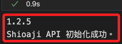
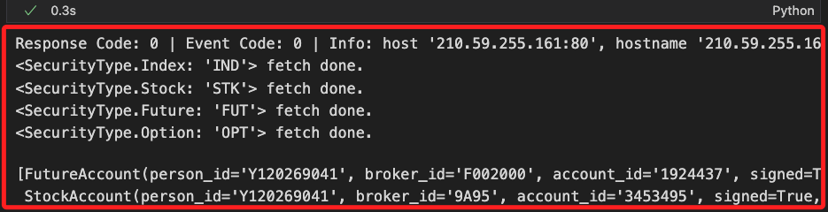
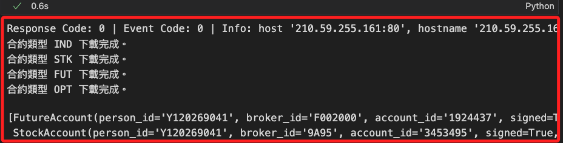
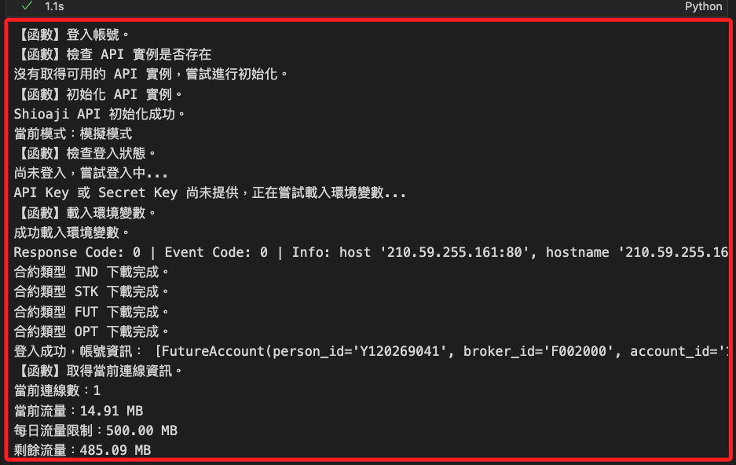
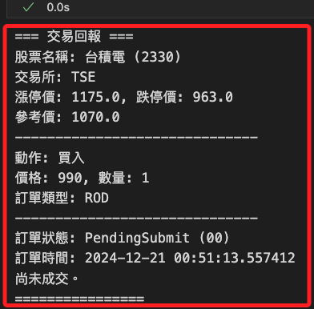

# 回調函數

_Callback functions，用於在特定事件發生時自動觸發自定義的邏輯；在 `Shioaji API` 中，官方模組內建了兩種回調類型，分別是登入階段使用 `contracts_cb` 設定的 `合約下載回調`，以及下單時使用 `set_order_callback` 設定的 `委託、成交回報回調`。_

<br>

## 合約下載回調 `contracts_cb`

_登入階段設定，所以要寫入登入的回調參數_

<br>

1. 載入環境變數並初始化 API。

    ```python
    import MyShioaji as msj

    # 載入環境變數
    api_key, secret_key = msj.load_env_variables()
    # 初始化 API
    api = msj.init_Shioaji()
    ```

    

<br>

2. 在此先做提醒，因為會多次調用 API 的 `login()` 函數，每次操作前，務必記得先登出。

    ```python
    # 調用登出函數，預設不重設 api
    msj.logout_all_connections(api)
    ```

<br>

3. 在 API 登入階段，可透過 `api.login()` 的參數設定合約下載完成後的回調通知，當指定的合約下載完成時，該回調函數會被觸發，用於監控不同類型的合約下載狀態；登入後，若下載了指定類型的合約資料如股票、期貨、選擇權等，會觸發 `contracts_cb` 回調函數處理合約資料（contracts）的下載完成事件，以下代碼是使用匿名函數 `Lambda` 的範例，下載後會輸出該合約類型下載完成的消息；特別注意，前面已經說過，下載是預設為 `True`，所以這裡並未設定參數 `fetch_contract`。

    ```python
    # 登入，並設定回調函數
    api.login(
        api_key=api_key,
        secret_key=secret_key,
        # 自訂回調函數
        contracts_cb=lambda security_type: print(f"{repr(security_type)} fetch done.")
    )
    ```

    

<br>

4. 若下載完成後要處理較為複雜的任務，可以自訂回調函數，直接將函數以參數形式傳入；這種方法適合在程式初始化或物件建立時以函數參數指定對應的回調函式，優點是清楚、直接，但在大型程式或多個事件回呼同時使用時，程式碼可讀性可能較差。

    ```python
    # 自訂回調函數
    def on_contracts_fetch(security_type):
        print(f"合約類型 {security_type} 下載完成。")
        # 可添加其他邏輯

    # 重新登入，並傳入回調函數的參考
    api.login(
        api_key=api_key,
        secret_key=secret_key,
        contracts_cb=on_contracts_fetch
    )
    ```

    

<br>

5. 調用自訂的登入函數。

    ```python
    # 呼叫登入函數時，利用 **kwargs 傳遞回調函式
    api = msj.login_Shioaji(
        # 寫入回調函式
        contracts_cb=on_contracts_fetch
    )
    ```

    

<br>

## 委託與成交回報回調 `set_order_callback`

_下單階段使用的回調，這在後續說明下單時會再詳細說明，屆時可參考 `訂閱通知` 中的解說。_

<br>

1. 登入成功後，可調用 `set_order_callback` 設置回調，用於接收 `委託回報` 和 `成交回報` 的通知，可透過 `api.set_order_callback()` 來設定，當交易事件發生時回調函數會被觸發，包含如下單成功、成交、取消等。

    ```python
    # 定義回調函數
    def order_callback(topic, msg):
        if topic == "Order":
            print(f"【委託回報】\n{msg}")
        elif topic == "Trade":
            print(f"【成交回報】\n{msg}")
        else:
            print(f"【未知回報】類型: {topic}, 訊息: {msg}")
    ```

<br>

2. 使用 API 方法 `set_order_callback` 註冊回調。

    ```python
    # 註冊委託/成交回報的回調函數
    api.set_order_callback(order_callback)
    ```

<br>

3. 下單並觸發回調函數。

    ```python
    import shioaji as sj

    # 設置商品物件
    contract = api.Contracts.Stocks.TSE["2330"]
    # 設置訂單物件
    order = api.Order(
        price=550,
        quantity=1,
        action=sj.constant.Action.Buy,
        price_type=sj.constant.StockPriceType.LMT,
        order_type=sj.constant.OrderType.ROD,
        account=api.stock_account
    )
    # 下單，傳出 trade
    trade = api.place_order(contract, order)
    ```

    _輸出_

    ```python
    【未知回報】類型: SORDER, 訊息: {
        'operation': {
            'op_type': 'New', 
            'op_code': '00', 
            'op_msg': ''
        }, 
        'order': {
            'id': '000472', 
            'seqno': '000472', 
            'ordno': '00011B', 
            'account': {
                'account_type': 'S', 
                'person_id': '', 
                'broker_id': '9A95', 
                'account_id': '3453495', 
                'signed': True
            }, 
            'action': 'Buy', 
            'price': 990, 
            'quantity': 1, 
            'order_cond': 'Cash', 
            'order_lot': 'Common', 
            'custom_field': '', 
            'order_type': 'ROD', 
            'price_type': 'LMT'
        }, 
        'status': {
            'id': '000472', 
            'exchange_ts': 1734713292.094029, 
            'order_quantity': 1, 
            'modified_price': 0, 
            'cancel_quantity': 0, 
            'web_id': '137'
        }, 
        'contract': {
            'security_type': 'STK', 
            'exchange': 'TSE', 
            'code': '2330'
        }
    }
    ```

<br>

4. 自訂函數優化以上的輸出。

    ```python
    # 格式化交易回報結果，清晰展示關鍵資訊
    def format_trade_response(trade):
        contract = trade.contract
        order = trade.order
        status = trade.status

        print("=== 交易回報 ===")
        print(f"股票名稱: {contract.name} ({contract.code})")
        print(f"交易所: {contract.exchange.name}")
        print(f"漲停價: {contract.limit_up}, 跌停價: {contract.limit_down}")
        print(f"參考價: {contract.reference}")
        print("-" * 30)
        print(
            f"動作: {'買入' if order.action == sj.constant.Action.Buy else '賣出'}"
        )
        print(f"價格: {order.price}, 數量: {order.quantity}")
        print(f"訂單類型: {order.order_type.name}")
        print("-" * 30)
        print(
            f"訂單狀態: {status.status.name} ({status.status_code})"
        )
        print(f"訂單時間: {status.order_datetime}")
        if status.deals:
            print("成交詳情:")
            for deal in status.deals:
                print(f"  - 價格: {deal.price}, 數量: {deal.quantity}")
        else:
            print("尚未成交。")
        print("================")
    ```

<br>

5. 調用函數。

    ```python
    # 調用函數
    format_trade_response(trade)
    ```

    

<br>

___

_接續下一單元_
