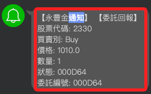

# 證券下單

<br>

## 查詢與測試

1. 查詢使用版本。

    ```python
    import shioaji as sj

    print(sj.__version__)
    ```

    

<br>

2. 登入測試；特別注意，測試時務必確認參數 `simulation` 設置為 `True`。

    ```python
    import os
    from dotenv import load_dotenv
    load_dotenv()

    api_key=os.environ["API_KEY"]
    secret_key=os.environ["SECRET_KEY"]

    # 模擬模式
    api = sj.Shioaji(simulation=True)
    api.login(
        api_key=api_key,   
        secret_key=secret_key
    )
    ```

    

<br>

3. 證券下單測試；這會延續前面的測試模式參數。

    ```python
    # 股票代碼
    Stock_Symbo = "2330"
    # 商品檔
    contract = api.Contracts.Stocks.TSE[Stock_Symbo]

    # 證券委託單
    order = api.Order(
        # 價格
        price=1010,
        # 數量
        quantity=1,
        # 買賣別
        action=sj.constant.Action.Buy,
        # 委託價格類別
        price_type=sj.constant.StockPriceType.LMT,
        # 委託條件
        order_type=sj.constant.OrderType.ROD,
        # 下單帳號
        account=api.stock_account,
    )

    # 下單
    trade = api.place_order(contract, order)
    trade
    ```

<br>

## 輸出說明

_輸出包含 `OrderState.StockOrder`、`Trade` 兩部分_

<br>

1. 第一部分 `OrderState.StockOrder` 輸出說明如下。

    ```bash
    {
        'operation': 
            {
                # 新建訂單
                'op_type': 'New', 
                # `00` 代表成功
                'op_code': '00', 
                # 無額外訊息
                'op_msg': ''
            }, 
        'order': 
            {
                # 內部訂單 ID
                'id': '000003',
                # 序號，通常與 ID 相同 
                'seqno': '000003', 
                # 內部訂單編號
                'ordno': '000002', 
                'account': 
                    {
                        # 帳戶類型，S 表示證券帳戶
                        'account_type': 'S', 
                        'person_id': '',
                        # 券商代號 
                        'broker_id': '9A95',
                        # 帳號
                        'account_id': '3453495',
                        # 是否完成 API 簽署
                        'signed': False
                    }, 
                'action': 'Buy', 
                # 價格
                'price': 1010, 
                # 數量
                'quantity': 1, 
                # 委託條件，Cash 表示現金交易
                'order_cond': 'Cash', 
                # 下單股數類型，Common 表示普通股
                'order_lot': 'Common', 
                'custom_field': '', 
                # 委託單類型，ROD 表示當日有效單
                'order_type': 'ROD', 
                # 價格類型，LMT 表示限價單
                'price_type': 'LMT'
            }, 
        'status': 
            {
                'id': '000003',
                # 交易所時間戳記
                'exchange_ts': 1733876046.713682, 
                'order_quantity': 1, 
                'modified_price': 0, 
                'cancel_quantity': 0,
                # 網頁端 ID，137，用於內部記錄
                'web_id': '137'
            }, 
        'contract': 
            {
                # 商品類型，STK 表示股票
                'security_type': 'STK',
                # 交易所，TSE 表示台灣證券交易所
                'exchange': 'TSE', 
                # 股票代號
                'code': '2330'
            }
    }
    ```

<br>

2. 第二部分 `Trade` 說明如下。

    ```bash
    Trade(
        contract=Stock(exchange=<Exchange.TSE: 'TSE'>, 
        code='2330', 
        symbol='TSE2330', 
        name='台積電', 
        category='24', 
        unit=1000, 
        limit_up=1170.0, 
        limit_down=959.0, 
        reference=1065.0, 
        update_date='2024/12/11', 
        margin_trading_balance=78, 
        day_trade=<DayTrade.OnlyBuy: 'OnlyBuy'>), 
        order=Order(
            action=<Action.Buy: 'Buy'>, 
            price=1010, 
            quantity=1, 
            account=StockAccount(
                person_id='Y120269041', broker_id='9A95', account_id='3453495', username='蕭中柱'
            ), 
            price_type=<StockPriceType.LMT: 'LMT'>, 
            order_type=<OrderType.ROD: 'ROD'>
        ), 
        status=OrderStatus(status=<Status.Failed: 'Failed'>)
    )
    ```

<br>

##  訂閱通知

_設定回調函數_

<br>

1. 訂閱委託和成交回報，透過設定 `委託（Order）` 與 `成交（Trade）` 的回調函數 `order_callback()`，監聽並處理來自交易系統的回報消息；當委託單或成交單有更新時，系統會透過回調函數通知相關資訊。

    ```python
    # 自定義設定委託和成交回報的回調函數
    def order_callback(topic, msg):
        if topic == "Order":
            print(f"委託回報：{msg}")
        elif topic == "Trade":
            print(f"成交回報：{msg}")
        else:
            print(f"未知回報類型：{topic}, 訊息：{msg}")

    # 訂閱委託/成交回報
    api.set_order_callback(order_callback)

    # 輸出，這只是通知代碼已經運行
    print("已啟動委託/成交回報訂閱...")
    ```

    

<br>

2. 推送到 LINE Notify。

    ```python
    import requests

    def send_line_notify(message):
        token = os.environ["LINE_NOTIFY"]
        headers = {"Authorization": f"Bearer {token}"}
        data = {"message": message}
        requests.post(
            "https://notify-api.line.me/api/notify", 
            headers=headers, 
            data=data
        )

    def order_callback(topic, msg):
        if topic == "Order":
            send_line_notify(f"委託回報：{msg}")
        elif topic == "Trade":
            send_line_notify(f"成交回報：{msg}")
        else:
            send_line_notify(f"未知回報類型：{topic}, 訊息：{msg}")
    
    # 訂閱委託/成交回報
    api.set_order_callback(order_callback)
    ```

<br>

3. 可優化代碼，讓收到的通知更易讀。

    ```python
    import os
    import requests

    def send_line_notify(message):
        token = os.environ["LINE_NOTIFY"]
        headers = {"Authorization": f"Bearer {token}"}
        data = {"message": message}
        requests.post(
            "https://notify-api.line.me/api/notify", 
            headers=headers, data=data
        )

    def format_message(topic, msg):
        if topic == "Order":
            order_info = msg.get("order", {})
            status_info = msg.get("status", {})
            contract_info = msg.get("contract", {})
            return (
                f"【委託回報】\n"
                f"股票代碼: {contract_info.get('code')}\n"
                f"買賣別: {order_info.get('action')}\n"
                f"價格: {order_info.get('price')}\n"
                f"數量: {order_info.get('quantity')}\n"
                f"狀態: {status_info.get('id')}\n"
                f"委託編號: {order_info.get('id')}"
            )
        elif topic == "Trade":
            trade_info = msg.get("trade", {})
            contract_info = msg.get("contract", {})
            return (
                f"【成交回報】\n"
                f"股票代碼: {contract_info.get('code')}\n"
                f"成交價格: {trade_info.get('price')}\n"
                f"成交數量: {trade_info.get('quantity')}\n"
                f"成交時間: {trade_info.get('time')}"
            )
        else:
            return (
                f"【未知回報類型】\n"
                f"類型: {topic}\n"
                f"訊息: {msg}"
            )

    def order_callback(topic, msg):
        formatted_message = format_message(topic, msg)
        send_line_notify(formatted_message)

    # 訂閱委託/成交回報
    api.set_order_callback(order_callback)
    ```

<br>

## 委託

1. 查詢今日委託明細。

    ```python
    # 偵測委託狀態
    today_trades = api.list_trades()

    for trade in today_trades:
        if trade.status.status == sj.constant.Status.PendingSubmit:
            print(
                f"委託單 {trade.order.id} "
                "處於等待提交狀態，尚未被交易所確認。"
            )
        elif trade.status.status == sj.constant.Status.Submitted:
            print(
                f"委託單 {trade.order.id} 已被交易所接受。"
            )
        elif trade.status.status == sj.constant.Status.Failed:
            print(
                f"委託單 {trade.order.id} 提交失敗，請檢查相關設定。"
            )
        else:
            print(
                f"委託單 {trade.order.id} "
                f"狀態：{trade.status.status}"
            )
    ```

    

<br>

2. 取消委託；會先進行查詢。

    ```python
    # 查詢當前委託明細
    def list_orders():
        # 返回當日所有委託明細
        trades = api.list_trades()
        if trades:
            print("當前委託明細：")
            for trade in trades:
                print(
                    f"ID: {trade.order.id}, "
                    f"狀態: {trade.status.status}, "
                    f"價格: {trade.order.price}"
                )
            return trades
        else:
            print("目前無委託單。")
            return []

    # 取消指定委託
    def cancel_order_by_id(order_id):
        try:
            # 查詢所有委託
            trades = list_orders()
            # 遍歷找到匹配的委託
            target_trade = next(
                (trade for trade in trades if trade.order.id == order_id),
                None
            )
            if target_trade:
                # 執行取消委託
                # 傳入的是 trade，而非 trade.order
                response = api.cancel_order(target_trade)
                print(f"取消委託成功，回應：{response}")
            else:
                print(f"找不到對應的委託單 ID: {order_id}")
        except Exception as e:
            print(f"取消委託失敗，錯誤：{e}")

    # 前面步驟查詢到的委託單
    order_id = trade.order.id
    cancel_order_by_id(order_id)
    ```

    

<br>

## 查詢

1. 帳號列表。

    ```python
    print(api.list_accounts())
    ```

<br>

2. 查詢是否通過 API 測試。

    ```python
    import shioaji as sj
    from dotenv import load_dotenv
    import os

    # 載入 .env 檔案
    load_dotenv()

    # 讀取環境變數
    API_KEY = os.getenv("API_KEY")
    SECRET_KEY = os.getenv("SECRET_KEY")

    if not API_KEY or not SECRET_KEY:
        raise ValueError("找不到密鑰資料。")

    # 初始化 Shioaji API
    # 正式模式，也就是非模擬模式
    api = sj.Shioaji(simulation=False)
    accounts = api.login(
        api_key=API_KEY, 
        secret_key=SECRET_KEY
    )

    print(accounts)
    ```

    _結果顯示_

    ```bash
    Response Code: 0 | 
    Event Code: 0 | 
    Info: host '210.59.255.161:80', 
    hostname '210.59.255.161:80' 
    IP 210.59.255.161:80 
    (host 1 of 1) 
    (host connection attempt 1 of 1) 
    (total connection attempt 1 of 1) | 
    Event: Session up
    [
        StockAccount(
            person_id='Y120269041', 
            broker_id='9A95', 
            account_id='3453495', 
            username='蕭中柱'
        )
    ]
    ```

<br>

3. 檢查是否有完成簽署的帳號。

    ```python
    signed_accounts = [
        account 
        for account in accounts 
        if getattr(account, 'signed', False)
    ]

    if signed_accounts:
        print("已完成簽署的帳號:")
        for account in signed_accounts:
            print(account)
    else:
        print("沒有完成簽署的帳號，請前往重新簽署。")
    ```

    

<br>

___

_END_