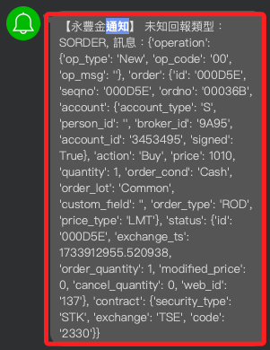

# 委託

<br>

## 說明

1. 查詢今日委託明細。

    ```python
    # 偵測委託狀態
    today_trades = api.list_trades()

    for trade in today_trades:
        if trade.status.status == sj.constant.Status.PendingSubmit:
            print(
                f"委託單 {trade.order.id} "
                "處於等待提交狀態，尚未被交易所確認。"
            )
        elif trade.status.status == sj.constant.Status.Submitted:
            print(
                f"委託單 {trade.order.id} 已被交易所接受。"
            )
        elif trade.status.status == sj.constant.Status.Failed:
            print(
                f"委託單 {trade.order.id} 提交失敗，請檢查相關設定。"
            )
        else:
            print(
                f"委託單 {trade.order.id} "
                f"狀態：{trade.status.status}"
            )
    ```

    

<br>

2. 取消委託；會先進行查詢。

    ```python
    # 查詢當前委託明細
    def list_orders():
        # 返回當日所有委託明細
        trades = api.list_trades()
        if trades:
            print("當前委託明細：")
            for trade in trades:
                print(
                    f"ID: {trade.order.id}, "
                    f"狀態: {trade.status.status}, "
                    f"價格: {trade.order.price}"
                )
            return trades
        else:
            print("目前無委託單。")
            return []

    # 取消指定委託
    def cancel_order_by_id(order_id):
        try:
            # 查詢所有委託
            trades = list_orders()
            # 遍歷找到匹配的委託
            target_trade = next(
                (trade for trade in trades if trade.order.id == order_id),
                None
            )
            if target_trade:
                # 執行取消委託
                # 傳入的是 trade，而非 trade.order
                response = api.cancel_order(target_trade)
                print(f"取消委託成功，回應：{response}")
            else:
                print(f"找不到對應的委託單 ID: {order_id}")
        except Exception as e:
            print(f"取消委託失敗，錯誤：{e}")

    # 前面步驟查詢到的委託單
    order_id = trade.order.id
    cancel_order_by_id(order_id)
    ```

    

<br>

## 查詢

1. 帳號列表。

    ```python
    print(api.list_accounts())
    ```

<br>

2. 查詢是否通過 API 測試。

    ```python
    import shioaji as sj
    from dotenv import load_dotenv
    import os

    # 載入 .env 檔案
    load_dotenv()

    # 讀取環境變數
    API_KEY = os.getenv("API_KEY")
    SECRET_KEY = os.getenv("SECRET_KEY")

    if not API_KEY or not SECRET_KEY:
        raise ValueError("找不到密鑰資料。")

    # 初始化 Shioaji API
    # 正式模式，也就是非模擬模式
    api = sj.Shioaji(simulation=False)
    accounts = api.login(
        api_key=API_KEY, 
        secret_key=SECRET_KEY
    )

    print(accounts)
    ```

    _結果顯示_

    ```bash
    Response Code: 0 | 
    Event Code: 0 | 
    Info: host '210.59.255.161:80', 
    hostname '210.59.255.161:80' 
    IP 210.59.255.161:80 
    (host 1 of 1) 
    (host connection attempt 1 of 1) 
    (total connection attempt 1 of 1) | 
    Event: Session up
    [
        StockAccount(
            person_id='Y120269041', 
            broker_id='9A95', 
            account_id='3453495', 
            username='蕭中柱'
        )
    ]
    ```

<br>

3. 檢查是否有完成簽署的帳號。

    ```python
    signed_accounts = [
        account 
        for account in accounts 
        if getattr(account, 'signed', False)
    ]

    if signed_accounts:
        print("已完成簽署的帳號:")
        for account in signed_accounts:
            print(account)
    else:
        print("沒有完成簽署的帳號，請前往重新簽署。")
    ```

    

<br>

___

_END_