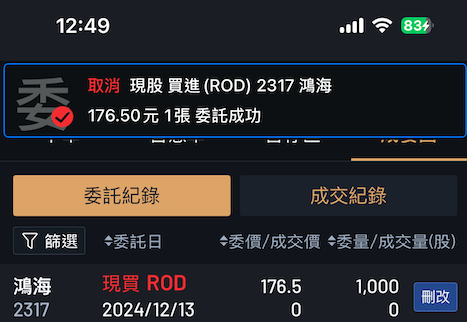
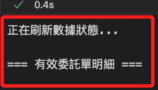

# 正式下單

<br>

## 步驟

1. 登入，指定為正式模式；在正式模式中，所取得的回應與模擬模式不同。

    ```python
    import shioaji as sj
    import os
    from dotenv import load_dotenv
    load_dotenv()

    api_key = os.environ["API_KEY"]
    secret_key = os.environ["SECRET_KEY"]

    # 初始化 Shioaji API
    # 設置為正式模式
    api = sj.Shioaji(simulation=False)

    # 使用 API 金鑰與密鑰登入
    accounts = api.login(
        api_key=api_key,
        secret_key=secret_key
    )

    # 帳號資訊
    print(accounts)
    ```

    

<br>

2. 啟用 CA，每次下單都必須進行啟用，其中 `person_id` 參數在第一次啟用之後可以省略。

    ```python
    try:
        # 執行 CA 啟用
        result = api.activate_ca(
            ca_path=os.environ["CA_CERT_PATH"],
            ca_passwd=os.environ["CA_PASSWORD"],
            person_id=os.environ["CA_PASSWORD"],
        )
        # 判斷結果並輸出
        if result:
            print("CA 憑證啟用成功。")
        else:
            print("CA 憑證啟用失敗，請檢查參數或系統狀態。")
    except Exception as e:
        # 捕捉並輸出錯誤訊息
        print(f"CA 憑證啟用過程中發生錯誤：{e}")
    ```

    

<br>

## 說明輸出

_記錄並說明前面步驟得到的回應資訊，若後續代碼有需要可進行截取_

<br>

1. 得到以下資訊。

    ```python
    Response Code: 0 | Event Code: 0 | Info: host '210.59.255.161:80', hostname '210.59.255.161:80' IP 210.59.255.161:80 (host 1 of 1) (host connection attempt 1 of 1) (total connection attempt 1 of 1) | Event: Session up
    [
        StockAccount(
            person_id='XXXXXXXXXX', 
            broker_id='XXXXX', 
            account_id='XXXXXXX', 
            signed=True, 
            username='XXX'
        )
    ]
    ```

<br>

2. 若得到提示可安裝帶有 [speed] 選項的 shioaji 套件等資訊，可自行決定是否安裝；特別注意，必須在提供的語句中添加引號如下。

    ```bash
    pip install "shioaji[speed]"
    ```

<br>

## 下單

_實測下單_

<br>

1. 使用代碼下單，手機 APP 會同步收到通知；關於代碼輸出請看後續說明。

    ```python
    # 目標資訊
    Stock_Symbo = "2317"
    PRICE = 176.5
    QUANTITY = 1.0

    # 合約
    contract = api.Contracts.Stocks.TSE[Stock_Symbo]

    # 證券委託單
    order = api.Order(
        # 價格
        price=PRICE,
        # 數量
        quantity=QUANTITY,
        # 買賣別
        action=sj.constant.Action.Buy,
        # 委託價格類別
        price_type=sj.constant.StockPriceType.LMT,
        # 委託條件
        order_type=sj.constant.OrderType.ROD,
        # 下單帳號
        account=api.stock_account,
    )

    # 下單
    trade = api.place_order(contract, order)
    ```

    

<br>

2. 在委託明細中會列出。

    

<br>

## 下單回報説明

_下單後會得到以下輸出資訊_

<br>

1. 訂單狀態物件 `OrderState.StockOrder`。

    ```python
    OrderState.StockOrder {
        'operation': {
            'op_type': 'New', 
            'op_code': '00', 
            'op_msg': ''
        }, 
        'order': {
            'id': '17f7f8cd', 
            'seqno': '784599', 
            'ordno': 'WE271', 
            'account': {
                'account_type': 'S', 'person_id': '', 'broker_id': '9A95', 'account_id': '3453495', 'signed': True
            }, 
            'action': 'Buy', 'price': 180.0, 'quantity': 1, 'order_type': 'ROD', 'price_type': 'LMT', 'order_cond': 'Cash', 'order_lot': 'Common', 'custom_field': ''
        }, 
        'status': {
            'id': '17f7f8cd', 'exchange_ts': 1734057568.218, 'modified_price': 0.0, 'cancel_quantity': 0, 'order_quantity': 1, 'web_id': '137'
        }, 
        'contract': {
            'security_type': 'STK', 'exchange': 'TSE', 'code': '2317', 'symbol': '', 'name': '', 'currency': 'TWD'
        }
    }
    ```

<br>

2. 若是要查看交易物件 `Trade` 對象，必須另外輸出；其中的 `msg` 會顯示委託單狀態描述 `委託成功`。

    ```python
    trade
    ```

    _輸出如下_

    ```python
    Trade(
        contract=Stock(
            exchange=<Exchange.TSE: 'TSE'>, 
            code='2317', 
            symbol='TSE2317', 
            name='鴻海', 
            category='31', 
            unit=1000, 
            limit_up=207.0, 
            limit_down=170.0, 
            reference=188.5, 
            update_date='2024/12/13', 
            margin_trading_balance=389, 
            short_selling_balance=173, 
            day_trade=<DayTrade.Yes: 'Yes'>
        ), 
        order=Order(
            action=<Action.Buy: 'Buy'>, 
            price=180, 
            quantity=1, 
            id='17f7f8cd', 
            seqno='784599', 
            ordno='WE271', 
            account=Account(
                account_type=<AccountType.Stock: 'S'>, 
                person_id='Y120269041', 
                broker_id='9A95', 
                account_id='3453495', 
                signed=True
            ), 
            price_type=<StockPriceType.LMT: 'LMT'>, 
            order_type=<OrderType.ROD: 'ROD'>
        ), 
        status=OrderStatus(
            id='17f7f8cd', 
            status=<Status.PendingSubmit: 'PendingSubmit'>, 
            status_code='0', 
            order_datetime=datetime.datetime(2024, 12, 13, 10, 39, 28), 
            msg='委託成功', 
            deals=[]
        )
    )
    ```

<br>

## 查詢委託單

1. 列出當前委託單。

    ```python
    def list_current_orders():
        try:
            # 確保數據刷新
            api.update_status()  
            
            # 查詢所有委託單
            trades = api.list_trades()
            if not trades:
                print("目前沒有任何委託單。")
                return []
            
            print("查詢有效委託單明細：")
            valid_trades = []
            for trade in trades:
                # 過濾有效的委託單，非已取消、已完成或失敗的委託
                if trade.status.status not in [
                    sj.constant.Status.Filled,
                    sj.constant.Status.Cancelled,
                    sj.constant.Status.Failed
                ]:
                    valid_trades.append(trade)
                    print(
                        f"股票代碼：{trade.contract.code}\n"
                        f"委託編號：{trade.order.id}\n"
                        f"買賣別：{trade.order.action}\n"
                        f"價格：{trade.order.price}\n"
                        f"數量：{trade.order.quantity}\n"
                        f"狀態：{trade.status.status}\n"
                        f"成交數量：{trade.status.order_quantity - trade.status.cancel_quantity}\n"
                        "-END-\n"
                    )
            return valid_trades
        except Exception as e:
            print(f"查詢有效委託單時發生錯誤：{e}")
            return []

    # 調用函數列出當前委託
    list_current_orders()
    ```

    

<br>

2. 解析輸出是一個 `Trade` 對象的細節訊息，描述委託單的詳細內容，包含 `合約 (contract)`、`委託訊息 (order)`、以及 `狀態 (status)`。

    ```python
    [
        Trade(
            # 合約
            contract=Stock(
                exchange=<Exchange.TSE: 'TSE'>, code='2317', symbol='TSE2317', name='鴻海', category='31', unit=1000, limit_up=207.0, limit_down=170.0, reference=188.5, update_date='2024/12/13', margin_trading_balance=389, short_selling_balance=173, day_trade=<DayTrade.Yes: 'Yes'>
            ), 
            # 訂單
            order=Order(
                action=<Action.Buy: 'Buy'>, price=176.5, quantity=1, id='88811c23', seqno='001325', ordno='WW567', account=Account(account_type=<AccountType.Stock: 'S'>, person_id='Y120269041', broker_id='9A95', account_id='3453495', signed=True), price_type=<StockPriceType.LMT: 'LMT'>, order_type=<OrderType.ROD: 'ROD'>
            ), 
            # 訂單狀態
            status=OrderStatus(
                id='88811c23', status=<Status.Submitted: 'Submitted'>, status_code='00', web_id='137', order_datetime=datetime.datetime(2024, 12, 13, 12, 44, 30), order_quantity=1, deals=[]
            )
        )
    ]
    ```

<br>

## 取消委託單

1. 先查詢確認委託，接著取消全部有效的委託單；直接從 `response["status"]` 提取 `cancel_quantity` 和 `order_quantity`，這些欄位精確反映了委託單的取消情況。

    ```python
    def cancel_all_valid_orders_with_validation():
        try:
            # 取得有效委託單
            valid_trades = list_current_orders()
            if not valid_trades:
                print("目前沒有有效的委託單可以取消。")
                return
            
            print("開始取消所有有效的委託單：")
            for trade in valid_trades:
                try:
                    # 執行取消操作
                    response = api.cancel_order(trade)
                    
                    # 根據回應判斷取消狀態
                    cancel_quantity = response["status"]["cancel_quantity"]
                    order_quantity = response["status"]["order_quantity"]
                    
                    if cancel_quantity == trade.order.quantity:
                        print(
                            f"取消成功：\n"
                            f"股票代碼：{trade.contract.code}\n"
                            f"委託編號：{trade.order.id}\n"
                            f"回應：{response}\n"
                        )
                    else:
                        print(
                            f"取消部分完成，需要再次確認：\n"
                            f"股票代碼：{trade.contract.code}\n"
                            f"委託編號：{trade.order.id}\n"
                            f"回應：{response}\n"
                        )
                        
                except Exception as e:
                    print(
                        f"取消委託失敗：\n"
                        f"股票代碼：{trade.contract.code}\n"
                        f"委託編號：{trade.order.id}\n"
                        f"錯誤：{e}\n"
                    )
            
            # 再次查詢確認
            print("更新後的有效委託單：")
            list_current_orders()
            
        except Exception as e:
            print(f"查詢或取消委託時發生錯誤：{e}")

    # 調用函數
    cancel_all_valid_orders_with_validation()
    ```

    

<br>

## 關於取消委託

_訊息說明_

<br>

1. 得到以下輸出，其中回應包含 `合約 contract` 及 `訂單狀態 OrderState.StockOrder` 兩部分。

    

<br>

2. 合約是一個股票物件 `Stock`，特別注意，這段輸出是用於描述委託交易中的詳細資訊，並非 Python 格式。

    ```python
    contract=Stock(
        exchange=<Exchange.TSE: 'TSE'>, 
        code='2317', 
        symbol='TSE2317', 
        name='鴻海', 
        category='31', 
        unit=1000, 
        limit_up=207.0, l
        imit_down=170.0, 
        reference=188.5, 
        update_date='2024/12/13', 
        margin_trading_balance=389, 
        short_selling_balance=173, 
        day_trade=<DayTrade.Yes: 'Yes'>
    ) 
        
    order=Order(
        action=<Action.Buy: 'Buy'>, 
        price=178.0, 
        quantity=1, 
        id='61be0665', 
        seqno='791049', 
        ordno='WK401', 
        account=Account(
            account_type=<AccountType.Stock: 'S'>, person_id='Y120269041', broker_id='9A95', account_id='3453495', signed=True
        ), 
        price_type=<StockPriceType.LMT: 'LMT'>, 
        order_type=<OrderType.ROD: 'ROD'>
    ) 
        
    status=OrderStatus(
        id='61be0665', 
        status=<Status.PendingSubmit: 'PendingSubmit'>, 
        status_code='0', 
        order_datetime=datetime.datetime(2024, 12, 13, 11, 19, 10), 
        deals=[]
    )
    ```

<br>

3. 另外還有一個委託單狀態 `OrderState.StockOrder`。

    ```python
    OrderState.StockOrder {
        'operation': {
            'op_type': 'Cancel', 'op_code': '00', 'op_msg': ''
        },
        'order': {
            'id': '61be0665', 'seqno': '791049', 'ordno': 'WK401', 
            'account': {
                'account_type': 'S', 'person_id': '', 'broker_id': '9A95', 'account_id': '3453495', 'signed': True
            }, 
            'action': 'Buy', 'price': 178.0, 'quantity': 1, 'order_type': 'ROD', 'price_type': 'LMT', 'order_cond': 'Cash', 'order_lot': 'Common', 'custom_field': ''
        }, 
        'status': {
            'id': '61be0665', 'exchange_ts': 1734060301.19, 'modified_price': 0.0, 'cancel_quantity': 1, 'order_quantity': 0, 'web_id': '137'
        }, 
        'contract': {
            'security_type': 'STK', 'exchange': 'TSE', 'code': '2317', 'symbol': '', 'name': '', 'currency': 'TWD'
        }
    }
    ```

<br>

## 確認委託狀態

1. 查詢當前有效的委託單。

    ```python
    list_current_orders()
    ```

    

<br>

___

_繼續以下單元_