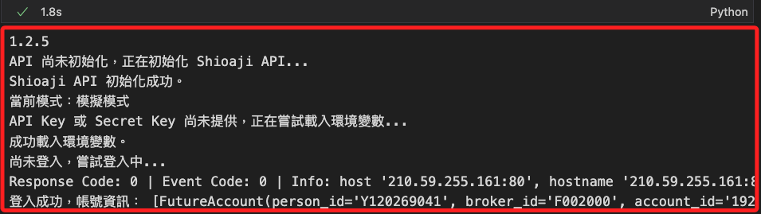

# 訂閱 Tick

_定義類別 `TickSubscription` 用已訂閱 Tick 資訊，並在接收到 Tick 資料時執行預設的 `回調函數` 處理相關數據，同時提供取消訂閱的功能。_

<br>

## 準備工作

1. 建立類別模組文件；另外也添加一個測試腳本 `ex01.ipynb`，已經存在可免。

    ```bash
    touch tick_subscription.py ex01.ipynb
    ```

<br>

## 報價類型

_`quote_type` 有幾種可選擇的報價類型_

<br>

1. `Tick` 表示逐筆交易資訊，包含每一筆成交的價格、數量等資料。

<br>

2. `BidAsk` 表示報價中的買賣價量資訊，如買價、賣價、買量、賣量等，用於觀察市場買賣雙方出價資訊的需求。

<br>

3. `Quote` 表示完整的報價資訊，包含最新的 `成交價`、`買賣五檔` 等綜合資訊，適合需要更多細節的市場數據觀察需求。

<br>

4. 可在測試腳本中使用 API 屬性觀察這些常數。

    ```python
    import shioaji as sj

    # 查看報價類型的所有成員
    print(sj.constant.QuoteType.__members__)

    # 逐筆交易資訊
    print(sj.constant.QuoteType.Tick)

    # 買賣報價資訊
    print(sj.constant.QuoteType.BidAsk)

    # 完整報價資訊
    print(sj.constant.QuoteType.Quote)
    ```

<br>

## 定義類別

_建立新的模組，可傳入不同參數訂閱不同報價類型_

<br>

1. 編輯類別，報價類型預設為 `Tick`、報價版本，預設為 `v1`；特別注意，檢查 API 若不存在時，`raise` 會拋出異常 `ValueError`，並立即中斷並退出當前函數的執行，也不需要 `return`。

    ```python
    import shioaji as sj
    from shioaji import TickSTKv1, Exchange
    from threading import Event, Thread
    import time


    # 定義類別
    class TickSubscription:
        # 類別層級變數，管理所有訂閱的實例
        subscriptions = {}

        # 初始化函數
        def __init__(
            self, api, 
            stock_code="2330", 
            quote_type="Tick", 
            version="v1"
        ):
            # 檢查 API 對象是否存在
            if not api:
                raise ValueError(
                    "api 未傳入，請確認是否已初始化並登入 Shioaji。"
                )

            self.api = api
            self.stock_code = stock_code
            self.quote_type = getattr(sj.constant.QuoteType, quote_type)
            self.version = getattr(sj.constant.QuoteVersion, version)
            self.event = Event()

            # 將實例加入管理器
            TickSubscription.subscriptions[stock_code] = self

        # 回調函數，處理接收到的 Tick 資訊
        def quote_callback(self, exchange: Exchange, tick: TickSTKv1):
            print(
                f"【Tick 資訊】\nExchange: {exchange}\nTick: {tick}"
            )

        # 開始訂閱 Tick 資訊
        def start_subscription(self):
            print(f"開始訂閱 {self.stock_code} 的 Tick 資訊...")

            # 綁定回調函數，避免裝飾器寫法
            self.api.quote.set_on_tick_stk_v1_callback(self.quote_callback)

            # 訂閱指定股票
            self.api.quote.subscribe(
                contract=self.api.Contracts.Stocks[self.stock_code],
                quote_type=self.quote_type,
                version=self.version
            )

            # 等待回調觸發
            self.event.wait()

        # 取消訂閱 Tick 資訊
        def stop_subscription(self):
            print(
                f"取消訂閱 {self.stock_code} 的 Tick 資訊..."
            )
            self.api.quote.unsubscribe(
                contract=self.api.Contracts.Stocks[self.stock_code],
                quote_type=self.quote_type,
                version=self.version
            )
            print(
                f"已取消訂閱 {self.stock_code} 的 Tick 資訊。"
            )
            self.event.set()

            # 從管理器中移除
            TickSubscription.subscriptions.pop(
                self.stock_code, 
                None
            )

        # 啟動訂閱並在指定時間後自動取消，這會排除進程阻塞
        def run(self, cancel_delay=60):
            # 啟動訂閱執行緒，設置為守護執行緒
            subscribe_thread = Thread(
                target=self.start_subscription, 
                daemon=True
            )
            subscribe_thread.start()

            # 啟動取消訂閱執行緒，設置為守護執行緒
            def delayed_stop():
                print(
                    f"等待 {cancel_delay} 秒後"
                    f"將自動取消訂閱 {self.stock_code}..."
                )
                time.sleep(cancel_delay)
                self.stop_subscription()

            stop_thread = Thread(target=delayed_stop, daemon=True)
            stop_thread.start()

            # 立即返回，不阻塞主執行緒
            print(
                f"訂閱 {self.stock_code} 已啟動，取消訂閱將在背景執行。"
            )

        # 定義類別方法，停止所有正在運行的訂閱
        @classmethod
        def stop_all(cls):
            print("停止所有訂閱...")
            # stock_code 會在 `stop_subscription` 傳出，無需重複
            # 所以使用 `_` 表示即可
            for _, subscription in list(cls.subscriptions.items()):
                subscription.stop_subscription()
            print("所有訂閱已停止。")
    ```

<br>

2. 補充説明，`守護者模式（Daemon Thread）` 是指將執行緒設定為 `守護執行緒`，當主執行緒結束時，所有守護執行緒也會自動終止，而不會阻塞主程式的退出；一般執行緒預設為 `非守護執行緒`，需要明確結束後才允許主執行緒退出。

<br>

## 導入模組

_前一個步驟建立的 `TickSubscription`_

<br>

1. 建立訂閱工具。

    ```python
    from tick_subscription import TickSubscription
    import MyShioaji as msj

    # 登入，務必確保已經登入
    api = msj.login_Shioaji()

    # 建立訂閱工具並執行
    tick_subscriber1 = TickSubscription(
        api=api,
        # 指定股票代碼
        stock_code="2330",
        quote_type="Tick",
    )
    # 建立訂閱工具並執行
    tick_subscriber2 = TickSubscription(
        api=api,
        stock_code="2317",
        quote_type="Tick",
        version="v1"
    )
    ```

    

<br>

2. 啟動訂閱；會開始輸出第一個訂閱的 `2330` 的資訊。

    ```python
    # 啟動訂閱
    tick_subscriber1.run(600)
    ```

    

<br>

3. 另外開啟一個 CELL，起訂另一個訂閱 `2317`。

    ```python
    tick_subscriber2.run(600)
    ```

    

<br>

4. 再開啟另一個 CELL，運行以下代碼建立第三個訂閱工具，同時啟動訂閱 `2303`。

    ```python
    # 建立訂閱工具並執行
    tick_subscriber3 = TickSubscription(
        api=api,
        stock_code="2303",
        quote_type="Tick",
    )
    tick_subscriber3.run(600)
    ```

    

<br>

5. 停止指定的訂閱，例如第一個訂閱，其餘訂閱會繼續運行。

    ```python
    # 停止指定訂閱
    tick_subscriber1.stop_subscription()
    ```

    

<br>

6. 停止所有訂閱；這是調用類別函數來運行。

    ```python
    # 停止所有訂閱
    TickSubscription.stop_all()
    ```

    

<br>

## 轉換訂閱類別 

1. 使用自訂類別 `TickSubscription` 時，可傳入不同的 `quote_type`，例如改成訂閱 `買賣報價資訊 (BidAsk)`。

    ```python
    tick_subscriber = TickSubscription(
        api=api, 
        stock_code="2330", 
        quote_type="BidAsk"
    )
    tick_subscriber.run()
    ```

<br>

___

_接續下一個單元_