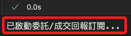
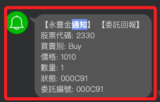

# 訂閱通知

<br>

## 設定回調函數

_訂閱委託和成交回報_

<br>

1. 透過設定 `委託（Order）` 與 `成交（Trade）` 的回調函數 `order_callback()`，監聽並處理來自交易系統的回報消息；當委託單或成交單有更新時，系統會透過回調函數通知相關資訊。

<br>

2. 以下是 _回調函數_ 的基本架構，任意命名如 `order_callback`，有兩個參數，第一個參數是系統預設的主題類型，可作為篩選條件，第二個參數是系統預設傳遞的訊息，可處理後回傳。

    ```python
    # 自定義設定委託和成交回報的回調函數
    def order_callback(topic, msg):
        if topic == "Order":
            print(f"委託回報：{msg}")
        elif topic == "Trade":
            print(f"成交回報：{msg}")
        else:
            print(f"未知回報類型：{topic}, 訊息：{msg}")
    ```

<br>

3. 調用函數訂閱委託、成交回報，並傳入自訂字的回調函數處理相關資訊。

    ```python
    api.set_order_callback(order_callback)

    # 輸出，這只是通知代碼已經運行
    print("已啟動委託/成交回報訂閱...")
    ```

    

<br>

## 進階回調函數

_實作使用 Line Notify 發送通知_

<br>

1. 優化回調函數，發送 LINE Notify。

    ```python
    import requests

    def send_line_notify(message):
        token = os.environ["LINE_NOTIFY"]
        headers = {"Authorization": f"Bearer {token}"}
        data = {"message": message}
        requests.post(
            "https://notify-api.line.me/api/notify", 
            headers=headers, 
            data=data
        )

    def order_callback(topic, msg):
        if topic == "Order":
            send_line_notify(f"委託回報：{msg}")
        elif topic == "Trade":
            send_line_notify(f"成交回報：{msg}")
        else:
            send_line_notify(f"未知回報類型：{topic}, 訊息：{msg}")
    
    # 訂閱委託/成交回報
    api.set_order_callback(order_callback)
    ```

<br>

2. 實測委託。

    ```python
    # 下單
    trade = api.place_order(contract, order)
    ```

    

<br>

## 優化

1. 優化代碼讓收到的通知更易讀。

    ```python
    import os
    import requests

    def send_line_notify(message):
        token = os.environ["LINE_NOTIFY"]
        headers = {"Authorization": f"Bearer {token}"}
        data = {"message": message}
        requests.post(
            "https://notify-api.line.me/api/notify", 
            headers=headers, data=data
        )

    def format_message(topic, msg):
        if topic == "Order":
            order_info = msg.get("order", {})
            status_info = msg.get("status", {})
            contract_info = msg.get("contract", {})
            return (
                f"【委託回報】\n"
                f"股票代碼: {contract_info.get('code')}\n"
                f"買賣別: {order_info.get('action')}\n"
                f"價格: {order_info.get('price')}\n"
                f"數量: {order_info.get('quantity')}\n"
                f"狀態: {status_info.get('id')}\n"
                f"委託編號: {order_info.get('id')}"
            )
        elif topic == "Trade":
            trade_info = msg.get("trade", {})
            contract_info = msg.get("contract", {})
            return (
                f"【成交回報】\n"
                f"股票代碼: {contract_info.get('code')}\n"
                f"成交價格: {trade_info.get('price')}\n"
                f"成交數量: {trade_info.get('quantity')}\n"
                f"成交時間: {trade_info.get('time')}"
            )
        else:
            return (
                f"【未知回報類型】\n"
                f"類型: {topic}\n"
                f"訊息: {msg}"
            )

    def order_callback(topic, msg):
        # 增加對 SORDER 的支援
        if topic in ["Order", "SORDER"]:
            formatted_message = format_message("Order", msg)
            send_line_notify(formatted_message)
        elif topic == "Trade":
            formatted_message = format_message("Trade", msg)
            send_line_notify(formatted_message)
        else:
            formatted_message = format_message(topic, msg)
            send_line_notify(formatted_message)

    # 訂閱委託/成交回報
    api.set_order_callback(order_callback)
    ```

<br>

2. 再次觸發委託測試；這代碼與前面相同。

    ```python
    # 下單
    trade = api.place_order(contract, order)
    ```

    

<br>

___

_接續下一個單元_