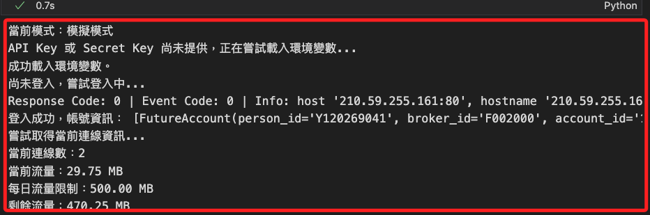
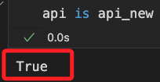
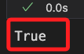

# 委託與取消

_延續之前的 `.ipynb`_

<br>

## 說明

1. 查詢今日委託明細。

    ```python
    # 偵測委託狀態
    today_trades = api.list_trades()

    for trade in today_trades:
        if trade.status.status == sj.constant.Status.PendingSubmit:
            print(
                f"委託單 {trade.order.id} "
                "處於等待提交狀態，尚未被交易所確認。"
            )
        elif trade.status.status == sj.constant.Status.Submitted:
            print(
                f"委託單 {trade.order.id} 已被交易所接受。"
            )
        elif trade.status.status == sj.constant.Status.Failed:
            print(
                f"委託單 {trade.order.id} 提交失敗，請檢查相關設定。"
            )
        else:
            print(
                f"委託單 {trade.order.id} "
                f"狀態：{trade.status.status}"
            )
    ```

    

<br>

2. 假如有多筆委託單，會逐筆顯示。

    

<br>

3. 取消委託；會先進行查詢。

    ```python
    # 查詢當前委託明細
    def list_orders():
        # 返回當日所有委託明細
        trades = api.list_trades()
        if trades:
            print("當前委託明細：")
            for trade in trades:
                print(
                    f"ID: {trade.order.id}, "
                    f"狀態: {trade.status.status}, "
                    f"價格: {trade.order.price}"
                )
            return trades
        else:
            print("目前無委託單。")
            return []

    # 取消指定委託
    def cancel_order_by_id(order_id):
        try:
            # 查詢所有委託
            trades = list_orders()
            # 遍歷找到匹配的委託
            target_trade = next(
                (trade for trade in trades if trade.order.id == order_id),
                None
            )
            if target_trade:
                # 執行取消委託
                # 傳入的是 trade，而非 trade.order
                response = api.cancel_order(target_trade)
                print(f"取消委託成功，回應：{response}")
            else:
                print(f"找不到對應的委託單 ID: {order_id}")
        except Exception as e:
            print(f"取消委託失敗，錯誤：{e}")

    # 前面步驟查詢到的委託單
    order_id = trade.order.id
    cancel_order_by_id(order_id)
    ```

    

<br>

4. 查詢當前委託。

    ```python
    # 查詢更新後的委託明細
    def list_updated_orders():
        # 取得當日所有委託明細
        trades = api.list_trades()
        if trades:
            print("更新後的委託明細：")
            for trade in trades:
                print(
                    f"ID: {trade.order.id}, "
                    f"狀態: {trade.status.status}, "
                    f"價格: {trade.order.price}"
                )
        else:
            print("目前無任何委託單。")

    # 執行查詢
    list_updated_orders()
    ```

    

<br>

5. 確認取消請求是否成功。

    ```python
    response = api.cancel_order(trade)
    print(f"取消委託回應：{response}")
    ```

<br>

## 修正回調

1. 添加取消。

    ```python
    import os
    import requests

    def send_line_notify(message):
        token = os.environ["LINE_NOTIFY"]
        headers = {"Authorization": f"Bearer {token}"}
        data = {"message": message}
        requests.post(
            "https://notify-api.line.me/api/notify", 
            headers=headers, data=data
        )

    def format_message(topic, msg):
        if topic == "Order":
            order_info = msg.get("order", {})
            status_info = msg.get("status", {})
            contract_info = msg.get("contract", {})
            operation_info = msg.get("operation", {})
            
            if operation_info.get("op_type") == "Cancel":
                # 格式化取消回報的訊息
                return (
                    f"【取消委託回報】\n"
                    f"股票代碼: {contract_info.get('code')}\n"
                    f"委託編號: {order_info.get('id')}\n"
                    f"取消狀態: {operation_info.get('op_msg')}"
                )
            
            return (
                f"【委託回報】\n"
                f"股票代碼: {contract_info.get('code')}\n"
                f"買賣別: {order_info.get('action')}\n"
                f"價格: {order_info.get('price')}\n"
                f"數量: {order_info.get('quantity')}\n"
                f"狀態: {status_info.get('id')}\n"
                f"委託編號: {order_info.get('id')}"
            )
        elif topic == "Trade":
            trade_info = msg.get("trade", {})
            contract_info = msg.get("contract", {})
            return (
                f"【成交回報】\n"
                f"股票代碼: {contract_info.get('code')}\n"
                f"成交價格: {trade_info.get('price')}\n"
                f"成交數量: {trade_info.get('quantity')}\n"
                f"成交時間: {trade_info.get('time')}"
            )
        else:
            return (
                f"【未知回報類型】\n"
                f"類型: {topic}\n"
                f"訊息: {msg}"
            )

    def order_callback(topic, msg):
        # 增加對 SORDER 的支援
        if topic in ["Order", "SORDER"]:
            formatted_message = format_message("Order", msg)
            send_line_notify(formatted_message)
        elif topic == "Trade":
            formatted_message = format_message("Trade", msg)
            send_line_notify(formatted_message)
        else:
            formatted_message = format_message(topic, msg)
            send_line_notify(formatted_message)

    # 訂閱委託/成交回報
    api.set_order_callback(order_callback)
    ```

<br>

2. 取消。

    ```python
    cancel_order_by_id('000C89')
    cancel_order_by_id('000C8A')
    ```

    

<br>

## 查詢當前委託

1. 優化查詢代碼。

    ```python
    # 查詢當前委託明細
    def list_current_orders():
        try:
            # 獲取當前委託明細
            trades = api.list_trades()
            if trades:
                print("-當前委託明細-")
                for trade in trades:
                    print(
                        f"股票代碼：{trade.contract.code}\n"
                        f"委託編號：{trade.order.id}\n"
                        f"買賣別：{trade.order.action}\n"
                        f"價格：{trade.order.price}\n"
                        f"數量：{trade.order.quantity}\n"
                        f"狀態：{trade.status.status}\n"
                        f"成交數量：{trade.status.order_quantity}\n"
                        f"-END-\n"
                    )
                return trades
            else:
                print("目前無委託單。")
                return []
        except Exception as e:
            print(f"查詢當前委託失敗，錯誤：{e}")
            return []

    # 執行查詢
    list_current_orders()
    ```

    

<br>

2. 再度優化。

    ```python
    import time

    # 初始化 API，切換到正式環境
    api = sj.Shioaji(simulation=True)

    # 登入正式環境
    api.login(
        api_key=api_key, 
        secret_key=secret_key
    )

    # 定義取消 PendingSubmit 狀態的委託
    def cancel_pending_orders():
        try:
            # 查詢當日所有委託明細
            trades = api.list_trades()
            if not trades:
                print("目前無委託單。")
                return

            for trade in trades:
                if trade.status.status == sj.constant.Status.PendingSubmit:
                    try:
                        # 嘗試取消委託
                        response = api.cancel_order(trade)
                        print(f"成功取消委託：{trade.order.id}，回應：{response}")
                    except Exception as e:
                        print(f"取消委託失敗，委託編號：{trade.order.id}，錯誤：{e}")
                else:
                    print(f"委託 {trade.order.id} 狀態為 {trade.status.status}，不執行取消。")
        except Exception as e:
            print(f"取消委託時發生錯誤：{e}")

    # 查詢委託明細
    def list_orders():
        try:
            trades = api.list_trades()
            if trades:
                print("-當前委託明細-")
                for trade in trades:
                    print(
                        f"股票代碼：{trade.contract.code}\n"
                        f"委託編號：{trade.order.id}\n"
                        f"買賣別：{trade.order.action}\n"
                        f"價格：{trade.order.price}\n"
                        f"數量：{trade.order.quantity}\n"
                        f"狀態：{trade.status.status}\n"
                        f"成交數量：{trade.status.order_quantity}\n-END-\n"
                    )
            else:
                print("目前無委託單。")
        except Exception as e:
            print(f"查詢委託明細時發生錯誤：{e}")

    # 執行取消 PendingSubmit 的委託
    print("執行取消操作...")
    cancel_pending_orders()

    # 等待交易所處理取消請求
    print("等待 5 秒，重新查詢委託狀態...")
    time.sleep(5)

    # 查詢更新後的委託明細
    print("更新後的委託明細：")
    list_orders()
    ```

    

<br>

___

_接續下一個單元_