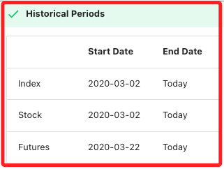

# 歷史數據

_Historical Market Data_

<br>

## 準備工作

1. 安裝套件。

    ```bash
    pip install pandas
    ```

<br>

2. 開啟測試腳本，載入套件並登入帳號，這裡使用正式模式登入。

    ```python
    # 導入庫
    from tick_subscription import TickSubscription
    import MyShioaji as msj

    # 登入
    api = msj.login_Shioaji(simulation=False)
    ```

<br>

## 逐筆交易資料

_`Ticks`，用於取得指定日期、時間區段或最後幾筆的逐筆交易數據。_

<br>

1. `方法簽名 (Method Signature)`，這是在函式定義中描述它的名稱和其參數列表的部分。

    ```python
    api.ticks
    ```

<br>

2. 全部參數說明。

    ```python
    api.ticks(
        # 合約物件 (例如：股票、期貨)
        contract: shioaji.contracts.BaseContract = api.Contracts.Stocks["2330"],
        # 日期，格式為 "YYYY-MM-DD"，預設為前一交易日
        date: str = '2022-12-26',
        # 查詢類型
        query_type: shioaji.constant.TicksQueryType = <TicksQueryType.AllDay: 'AllDay'>,
        # 開始時間
        time_start: Union[str, datetime.time] = None,
        # 結束時間
        time_end: Union[str, datetime.time] = None,
        # 最後幾筆數據
        last_cnt: int = 0,
        # 超時時間 (單位：毫秒)
        timeout: int = 30000,
        # 回調函數 (非必要)
        cb: Callable[[shioaji.data.Ticks], NoneType] = None,  
    ) -> shioaji.data.Ticks
    ```

<br>

## 實測

1. 按日期查詢。

    ```python
    ticks = api.ticks(
        contract=api.Contracts.Stocks["2330"], 
        date="2024-12-17"
    )
    ticks
    ```

    _輸出_

    ```python
    Ticks(
        # 時間戳記 (timestamp)
        ts=[
            1673859600113699000, 1673859600228800000, 1673859600244294000, 1673859600308595000
        ], 
        # 成交價格
        close=[506.0, 505.0, 506.0, 506.0],
        # 成交數量
        volume=[3340, 1, 17, 2],
        # 買價，買方價格，內盤價
        bid_price=[505.0, 505.0, 506.0, 506.0],
        # 買量
        bid_volume=[122, 320, 60, 58],
        # 賣價，賣方價格，外盤價
        ask_price=[506.0, 506.0, 507.0, 507.0],
        # 賣量
        ask_volume=[13, 22, 702, 702],
        # 內外盤別 {1: 外盤, 2: 內盤, 0: 無法判定}
        tick_type=[1, 2, 1, 2]
    )
    ```

<br>

2. 輸出為 `DataFrame`。

    ```python
    import pandas as pd
    # 根據 ticks 的屬性將其轉為 DataFrame
    df = pd.DataFrame({
        'ts': ticks.ts,
        # 其他屬性
        'close': ticks.close,
        'volume': ticks.volume,
        'bid_price': ticks.bid_price,
        'bid_volume': ticks.bid_volume,
        'ask_price': ticks.ask_price,
        'ask_volume': ticks.ask_volume,
        'tick_type': ticks.tick_type,
    })

    # 將 ts 欄位轉換為時間格式
    df['ts'] = pd.to_datetime(df['ts']).dt.floor('s')
    df
    ```

    _輸出_

    

<br>

3. 時間區段查詢 (Range Time)，指定時間範圍的逐筆資料。

    ```python
    ticks = api.ticks(
        contract=api.Contracts.Stocks["2330"], 
        date="2023-01-16",
        query_type=sj.constant.TicksQueryType.RangeTime,
        time_start="09:00:00",
        time_end="09:20:01"
    )
    ticks
    ```

<br>

4. 查詢最後 N 筆數據 (Last Count)。

    ```python
    ticks = api.ticks(
        contract=api.Contracts.Stocks["2330"], 
        date="2023-01-16",
        query_type=sj.constant.TicksQueryType.LastCount,
        last_cnt=4,
    )
    ticks
    ```

<br>

## K線資料

_`Kbars`，用於取得指定日期區間的 K 線數據_

<br>

1. 方法簽名。

    ```python
    api.kbars
    ```

<br>

2. 參數介紹。

    ```python
    api.kbars(
        # 合約物件 (例如：股票、期貨)
        contract: shioaji.contracts.BaseContract,
        # 開始日期
        start: str = '2023-01-15',
        # 結束日期
        end: str = '2023-01-16',
        # 超時時間
        timeout: int = 30000,
        # 回調函數 (非必要)
        cb: Callable[[shioaji.data.Kbars], NoneType] = None
    ) -> shioaji.data.Kbars
    ```

<br>

3. 取得 K 線數據。

    ```python
    kbars = api.kbars(
        contract=api.Contracts.Stocks["2330"], 
        start="2024-11-01", 
        end="2024-12-17", 
    )
    kbars
    ```

    _輸出_

    ```python
    Kbars(
        # 時間戳記
        ts=[1673859660000000000, 1673859720000000000, 1673859780000000000, 1673859840000000000],
        Open=[506.0, 505.0, 505.0, 504.0],
        High=[508.0, 506.0, 506.0, 505.0],
        Low=[505.0, 505.0, 504.0, 504.0],
        Close=[505.0, 505.0, 504.0, 504.0],
        Volume=[5308, 1018, 543, 209]
    )
    ```

<br>

4. 輸出為 `DataFrame`。

    ```python
    import pandas as pd
    # 根據 ticks 的屬性將其轉為 DataFrame
    df = pd.DataFrame({
        'ts': kbars.ts,
        # 其他屬性
        'Open': kbars.Open,
        'High': kbars.High,
        'Low': kbars.Low,
        'Close': kbars.Close,
        'Volume': kbars.Volume
    })

    # 將 ts 欄位轉換為時間格式
    df['ts'] = pd.to_datetime(df['ts']).dt.floor('s')
    df
    ```

<br>

5. 可透過 Python 的 `dir()` 函數列出物件的所有可訪問的屬性和方法。

    ```python
    dir(kbars)
    ```

6. 也可透過 Python 的 `help()` 函數查看該物件的說明文檔。

    ```python
    help(kbars)
    ```

<br>

7. 輸出為 `DataFrame`。

    ```python
    import pandas as pd
    # 根據 ticks 的屬性將其轉為 DataFrame
    df = pd.DataFrame({
        'ts': kbars.ts,
        # 其他屬性
        'Open': kbars.Open,
        'High': kbars.High,
        'Low': kbars.Low,
        'Close': kbars.Close,
        'Volume': kbars.Volume
    })

    # 將 ts 欄位轉換為時間格式
    df['ts'] = pd.to_datetime(df['ts']).dt.floor('s')
    df
    ```

    _輸出_

<br>

## 連續期貨合約

_Continuous Futures，當期貨合約過期後，原合約無法再查詢數據，但可以使用 `TXFR1` 和 `TXFR2` 來獲取近月和次月的連續合約數據。_

<br>

1. 逐筆資料 (Ticks)。

    ```python
    ticks = api.ticks(
        contract=api.Contracts.Futures.TXF.TXFR1, 
        date="2020-03-22"
    )
    ticks
    ```

<br>

2. K 線數據 (Kbars)。

    ```python
    kbars = api.kbars(
        contract=api.Contracts.Futures.TXF.TXFR1,
        start="2023-01-15", 
        end="2023-01-16", 
    )
    kbars
    ```

<br>

3. 依據官方文件，支援的歷史資料範圍 (Historical Periods)。

    

<br>

___

_END_