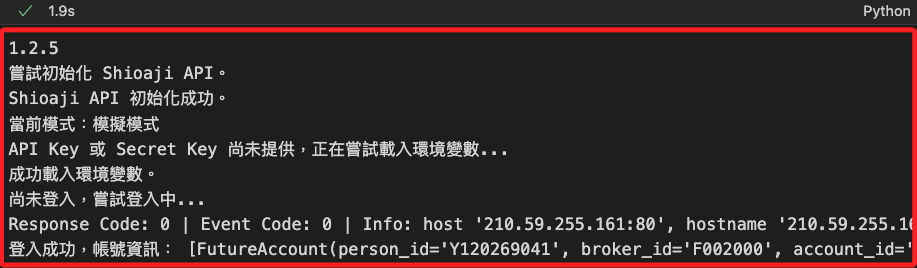

# 訂閱通知

_開啟新的 `.ipynb`_

<br>

## 前置作業

_先將以下函數寫入模組中，這是優化後的回調函數，可透過 Line Notify 發送訂閱的通知_

<br>

1. 發送 LINE Notify 的函數，參數 `message` 是要發送的文字訊息。

    ```python
    # 發送 LINE Notify 訊息
    def send_line_notify(message):
        import requests, os
        try:
            token = os.environ.get("LINE_NOTIFY")
            if not token:
                print("LINE Notify Token 未設定，無法發送通知。")
                return
            headers = {"Authorization": f"Bearer {token}"}
            data = {"message": message}
            response = requests.post(
                "https://notify-api.line.me/api/notify", 
                headers=headers, 
                data=data
            )
            if response.status_code == 200:
                print("LINE Notify 訊息發送成功。")
            else:
                print(
                    f"LINE Notify 發送失敗，狀態碼：{response.status_code}，"
                    f"回應：{response.text}"
                )
        except Exception as e:
            print(f"發送 LINE Notify 時發生錯誤：{e}")
    ```

<br>

2. 訂閱委託與成交回報的通知，要傳入自定義的回調函數，處理回報邏輯。

    ```python
    # 訂閱回調的函數
    def subscribe_notifications(api, callback_function):
        try:
            # 設定委託回報的回調函數
            api.set_order_callback(callback_function)
            print("已成功訂閱委託與成交回報通知。")
        except Exception as e:
            print(f"訂閱通知時發生錯誤：{e}")
    ```

<br>

3. 處理委託與成交回報的回調函數，其中參數 `topic` 會依據傳入類型做不同處理，包含 `Order` 或 `Trade` 等；參數 `msg` 則是回報的詳細訊息。

    ```python
    # 處理不同類型交易的回調函數
    def my_order_callback(topic, msg):
        if topic == "Order":
            send_line_notify(f"委託回報：{msg}")
            print(f"[訂閱通知] 委託回報：{msg}")
        elif topic == "Trade":
            send_line_notify(f"成交回報：{msg}")
            print(f"[訂閱通知] 成交回報：{msg}")
        else:
            send_line_notify(f"未知回報類型：{topic}, 訊息：{msg}")
            print(f"[訂閱通知] 未知回報類型：{topic}, 訊息：{msg}")
    ```

<br>

## 建立操作環境

_導入模組、登入並啟用憑證_

<br>

1. 載入自訂模組。

    ```python
    import MyShioaji as msj
    ```

<br>

2. 調用自訂的登入函數，並指定參數為正式模式。

    ```python
    # 登入，重新載入環境變數，並傳出全局變數 api
    api = msj.login_Shioaji(simulation=False)
    ```

    

<br>

3. 啟用 CA，每次下單都必須進行啟用。

    ```python
    msj.activate_ca(api)
    ```

    

<br>

## 回調函數基本介紹

_簡單介紹訂閱委託和成交回報，可不實作_

<br>

1. 透過設定 `委託（Order）` 與 `成交（Trade）` 的回調函數 `order_callback()`，監聽並處理來自交易系統的回報消息；當委託單或成交單有更新時，系統會透過回調函數通知相關資訊。

<br>

2. 以下是 _回調函數_ 的基本架構，任意命名如 `order_callback`，有兩個參數，第一個參數是系統預設的主題類型，可作為篩選條件，第二個參數是系統預設傳遞的訊息，可處理後回傳。

    ```python
    # 自定義設定委託和成交回報的回調函數
    def order_callback(topic, msg):
        if topic == "Order":
            print(f"委託回報：{msg}")
        elif topic == "Trade":
            print(f"成交回報：{msg}")
        else:
            print(f"未知回報類型：{topic}, 訊息：{msg}")
    ```

<br>

3. 調用函數訂閱委託、成交回報，並傳入自訂字的回調函數處理相關資訊。

    ```python
    # 訂閱
    api.set_order_callback(order_callback)

    # 輸出，這只是通知代碼已經運行
    print("已啟動委託/成交回報訂閱...")
    ```

    

<br>

## 實作訂閱與觸發

1. 進行訂閱。

    ```python
    # 調用函數，訂閱委託與交易通知
    msj.subscribe_notifications(api, msj.my_order_callback)
    ```

<br>

2. 運行委託代碼進行實測，系統會觸發回調函數發送相關通知。

    ```python
    # 調用下單函數，其餘參數省略
    trade = msj.place_order(
        api=api,
        symbol="2317",
        price=176.5
    )
    ```

    

<br>

3. 可觀察取得的訊息進一步優化回調函數，回覆的 `topic` 為 `SORDER`，內容如下。

    ```json
    {
        'operation': {
            'op_type': 'New', 
            'op_code': '00', 
            'op_msg': ''
        }, 
        'order': {
            'id': '000031', 
            'seqno': '000031', 
            'ordno': '00000E', 
            'account': {
                'account_type': 'S', 
                'person_id': '', 
                'broker_id': '9A95', 
                'account_id': '3453495', 
                'signed': True
                }, 
            'action': 'Buy', 
            'price': 1010, 
            'quantity': 1, 
            'order_cond': 'Cash', 
            'order_lot': 'Common', 
            'custom_field': '', 
            'order_type': 'ROD', 
            'price_type': 'LMT'
        }, 
        'status': {
            'id': '000031', 
            'exchange_ts': 1733968270.729017, 
            'order_quantity': 1, 
            'modified_price': 0, 
            'cancel_quantity': 0, 
            'web_id': '137'
        }, 
        'contract': {
            'security_type': 'STK', 
            'exchange': 'TSE', 
            'code': '2330'
        }
    }
    ```

<br>

## 優化回調函數

1. 讓前面步驟所收到的通知更易讀。

    ```python
    import os
    import requests

    def send_line_notify(message):
        token = os.environ["LINE_NOTIFY"]
        headers = {"Authorization": f"Bearer {token}"}
        data = {"message": message}
        requests.post(
            "https://notify-api.line.me/api/notify", 
            headers=headers, data=data
        )

    def format_message(topic, msg):
        if topic == "Order":
            order_info = msg.get("order", {})
            status_info = msg.get("status", {})
            contract_info = msg.get("contract", {})
            return (
                f"【委託回報】\n"
                f"股票代碼: {contract_info.get('code')}\n"
                f"買賣別: {order_info.get('action')}\n"
                f"價格: {order_info.get('price')}\n"
                f"數量: {order_info.get('quantity')}\n"
                f"狀態: {status_info.get('id')}\n"
                f"委託編號: {order_info.get('id')}"
            )
        elif topic == "Trade":
            trade_info = msg.get("trade", {})
            contract_info = msg.get("contract", {})
            return (
                f"【成交回報】\n"
                f"股票代碼: {contract_info.get('code')}\n"
                f"成交價格: {trade_info.get('price')}\n"
                f"成交數量: {trade_info.get('quantity')}\n"
                f"成交時間: {trade_info.get('time')}"
            )
        else:
            return (
                f"【未知回報類型】\n"
                f"類型: {topic}\n"
                f"訊息: {msg}"
            )

    def order_callback(topic, msg):
        # 增加對 SORDER 的支援
        if topic in ["Order", "SORDER"]:
            formatted_message = format_message("Order", msg)
            send_line_notify(formatted_message)
        elif topic == "Trade":
            formatted_message = format_message("Trade", msg)
            send_line_notify(formatted_message)
        else:
            formatted_message = format_message(topic, msg)
            send_line_notify(formatted_message)

    # 訂閱委託/成交回報
    api.set_order_callback(order_callback)
    ```

<br>

2. 再次觸發委託測試；這代碼與前面相同。

    ```python
    # 下單
    trade = api.place_order(contract, order)
    ```

    

<br>

___

_接續下一個單元_