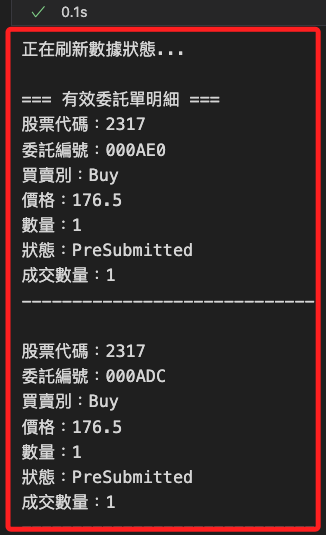
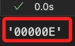
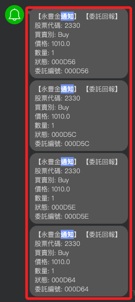
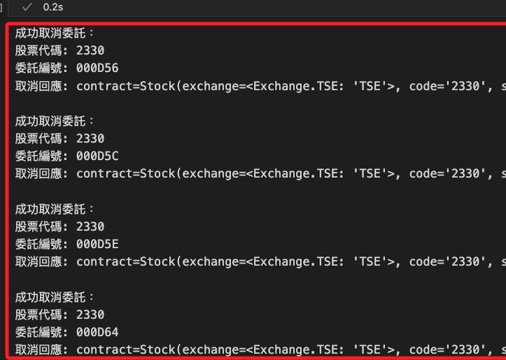

# 委託與取消

_延續之前的 `.ipynb`_

<br>

## 查詢交易

1. 使用 API 的函數查詢當前委託明細，每一行就是一筆委託單；其中包含各種狀態如 `已完成（Filled）`、`已取消（Cancelled）`、`失敗（Failed）`、`待提交（PendingSubmit）`、`已提交（Submitted）`、`部分成交（PartiallyFilled）`、`準備提交 (PreSubmit)`。

    ```python
    today_trades = api.list_trades()
    ```

    

<br>

2. 調用自訂義函數查詢，這會將 `已取消`、`失敗`、`已完成` 等狀態的訂單排除。

    ```python
    valid_trades = msj.list_current_orders(api)
    ```

    

<br>

## 取消指定委託

_寫入模組中，傳入委託單號來取消指定委託單_

<br>

1. 定義函數用以取消指定委託單。

    ```python
    # 取消指定單號的委託
    def cancel_order_by_id(api, order_id):
        try:
            # 檢查輸入參數
            if not api:
                raise ValueError("API 實例未初始化。")
            if not order_id:
                raise ValueError("必須提供有效的委託單編號。")

            # 查詢當前所有委託明細
            print("正在查詢當前委託單...")
            trades = api.list_trades()
            if not trades:
                print("目前無任何委託單可供取消。")
                return None

            # 查找目標委託單
            print(f"正在查找委託單 ID: {order_id}...")
            target_trade = next(
                (trade for trade in trades if trade.order.id == order_id), 
                None
            )

            if target_trade:
                # 確認找到目標，執行取消
                print(
                    f"找到目標委託單，股票代碼: {target_trade.contract.code}，"
                    f"買賣別: {target_trade.order.action}，"
                    f"數量: {target_trade.order.quantity}"
                )
                response = api.cancel_order(target_trade)
                print(f"取消委託成功，回應：{response}")
                return response
            else:
                # 找不到對應委託單
                print(f"找不到對應的委託單 ID: {order_id}")
                return None

        except ValueError as ve:
            print(f"參數錯誤：{ve}")
            return None
        except Exception as e:
            print(f"取消委託時發生錯誤：{e}")
            return None
    ```

<br>

2. 先下一筆訂單。

    ```python
    # 調用下單函數，其餘參數省略
    trade = msj.place_order(api=api, symbol="2317", price=177.5)
    ```

<br>

3. 調用 API 方法取得最後一筆委託的 ID。

    ```python
    trade.order.id
    ```

    

<br>

4. 取消指定 ID 的委託。

    ```python
    response = msj.cancel_order_by_id(api, trade.order.id)
    ```

    

<br>

## 取消全部委託。

1. 取消所有有效委託單。

    ```python
    # 取消所有有效委託單
    msj.cancel_all_valid_orders(api)
    ```

<br>

2. 同樣會收到訂閱的 Line 通知。

    

<br>

## 刪除指定狀態的委託

_寫入模組_

<br>

1. 自訂函數查詢指定狀態的訂單。

    ```python
    # 查詢指定狀態的全部委託單
    def list_orders_by_status(api, target_status="PreSubmitted"):
        import shioaji as sj

        try:
            # 獲取當日所有交易明細
            print(f"查詢當前所有委託單，目標狀態：{target_status}...")
            trades = api.list_trades()
            
            if not trades:
                print("目前無任何委託單。")
                return []

            # 檢查目標狀態是否有效
            valid_statuses = [status.value for status in sj.constant.Status]
            if target_status not in valid_statuses:
                print(f"目標狀態無效：{target_status}。有效狀態為：{valid_statuses}")
                return []

            # 篩選符合目標狀態的委託單
            filtered_trades = [
                trade for trade in trades 
                if trade.status.status == getattr(sj.constant.Status, target_status, None)
            ]
            
            # 如果沒有符合條件的委託單
            if not filtered_trades:
                print(f"未找到目標狀態為 {target_status} 的委託單。")
                return []

            # 打印符合條件的委託單明細
            print(f"找到 {len(filtered_trades)} 筆符合目標狀態的委託單：")
            for trade in filtered_trades:
                print(
                    f"股票代碼：{trade.contract.code}\n"
                    f"委託編號：{trade.order.id}\n"
                    f"買賣別：{trade.order.action}\n"
                    f"價格：{trade.order.price}\n"
                    f"數量：{trade.order.quantity}\n"
                    f"狀態：{trade.status.status}\n"
                    "-END-\n"
                )

            return filtered_trades

        except Exception as e:
            print(f"查詢指定狀態委託單時發生錯誤：{e}")
            return []
    ```

<br>

2. 自訂函數刪除指定狀態的委託。

    ```python
    # 取消指定狀態的所有委託單
    def cancel_orders_by_status(api, target_status="PreSubmitted"):
        import shioaji as sj

        try:
            # 查詢所有當日交易明細
            print(f"查詢當前所有委託單，目標狀態：{target_status}...")
            trades = api.list_trades()
            if not trades:
                print("目前無任何委託單可供取消。")
                return []

            # 保存取消成功的回應
            success_responses = []

            # 遍歷交易明細
            for trade in trades:
                # 檢查委託單狀態是否符合目標
                if trade.status.status == getattr(sj.constant.Status, target_status, None):
                    try:
                        # 執行取消委託
                        response = api.cancel_order(trade)
                        print(
                            f"成功取消委託：\n"
                            f"股票代碼: {trade.contract.code}\n"
                            f"委託編號: {trade.order.id}\n"
                            f"取消回應: {response}\n"
                        )
                        success_responses.append(response)
                    except Exception as e:
                        print(
                            f"取消委託失敗：\n"
                            f"股票代碼: {trade.contract.code}\n"
                            f"委託編號: {trade.order.id}\n"
                            f"錯誤原因: {e}\n"
                        )
                else:
                    print(
                        f"委託單不符合目標狀態：\n"
                        f"股票代碼: {trade.contract.code}\n"
                        f"委託編號: {trade.order.id}\n"
                        f"目前狀態: {trade.status.status}\n"
                    )

            # 返回成功取消的回應
            if success_responses:
                print(f"總共成功取消 {len(success_responses)} 筆委託單。")
            else:
                print("未找到符合條件的委託單。")
            return success_responses

        except Exception as e:
            print(f"取消操作過程中發生錯誤：{e}")
            return []
    ```

    

<br>

3. 查詢指定狀態的委託。

    ```python
    # 查詢指定狀態的委託
    list_orders_by_status(api, target_status="PreSubmitted")
    ```

<br>

4. 刪除指定狀態的委託。

    ```python
    # 刪除指定狀態的委託
    cancel_orders_by_status(api, target_status="PreSubmitted")
    ```

<br>

## 繼續修正

1. 添加取消。

    ```python
    import os
    import requests

    def send_line_notify(message):
        token = os.environ["LINE_NOTIFY"]
        headers = {"Authorization": f"Bearer {token}"}
        data = {"message": message}
        requests.post(
            "https://notify-api.line.me/api/notify", 
            headers=headers, data=data
        )

    def format_message(topic, msg):
        if topic == "Order":
            order_info = msg.get("order", {})
            status_info = msg.get("status", {})
            contract_info = msg.get("contract", {})
            operation_info = msg.get("operation", {})
            
            if operation_info.get("op_type") == "Cancel":
                # 格式化取消回報的訊息
                return (
                    f"【取消委託回報】\n"
                    f"股票代碼: {contract_info.get('code')}\n"
                    f"委託編號: {order_info.get('id')}\n"
                    f"取消狀態: {operation_info.get('op_msg')}"
                )
            
            return (
                f"【委託回報】\n"
                f"股票代碼: {contract_info.get('code')}\n"
                f"買賣別: {order_info.get('action')}\n"
                f"價格: {order_info.get('price')}\n"
                f"數量: {order_info.get('quantity')}\n"
                f"狀態: {status_info.get('id')}\n"
                f"委託編號: {order_info.get('id')}"
            )
        elif topic == "Trade":
            trade_info = msg.get("trade", {})
            contract_info = msg.get("contract", {})
            return (
                f"【成交回報】\n"
                f"股票代碼: {contract_info.get('code')}\n"
                f"成交價格: {trade_info.get('price')}\n"
                f"成交數量: {trade_info.get('quantity')}\n"
                f"成交時間: {trade_info.get('time')}"
            )
        else:
            return (
                f"【未知回報類型】\n"
                f"類型: {topic}\n"
                f"訊息: {msg}"
            )

    def order_callback(topic, msg):
        # 增加對 SORDER 的支援
        if topic in ["Order", "SORDER"]:
            formatted_message = format_message("Order", msg)
            send_line_notify(formatted_message)
        elif topic == "Trade":
            formatted_message = format_message("Trade", msg)
            send_line_notify(formatted_message)
        else:
            formatted_message = format_message(topic, msg)
            send_line_notify(formatted_message)

    # 訂閱委託/成交回報
    api.set_order_callback(order_callback)
    ```

<br>

2. 取消指定單號。

    ```python
    cancel_order_by_id('000D56')
    cancel_order_by_id('000D5C')
    ```

    

<br>

## 查詢當前委託

1. 優化查詢代碼。

    ```python
    # 查詢當前委託明細
    def list_current_orders():
        try:
            # 取得當前委託明細
            trades = api.list_trades()
            if trades:
                print("-當前委託明細-")
                for trade in trades:
                    print(
                        f"股票代碼：{trade.contract.code}\n"
                        f"委託編號：{trade.order.id}\n"
                        f"買賣別：{trade.order.action}\n"
                        f"價格：{trade.order.price}\n"
                        f"數量：{trade.order.quantity}\n"
                        f"狀態：{trade.status.status}\n"
                        f"成交數量：{trade.status.order_quantity}\n"
                        f"-END-\n"
                    )
                return trades
            else:
                print("目前無委託單。")
                return []
        except Exception as e:
            print(f"查詢當前委託失敗，錯誤：{e}")
            return []

    # 執行查詢
    list_current_orders()
    ```

    

<br>

2. 再度優化，正確刪除委託單。

    ```python
    import time

    # 初始化 API，依據實際需求切換測試或正式環境
    api = sj.Shioaji(simulation=True)

    # 登入
    api.login(
        api_key=api_key, 
        secret_key=secret_key
    )

    # 定義取消 PendingSubmit 狀態的委託
    def cancel_pending_orders():
        try:
            # 查詢當日所有委託明細
            trades = api.list_trades()
            if not trades:
                print("目前無委託單。")
                return

            for trade in trades:
                if trade.status.status == sj.constant.Status.PendingSubmit:
                    try:
                        # 嘗試取消委託
                        response = api.cancel_order(trade)
                        print(
                            f"成功取消委託：{trade.order.id}，"
                            f"回應：{response}"
                        )
                    except Exception as e:
                        print(
                            f"取消委託失敗，委託編號：{trade.order.id}，"
                            f"錯誤：{e}"
                        )
                else:
                    print(
                        f"委託 {trade.order.id} "
                        f"狀態為 {trade.status.status}，不執行取消。"
                    )
        except Exception as e:
            print(f"取消委託時發生錯誤：{e}")

    # 查詢委託明細
    def list_orders():
        try:
            trades = api.list_trades()
            if trades:
                print("-當前委託明細-")
                for trade in trades:
                    print(
                        f"股票代碼：{trade.contract.code}\n"
                        f"委託編號：{trade.order.id}\n"
                        f"買賣別：{trade.order.action}\n"
                        f"價格：{trade.order.price}\n"
                        f"數量：{trade.order.quantity}\n"
                        f"狀態：{trade.status.status}\n"
                        f"成交數量：{trade.status.order_quantity}\n-END-\n"
                    )
            else:
                print("目前無委託單。")
        except Exception as e:
            print(f"查詢委託明細時發生錯誤：{e}")

    # 執行取消 PendingSubmit 的委託
    print("執行取消操作...")
    cancel_pending_orders()

    # 等待交易所處理取消請求
    print("等待 5 秒，重新查詢委託狀態...")
    time.sleep(5)

    # 查詢更新後的委託明細
    print("更新後的委託明細：")
    list_orders()
    ```

    

<br>

___

_接續下一個單元_