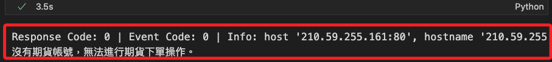

# 期貨

_尚未開戶_

<br>

## 帳戶狀態

1. 檢查。

    ```python
    import shioaji as sj

    # 初始化 API，先使用模擬模式
    api = sj.Shioaji(simulation=True)

    api_key = os.environ["API_KEY"]
    secret_key = os.environ["SECRET_KEY"]
    accounts = api.login(api_key=api_key, secret_key=secret_key)

    # 查詢所有帳號
    all_accounts = api.list_accounts()

    # 篩選出期貨帳號
    futures_accounts = [acc for acc in all_accounts if acc.account_type == "F"]

    # 檢查是否具備期貨下單權限
    if futures_accounts:
        signed_futures_accounts = [
            acc for acc in futures_accounts if getattr(acc, "signed", False)
        ]
        if signed_futures_accounts:
            print("已具備期貨下單權限，以下是簽署的期貨帳號：")
            for acc in signed_futures_accounts:
                print(
                    f"帳號ID: {acc.account_id}, "
                    f"經紀商: {acc.broker_id}, "
                    f"使用者: {acc.username}"
                )
        else:
            print("尚未完成期貨帳號的簽署，請前往完成簽署。")
    else:
        print("沒有期貨帳號，無法進行期貨下單操作。")
    ```

<br>

2. 假如尚未開戶。

    

<br>

## 下單

1. 程式碼。

```python
# 建立下單物件
order = api.Order(
    price=15000,
    quantity=1,
    # 買賣方向（買入）
    action=sj.constant.Action.Buy,
    # 限價單
    price_type=sj.constant.FuturesPriceType.LMT,
    # 委託單有效期（當日有效）
    order_type=sj.constant.OrderType.ROD,
    # 倉別（自動）
    octype=sj.constant.FuturesOCType.Auto,
    # 使用預設期貨帳號
    account=api.futopt_account
)

# 取得期貨商品
# 此處為 2023 年 12 月到期的台指期貨
contract = api.Contracts.Futures.TXF.TXF202312

# 下單
trade = api.place_order(contract, order)
print(trade)
```

<br>

## 訂閱交易回報

1. 訂閱指定帳號的交易回報。

```python
api.subscribe_trade(api.futopt_account)
```

<br>

2. 取消訂閱指定帳號的交易回報。

```python
api.unsubscribe_trade(api.futopt_account)
```

<br>

## 登出

1. 結束與伺服器的連接，釋放連線資源。

```python
api.logout()
```

<br>

___

_待續_
