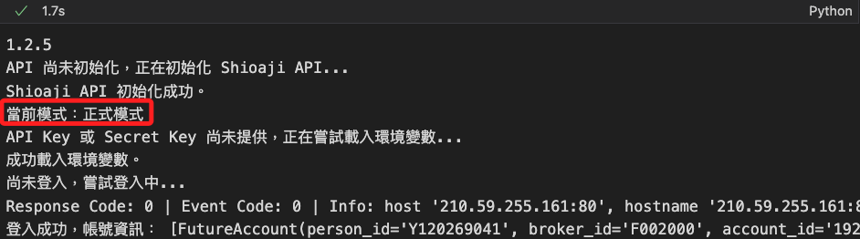

# Short Stock Source

_可用融券餘額，也就是市場中仍可供借券放空的數量；特別注意，並非是 `融券餘額` 資訊。_

<br>

## 函數說明

_`api.short_stock_sources()`_

<br>

1. 取得 `可用融券餘額` 資訊。

   ```python
   api.short_stock_sources(
       # 欲查詢的股票合約列表
       contracts: List[shioaji.contracts.Stock],
       # 請求逾時時間（毫秒）
       timeout: int = 5000,
       # callback 函式，可在取得結果時進行回呼
       cb: Callable[[shioaji.data.ShortStockSource], NoneType] = None
   ) -> List[shioaji.data.ShortStockSource]
   ```

<br>

2. `回傳值` 是一個 `ShortStockSource` 物件的列表，內容包含 `code (str)` 股票代碼、`short_stock_source (float)` 可用融券餘額、`ts (int)` 取得該資料的時間戳記

<br>

## 實作

1. 載入庫並登入；特別注意，要使用正式模式。

   ```python
   # 導入庫
   import MyShioaji as msj

   # 登入
   api = msj.login_Shioaji(simulation=False)
   ```

   

<br>

2. 建立合約物件並調用函數。

   ```python
   # 建立合約列表
   contracts = [
       api.Contracts.Stocks['2330'],
       api.Contracts.Stocks['2317']
   ]
   # 取得可用融券餘額
   short_stock_sources = api.short_stock_sources(contracts)
   short_stock_sources
   ```

   _輸出_

   ```bash
   [
       ShortStockSource(
           code='2330', 
           short_stock_source=106, 
           ts=1734530629000000000
       ),
       # 略
   ]
   ```

<br>

3. 假如使用 `模擬模式` 會顯示如下。

   ```bash
   2024-12-18 21:58:58.386 | WARNING  | shioaji.shioaji:short_stock_sources:955 - Simulation not support short_stock_sources yet
   ```

<br>

4. 轉為 DataFrame。

   ```python
   import pandas as pd

   df = pd.DataFrame(s.__dict__ for s in short_stock_sources)
   df.ts = pd.to_datetime(df.ts)
   df
   ```

   

<br>

---

_END_
