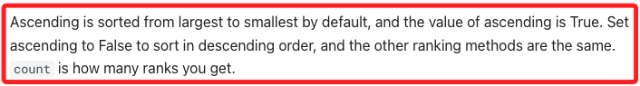

# Scanners

_篩選器，`Scanners` 指的是一種用於篩選、排序特定市場標的的工具與方法，可根據特定的條件或屬性，將符合條件的標的進行排名；透過 Scanners 可快速找到在特定日期或條件下表現最突出或變化最大的商品。_

<br>

## 函數說明

_`api.scanners()`，提供快速取得特定排行資訊的方法_

<br>

1. 可指定 `scanner_type` 來取得市場所需的排名，支援的 Scanner Type 如下。

    ```bash
    # 根據價格變化百分比(漲幅%)排序
    ChangePercentRank  

    # 根據價格漲跌金額排序
    ChangePriceRank  

    # 根據當日價格區間(最高-最低)排序
    DayRangeRank

    # 根據成交量排序
    VolumeRank

    # 根據成交金額排序
    AmountRank
    ```

<br>

2. 參數介紹。

    ```python
    api.scanners(
        # 排行的類，如 ChangePercentRank, ChangePriceRank 等
        scanner_type: shioaji.constant.ScannerType, 
        # 是否升冪，預設為 True
        ascending: bool = True,
        # 指定日期，預設日期為當前交易日
        date: str = None,
        # 取得前幾名，範圍 `0~200`
        count: int = 100,
        # 逾時時間
        timeout: int = 30000,
        # 回調函數
        cb: Callable[[List[shioaji.data.ChangePercentRank]], None] = None,
    ) -> List[shioaji.data.ChangePercentRank]
    ```

<br>

3. 特別注意，參數 `ascending` 在一般邏輯下指的是 `升冪`，`ascending=True` 應表示 `由小到大` 排序，但官方文件中卻描述 `Ascending is sorted from largest to smallest by default, and the value of ascending is True`，`ascending` 的預設為 `True`，依官方的定義則是 `由大到小` 方向排序；若要由小到大排序，請設 `ascending=False`。

    

<br>

4. `回傳值` 是一個列表 `List[ChangePercentRank]`，若為其他排序類型，回傳的物件結構相同或相近，但屬性名稱可能會有略微差異。

<br>

## 實作

1. 以 ChangePercentRank (漲幅%) 為例。

    ```python
    # 此範例將取得目前漲幅排名前 1 名的標的
    scanners = api.scanners(
        scanner_type=sj.constant.ScannerType.ChangePercentRank,
        count=1
    )

    # 查看結果
    scanners
    # 可能回傳類似如下的清單:
    # [ChangePercentRank(
    #     date='2021-04-09', code='5211', name='蒙恬', ... 
    # )]
    ```

<br>

2. 將結果轉換為 DataFrame。

    ```python
    import pandas as pd

    # 取得前 5 名漲幅最高的標的
    scanners = api.scanners(
        scanner_type=sj.constant.ScannerType.ChangePercentRank, 
        count=5
    )

    # 將回傳的 ChangePercentRank 物件轉為 DataFrame，便於檢視與分析
    df = pd.DataFrame(s.__dict__ for s in scanners)

    # 將 ts (timestamp) 欄位轉成可讀的日期時間格式
    df.ts = pd.to_datetime(df.ts)

    # 查看 DataFrame
    df
    ```

<br>

## ChangePercentRank 屬性說明

1. `date (str)` 日期。

<br>

2. `code (str)` 股票代號。

<br>

3. `name (str)` 股票名稱。

<br>

4. `ts (int)` 時間戳記，可轉為 datetime。

<br>

5. `open (float)` 今日開盤價。

<br>

6. `high (float)` 今日最高價。

<br>

7. `low (float)` 今日最低價。

<br>

8. `close (float)` 最新成交價。

<br>

9. `price_range (float)` 今日價格區間 (高-低)。

<br>

10. `tick_type (int)` 內外盤別 (1:外盤、2:內盤、0:無法判定)。

<br>

11. `change_price (float)` 相對昨日的漲跌金額。

<br>

12. `change_type (int)` 漲跌種類 (上漲、平盤、下跌、漲停、跌停)。

<br>

13. `average_price (float)` 加權平均價。

<br>

14. `volume (int)` 最新一筆成交量。

<br>

15. `total_volume (int)` 今日累計成交量。

<br>

16. `amount (int)` 最新一筆成交金額。

<br>

17. `total_amount (int)` 今日累計成交金額。

<br>

18. `yesterday_volume (int)`: 昨日成交量。

<br>

19. `volume_ratio (float)` volume / yesterday_volume，即量比。

<br>

20. `buy_price (float)` 買價。

<br>

21. `buy_volume (int)` 買量。

<br>

22. `sell_price (float)` 賣價。

<br>

23. `sell_volume (int)` 賣量。

<br>

24. `bid_orders (int)` 買單數量 (以委託單計算)。

<br>

25. `bid_volumes (int)` 買單總量。

<br>

26. `ask_orders (int)` 賣單數量。

<br>

27. `ask_volumes (int)` 賣單總量。

<br>

___

_END_