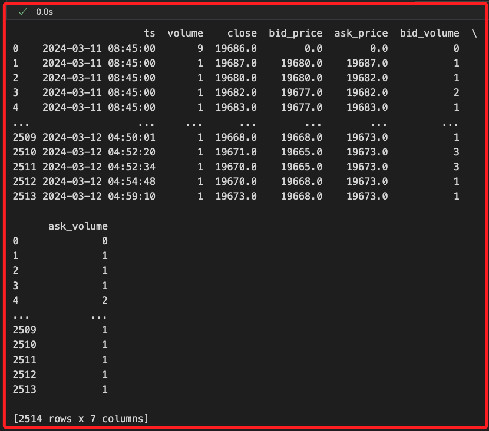
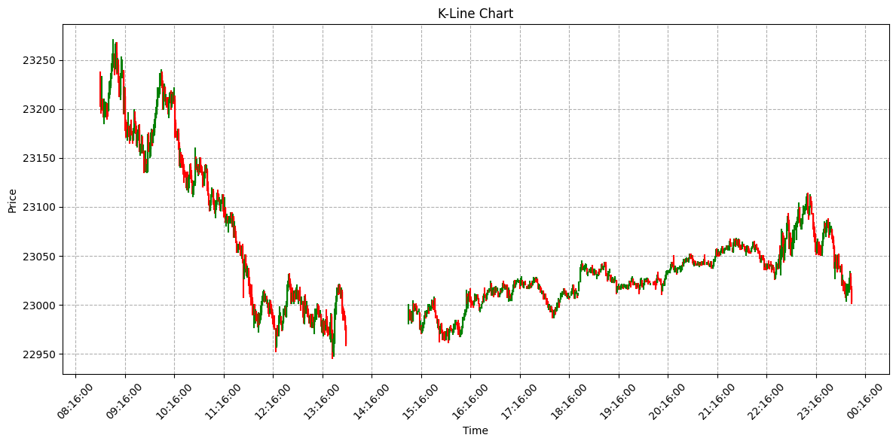
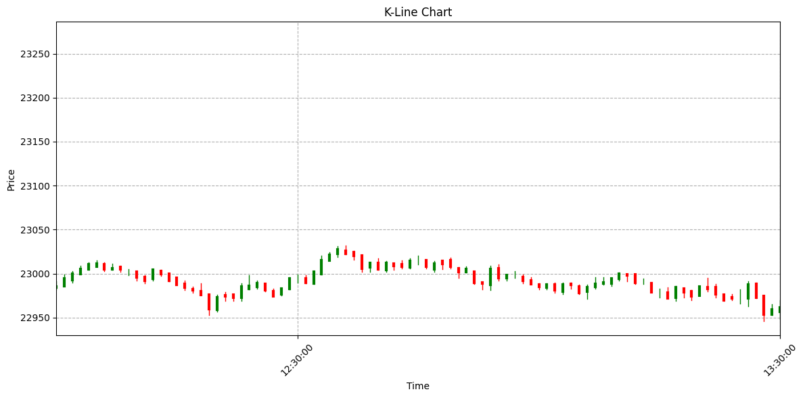
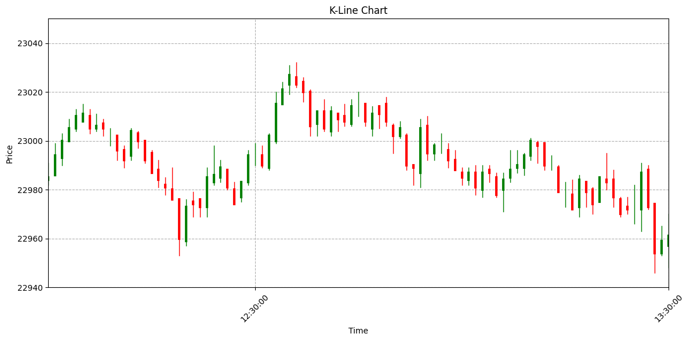
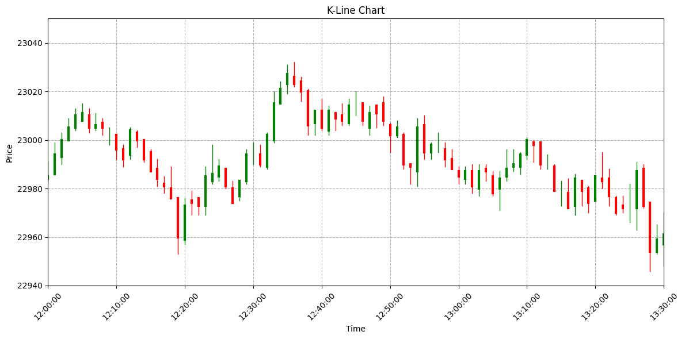

# 歷史數據

_期貨_

<br>

## 準備工作

1. 安裝套件。

    ```bash
    pip install matplotlib
    ```

<br>

## 連續期貨合約

_Continuous Futures，當期貨合約過期後，原合約無法再查詢數據，但可以使用 `TXFR1` 和 `TXFR2` 來取得近月和次月的連續合約數據。_

<br>

1. 先載入自訂模組並登入帳號；特別注意，這裡是使用模擬模式，在某些狀況下，使用不同模式可能會無法取得數據，可切換嘗試。

    ```python
    # 導入庫
    import MyShioaji as msj

    # 登入，使用模擬模式
    api = msj.login_Shioaji(simulation=True)
    ```

<br>

2. 逐筆資料 (Ticks)。

    ```python
    # 逐筆資料
    ticks = api.ticks(
        contract=api.Contracts.Futures.TXF.TXFR1, 
        date="2020-03-22"
    )
    ticks
    ```

<br>

3. 可先透過 `dir()` 查看屬性，這個方法回傳的是一個列表 `List`。

    ```python
    # 查看物件的屬性
    dir(ticks)
    ```

<br>

4. 可透過 `vars()` 查看物件屬性，會回傳一個字典，包含屬性及其值。

    ```python
    # 查看物件屬性
    vars(ticks)
    ```

<br>

5. 可透過 `keys()` 取得字典的鍵。

    ```python
    # 查看 ticks 的屬性及其對應值
    vars(ticks).keys()
    ```

<br>

6. 也可透過屬性 `__dict__` 取回字典，然後再透過 `keys()` 取得字典的鍵。

    ```python
    # 查看 ticks 的鍵
    ticks.__dict__.keys()
    ```

<br>

7. 根據 ticks 的屬性將其轉為 DataFrame。

    ```python
    import pandas as pd

    # 將 ticks 的有效屬性轉換為 DataFrame
    df = pd.DataFrame({
        'ts': ticks.ts,
        'volume': ticks.volume,
        'close': ticks.close,
        'bid_price': ticks.bid_price,
        'ask_price': ticks.ask_price,
        'bid_volume': ticks.bid_volume,
        'ask_volume': ticks.ask_volume
    })

    # 將 ts 欄位轉換為時間格式，並格式化為秒級
    df['ts'] = pd.to_datetime(df['ts']).dt.floor('s')

    # 查看數據
    print(df)
    ```

    

<br>

## K 線數據 (Kbars)

1. 取回數據。

    ```python
    # K 線數據
    kbars = api.kbars(
        contract=api.Contracts.Futures.TXF.TXFR1,
        start="2024-12-15", 
        end="2024-12-16", 
    )
    kbars
    ```

<br>

2. 查看 kbars 的數據欄位。

    ```python
    # 查看 kbars 的數據欄位
    vars(kbars).keys()
    ```

<br>

3. 根據欄位轉換為 DataFrame。

    ```python
    import pandas as pd

    # 將 ticks 的有效屬性轉換為 DataFrame
    df = pd.DataFrame({
        'ts': kbars.ts,
        'volume': kbars.Open,
        'close': kbars.High,
        'bid_price': kbars.Low,
        'ask_price': kbars.Close,
        'bid_volume': kbars.Volume,
        'ask_volume': kbars.Amount
    })

    # 將 ts 欄位轉換為時間格式，並格式化為秒級
    df['ts'] = pd.to_datetime(df['ts']).dt.floor('s')

    # 查看數據
    print(df)
    ```

<br>

## 繪圖

1. 繪製 K 線圖。

    ```python
    import pandas as pd
    import matplotlib.pyplot as plt
    import matplotlib.dates as mdates

    # 將 ticks 的有效屬性轉換為 DataFrame
    df = pd.DataFrame({
        'ts': kbars.ts,
        'open': kbars.Open,
        'high': kbars.High,
        'low': kbars.Low,
        'close': kbars.Close,
        'volume': kbars.Volume,
        'amount': kbars.Amount
    })

    # 將 ts 欄位轉換為時間格式，並格式化為秒級
    df['ts'] = pd.to_datetime(df['ts']).dt.floor('s')

    # 繪製 K 線圖
    fig, ax = plt.subplots(figsize=(12, 6))

    # 設置時間作為 x 軸，顯示小時:分鐘:秒
    ax.xaxis.set_major_formatter(
        mdates.DateFormatter('%H:%M:%S')
    )
    # X 軸坐標標籤的顯示區間，設置為每 60 秒一次
    ax.xaxis.set_major_locator(
        mdates.MinuteLocator(interval=60)
    )
    # 標籤旋轉 45 度避免重疊
    plt.xticks(rotation=45)

    # 畫出每根 K 線
    for index, row in df.iterrows():
        # 收盤價高於開盤價為綠，否則為紅
        color = 'green' if row['close'] >= row['open'] else 'red'
        # 繪製上下影線，顯示最高價與最低價
        ax.plot(
            [row['ts'], row['ts']], [row['low'], row['high']], 
            color=color
        )  
        # 繪製棒體，也就是開盤價和收盤價
        ax.plot(
            [row['ts'], row['ts']], [row['open'], row['close']], 
            color=color,
            # K 線粗
            linewidth=1
        )

    # 標題和軸標籤
    ax.set_title('K-Line Chart')
    ax.set_xlabel('Time')
    ax.set_ylabel('Price')

    # 設置 X 軸範圍
    # start_time = pd.Timestamp('2024-12-16 12:00:00')
    # end_time = pd.Timestamp('2024-12-16 13:30:00')
    # ax.set_xlim(start_time, end_time)

    # 設置 Y 軸範圍
    # ax.set_ylim(22900, 23200)
    
    # 設置虛線網格
    plt.grid(linestyle='--')
    # 自動調整子圖元素間的間距
    plt.tight_layout()
    # 展示圖表
    plt.show()
    ```

    

<br>

2. 設置 X 軸範圍。

    ```python
    # 設置 X 軸範圍
    start_time = pd.Timestamp('2024-12-16 12:00:00')
    end_time = pd.Timestamp('2024-12-16 13:30:00')
    ax.set_xlim(start_time, end_time)
    plt.show()
    ```

    

<br>

3. 設置 Y 軸範圍。

    ```python
    # 設置 Y 軸範圍
    ax.set_ylim(22940, 23050)
    ```

    

<br>

4. 可設置更合宜的 X 軸坐標區間。

    ```python
    # 每 60 分鐘顯示一次標籤
    ax.xaxis.set_major_locator(
        mdates.MinuteLocator(interval=10)
    )
    ```

    

<br>

___

_END_