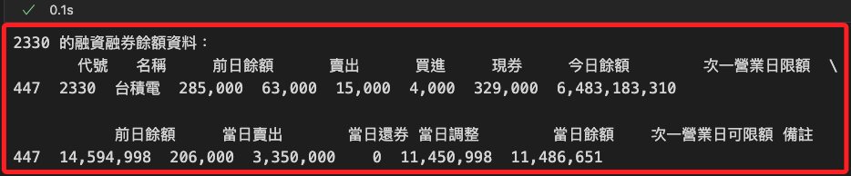
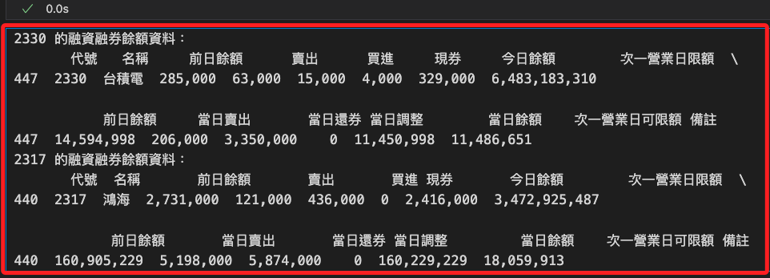

# Short Stock Source

_可用融券餘額，也就是市場中仍可供借券放空的數量；特別注意，並非是 `融券餘額` 資訊。_

<br>

## 函數說明

_`api.short_stock_sources()`_

<br>

1. 取得 `可用融券餘額` 資訊。

   ```python
   api.short_stock_sources(
       # 欲查詢的股票合約列表
       contracts: List[shioaji.contracts.Stock],
       # 請求逾時時間（毫秒）
       timeout: int = 5000,
       # callback 函式，可在取得結果時進行回呼
       cb: Callable[[shioaji.data.ShortStockSource], NoneType] = None
   ) -> List[shioaji.data.ShortStockSource]
   ```

<br>

2. `回傳值` 是一個 `ShortStockSource` 物件的列表，內容包含 `code (str)` 股票代碼、`short_stock_source (float)` 可用融券餘額、`ts (int)` 取得該資料的時間戳記

<br>

## 實作

1. 載入庫並登入；特別注意，要使用正式模式。

   ```python
   # 導入庫
   import MyShioaji as msj

   # 登入
   api = msj.login_Shioaji(simulation=False)
   ```

   

<br>

2. 建立合約物件並調用函數。

   ```python
   # 建立合約列表
   contracts = [
       api.Contracts.Stocks['2330'],
       api.Contracts.Stocks['2317']
   ]
   # 取得可用融券餘額
   short_stock_sources = api.short_stock_sources(contracts)
   short_stock_sources
   ```

   _輸出_

   ```bash
   [
       ShortStockSource(
           code='2330', 
           short_stock_source=106, 
           ts=1734530629000000000
       ),
       # 略
   ]
   ```

<br>

3. 假如使用 `模擬模式` 會顯示如下。

   ```bash
   2024-12-18 21:58:58.386 | WARNING  | shioaji.shioaji:short_stock_sources:955 - Simulation not support short_stock_sources yet
   ```

<br>

4. 轉為 DataFrame。

   ```python
   import pandas as pd

   df = pd.DataFrame(s.__dict__ for s in short_stock_sources)
   df.ts = pd.to_datetime(df.ts)
   df
   ```

   

<br>

## 關於 `融券餘額`

_當前 `Shioaji API` 並未提供直接查詢 `市場融券餘額` 的功能，以下示範使用 `TWSE` 提供的 API 取得融券餘額。_

<br>

1. 查詢融券餘額。

   ```python
   import requests
   import pandas as pd

   # 設定日期，格式 `yyyyMMdd`
   date = "20241218"

   # TWSE 融資融券餘額 API URL
   url = f"https://www.twse.com.tw/exchangeReport/TWT93U?response=json&date={date}&selectType=ALL"

   # 發送請求
   response = requests.get(url)
   data = response.json()

   # 將數據轉換為 DataFrame
   if data["stat"] == "OK":
      df = pd.DataFrame(data["data"], columns=data["fields"])
      print("融資融券餘額資料：")
      # 查看前幾筆資料
      print(df.head())
   else:
      print("無法取得資料，請檢查日期或 API 狀態")
   ```

<br>

2. 查詢指定標的的融券餘額。

   ```python
   import requests
   import pandas as pd

   # 設定日期，格式 `yyyyMMdd`
   date = "20241218"
   # 指定股票代號，例如 `2330`
   stock_code = "2330"

   # TWSE 融資融券餘額 API URL
   url = f"https://www.twse.com.tw/exchangeReport/TWT93U?response=json&date={date}&selectType=ALL"

   # 發送請求
   response = requests.get(url)
   data = response.json()

   # 將數據轉換為 DataFrame
   if data["stat"] == "OK":
      # 轉換為 DataFrame 並設置欄位名稱
      df = pd.DataFrame(data["data"], columns=data["fields"])
      # 查詢資料
      stock_data = df[df["代號"] == stock_code]

      if not stock_data.empty:
         print(f"{stock_code} 的融資融券餘額資料：")
         print(stock_data)
      else:
         print(f"未找到代號為 {stock_code} 的股票資料。")
   else:
      print("無法取得資料，請檢查日期或 API 狀態")
   ```

   

<br>

3. 查詢多檔股票融券餘額。

   ```python
   # 股票代號列表
   stock_codes = ["2330", "2317"]

   # 查詢多支股票的資料
   for stock_code in stock_codes:
      stock_data = df[df["代號"] == stock_code]
      if not stock_data.empty:
         print(f"{stock_code} 的融資融券餘額資料：")
         print(stock_data)
      else:
         print(f"未找到代號為 {stock_code} 的股票資料。")
   ```

   

<br>

4. 單一標的可繪製線圖。

___

_END_
