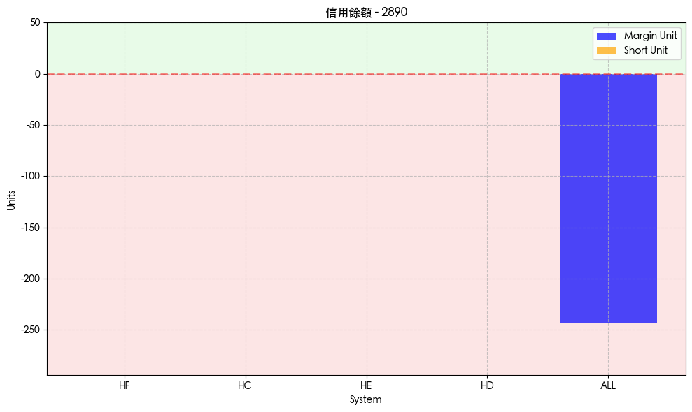

# Credit Enquires

_用於查詢股票在各信用交易系統中的資訊，包含 `可用融資（margin）餘額`、`可用融券（short）餘額`；再次強調，`margin_unit` 是 `可用融資餘額`、`short_unit` 是 `可用融券餘額`。_

<br>

## 函數說明

_`api.credit_enquires()`_

<br>

1. 可查詢股票在信用交易市場中的狀況，如 `可用融資餘額 (margin_unit)`、`可用融券餘額 (short_unit)` 以及 `最後更新時間(update_time)`。

    ```python
    api.credit_enquires(
        # 合約列表
        contracts: List[shioaji.contracts.Stock],
        # 查詢逾時時間（毫秒），預設 `30000` 毫秒
        timeout: int = 30000,
        # 回呼函式，用於非同步資料處理
        cb: Callable[[shioaji.data.CreditEnquire], NoneType] = None
    ) -> List[shioaji.data.CreditEnquire]
    ```

<br>

2. 回傳值是一個列表 `List[CreditEnquire]`，每個 `CreditEnquire` 物件包含 `update_time ` 資料更新時間、`system` 信用交易系統代號（如 HE、HC、HN、HF）、`stock_id` 股票代號、`margin_unit`、`short_unit (int)`。

<br>

3. 不同的 `system` 代表不同的信用交易市場或渠道，每個系統會有不同的資源狀況，投資者可透過比對同一檔股票在不同系統的資源，判斷何處融資融券比較充裕。

<br>

## 實作

1. 載入套件並登入；這裡使用 `模擬模式`。

    ```python
    # 導入庫
    import MyShioaji as msj

    # 登入
    api = msj.login_Shioaji()
    ```

<br>

2. 定義欲查詢的股票合約清單。

    ```python
    # 台積電(2330)與第一金(2890)
    contracts = [
        api.Contracts.Stocks['2330'],
        api.Contracts.Stocks['2890']
    ]
    ```

<br>

3. 查詢該合約清單的信用交易資訊。 

    ```python
    # 信用交易資訊
    credit_enquires = api.credit_enquires(contracts)
    # 查看取得的信用交易資訊列表
    credit_enquires
    ```

    _輸出_

    ```bash
    [
        CreditEnquire(
            update_time='2024-12-18 14:32:03.769767', 
            system='HF', 
            stock_id='2330'
        ),
        # 略
    ]
    ```

<br>

4. 將資料轉換為 DataFrame。

    ```python
    import pandas as pd

    # 將每個 CreditEnquire 物件轉為字典，組成 DataFrame
    df = pd.DataFrame(c.__dict__ for c in credit_enquires)
    # 將 update_time 欄位從字串轉為 datetime 格式，方便時間序列分析
    df.update_time = pd.to_datetime(df.update_time)
    # 顯示 DataFrame
    df
    ```

    

<br>

5. 查看輸出，可見 `台積電(2330)` 在各系統的 `margin_unit` 值不同，代表不同系統下的融資可用量不同；而 `第一金(2890)` 則全為 0，表示在這些信用系統中該股票已無可用融資單位。

<br>

## 繪圖

1. 觀察信用餘額。

```python
import matplotlib.pyplot as plt
import pandas as pd
import matplotlib

# 設置字型避免亂碼
matplotlib.rc('font', family='Heiti TC')

# 假設 `df` 是數據 DataFrame，獲取所有股票代號
stocks = df['stock_id'].unique()

for stock_id in stocks:
    # 選擇該股票的數據
    stock_data = df[df['stock_id'] == stock_id]

    # 獲取融資和融券餘額的最大值和最小值
    min_value = min(
        stock_data['margin_unit'].min(), 
        stock_data['short_unit'].min()
    )
    max_value = max(
        stock_data['margin_unit'].max(), 
        stock_data['short_unit'].max()
    )

    # 設置 Y 軸範圍，確保正負值的視覺平衡
    if min_value >= 0:
        y_min = -50  # 顯示最小負值
        y_max = max_value + 50  # 稍微增加上限範圍
    elif max_value <= 0:
        y_min = min_value - 50  # 稍微減小下限範圍
        y_max = 50  # 顯示最小正值
    else:
        y_min = min_value - 50
        y_max = max_value + 50

    # 繪圖
    fig, ax = plt.subplots(figsize=(10, 6))

    # 添加正負數背景顏色
    ax.axhspan(0, y_max, facecolor='lightgreen', alpha=0.2)  # 正數區域背景
    ax.axhspan(y_min, 0, facecolor='lightcoral', alpha=0.2)  # 負數區域背景

    # 畫出融資餘額（margin_unit）的長條圖
    ax.bar(
        stock_data['system'], 
        stock_data['margin_unit'], 
        label='Margin Unit', 
        alpha=0.7,
        color='blue'
    )

    # 畫出融券餘額（short_unit）的長條圖
    ax.bar(
        stock_data['system'], 
        stock_data['short_unit'], 
        label='Short Unit', 
        alpha=0.7,
        color='orange'
    )

    # 設置圖表標題和軸標籤
    ax.set_title(f"信用餘額 - {stock_id}")
    ax.set_xlabel("System")
    ax.set_ylabel("Units")
    ax.legend()

    # 設置 Y 軸範圍
    ax.set_ylim(y_min, y_max)

    # 添加網格
    ax.grid(linestyle='--', alpha=0.7)

    # 添加紅色粗線作為 X 軸
    ax.axhline(y=0, color='red', linewidth=2)

    # 調整佈局
    plt.tight_layout()

    # 顯示圖表
    plt.show()
```




<br>

___

_END_