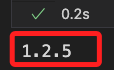
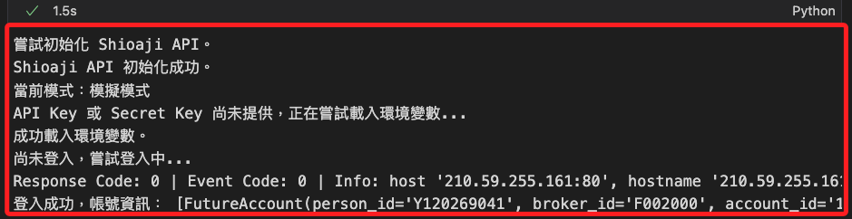
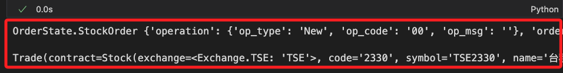
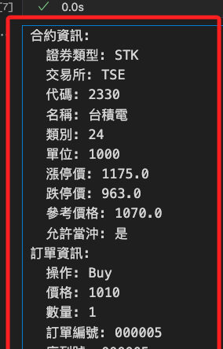
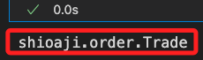
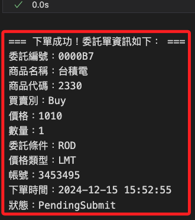

# 下單簡介

_關於 `產業類別與分類碼` 可參考官方提供的 [對照表](https://members.sitca.org.tw/OPF/K0000/files/F/01/%E8%AD%89%E5%88%B8%E4%BB%A3%E7%A2%BC%E7%B7%A8%E7%A2%BC%E5%8E%9F%E5%89%87.doc)_

<br>

## 前置作業

_將以下函數寫入之前建立的模組 `MyShioaji.py`_

<br>

1. 封裝 API 提供的下單函數，並支持多種商品類型；特別注意，`api` 是第三個參數，這是因為 _必要參數必須在有預設值的參數之前_。

    ```python
    # 下單
    def place_order(
        symbol,
        price,
        api=None,
        product_type="Stocks", 
        quantity=1, 
        action="Buy", 
        price_type="LMT", 
        order_type="ROD", 
        account=None
    ):
        print("【函數】下單。")
        import sys, io

        # 如果傳入了 api，取得其 simulation 模式；否則預設為 True
        if api is not None:
            simulation = getattr(api, 'simulation', True)
        else:
            simulation = True

        # 使用傳入的 api 和 simulation 模式初始化或取得 api 實例
        api = _get_or_init_api(api=api, simulation=simulation)

        if api is None:
            raise ValueError("無法初始化 API，請檢查環境配置。")

        # 取得商品合約
        try:
            # 根據商品類型取得合約
            if product_type == "Stocks":
                contract = api.Contracts.Stocks.TSE[symbol]
            elif product_type == "Futures":
                contract = api.Contracts.Futures[symbol]
            else:
                raise ValueError(f"不支持的商品類型：{product_type}")

            # 若未指定帳號，預設使用股票帳號
            if account is None:
                account = api.stock_account

            # 建立委託單物件
            order = api.Order(
                price=price,
                quantity=quantity,
                action=getattr(sj.constant.Action, action),
                price_type=getattr(sj.constant.StockPriceType, price_type),
                order_type=getattr(sj.constant.OrderType, order_type),
                account=account,
            )

            # 保存原始標準輸出
            old_stdout = sys.stdout
            # 重定向標準輸出到記憶體
            sys.stdout = io.StringIO()
            try:
                # 下單
                trade = api.place_order(contract, order)
            finally:
                # 恢復原始標準輸出
                sys.stdout = old_stdout

            # 提取下單時間
            order_time = trade.status.order_datetime.strftime('%Y-%m-%d %H:%M:%S') if trade.status.order_datetime else "未提供"

            # 輸出下單資訊
            print("\n=== 下單成功！委託單資訊如下： ===\n")
            print(f"委託編號：{trade.order.id}")
            print(f"商品名稱：{trade.contract.name}")
            print(f"商品代碼：{trade.contract.code}")
            print(f"買賣別：{trade.order.action}")
            print(f"價格：{trade.order.price}")
            print(f"數量：{trade.order.quantity}")
            print(f"委託條件：{trade.order.order_type}")
            print(f"價格類型：{trade.order.price_type}")
            print(f"帳號：{trade.order.account.account_id}")
            print(f"下單時間：{order_time}")
            print(f"狀態：{trade.status.status.value}")

            return trade

        except Exception as e:
            print(f"下單失敗：{e}")
            return None

    ```

<br>

2. 格式化輸出 `Trade` 物件。

    ```python
    # 私有函數，用來格式化 `Trade` 物件
    def _format_trade_output_zh(trade):
        print("【函數】格式化 `Trade` 物件。")
        output = {
            "合約資訊": {
                "證券類型": trade.contract.security_type,
                "交易所": trade.contract.exchange,
                "代碼": trade.contract.code,
                "名稱": trade.contract.name,
                "類別": trade.contract.category,
                "單位": trade.contract.unit,
                "漲停價": trade.contract.limit_up,
                "跌停價": trade.contract.limit_down,
                "參考價格": trade.contract.reference,
                "允許當沖": "是" if trade.contract.day_trade.value == "Yes" else "否",
            },
            "訂單資訊": {
                "操作": trade.order.action.value,
                "價格": trade.order.price,
                "數量": trade.order.quantity,
                "訂單編號": trade.order.id,
                "序列號": trade.order.seqno,
                "委託編號": trade.order.ordno,
                "價格類型": trade.order.price_type.value,
                "訂單類型": trade.order.order_type.value,
                "帳戶": {
                    "帳戶類型": trade.order.account.account_type.value,
                    "帳戶 ID": trade.order.account.account_id,
                    "券商 ID": trade.order.account.broker_id,
                },
            },
            "狀態資訊": {
                "狀態": trade.status.status.value,
                "狀態代碼": trade.status.status_code,
                "委託數量": trade.status.order_quantity,
                "修改價格": trade.status.modified_price,
                "取消數量": trade.status.cancel_quantity,
                "委託時間": trade.status.order_datetime,
                "成交資訊": trade.status.deals,
            },
        }
        return output

    # 將交易物件格式化並輸出為中文的可讀內容
    def display_trade_info_zh(trade):
        print("【函數】將交易物件格式化並輸出為中文的可讀內容。")
        # 取得格式化後的交易資訊
        trade_output_zh = _format_trade_output_zh(trade)

        # 按格式輸出內容
        for section, details in trade_output_zh.items():
            print(f"{section}:")
            for key, value in details.items():
                # 處理嵌套字典
                if isinstance(value, dict):
                    print(f"  {key}:")
                    for sub_key, sub_value in value.items():
                        print(f"    {sub_key}: {sub_value}")
                else:
                    print(f"  {key}: {value}")
    
    ```

<br>

## 導入模組與初始化

1. 導入自訂模組，這會顯示當前套件 `shioaji` 的版本。

    ```python
    # 導入自訂模組
    import MyShioaji as msj
    ```

    

<br>

2. 調用自訂函數來完成載入環境變數，同時初始化 API 後進行登入；特別注意，因為並未手動調用 API 初始化函數，所以不用傳入任何參數，該函數便會自動初始化 API，若存在既有且要沿用的 API，則作為參數傳入即可。

    ```python
    # 登入，重新載入環境變數，並傳出全域變數 api
    api = msj.login_Shioaji()
    ```

    

<br>

## 開始下單

_先介紹如何使用 API 的函數進行下單，交易模式是在登入時就確認的，特別注意是 `測試模式` 或 `正式模式`；部分功能指定要在 `正式模式` 才能運行。_

<br>

1. 導入 API 套件，這裡要先嘗試使用 API 方法進行下單。

    ```python
    # 導入庫
    import shioaji as sj
    ```

<br>

2. 建立 `合約物件 (Contracts)`，或稱為 `商品物件`；所謂的 `商品` 或 `合約` 就是哪一個 `標的物`。

    ```python
    # 股票代碼
    Stock_Symbo = "2330"
    # 合約物件
    contract = api.Contracts.Stocks.TSE[Stock_Symbo]
    ```

<br>

3. 建立 `委託物件 (Order)`，也就是交易條件；在委託物件中，只定義了交易帳號、價格、數量、委託類別等 `交易的條件`，這裡是不包含標的物資訊的。


    ```python
    # 證券委託單物件
    order = api.Order(
        # 價格
        price=1010,
        # 數量
        quantity=1,
        # 買賣別
        action=sj.constant.Action.Buy,
        # 委託價格類別
        price_type=sj.constant.StockPriceType.LMT,
        # 委託條件
        order_type=sj.constant.OrderType.ROD,
        # 下單帳號
        account=api.stock_account,
    )
    ```

<br>

4. 依據 `合約物件` 以及 `委託物件` 進行下單；回傳值包含兩條預設資訊 `OrderState.StockOrder` 與 `Trade`。

    ```python
    # 下單，傳入商品檔以及合約物件
    trade = api.place_order(contract, order)
    trade
    ```

    

<br>

5. 調用自訂函數將 `Trade` 物件標準化輸出。

    ```python
    # 調用格式化輸出 Trade 物件的函數
    msj.display_trade_info_zh(trade)
    ```

    

<br>

6. 可透過 `type()` 函數觀察這個輸出的型別是 `shioaji.order.Trade`。

    ```python
    type(trade)
    ```

    

<br>

7. 下單的商品檔代碼也可省略 `市場別` 屬性表示如下，`Stocks` 屬性會在更大的範圍內搜尋標的，而不特定於 `TSE` 或 `OTC` 某個交易所，只要不同交易所間的代碼並未重複，兩者結果並無差異。

    ```python
    contract = api.Contracts.Stocks["2890"]
    ```

<br>

## 調用自訂函數進行下單

1. 無需建立契約物件，直接傳入標的物代碼即可。

    ```python
    # 調用下單函數，其餘參數可省略
    trade = msj.place_order(
        api=api,
        symbol="2330",
        price=1010
    )
    ```

    

<br>

2. `【說明】` 補充前面的調用代碼，以下將其他有預設值參數也顯式表達的函數調用表達式。

    ```python
    # 調用下單函數
    trade = msj.place_order(
        api=api,
        symbol="2330",
        price=1010,
        # 商品類型
        product_type="Stocks",
        # 委託數量
        quantity=10,
        # 買賣別
        action="Buy",
        # 價格類型
        price_type="LMT",
        # 委託條件
        order_type="ROD"
    )
    ```

<br>

## 屏蔽訊息輸出

_`【說明】` 在前面的函數中，暫時屏蔽了標準輸出，這是因為在執行某些底層函數如 `api.place_order()` 時，會直接輸出相關資訊到控制台中，這些訊息可能造成某些干擾或累贅。_

<br>

1. 將當前的標準輸出 `sys.stdout` 保存到變數 `old_stdout` 中，保存的目的是為了稍後恢復標準輸出，為後續重定向輸出做好準備，確保在重定向標準輸出後，能夠正確地恢復。

    ```python
    import sys

    old_stdout = sys.stdout
    ```

<br>

2. 將標準輸出重定向到 `io.StringIO()`，這是一個記憶體中的文件對象，可以捕獲所有被寫入的輸出，任何輸出到 `sys.stdout` 的內容，現在都會被寫入到這個記憶體對象中，而不再顯示在控制台上，如此便可阻止如 `api.place_order()` 函數直接輸出的內容顯示在控制台中，暫時屏蔽底層方法的輸出，避免影響主程式的控制台輸出。

    ```python
    sys.stdout = io.StringIO()
    ```

<br>

3. 運行會產生輸出的代碼後，恢復原始標準輸出。

    ```python
    try:
        # 下單
        trade = api.place_order(contract, order)
    finally:
        # 恢復原始標準輸出
        sys.stdout = old_stdout
    ```

<br>

## 關於輸出的資訊

_`【說明】` 前面所屏蔽的訊息，包含 `OrderState.StockOrder`、`Trade` 兩部分_

<br>

1. 第一部分 `OrderState.StockOrder` 輸出說明如下。

    ```bash
    {
        'operation': 
            {
                # 新建訂單
                'op_type': 'New', 
                # `00` 代表成功
                'op_code': '00', 
                # 無額外訊息
                'op_msg': ''
            }, 
        'order': 
            {
                # 內部訂單 ID
                'id': '000003',
                # 序號，通常與 ID 相同 
                'seqno': '000003', 
                # 內部訂單編號
                'ordno': '000002', 
                'account': 
                    {
                        # 帳戶類型，S 表示證券帳戶
                        'account_type': 'S', 
                        'person_id': '',
                        # 券商代號 
                        'broker_id': '9A95',
                        # 帳號
                        'account_id': '3453495',
                        # 是否完成 API 簽署
                        'signed': False
                    }, 
                'action': 'Buy', 
                # 價格
                'price': 1010, 
                # 數量
                'quantity': 1, 
                # 委託條件，Cash 表示現金交易
                'order_cond': 'Cash', 
                # 下單股數類型，Common 表示普通股
                'order_lot': 'Common', 
                'custom_field': '', 
                # 委託單類型，ROD 表示當日有效單
                'order_type': 'ROD', 
                # 價格類型，LMT 表示限價單
                'price_type': 'LMT'
            }, 
        'status': 
            {
                'id': '000003',
                # 交易所時間戳記
                'exchange_ts': 1733876046.713682, 
                'order_quantity': 1, 
                'modified_price': 0, 
                'cancel_quantity': 0,
                # 網頁端 ID，137，用於內部記錄
                'web_id': '137'
            }, 
        'contract': 
            {
                # 商品類型，STK 表示股票
                'security_type': 'STK',
                # 交易所，TSE 表示台灣證券交易所
                'exchange': 'TSE', 
                # 股票代號
                'code': '2330'
            }
    }
    ```

<br>

2. 第二部分 `Trade` 說明如下。

    ```bash
    Trade(
        contract=Stock(exchange=<Exchange.TSE: 'TSE'>, 
        code='2330', 
        symbol='TSE2330', 
        name='台積電', 
        category='24', 
        unit=1000, 
        limit_up=1170.0, 
        limit_down=959.0, 
        reference=1065.0, 
        update_date='2024/12/11', 
        margin_trading_balance=78, 
        day_trade=<DayTrade.OnlyBuy: 'OnlyBuy'>), 
        order=Order(
            action=<Action.Buy: 'Buy'>, 
            price=1010, 
            quantity=1, 
            account=StockAccount(
                person_id='Y120269041', broker_id='9A95', account_id='3453495', username='蕭中柱'
            ), 
            price_type=<StockPriceType.LMT: 'LMT'>, 
            order_type=<OrderType.ROD: 'ROD'>
        ), 
        status=OrderStatus(status=<Status.Failed: 'Failed'>)
    )
    ```

<br>

___

_接續下一個單元，進行正式下單_