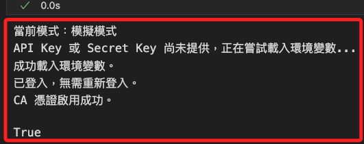
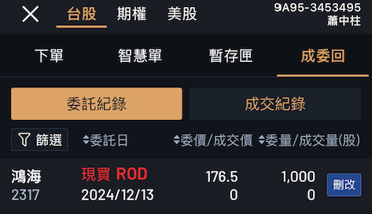
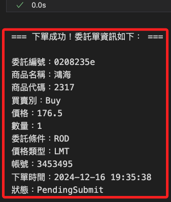
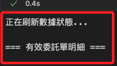

# 正式下單與取消

_開啟新的 `.ipynb`_

<br>

## 準備工作

1. 載入自訂模組。

    ```python
    import MyShioaji as msj
    ```

<br>

2. 調用自訂的登入函數，並指定參數為正式模式。

    ```python
    # 登入，重新載入環境變數，並傳出全局變數 api
    api = msj.login_Shioaji(simulation=False)
    ```

    

<br>

3. 特別注意，假如初始化或登入的時候設置為虛擬模式 `simulation=True`，這時因為不需要憑證所以不會啟用，需要啟動的話則需手動運行以下指進行啟用。

    ```python
    msj.activate_ca(api)
    ```

    

<br>

## 說明輸出

_記錄並說明前面步驟得到的回應資訊，若後續代碼有需要可進行截取_

<br>

1. 得到以下資訊。

    ```python
    Response Code: 0 | Event Code: 0 | 
    Info: host '210.59.255.161:80', 
    hostname '210.59.255.161:80' IP 210.59.255.161:80 
    (host 1 of 1) 
    (host connection attempt 1 of 1) 
    (total connection attempt 1 of 1) | 
    Event: Session up
    [
        StockAccount(
            person_id='XXXXXXXXXX', 
            broker_id='XXXXX', 
            account_id='XXXXXXX', 
            signed=True, 
            username='XXX'
        )
    ]
    ```

<br>

2. 若得到提示可安裝帶有 [speed] 選項的 shioaji 套件等資訊，可自行決定是否安裝；特別注意，必須在提供的語句中添加引號如下。

    ```bash
    pip install "shioaji[speed]"
    ```

<br>

## 下單

_實測下單_

<br>

1. 使用代碼下單，手機 APP 會同步收到通知；關於代碼輸出請看後續說明。

    ```python
    # 目標資訊
    Stock_Symbo = "2317"
    PRICE = 176.5
    QUANTITY = 1.0

    # 合約
    contract = api.Contracts.Stocks.TSE[Stock_Symbo]

    # 證券委託單
    order = api.Order(
        # 價格
        price=PRICE,
        # 數量
        quantity=QUANTITY,
        # 買賣別
        action=sj.constant.Action.Buy,
        # 委託價格類別
        price_type=sj.constant.StockPriceType.LMT,
        # 委託條件
        order_type=sj.constant.OrderType.ROD,
        # 下單帳號
        account=api.stock_account,
    )

    # 下單
    trade = api.place_order(contract, order)
    ```

    

<br>

2. 在委託明細中會列出。

    

<br>

3. 使用封裝的函數下單。

    ```python
    # 調用下單函數，其餘參數省略
    trade = msj.place_order(
        api=api,
        symbol="2317",
        price=176.5
    )
    ```

    

<br>

## 下單回報説明

_下單後會得到以下輸出資訊_

<br>

1. 訂單狀態物件 `OrderState.StockOrder`。

    ```python
    OrderState.StockOrder {
        'operation': {
            'op_type': 'New', 
            'op_code': '00', 
            'op_msg': ''
        }, 
        'order': {
            'id': '17f7f8cd', 
            'seqno': '784599', 
            'ordno': 'WE271', 
            'account': {
                'account_type': 'S', 
                'person_id': '', 
                'broker_id': '9A95', 
                'account_id': 'XXXXXXX', 
                'signed': True
            }, 
            'action': 'Buy', 
            'price': 180.0, 
            'quantity': 1, 
            'order_type': 'ROD', 
            'price_type': 'LMT', 
            'order_cond': 'Cash', 
            'order_lot': 'Common', 
            'custom_field': ''
        }, 
        'status': {
            'id': '17f7f8cd', 
            'exchange_ts': 1734057568.218, 
            'modified_price': 0.0, 
            'cancel_quantity': 0, 
            'order_quantity': 1, 
            'web_id': '137'
        }, 
        'contract': {
            'security_type': 'STK', 
            'exchange': 'TSE', 
            'code': '2317', 
            'symbol': '', 
            'name': '', 
            'currency': 'TWD'
        }
    }
    ```

<br>

2. 若是要查看交易物件 `Trade` 對象，必須另外輸出；其中的 `msg` 會顯示委託單狀態描述 `委託成功`。

    ```python
    trade
    ```

    _輸出如下_

    ```python
    Trade(
        contract=Stock(
            exchange=<Exchange.TSE: 'TSE'>, 
            code='2317', 
            symbol='TSE2317', 
            name='鴻海', 
            category='31', 
            unit=1000, 
            limit_up=207.0, 
            limit_down=170.0, 
            reference=188.5, 
            update_date='2024/12/13', 
            margin_trading_balance=389, 
            short_selling_balance=173, 
            day_trade=<DayTrade.Yes: 'Yes'>
        ), 
        order=Order(
            action=<Action.Buy: 'Buy'>, 
            price=180, 
            quantity=1, 
            id='17f7f8cd', 
            seqno='784599', 
            ordno='WE271', 
            account=Account(
                account_type=<AccountType.Stock: 'S'>, 
                person_id='XXXXXXXXXX', 
                broker_id='9A95', 
                account_id='XXXXXXX', 
                signed=True
            ), 
            price_type=<StockPriceType.LMT: 'LMT'>, 
            order_type=<OrderType.ROD: 'ROD'>
        ), 
        status=OrderStatus(
            id='17f7f8cd', 
            status=<Status.PendingSubmit: 'PendingSubmit'>, 
            status_code='0', 
            order_datetime=datetime.datetime(2024, 12, 13, 10, 39, 28), 
            msg='委託成功', 
            deals=[]
        )
    )
    ```

<br>

3. 解析輸出是一個 `Trade` 對象的細節訊息，描述委託單的詳細內容，包含 `合約 (contract)`、`委託訊息 (order)`、以及 `狀態 (status)`。

    ```python
    [
        Trade(
            # 合約
            contract=Stock(
                exchange=<Exchange.TSE: 'TSE'>, 
                code='2317', 
                symbol='TSE2317', 
                name='鴻海', 
                category='31', 
                unit=1000, 
                limit_up=207.0, 
                limit_down=170.0, 
                reference=188.5, 
                update_date='2024/12/13',
                margin_trading_balance=389, 
                short_selling_balance=173, 
                day_trade=<DayTrade.Yes: 'Yes'>
            ), 
            # 訂單
            order=Order(
                action=<Action.Buy: 'Buy'>, 
                price=176.5, 
                quantity=1, 
                id='88811c23', 
                seqno='001325', 
                ordno='WW567', 
                account=Account(
                    account_type=<AccountType.Stock: 'S'>, 
                    person_id='XXXXXXXXXX', 
                    broker_id='9A95', 
                    account_id='XXXXXXX', 
                    signed=True
                ), 
                price_type=<StockPriceType.LMT: 'LMT'>, 
                order_type=<OrderType.ROD: 'ROD'>
            ), 
            # 訂單狀態
            status=OrderStatus(
                id='88811c23', 
                status=<Status.Submitted: 'Submitted'>, 
                status_code='00', 
                web_id='137', 
                order_datetime=datetime.datetime(2024, 12, 13, 12, 44, 30), 
                order_quantity=1, 
                deals=[]
            )
        )
    ]
    ```

<br>

## 查詢委託單

_寫入模組中再進行調用_

<br>

1. 列出當前有效的委託單，必須傳入正確的 api 作為參數，最終會傳出委託單列表 `list`。

    ```python
    # 列出當前有效的委託單
    def list_current_orders(api):
        # 確保模組的導入
        import shioaji as sj

        try:
            # 確保數據刷新
            print("正在刷新數據狀態...")
            api.update_status()

            # 查詢所有委託單
            trades = api.list_trades()
            if not trades:
                print("目前沒有任何委託單。")
                return []

            print("\n=== 有效委託單明細 ===")
            valid_trades = []
            for trade in trades:
                # 過濾有效的委託單，排除已完成、已取消或失敗的單據
                if trade.status.status not in [
                    sj.constant.Status.Filled,
                    sj.constant.Status.Cancelled,
                    sj.constant.Status.Failed,
                ]:
                    valid_trades.append(trade)
                    print(
                        f"股票代碼：{trade.contract.code}\n"
                        f"委託編號：{trade.order.id}\n"
                        f"買賣別：{trade.order.action}\n"
                        f"價格：{trade.order.price}\n"
                        f"數量：{trade.order.quantity}\n"
                        f"狀態：{trade.status.status.value}\n"
                        f"成交數量：{trade.status.order_quantity - trade.status.cancel_quantity}\n"
                        "-----------------------------\n"
                    )
            return valid_trades

        except Exception as e:
            print(f"查詢有效委託單時發生錯誤：{e}")
            return []
    ```

<br>

2. 調用函數列出當前委託。

    ```python
    # 列出當前有效委託單
    valid_trades = msj.list_current_orders(api)
    ```

    

<br>


## 取消委託單

_寫入模組中再進行調用_

<br>

1. 先查詢確認委託，接著取消全部有效的委託單；其中參數 `show_response` 預設值為 `False`，這個參數是用來輸出 API 在取消時的預設輸出。

    ```python
    # 取消所有有效的委託單
    def cancel_all_valid_orders(api, show_response=False):
        try:
            # 取得有效委託單
            valid_trades = list_current_orders(api)
            if not valid_trades:
                print("目前沒有有效的委託單可以取消。")
                return

            print("\n=== 開始取消所有有效的委託單 ===")
            for trade in valid_trades:
                try:
                    # 執行取消操作
                    response = api.cancel_order(trade)
                    # 假如指定輸出
                    if show_response:
                        print(f"API 預設 Response：{response}")
                    # 根據回應判斷取消狀態
                    cancel_quantity = response.status.cancel_quantity
                    # 取消後的總委託數量
                    order_quantity = response.status.order_quantity
                    # 原始委託數量
                    original_quantity = trade.order.quantity

                    # 比對取消數量與原始委託數量
                    if cancel_quantity == original_quantity:
                        print(
                            f"取消成功：\n"
                            f"股票代碼：{trade.contract.code}\n"
                            f"委託編號：{trade.order.id}\n"
                            f"取消數量：{cancel_quantity}\n"
                            f"總委託數量：{order_quantity}\n"
                        )
                    else:
                        print(
                            f"取消部分完成，請再次確認：\n"
                            f"股票代碼：{trade.contract.code}\n"
                            f"委託編號：{trade.order.id}\n"
                            f"取消數量：{cancel_quantity}\n"
                            f"原始委託數量：{original_quantity}\n"
                            f"總委託數量：{order_quantity}\n"
                        )
                except Exception as e:
                    print(
                        f"取消委託失敗：\n"
                        f"股票代碼：{trade.contract.code}\n"
                        f"委託編號：{trade.order.id}\n"
                        f"錯誤：{e}\n"
                    )

            # 再次查詢確認
            print("\n=== 更新後的有效委託單 ===")
            list_current_orders(api)

        except Exception as e:
            print(f"查詢或取消委託時發生錯誤：{e}")
    ```

<br>

2. 調用函數取消所有有效委託單；會先輸出有效委託單明細，然後遍歷委託單並進行取消委託。

    ```python
    # 取消所有有效委託單
    msj.cancel_all_valid_orders(api)
    ```

    

<br>

## 關於取消委託

_訊息說明_

<br>

1. 得到的回應包含三個部分，分別是 `合約 contract`、`訂單 order` 及 `狀態 status `。

    

<br>

2. 特別注意，輸出的內容是用於描述委託交易中的詳細資訊，並非 Python 格式。

    ```python
    contract=Stock(
        exchange=<Exchange.TSE: 'TSE'>, 
        code='2317', 
        symbol='TSE2317', 
        name='鴻海', 
        category='31', 
        unit=1000, 
        limit_up=207.0, l
        imit_down=170.0, 
        reference=188.5, 
        update_date='2024/12/13', 
        margin_trading_balance=389, 
        short_selling_balance=173, 
        day_trade=<DayTrade.Yes: 'Yes'>
    ) 
        
    order=Order(
        action=<Action.Buy: 'Buy'>, 
        price=178.0, 
        quantity=1, 
        id='61be0665', 
        seqno='791049', 
        ordno='WK401', 
        account=Account(
            account_type=<AccountType.Stock: 'S'>, 
            person_id='XXXXXXXXXX', 
            broker_id='9A95', 
            account_id='XXXXXXX', 
            signed=True
        ), 
        price_type=<StockPriceType.LMT: 'LMT'>, 
        order_type=<OrderType.ROD: 'ROD'>
    ) 
        
    status=OrderStatus(
        id='61be0665', 
        status=<Status.PendingSubmit: 'PendingSubmit'>, 
        status_code='0', 
        order_datetime=datetime.datetime(2024, 12, 13, 11, 19, 10), 
        deals=[]
    )
    ```

<br>

## 確認委託狀態

1. 取消之後，可再次查詢當前有效的委託單。

    ```python
    valid_trades = msj.list_current_orders(api)
    ```

    

<br>

___

_繼續以下單元_