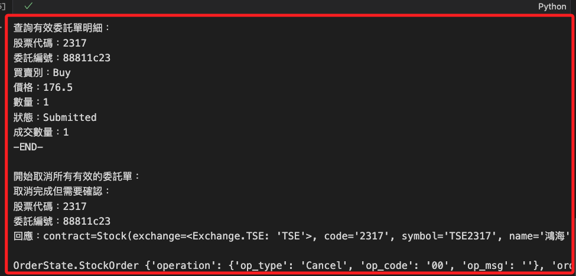

# 取消委託單

_寫入模組中再進行調用_

<br>

## 寫入模組

1. 先查詢確認委託，接著取消全部有效的委託單；其中參數 `show_response` 預設值為 `False`，這個參數是用來輸出 API 在取消時的預設輸出。

    ```python
    # 取消所有有效的委託單
    def cancel_all_valid_orders(api=None, show_response=False):
        # 檢查是否傳入 API
        api = _get_or_init_api()

        try:
            # 取得有效委託單
            valid_trades = list_current_orders(api)
            if not valid_trades:
                print("目前沒有有效的委託單可以取消。")
                return

            print("\n=== 開始取消所有有效的委託單 ===")
            for trade in valid_trades:
                try:
                    # 執行取消操作
                    response = api.cancel_order(trade)
                    # 假如指定輸出
                    if show_response:
                        print(f"API 預設 Response：{response}")
                    # 根據回應判斷取消狀態
                    cancel_quantity = response.status.cancel_quantity
                    # 取消後的總委託數量
                    order_quantity = response.status.order_quantity
                    # 原始委託數量
                    original_quantity = trade.order.quantity

                    # 比對取消數量與原始委託數量
                    if cancel_quantity == original_quantity:
                        print(
                            f"取消成功：\n"
                            f"股票代碼：{trade.contract.code}\n"
                            f"委託編號：{trade.order.id}\n"
                            f"取消數量：{cancel_quantity}\n"
                            f"總委託數量：{order_quantity}\n"
                        )
                    else:
                        print(
                            f"取消部分完成，請再次確認：\n"
                            f"股票代碼：{trade.contract.code}\n"
                            f"委託編號：{trade.order.id}\n"
                            f"取消數量：{cancel_quantity}\n"
                            f"原始委託數量：{original_quantity}\n"
                            f"總委託數量：{order_quantity}\n"
                        )
                except Exception as e:
                    print(
                        f"取消委託失敗：\n"
                        f"股票代碼：{trade.contract.code}\n"
                        f"委託編號：{trade.order.id}\n"
                        f"錯誤：{e}\n"
                    )

            # 再次查詢確認
            print("\n=== 更新後的有效委託單 ===")
            list_current_orders(api)

        except Exception as e:
            print(f"查詢或取消委託時發生錯誤：{e}")
    
    ```

<br>

## 實作

1. 調用函數取消所有有效委託單；會先輸出有效委託單明細，然後遍歷委託單並進行取消委託。

    ```python
    # 取消所有有效委託單
    msj.cancel_all_valid_orders(api)
    ```

    

<br>

## 關於取消委託

_訊息說明_

<br>

1. 得到的回應包含三個部分，分別是 `合約 contract`、`訂單 order` 及 `狀態 status `。

    

<br>

2. 特別注意，輸出的內容是用於描述委託交易中的詳細資訊，並非 Python 格式。

    ```python
    contract=Stock(
        exchange=<Exchange.TSE: 'TSE'>, 
        code='2317', 
        symbol='TSE2317', 
        name='鴻海', 
        category='31', 
        unit=1000, 
        limit_up=207.0, l
        imit_down=170.0, 
        reference=188.5, 
        update_date='2024/12/13', 
        margin_trading_balance=389, 
        short_selling_balance=173, 
        day_trade=<DayTrade.Yes: 'Yes'>
    ) 
        
    order=Order(
        action=<Action.Buy: 'Buy'>, 
        price=178.0, 
        quantity=1, 
        id='61be0665', 
        seqno='791049', 
        ordno='WK401', 
        account=Account(
            account_type=<AccountType.Stock: 'S'>, 
            person_id='XXXXXXXXXX', 
            broker_id='9A95', 
            account_id='XXXXXXX', 
            signed=True
        ), 
        price_type=<StockPriceType.LMT: 'LMT'>, 
        order_type=<OrderType.ROD: 'ROD'>
    ) 
        
    status=OrderStatus(
        id='61be0665', 
        status=<Status.PendingSubmit: 'PendingSubmit'>, 
        status_code='0', 
        order_datetime=datetime.datetime(2024, 12, 13, 11, 19, 10), 
        deals=[]
    )
    ```

<br>

## 確認委託狀態

1. 取消之後，可再次查詢當前有效的委託單。

    ```python
    valid_trades = msj.list_current_orders(api)
    ```

    

<br>

___

_繼續以下單元_