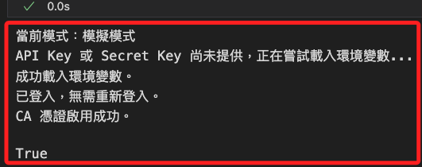
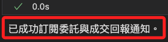
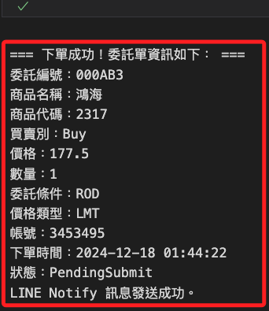

# 訂閱通知

_開啟新的 `.ipynb`；特別注意，在非交易時間內，僅可使用模擬模式進行訂閱。_

<br>

## 前置作業

_先將以下函數寫入模組中，這是優化後的回調函數，可透過 Line Notify 發送訂閱的通知_

<br>

1. 發送 LINE Notify 的函數，參數 `message` 是要發送的文字訊息。

    ```python
    # 發送 LINE Notify 訊息
    def send_line_notify(message):
        import requests, os
        try:
            token = os.environ.get("LINE_NOTIFY")
            if not token:
                print("LINE Notify Token 未設定，無法發送通知。")
                return
            headers = {"Authorization": f"Bearer {token}"}
            data = {"message": message}
            response = requests.post(
                "https://notify-api.line.me/api/notify", 
                headers=headers, 
                data=data
            )
            if response.status_code == 200:
                print("LINE Notify 訊息發送成功。")
            else:
                print(
                    f"LINE Notify 發送失敗，狀態碼：{response.status_code}，"
                    f"回應：{response.text}"
                )
        except Exception as e:
            print(f"發送 LINE Notify 時發生錯誤：{e}")
    
    ```

<br>

2. 訂閱委託與成交回報的通知，要傳入自定義的回調函數，處理回報邏輯；特別注意，必要參數要寫在非必要參數之前。

    ```python
    # 訂閱回調的函數
    def subscribe_notifications(callback_function, api=None):
        # 檢查是否傳入 API
        api = _get_or_init_api()
        try:
            # 設定委託回報的回調函數
            api.set_order_callback(callback_function)
            print("已成功訂閱委託與成交回報通知。")
        except Exception as e:
            print(f"訂閱通知時發生錯誤：{e}")
    
    ```

<br>

3. 處理委託與成交回報的回調函數，其中參數 `topic` 會依據傳入類型做不同處理，包含 `Order` 或 `Trade` 等；參數 `msg` 則是回報的詳細訊息。

    ```python
    # 處理不同類型交易的回調函數
    def my_order_callback(topic, msg):
        if topic == "Order":
            send_line_notify(f"委託回報：{msg}")
            print(f"[訂閱通知] 委託回報：{msg}")
        elif topic == "Trade":
            send_line_notify(f"成交回報：{msg}")
            print(f"[訂閱通知] 成交回報：{msg}")
        else:
            send_line_notify(f"未知回報類型：{topic}, 訊息：{msg}")
            print(f"[訂閱通知] 未知回報類型：{topic}, 訊息：{msg}")
    
    ```

<br>

4. 優化訊息格式，包括取消委託、一般委託與成交回報。

    ```python
    # 優化訊息格式
    def format_message(topic, msg):
        if topic == "Order":
            order_info = msg.get("order", {})
            status_info = msg.get("status", {})
            contract_info = msg.get("contract", {})
            operation_info = msg.get("operation", {})

            # 檢查是否為取消委託回報
            if operation_info.get("op_type") == "Cancel":
                return (
                    f"【取消委託回報】\n"
                    f"股票代碼: {contract_info.get('code', '未知')}\n"
                    f"委託編號: {order_info.get('id', '未知')}\n"
                    f"取消狀態: {operation_info.get('op_msg', '未知')}\n"
                    f"取消數量: {status_info.get('cancel_quantity', 0)}\n"
                    f"總數量: {order_info.get('quantity', 0)}"
                )

            # 一般委託回報
            return (
                f"【委託回報】\n"
                f"股票代碼: {contract_info.get('code', '未知')}\n"
                f"買賣別: {order_info.get('action', '未知')}\n"
                f"價格: {order_info.get('price', 0)}\n"
                f"數量: {order_info.get('quantity', 0)}\n"
                f"狀態: {status_info.get('status', '未知')}\n"
                f"委託編號: {order_info.get('id', '未知')}"
            )

        elif topic == "Trade":
            trade_info = msg.get("trade", {})
            contract_info = msg.get("contract", {})
            return (
                f"【成交回報】\n"
                f"股票代碼: {contract_info.get('code', '未知')}\n"
                f"成交價格: {trade_info.get('price', 0)}\n"
                f"成交數量: {trade_info.get('quantity', 0)}\n"
                f"成交時間: {trade_info.get('time', '未知')}"
            )

        else:
            return (
                f"【未知回報類型】\n"
                f"類型: {topic}\n"
                f"訊息: {msg}"
            )
    
    ```

<br>

5. 優化後的回調函數。

    ```python
    # 優化回調函數 V2
    def my_order_callback_v2(topic, msg):
        # 增加對 SORDER 的支援
        if topic in ["Order", "SORDER"]:
            formatted_message = format_message("Order", msg)
            send_line_notify(formatted_message)
        elif topic == "Trade":
            formatted_message = format_message("Trade", msg)
            send_line_notify(formatted_message)
        else:
            formatted_message = format_message(topic, msg)
            send_line_notify(formatted_message)
    
    ```

<br>

## 建立操作環境

_開始編輯腳本，先導入模組、進行登入並啟用憑證_

<br>

1. 載入自訂模組。

    ```python
    import MyShioaji as msj
    ```

<br>

2. 調用自訂的登入函數，並指定參數為正式模式；再次提醒，非交易時間只可以使用模擬模式。

    ```python
    # 登入，重新載入環境變數，並傳出全局變數 api
    api = msj.login_Shioaji(simulation=True)
    ```

    

<br>

3. 在模擬模式下若要啟用 CA，請運行以下函數；正式模式會自動啟用 CA。

    ```python
    # 啟用憑證
    msj.activate_ca(api)
    ```

    

<br>

## 回調函數基本介紹

_簡單介紹訂閱委託和成交回報，以下代碼無需寫入模組，直接在腳本定義與運行。_

<br>

1. 透過設定 `委託（Order）` 與 `成交（Trade）` 的回調函數 `order_callback()`，監聽並處理來自交易系統的回報消息；當委託單或成交單有更新時，系統會透過回調函數通知相關資訊。

<br>

2. 由於回調函數的輸出必須顯示在 _當前執行中的前台 Cell_ 或透過 _顯示輸出工具_ 來觀察，所以要利用 `IPython.display` 模組，將輸出資訊動態顯示到 `當前的 Notebook` 前台；在這個模式中，回報訊息由 `api.set_order_callback()` 設定的回調函數 `order_callback` 直接被觸發執行，但是特別注意，回調執行過程中主執行緒可能被阻塞，若有其他操作正在執行，可能導致延遲。

<br>

3. 以下是 _回調函數_ 的基本架構，任意命名如 `order_callback`，有兩個參數，第一個參數是系統預設的主題類型，可作為篩選條件，第二個參數是系統預設傳遞的訊息，可處理後回傳。

    ```python
    # 自定義設定委託和成交回報的回調函數
    def order_callback(topic, msg):
        from IPython.display import display
        # 依據類型回覆
        if topic == "Order":
            display(f"委託回報：{msg}")
        elif topic == "Trade":
            display(f"成交回報：{msg}")
        else:
            display(f"其他回報類型：{topic}, 訊息：{msg}")
    ```

<br>

4. 訂閱委託、成交回報的回調函數。

    ```python
    # 訂閱回調函數
    api.set_order_callback(order_callback)

    # 通知代碼已經運行
    print("已啟動委託/成交回報訂閱...")
    ```

    

<br>

5. 下單觸發訂閱。

    ```python
    trade = msj.place_order(
        api=api,
        symbol="2317",
        price=176.5
    )
    ```

<br>

## 建立執行緒

_建立執行緒在背景持續監聽回報資訊，並將輸出動態顯示到當前前台 Cell。_

<br>

1. 建立回調函數，在這個模式下，回報訊息會先進入 `Queue`，回調函數只負責將資料推送到佇列，而不立即處理顯示，`display_callback` 在 `獨立背景執行緒` 中持續監聽佇列，並從佇列中取出資料來顯示，避免主執行緒被阻塞。

    ```python
    from threading import Thread
    from queue import Queue
    from IPython.display import display

    # 訊息隊列
    callback_queue = Queue()

    # 自定義設定委託和成交回報的回調函數
    def order_callback(topic, msg):
        # 將回報存入隊列
        callback_queue.put((topic, msg))

    # 背景執行緒，持續監聽回報資訊並輸出
    def display_callback():
        while True:
            if not callback_queue.empty():
                topic, msg = callback_queue.get()
                clear_output(wait=True)
                if topic == "Order":
                    display(f"委託回報：{msg}")
                elif topic == "Trade":
                    display(f"成交回報：{msg}")
                else:
                    display(f"未知回報類型：{topic}, 訊息：{msg}")

    # 啟動背景執行緒
    callback_thread = Thread(target=display_callback, daemon=True)
    callback_thread.start()

    # 設定回調函數
    api.set_order_callback(order_callback)
    print("已啟動委託/成交回報訂閱...")
    ```

<br>

2. 建立並啟動背景執行緒。

    ```python
    # 建立執行緒
    callback_thread = Thread(
        target=display_callback, 
        daemon=True
    )
    # 啟動執行緒
    callback_thread.start()
    ```

<br>

3. 設定回調函數。 

    ```python
    # 設定回調函數
    api.set_order_callback(order_callback)
    print("已啟動委託/成交回報訂閱...")
    ```

<br>

4. 下單觸發訂閱。

    ```python
    trade = msj.place_order(
        api=api,
        symbol="2317",
        price=176.5
    )
    ```

<br>

## 實作訂閱與觸發

_將回調寫入模組中然後調用_

<br>

1. 進行訂閱；特別注意，這個回調函數 `my_order_callback` 已經在一開始就寫入模組。

    ```python
    # 調用函數，訂閱委託與交易通知
    msj.subscribe_notifications(
        api, 
        msj.my_order_callback
    )
    ```

    

<br>

2. 運行委託代碼進行實測，系統會觸發回調函數發送相關通知。

    ```python
    # 調用下單函數，其餘參數省略
    trade = msj.place_order(
        api=api,
        symbol="2317",
        price=176.5
    )
    ```

    

<br>

3. 這時會收到 Line 通知，內容如下。

    

<br>

4. 可觀察取得的訊息進一步優化回調函數，回覆的 `topic` 為 `SORDER`，內容如下。

    ```json
    {
        'operation': {
            'op_type': 'New', 
            'op_code': '00', 
            'op_msg': ''
        }, 
        'order': {
            'id': '000031', 
            'seqno': '000031', 
            'ordno': '00000E', 
            'account': {
                'account_type': 'S', 
                'person_id': '', 
                'broker_id': '9A95', 
                'account_id': '3453495', 
                'signed': True
                }, 
            'action': 'Buy', 
            'price': 1010, 
            'quantity': 1, 
            'order_cond': 'Cash', 
            'order_lot': 'Common', 
            'custom_field': '', 
            'order_type': 'ROD', 
            'price_type': 'LMT'
        }, 
        'status': {
            'id': '000031', 
            'exchange_ts': 1733968270.729017, 
            'order_quantity': 1, 
            'modified_price': 0, 
            'cancel_quantity': 0, 
            'web_id': '137'
        }, 
        'contract': {
            'security_type': 'STK', 
            'exchange': 'TSE', 
            'code': '2330'
        }
    }
    ```

<br>

## 優化回調函數

_已寫入模組，重啟核心進行後續操作_

<br>

## 重新訂閱

1. 重新定義回調及相關函數後，訂閱新的回調。

    ```python
    # 訂閱更新後的委託與交易通知
    msj.subscribe_notifications(
        api, 
        msj.my_order_callback_v2
    )
    ```

<br>

2. 再次觸發委託測試；這代碼與前面相同。

    ```python
    # 調用下單函數，其餘參數省略
    trade = msj.place_order(
        api=api,
        symbol="2317",
        price=177.5
    )
    ```

    

<br>

3. 查看收到的 Line 訊息。

    

<br>

## 查詢並取消委託

_查詢不會觸發訂閱_

<br>

1. 查詢當前有效委託。

    ```python
    # 查詢當前有效委託
    valid_trades = msj.list_current_orders(api)
    ```

    

<br>

2. 取消所有有效委託單。 

    ```python
    # 取消所有有效委託單
    msj.cancel_all_valid_orders(api)
    ```

    

<br>

3. 取消委託也會收到回調的 Line 通知。

    

<br>

4. 取消全部有效委託之後，可再次查詢。

    ```python
    # 查詢當前有效委託
    valid_trades = msj.list_current_orders(api)
    ```

    

<br>

___

_接續下一個單元_