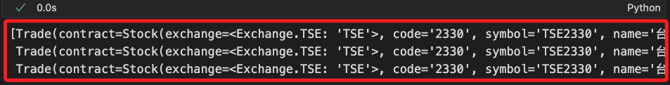

# 進階查詢與取消

_延續之前的 `.ipynb`_

<br>

## 查詢交易

1. 使用 API 的函數查詢當前委託明細，每一行就是一筆委託單；其中包含各種狀態如 `已完成（Filled）`、`已取消（Cancelled）`、`失敗（Failed）`、`待提交（PendingSubmit）`、`已提交（Submitted）`、`部分成交（PartiallyFilled）`、`準備提交 (PreSubmit)`。

    ```python
    # 使用 API 方法查詢當前委託明細
    today_trades = api.list_trades()
    today_trades
    ```

    

<br>

2. 調用自訂義函數查詢，這會將 `已取消`、`失敗`、`已完成` 等狀態的訂單排除。

    ```python
    valid_trades = msj.list_current_orders(api)
    ```

    

<br>

## 取消指定 ID 委託

_寫入模組中，傳入委託單號來取消指定委託單_

<br>

1. 定義函數用以取消指定委託單。

    ```python
    # 取消指定單號的委託
    def cancel_order_by_id(api, order_id):
        try:
            # 檢查輸入參數
            if not api:
                raise ValueError("API 實例未初始化。")
            if not order_id:
                raise ValueError("必須提供有效的委託單編號。")

            # 查詢當前所有委託明細
            print("正在查詢當前委託單...")
            trades = api.list_trades()
            if not trades:
                print("目前無任何委託單可供取消。")
                return None

            # 查找目標委託單
            print(f"正在查找委託單 ID: {order_id}...")
            target_trade = next(
                (trade for trade in trades if trade.order.id == order_id), 
                None
            )

            if target_trade:
                # 確認找到目標，執行取消
                print(
                    f"找到目標委託單，股票代碼: {target_trade.contract.code}，"
                    f"買賣別: {target_trade.order.action}，"
                    f"數量: {target_trade.order.quantity}"
                )
                response = api.cancel_order(target_trade)
                print(f"取消委託成功，回應：{response}")
                return response
            else:
                # 找不到對應委託單
                print(f"找不到對應的委託單 ID: {order_id}")
                return None

        except ValueError as ve:
            print(f"參數錯誤：{ve}")
            return None
        except Exception as e:
            print(f"取消委託時發生錯誤：{e}")
            return None
    ```

<br>

2. 先下一筆訂單。

    ```python
    # 調用下單函數，其餘參數省略
    trade = msj.place_order(
        api=api, 
        symbol="2317", 
        price=177.5
    )
    ```

<br>

3. 查看 Trade 物件整體資訊。

    ```python
    trade
    ```

<br>

4. 觀察輸出，分別是 `contract 合約`、`order 訂單`、`status 狀態`，可利用個屬性進行必要的邏輯。

    ```python
    Trade(
        contract=Stock(
            # 交易所
            exchange=<Exchange.TSE: 'TSE'>, 
            # 股票基本資訊
            code='2317', symbol='TSE2317', name='鴻海', category='31', 
            # 交易資訊
            unit=1000, limit_up=207.0, limit_down=170.0, reference=188.5,
            # 合約資訊最後更新的日期
            update_date='2024/12/13', 
            # 融資餘額
            margin_trading_balance=389,
            # 融券餘額
            short_selling_balance=173, 
            # 是否可進行當日沖銷交易
            day_trade=<DayTrade.Yes: 'Yes'>
        ), 
        order=Order(
            action=<Action.Buy: 'Buy'>, price=176.5, quantity=1, 
            # 委託單的 ID
            id='000114', 
            # 委託單的流水號
            seqno='000114', 
            # 委託單號碼
            ordno='00004C', 
            # 交易帳號
            account=Account(
                account_type=<AccountType.Stock: 'S'>, person_id='Y120269041', broker_id='9A95', account_id='3453495', signed=True
            ), 
            # 限價單
            price_type=<StockPriceType.LMT: 'LMT'>, 
            # 當日有效單
            order_type=<OrderType.ROD: 'ROD'>
        ), 
        status=OrderStatus(
            id='000114', 
            status=<Status.PendingSubmit: 'PendingSubmit'>, 
            status_code='00', 
            order_datetime=datetime.datetime(2024, 12, 16, 0, 39, 37, 942050), 
            deals=[]
        )
    )
    ```

<br>

5. 透過點標記法讀取指定屬性值，例如查詢訂單的行為類型。

    ```python
    # 查詢訂單的行為類型
    trade.order.action.value
    ```

<br>

6. 調用 API 方法取得最後一筆委託的 ID。

    ```python
    trade.order.id
    ```

    

<br>

7. 取消指定 ID 的委託。

    ```python
    # 取消指定 ID 的委託
    response = msj.cancel_order_by_id(
        api, 
        trade.order.id
    )
    ```

    

<br>

## 取消全部有效委託。

_這是在 `正式下單與取消` 時就定義的函數_

<br>

1. 取消所有有效委託單。

    ```python
    # 取消所有有效委託單
    msj.cancel_all_valid_orders(api)
    ```

<br>

2. 同樣會收到訂閱的 Line 通知。

    

<br>

## 查詢與取消指定狀態的委託

_寫入模組_

<br>

1. 查詢指定狀態的委託。

    ```python
    # 查詢指定狀態的全部委託單
    def list_orders_by_status(
        api, 
        target_status="PreSubmitted"
    ):
        import shioaji as sj

        try:
            # 取得當日所有交易明細
            print(
                f"查詢當前所有委託單，"
                f"目標狀態：{target_status}..."
            )
            trades = api.list_trades()
            
            if not trades:
                print("目前無任何委託單。")
                return []

            # 檢查目標狀態是否有效
            valid_statuses = [
                status.value for status in sj.constant.Status
            ]
            if target_status not in valid_statuses:
                print(
                    f"目標狀態無效：{target_status}。"
                    f"有效狀態為：{valid_statuses}"
                )
                return []

            # 篩選符合目標狀態的委託單
            filtered_trades = [
                trade for trade in trades 
                if trade.status.status == getattr(
                    sj.constant.Status, 
                    target_status, 
                    None
                )
            ]
            
            # 如果沒有符合條件的委託單
            if not filtered_trades:
                print(
                    f"未找到目標狀態為 {target_status} 的委託單。"
                )
                return []

            # 輸出符合條件的委託單明細
            print(
                f"找到 {len(filtered_trades)} "
                "筆符合目標狀態的委託單："
            )
            for trade in filtered_trades:
                print(
                    f"股票代碼：{trade.contract.code}\n"
                    f"委託編號：{trade.order.id}\n"
                    f"買賣別：{trade.order.action}\n"
                    f"價格：{trade.order.price}\n"
                    f"數量：{trade.order.quantity}\n"
                    f"狀態：{trade.status.status}\n"
                    "-END-\n"
                )

            return filtered_trades

        except Exception as e:
            print(f"查詢指定狀態委託單時發生錯誤：{e}")
            return []
    ```

<br>

2. 取消指定狀態的委託。

    ```python
    # 取消指定狀態的所有委託單
    def cancel_orders_by_status(
        api, 
        target_status="PreSubmitted"
    ):
        import shioaji as sj

        try:
            # 查詢所有當日交易明細
            print(
                f"查詢當前所有委託單，目標狀態：{target_status}..."
            )
            trades = api.list_trades()
            if not trades:
                print("目前無任何委託單可供取消。")
                return []

            # 保存取消成功的回應
            success_responses = []

            # 遍歷交易明細
            for trade in trades:
                # 檢查委託單狀態是否符合目標
                if trade.status.status == getattr(
                    sj.constant.Status, 
                    target_status, 
                    None
                ):
                    try:
                        # 執行取消委託
                        response = api.cancel_order(trade)
                        print(
                            f"成功取消委託：\n"
                            f"股票代碼: {trade.contract.code}\n"
                            f"委託編號: {trade.order.id}\n"
                            f"取消回應: {response}\n"
                        )
                        success_responses.append(response)
                    except Exception as e:
                        print(
                            f"取消委託失敗：\n"
                            f"股票代碼: {trade.contract.code}\n"
                            f"委託編號: {trade.order.id}\n"
                            f"錯誤原因: {e}\n"
                        )
                else:
                    print(
                        f"委託單不符合目標狀態：\n"
                        f"股票代碼: {trade.contract.code}\n"
                        f"委託編號: {trade.order.id}\n"
                        f"目前狀態: {trade.status.status}\n"
                    )

            # 返回成功取消的回應
            if success_responses:
                print(
                    f"總共成功取消 {len(success_responses)} 筆委託單。"
                )
            else:
                print("未找到符合條件的委託單。")
            return success_responses

        except Exception as e:
            print(f"取消操作過程中發生錯誤：{e}")
            return []
    ```

    

<br>

3. 查詢指定委託單 ID 的狀態。

    ```python
    # 查詢指定委託單 ID 的狀態
    def get_order_status_by_id(api, order_id):
        import shioaji as sj

        try:
            # 取得所有當日交易明細
            print(f"正在查詢委託單 ID: {order_id}...")
            trades = api.list_trades()

            if not trades:
                print("目前無任何委託單。")
                return None

            # 查找目標委託單
            target_trade = next(
                (trade for trade in trades if trade.order.id == order_id), 
                None
            )

            if not target_trade:
                print(f"未找到對應的委託單 ID: {order_id}")
                return None

            # 提取並輸出委託單詳情
            trade_info = {
                "股票代碼": target_trade.contract.code,
                "委託編號": target_trade.order.id,
                "買賣別": target_trade.order.action.value,
                "價格": target_trade.order.price,
                "數量": target_trade.order.quantity,
                "狀態": target_trade.status.status.value,
                "成交數量": target_trade.status.order_quantity - target_trade.status.cancel_quantity,
                "取消數量": target_trade.status.cancel_quantity,
                "下單時間": target_trade.status.order_datetime.strftime(
                    '%Y-%m-%d %H:%M:%S'
                ) 
                if target_trade.status.order_datetime else "未提供",
            }

            print("\n=== 委託單狀態 ===")
            for key, value in trade_info.items():
                print(f"{key}: {value}")
            print("==================")

            return trade_info

        except Exception as e:
            print(f"查詢委託單狀態時發生錯誤：{e}")
            return None
    ```

<br>

## 查詢並取消委託

1. 取得 ID。

    ```python
    trade.order.id
    ```

<br>

2. 以指定 ID 查詢委託單的狀態。 

    ```python
    # 查詢指定委託單 ID 的狀態
    status = msj.get_order_status_by_id(
        api, 
        order_id=trade.order.id
    )
    ```

<br>

3. 查詢指定狀態的委託。

    ```python
    # 查詢指定狀態的委託
    msj.list_orders_by_status(
        api, 
        target_status="PendingSubmit"
    )
    ```

<br>

4. 取消指定狀態的委託。

    ```python
    # 刪除指定狀態的委託
    msj.cancel_orders_by_status(
        api, 
        target_status="PendingSubmit"
    )
    ```

<br>

## 查詢委託狀態

1. 透過 API 屬性 `status` 查看狀態。

    ```python
    trade.status
    ```

<br>

2. 透過 `點標記法` 存取指定鍵名的屬性值。

    ```python
    trade.status.status
    ```

<br>

3. 查看 API 常數。

    ```python
    import shioaji as sj

    # 查看 API 常數
    sj.constant.Status.__members__
    ```

<br>

4. 輸出常數的枚舉，例如 `sj.constant.Status.PendingSubmit`。

    ```python
    # 輸出常數的枚舉
    sj.constant.Status.PendingSubmit
    ```

<br>

5. 取值 `value`。

    ```python
    # 取值
    sj.constant.Status.PendingSubmit.value
    ```

<br>

6. 取鍵名 `name`。

    ```python
    # 取出名稱
    sj.constant.Status.PendingSubmit.name
    ```

<br>

___

_接續下一個單元_