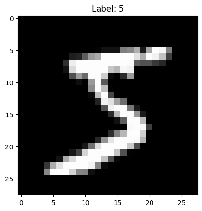
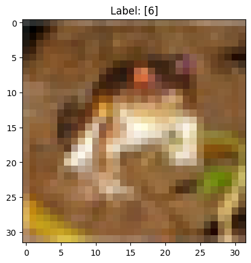
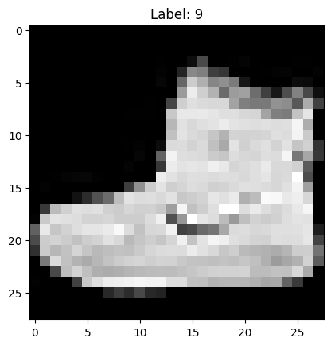
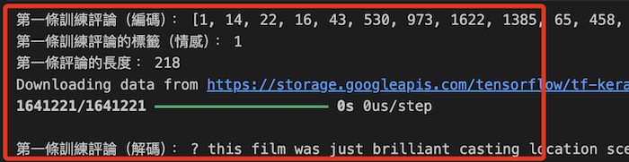
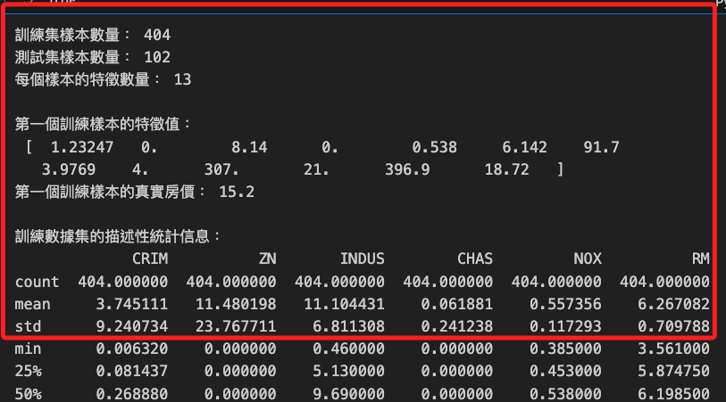
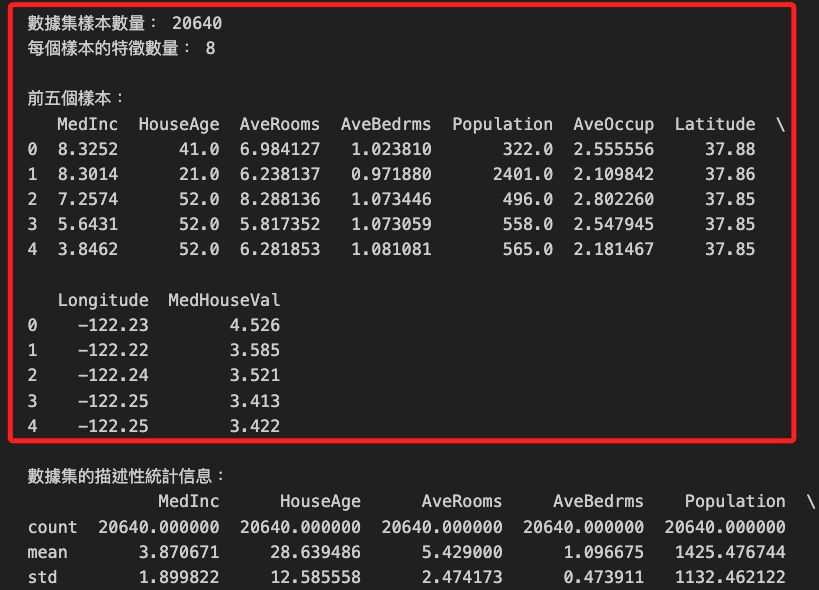
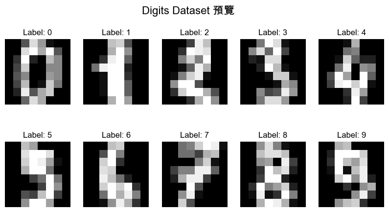
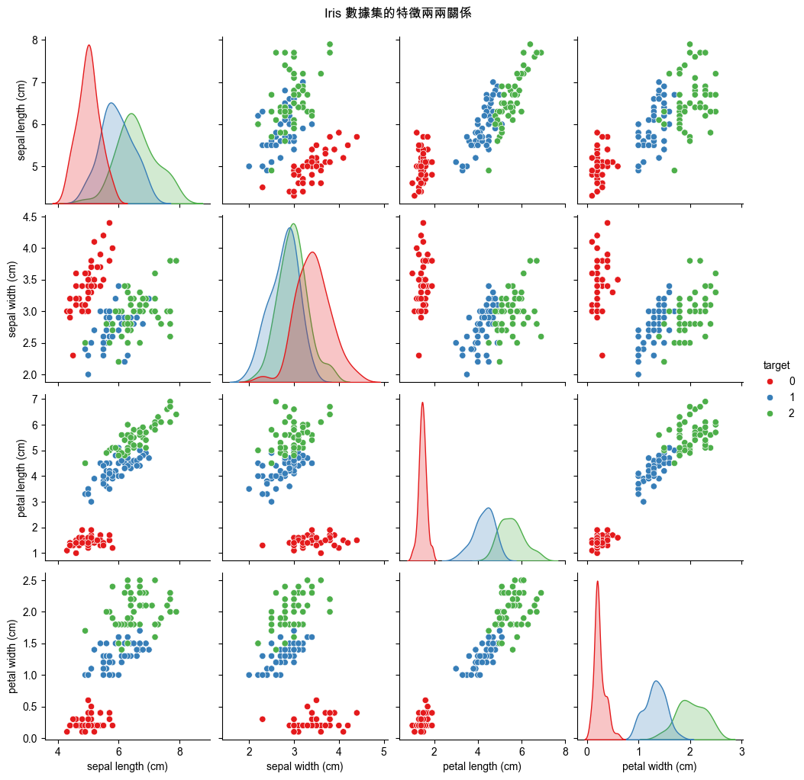

# 常見數據集

_介紹機器學習中常用的數據集，後續範例將依據各章節特性使用不同數據集進行代碼示範_

<br>

## MNIST

_Modified National Institute of Standards and Technology_

<br>

1. `MNIST` 是一個經典的 `手寫數字數據集`，包含 10 個數字類別 `（0-9）`；這是美國國家標準與技術研究院（NIST）的數據集，由 Yann LeCun 等人在 1998 年整理並發布。

<br>

2. 數據集中有訓練集 `60,000` 張 `28x28` 灰度圖像、測試集 `10,000` 張 `28x28` 灰度圖像；灰度圖像也稱為 `灰階圖像`，英文為 `Grayscale Image`。

<br>

3. 適用模型有 ANN、CNN、SVM、k-NN 等，應用場景如圖像分類、模式識別等；主要用於測試簡單的神經網絡和深度學習模型。

<br>

4. 使用 Keras 提供的 API 進行加載。

    ```python
    from tensorflow.keras.datasets import mnist
    (X_train, y_train), (X_test, y_test) = mnist.load_data()
    ```

<br>

5. 檢視內容。

    ```python
    import matplotlib.pyplot as plt

    # 顯示前5個訓練圖像及其標籤
    for i in range(5):
        # 灰度顯示
        plt.imshow(X_train[i], cmap='gray')
        plt.title(f"Label: {y_train[i]}")
        plt.show()
    ```

    

<br>

## CIFAR-10

_Canadian Institute For Advanced Research 10_

<br>

1. `CIFAR-10` 是一個包含 10 種日常物品的圖像數據集，項目有 `飛機、汽車、鳥、貓`等；這是一個在多倫多大學的機器學習研究小組（CIFAR）下開發的小型圖像數據集，用於測試圖像分類算法的性能，特別是 `卷積神經網絡 CNN`。

<br>

2. 數據集包含訓練集 `50,000` 張 `32x32` 彩色圖像、測試集 `10,000` 張 `32x32` 彩色圖像。

<br>

3. 適用模型 CNN、ANN、SVM 等，應用場景主要是 `圖像分類`，可測試模型的性能。

<br>

4. 加載數據。

    ```python
    from tensorflow.keras.datasets import cifar10
    (X_train, y_train), (X_test, y_test) = cifar10.load_data()
    ```

<br>

5. 預覽。

    ```python
    import matplotlib.pyplot as plt

    # 假設 X_train 是彩色圖片數據，顯示前5個訓練圖像及其標籤
    for i in range(5):
        # 不使用 cmap 參數，顯示彩色圖像
        plt.imshow(X_train[i])
        plt.title(f"Label: {y_train[i]}")
        plt.show()
    ```

    

<br>

## Fashion-MNIST

_用於替代 MNIST 作為更複雜的圖像分類數據集_

<br>

1. `Fashion-MNIST` 是由 Zalando Research 團隊開發，包含 `10` 個類別的時尚物品，如 `T-shirt、鞋子、包` 等的圖像。

<br>

2. 數據集包含訓練集 `60,000` 張 `28x28` 灰度圖像、測試集 `10,000` 張 `28x28` 灰度圖像。

<br>

3. 適用模型 ANN、CNN、SVM、k-NN 等，應用場景主要是圖像分類，用於更具挑戰性的分類任務。

<br>

4. 加載數據集。

    ```python
    from tensorflow.keras.datasets import fashion_mnist
    (X_train, y_train), (X_test, y_test) = fashion_mnist.load_data()
    ```

<br>

5. 預覽，代碼省略。

    

<br>

## IMDB

_Internet Movie Database_

<br>

1. IMDB 數據集由斯坦福大學 Andrew Maas 等人整理和發布，用於情感分析研究，包含 `50,000` 條關於電影評論的文本數據，用於正面或負面的情感分析。

<br>

2. 數據集包含 `訓練集` 和 `測試集` 各 `25,000` 條評論。

<br>

3. 適用模型 RNN、LSTM、ANN 等；應用場景包含文本分類、情感分析，主要用於自然語言處理任務。

<br>

4. 加載。

    ```python
    from tensorflow.keras.datasets import imdb
    (X_train, y_train), (X_test, y_test) = imdb.load_data(num_words=10000)
    ```

<br>

5. 這些評論已經被預處理過，每個評論都被編碼成一系列整數，也就是 `單詞索引`，下面範例可用於預覽 IMDB 資料集。

    ```python
    import numpy as np

    # 加載 IMDB 資料集，僅保留前 10,000 個最常見的詞
    (X_train, y_train), (X_test, y_test) = imdb.load_data(
        num_words=10000
    )

    # 查看訓練數據集的第一條評論（編碼格式）
    print("第一條訓練評論（編碼）：", X_train[0])

    # 查看第一條評論的真實標籤
    # 0 表示負面，1 表示正面
    print("第一條訓練評論的標籤（情感）：", y_train[0])

    # 查看評論的長度
    print("第一條評論的長度：", len(X_train[0]))

    # 使用 IMDB 提供的詞彙表將編碼轉回單詞
    word_index = imdb.get_word_index()
    reverse_word_index = {
        value: key for key, value in word_index.items()
    }

    # 將第一條評論轉回單詞
    decoded_review = ' '.join(
        [reverse_word_index.get(i - 3, '?') for i in X_train[0]]
    )
    print("\n第一條訓練評論（解碼）：", decoded_review)
    ```

    

<br>

## Boston Housing

1. Boston Housing 數據集來自於美國波士頓地區的房價數據研究，最早收集於 1970 年代，由 StatLib 庫提供，可用於迴歸分析。每個數據點包括 13 個特徵和房屋的中位數價格。

<br>

2. 數據集規模包含 `506` 個樣本，每個樣本有 `13` 個特徵。

<br>

3. 適用模型包含 ANN、DNN、隨機森林、迴歸模型；應用場景主要是迴歸分析，用於預測連續值，如房價。

<br>

4. 加載。

    ```python
    from tensorflow.keras.datasets import boston_housing
    (X_train, y_train), (X_test, y_test) = boston_housing.load_data()
    ```

<br>

5. 預覽。

    ```python
    import numpy as np
    import pandas as pd

    # 加載 Boston Housing 資料集
    (X_train, y_train), (X_test, y_test) = boston_housing.load_data()

    # 查看數據集的形狀
    print("訓練集樣本數量：", X_train.shape[0])
    print("測試集樣本數量：", X_test.shape[0])
    print("每個樣本的特徵數量：", X_train.shape[1])

    # 顯示訓練數據集的第一個樣本及其標籤
    print("\n第一個訓練樣本的特徵值：\n", X_train[0])
    print("第一個訓練樣本的真實房價：", y_train[0])

    # 顯示數據集的描述性統計信息
    df = pd.DataFrame(X_train, columns=[
        'CRIM', 'ZN', 'INDUS', 'CHAS',
        'NOX', 'RM', 'AGE', 'DIS', 'RAD',
        'TAX', 'PTRATIO', 'B', 'LSTAT'
    ])
    print("\n訓練數據集的描述性統計信息：")
    print(df.describe())

    # 顯示前五個樣本的特徵和目標值
    for i in range(5):
        print(f"\n樣本 {i+1} 的特徵值：\n", X_train[i])
        print(f"樣本 {i+1} 的真實房價：{y_train[i]}")
    ```

    

<br>

## California Housing

1. `California Housing 數據集` 源自加州 1990 年的人口普查數據，提供了關於加州各個街區的房屋價值、收入、房齡、房屋數量等信息，這個數據集非常適合用於 `迴歸分析`，以預測加州房價的 `中位數`。

<br>

2. 數據集包含 `20,640` 個樣本，每個樣本有 `8` 個特徵，這些特徵包括人口統計數據和地理信息，例如經緯度、中位數收入、房屋年齡等。

<br>

3. 適用模型包括 ANN、DNN、隨機森林、線性迴歸、決策樹等；應用場景主要是迴歸分析，用於預測連續值，如房價。

<br>

4. 加載。

    ```python
    from sklearn.datasets import fetch_california_housing
    california_housing = fetch_california_housing()
    ```

<br>

5. 預覽。

    ```python
    import pandas as pd

    # 加載加州房價數據集
    # 函數返回一個類似字典的對象，包括特徵數據、目標值、特徵名稱和描述等信息
    california_housing = fetch_california_housing()

    # 查看數據集的形狀
    print("數據集樣本數量：", california_housing.data.shape[0])
    print("每個樣本的特徵數量：", california_housing.data.shape[1])

    # 將數據轉換為 DataFrame 格式，以便更好地查看
    df = pd.DataFrame(
        california_housing.data, 
        columns=california_housing.feature_names
    )

    # 添加目標值（房價中位數）到 DataFrame
    df['MedHouseVal'] = california_housing.target

    # 顯示數據集的前五個樣本
    print("\n前五個樣本：")
    print(df.head())

    # 顯示數據集的描述性統計信息
    print("\n數據集的描述性統計信息：")
    print(df.describe())

    # 顯示第一個樣本的特徵值及其標籤
    print("\n第一個樣本的特徵值：\n", df.iloc[0][:-1])
    print("第一個樣本的真實房價中位數：", df.iloc[0]['MedHouseVal'])

    # 顯示前五個樣本的特徵和目標值
    for i in range(5):
        print(f"\n樣本 {i+1} 的特徵值：\n", df.iloc[i][:-1].to_numpy())
        print(f"樣本 {i+1} 的真實房價中位數：{df.iloc[i]['MedHouseVal']}")
    ```

    

<br>

## Wine Quality Dataset

1. 數據集來自葡萄牙機器學習研究機構，包含紅葡萄酒和白葡萄酒的各種化學成分和品質評分數據，用於預測酒的品質。

<br>

2. 數據集包含 `1,599` 個紅酒樣本和 `4,898` 個白酒樣本，每個樣本有 `11` 個特徵，如固定酸度、揮發酸、檸檬酸、殘糖、氯化物等。

<br>

3. 適用模型包含 ANN、隨機森林、SVM、KNN；應用場景包含迴歸和分類問題，用於預測品質分數或分類為不同品質等級。

<br>

4. 從 UCI 機器學習數據庫 [下載](https://www.kaggle.com/datasets/uciml/red-wine-quality-cortez-et-al-2009)。

    

<br>

5. 導入並查看資料集。

    ```python
    import pandas as pd

    # 加載紅葡萄酒數據集
    red_wine_data = pd.read_csv(
        'winequality-red.csv', sep=';'
    )

    # 加載白葡萄酒數據集
    white_wine_data = pd.read_csv(
        'winequality-white.csv', sep=';'
    )

    # 查看紅葡萄酒數據集的基本信息
    print("紅葡萄酒數據集信息：")
    print(red_wine_data.info())

    # 顯示紅葡萄酒數據集的前五個樣本
    print("\n紅葡萄酒數據集的前五個樣本：")
    print(red_wine_data.head())

    # 查看白葡萄酒數據集的基本信息
    print("\n白葡萄酒數據集信息：")
    print(white_wine_data.info())

    # 顯示白葡萄酒數據集的前五個樣本
    print("\n白葡萄酒數據集的前五個樣本：")
    print(white_wine_data.head())

    # 顯示紅葡萄酒數據集的描述性統計信息
    print("\n紅葡萄酒數據集的描述性統計信息：")
    print(red_wine_data.describe())

    # 顯示白葡萄酒數據集的描述性統計信息
    print("\n白葡萄酒數據集的描述性統計信息：")
    print(white_wine_data.describe())
    ```

<br>

## Wine Recognition Dataset

1. 與前面 `Wine Quality Dataset` 不同，另一個常見的數據集 `Wine Recognition Dataset` 也是與酒品有關的數據集，主要用於分類問題；這是來自 UCI 機器學習數據庫的分類數據集，用於根據化學分析來識別 3 種不同產地的意大利葡萄酒。數據集中的每一個數據點代表一個葡萄酒樣本，並包含 13 個與化學成分相關的特徵，例如酒精含量、蘋果酸、灰分、鎂含量等，包含 `178` 個樣本，每個樣本有 `13` 個特徵和一個目標變數。

<br>

2. 適用於分類模型如 k-NN、SVM、隨機森林、多層感知機等，這些模型可以用來識別每個樣本屬於哪一類葡萄酒。

<br>

3. 加載與預覽。

    ```python
    from sklearn.datasets import load_wine
    import pandas as pd

    # 加載數據集
    wine_data = load_wine()
    
    # 將數據集轉換為 DataFrame
    df_wine = pd.DataFrame(
        data=wine_data.data, columns=wine_data.feature_names
    )
    df_wine['target'] = wine_data.target

    # 查看數據集的基本信息
    print("數據集基本信息：")
    print(df_wine.info())

    # 顯示數據集的前五個樣本
    print("\n數據集的前五個樣本：")
    print(df_wine.head())

    # 顯示數據集的描述性統計信息
    print("\n數據集的描述性統計信息：")
    print(df_wine.describe())
    ```

<br>

## Digits Dataset

1. 數據集由美國國家標準與技術研究院（NIST）提供，並被 Scikit-learn 包裝為 Python 庫中的標準數據集，這是個 `小型手寫數字數據集`，包含 `8x8` 像素的灰度圖像，共 `10` 個數字類別（0-9）。

<br>

2. 數據集包含 `1,797` 張 `8x8` 灰度圖像。

<br>

3. 適用模型有 ANN、SVM、KNN、隨機森林；應用場景為圖像分類，適合用於入門級圖像識別任務。

<br>

4. 使用 `Scikit-learn` 庫提供的 API 進行加載。

    ```python
    from sklearn.datasets import load_digits
    digits = load_digits()
    X, y = digits.data, digits.target
    ```

<br>

5. 預覽。

    ```python
    import matplotlib.pyplot as plt

    # 查看數據集的形狀
    print(f"數據集的形狀: {X.shape}")
    print(f"目標的形狀: {y.shape}")

    # 顯示數據集的基本信息
    print(f"特徵數據的類型: {type(X)}")
    print(f"標籤數據的類型: {type(y)}")
    print(f"特徵數據的範圍: {X.min()} ~ {X.max()}")
    print(f"目標數據的類別數: {len(set(y))}")

    # 可視化數據集中的前幾個數字
    fig, axes = plt.subplots(2, 5, figsize=(10, 5))
    for i, ax in enumerate(axes.ravel()):
        ax.imshow(digits.images[i], cmap='gray')
        ax.set_title(f'Label: {digits.target[i]}')
        ax.axis('off')

    plt.suptitle('Digits Dataset 預覽', fontsize=16)
    plt.show()

    # 顯示數據集的描述性統計信息
    print("\n數據集的描述性統計信息：")
    print(f"每個樣本的特徵數量: {X.shape[1]}")
    print(f"每個樣本的像素分布：\n {X[:5]}")
    print(f"前5個樣本的真實標籤： {y[:5]}")
    ```

    

<br>

## Iris Dataset

1. Iris 數據集是一個經典的機器學習數據集，由英國統計學家和生物學家 Fisher 在 1936 年首次介紹，常用於演示 `分類` 算法，數據集包含了 `3` 種類別的鳶尾花 `（Setosa、Versicolour、Virginica）`，每個樣本都有 `4` 個特徵 `花萼長度（sepal length）、花萼寬度（sepal width）、花瓣長度（petal length）、花瓣寬度（petal width）`。

<br>

2. 數據集包含 `150` 個樣本，每個樣本有 `4` 個特徵，目標變數（類別標籤）有 `3` 種不同的鳶尾花品種；適用於 `分類` 模型如 `k-NN`、`SVM`、`隨機森林`、`MLP` 等。
。

<br>

3. 加載。

    ```python
    from sklearn.datasets import load_iris
    import pandas as pd
    import matplotlib.pyplot as plt
    import seaborn as sns

    # 設定支持中文的字體，避免顯示錯誤
    plt.rcParams['font.sans-serif'] = ['Arial Unicode MS']
    # 用來正常顯示負號
    plt.rcParams['axes.unicode_minus'] = False

    # 加載數據集
    iris_data = load_iris()
    
    # 將數據集轉換為 DataFrame
    df_iris = pd.DataFrame(
        data=iris_data.data,
        columns=iris_data.feature_names
    )
    df_iris['target'] = iris_data.target

    # 查看數據集的基本信息
    print("數據集基本信息：")
    print(df_iris.info())

    # 顯示數據集的前五個樣本
    print("\n數據集的前五個樣本：")
    print(df_iris.head())

    # 顯示數據集的描述性統計信息
    print("\n數據集的描述性統計信息：")
    print(df_iris.describe())

    # 可視化數據分佈
    sns.pairplot(
        df_iris, hue='target', 
        palette='Set1', diag_kind='kde'
    )
    plt.suptitle('Iris 數據集的特徵兩兩關係', y=1.02)
    plt.show()
    ```

    

<br>

___

_END_