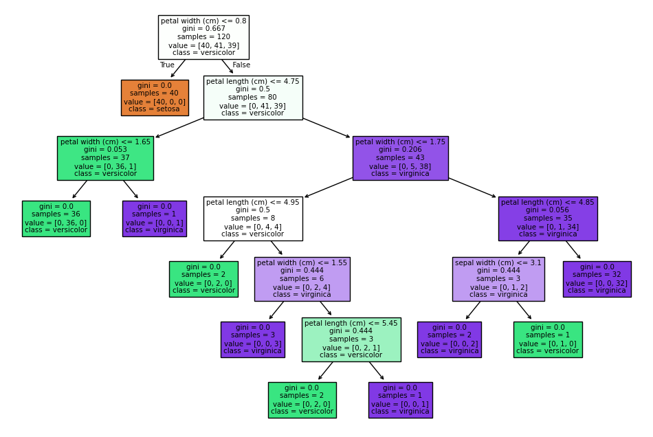
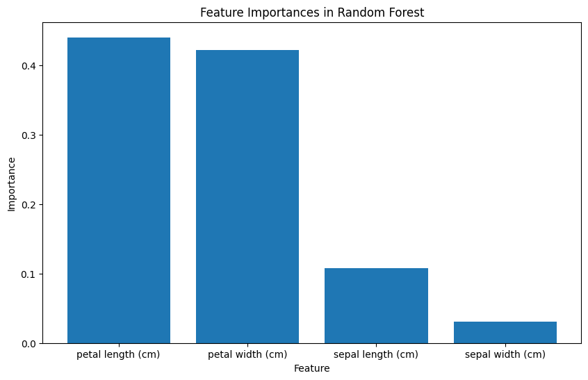
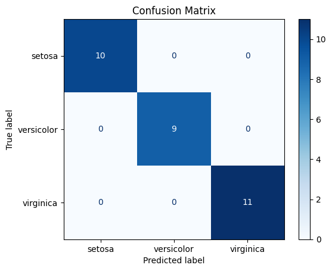
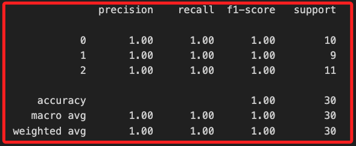
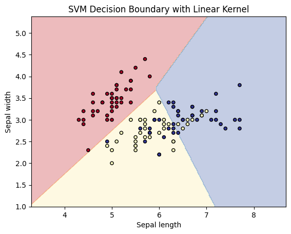
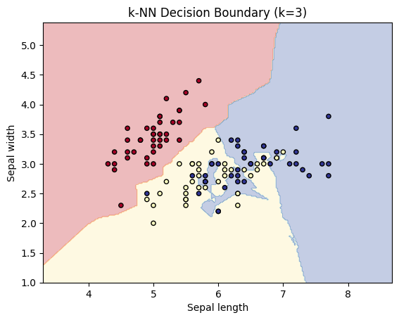

# 機器學習

_從數據中學習模式和規律來進行預測或決策_

<br>

## 主要類型

_監督式學習依賴標註數據進行訓練，而非監督式學習則在無標註數據中尋找內在結構；強化學習是一種通過試錯和獎勵機制來學習最佳行為策略的方法，同樣是不依賴於標註數據或數據內在結構。_

<br>

1. 監督式學習（Supervised Learning）：利用標註數據進行訓練，模型學習 _輸入與輸出之間的映射關係_，適用於分類（如垃圾郵件檢測）或迴歸（如房價預測）問題。

<br>

2. 非監督式學習（Unsupervised Learning）：在無標註數據的情況下，模型嘗試學習 _數據的內在結構_，用於聚類（如客戶細分）或降維（如主成分分析）問題。

<br>

3. 強化學習（Reinforcement Learning）：強化學習通過 `代理（agent）` 與環境進行互動來學習，代理會根據環境的狀態做出動作，然後根據動作的結果獲得 `回饋（獎勵或懲罰）`，並根據這些回饋來更新策略，以最大化長期回報；常用於遊戲AI、機器人控制、自動駕駛等需要決策和控制的任務。

<br>

4. 半監督式學習（Semi-supervised learning）：結合了監督式和非監督式學習的元素，模型使用少量的標註數據來引導學習過程，同時利用大量未標註數據來學習數據的內在結構和模式；這種方法有助於提高模型在標註數據有限時的性能，特別是在標註成本高昂或標註過程耗時的情況下，常應用於語音識別、文本分類、圖像標註和生物信息學等領域。

<br>

## 分佈假設

1. 參數模型：此類模型的數據會服從某種特定的分佈假設，例如數據服從常態分佈的演算法有線性迴歸、邏輯迴歸等，由於數據分佈具有一定的假設基礎，模型相對有較強的可解釋性，這與統計學的概念是一致的。

<br>

2. 非參數模型：非參數模型不依賴於對數據的任何明確分佈假設。模型更靈活，可以適應更複雜的數據分佈，與統計學小樣本適用非參數統計方法不同，機器學習中的非參數模型通常需要更多的訓練數據，並且訓練和預測過程耗時更長；常見的非參數模型如 k-NN、決策樹、SVM、隨機森林等。

<br>

## 任務類別

1. 分類（Classification）：監督式學習任務，識別數據所屬的類別標籤，例如垃圾郵件檢測、圖片分類、醫學診斷等。

<br>

2. 迴歸（Regression）：監督式學習任務，使用帶有標籤的訓練數據來學習輸入特徵和連續數值之間的映射關係，然後對新數據進行數值預測，例如房價預測、股票價格預測。

<br>

3. 聚類（Clustering）：非監督式學習任務，在無需標籤的情況下，將相似數據點分組，例如市場客戶細分、圖像分割、文檔分組等。

<br>

4. 降維（Dimensionality Reduction）：非監督式學習任務，不需要標籤來學習數據的特徵表示，透過簡化數據特徵空間，保留重要信息，例如 PCA、t-SNE。

<br>

5. 異常檢測（Anomaly Detection）：用以識別數據集中與大多數數據不同的 `異常數據點`，例如金融欺詐檢測、網絡入侵檢測；這種任務類別也就是某種應用場景，它不是具體的算法或模型，而是可使用多種不同算法或模型來因應，例如使用 `K-means、Isolation Forest、One-Class SVM` 等，根據是否有標註數據，可以採用監督或非監督的方式進行。

<br>

6. 強化學習（Reinforcement Learning）：既不是監督式也不是非監督式學習。它是一種基於試錯法和獎勵機制的學習方式；通過試驗和錯誤學習策略，在動態環境中獲得最大化回報，例如機器人控制、遊戲AI。

<br>

## 常用的演算法

1. 線性迴歸（Linear Regression）。

<br>

2. 決策樹（Decision Tree）。

<br>

3. 隨機森林（Random Forest）。

<br>

4. 支持向量機（Support Vector Machine，SVM）。

<br>

5. k-最近鄰（k-Nearest Neighbors，k-NN）。

<br>

## 準備工作

1. 安裝必要套件。

    ```bash
    pip install scikit-learn numpy matplotlib
    ```

<br>

2. scikit-learn：機器學習庫，用於訓練和評估模型。

<br>

3. numpy：數值計算庫，用於處理數據。

<br>

4. matplotlib：數據視覺化庫，用於繪製圖形。

<br>

## 線性迴歸（Linear Regression）

1. 線性迴歸是一種監督式學習算法，主要用於數值預測，核心思想是通過擬合一條線性關係來預測目標值。

    ```python
    import numpy as np
    import matplotlib.pyplot as plt
    from sklearn.linear_model import LinearRegression
    from sklearn.model_selection import train_test_split

    # 生成示例數據
    X = np.array([[1], [2], [3], [4], [5]])
    y = np.array([1, 2, 1.3, 3.75, 2.25])

    # 分割訓練集和測試集
    X_train, X_test, y_train, y_test = train_test_split(
        X, y, test_size=0.2, random_state=42
    )

    # 建立線性迴歸模型
    model = LinearRegression()
    model.fit(X_train, y_train)

    # 預測
    y_pred = model.predict(X_test)

    # 視覺化結果
    plt.scatter(X, y, color='blue', label='Data points')
    plt.plot(
        X_test, y_pred, color='red', linewidth=2, label='Linear fit'
    )
    plt.xlabel('X')
    plt.ylabel('y')
    plt.legend()
    plt.show()
    ```

<br>

2. 以上範例中，使用簡單的一維數據來演示線性迴歸的基本原理，特徵數據（X）是一維數據集，包含了 5 個樣本（[1], [2], [3], [4], [5]），每個樣本只有一個特徵（即一個數值），它們是獨立變量。

<br>

3. 標籤數據（y）是目標數據集，包含了對應於 X 的 5 個樣本的目標值（[1, 2, 1.3, 3.75, 2.25]），這些值就是自變量 X 的響應值或預測目標。

<br>

4. `train_test_split 函數` 可將數據集分為訓練集和測試集，在這個例子中，`test_size=0.2` 表示測試集佔總數據的 20%，因此有 4 個樣本進入訓練集（80%）、1 個樣本進入測試集（20%）。

<br>

5. 通過 `LinearRegression()` 建立線性迴歸模型的實例，並使用 `fit` 方法對訓練數據進行擬合；這個模型學習到一個最佳的直線來近似輸入數據和目標數據之間的關係。

<br>

6. 使用 `測試集 X_test` 進行預測，並使用 `matplotlib` 繪製原始數據點和線性迴歸擬合線。

<br>

## 決策樹（Decision Tree）

1. 決策樹是一種基於樹形結構的算法，適用於 _分類和迴歸_ 問題，通過對數據集進行分割來構建一個決策樹，每個節點根據某個特徵的某個值進行分裂。

    ```python
    from sklearn.datasets import load_iris
    from sklearn.tree import DecisionTreeClassifier
    from sklearn.model_selection import train_test_split
    from sklearn import tree

    # 加載 Iris數據集
    iris = load_iris()
    X, y = iris.data, iris.target

    # 分割訓練集和測試集
    X_train, X_test, y_train, y_test = train_test_split(
        X, y,
        test_size=0.2, random_state=42
    )

    # 建立決策樹分類器
    clf = DecisionTreeClassifier()
    clf.fit(X_train, y_train)

    # 預測
    y_pred = clf.predict(X_test)

    # 視覺化決策樹
    plt.figure(figsize=(12, 8))
    tree.plot_tree(
        clf,
        filled=True,
        feature_names=iris.feature_names,
        class_names=iris.target_names
    )
    plt.show()
    ```

    

<br>

## 隨機森林（Random Forest）

1. 隨機森林是一種集成學習算法，通過結合 `多個決策樹` 的輸出來提高模型的準確性和穩定性，這在處理高維數據時特別有效。

<br>

2. 範例使用了 Iris 數據集，這個數據集包含了 `150` 個樣本，每個樣本有 `4` 個特徵，分別是 `sepal length`、`sepal width`、`petal length`、`petal width`，對應於 `3` 種不同類別的鳶尾花，分別是 `setosa`、`versicolor`、`virginica`，每個類別有 `50` 個樣本；特徵矩陣（X）包含了每個樣本的 4 個特徵值，目標向量（y）包含每個樣本的對應類別，其中 `0, 1, 2` 分別代表 `setosa、versicolor、virginica`。

    ```python
    import matplotlib.pyplot as plt
    import numpy as np
    from sklearn.ensemble import RandomForestClassifier
    from sklearn.datasets import load_iris
    from sklearn.model_selection import train_test_split
    from sklearn.metrics import accuracy_score

    # 加載示例數據集（Iris數據集）
    iris = load_iris()
    X, y = iris.data, iris.target

    # 分割訓練集和測試集
    X_train, X_test, y_train, y_test = train_test_split(
        X, y, test_size=0.2, random_state=42
    )

    # 建立隨機森林分類器
    clf = RandomForestClassifier(
        n_estimators=100, random_state=42
    )
    clf.fit(X_train, y_train)

    # 預測
    y_pred = clf.predict(X_test)

    # 計算準確率
    accuracy = accuracy_score(y_test, y_pred)
    print(f"Model Accuracy: {accuracy * 100:.2f}%")

    # 可視化特徵重要性
    importances = clf.feature_importances_
    feature_names = iris.feature_names
    # 按重要性排序特徵
    indices = np.argsort(importances)[::-1]

    plt.figure(figsize=(10, 6))
    plt.title("Feature Importances in Random Forest")
    plt.bar(
        range(X.shape[1]), importances[indices], align="center"
    )
    plt.xticks(
        range(X.shape[1]), [feature_names[i] for i in indices]
    )
    plt.xlabel("Feature")
    plt.ylabel("Importance")
    plt.show()
    ```

    

<br>

3. 在模型訓練上，`RandomForestClassifier` 這個分類器由多個決策樹組成，此處設定為 100 棵樹，每棵樹都從數據的 `隨機子集` 中訓練，最終的預測結果是通過所有樹的預測結果進行投票得出的。

<br>

4. 混淆矩陣（Confusion Matrix）可用於評估分類模型的性能，通過可視化每個類別的預測和實際情況來觀察模型的誤分類情況。矩陣的每一行代表實際類別，每一列代表預測類別，主對角線上的數字表示正確分類的樣本數，非主對角線的數字表示誤分類的樣本數；通過混淆矩陣可觀察到模型在某些類別上的誤差情況。

    ```python
    from sklearn.metrics import confusion_matrix, ConfusionMatrixDisplay

    # 計算混淆矩陣
    cm = confusion_matrix(y_test, y_pred)
    disp = ConfusionMatrixDisplay(confusion_matrix=cm, display_labels=iris.target_names)

    # 可視化混淆矩陣
    plt.figure(figsize=(8, 6))
    disp.plot(cmap=plt.cm.Blues)
    plt.title("Confusion Matrix")
    plt.show()
    ```

    

<br>

## 支持向量機（Support Vector Machine, SVM）

1. 支持向量機是一種監督式學習算法，通常用於分類任務，核心思想是找到一個最佳的超平面，將不同類別的數據點分開，並最大化數據點到該超平面的距離。

    ```python
    from sklearn import datasets
    from sklearn.model_selection import train_test_split
    from sklearn.svm import SVC
    from sklearn.metrics import classification_report

    # 加載示例數據集（Iris數據集）
    iris = datasets.load_iris()
    X, y = iris.data, iris.target

    # 分割訓練集和測試集
    X_train, X_test, y_train, y_test = train_test_split(
        X, y, test_size=0.2, random_state=42
    )

    # 建立支持向量機分類器
    clf = SVC(kernel='linear')
    clf.fit(X_train, y_train)

    # 預測
    y_pred = clf.predict(X_test)

    # 顯示分類報告
    print(classification_report(y_test, y_pred))
    ```

    

<br>

2. 這個範例使用了 Iris 數據集，它是四維特徵數據集，所以可視化可能會受到一些限制，以下通過投影特徵到2D平面或3D空間中來觀察數據和支持向量機（SVM）的分類邊界。

    ```python
    import matplotlib.pyplot as plt
    import numpy as np
    from sklearn import datasets
    from sklearn.model_selection import train_test_split
    from sklearn.svm import SVC
    from sklearn.metrics import classification_report

    # 加載示例數據集（Iris數據集）
    iris = datasets.load_iris()
    X, y = iris.data, iris.target

    # 只選取前兩個特徵進行2D可視化
    X = X[:, :2]  # sepal length and sepal width

    # 分割訓練集和測試集
    X_train, X_test, y_train, y_test = train_test_split(
        X, y, test_size=0.2, random_state=42
    )

    # 建立支持向量機分類器
    clf = SVC(kernel="linear")
    clf.fit(X_train, y_train)

    # 預測
    y_pred = clf.predict(X_test)

    # 顯示分類報告
    print(classification_report(y_test, y_pred))


    # 可視化決策邊界
    def plot_decision_boundary(X, y, model):
        # 設置最大和最小值並填充網格
        x_min, x_max = X[:, 0].min() - 1, X[:, 0].max() + 1
        y_min, y_max = X[:, 1].min() - 1, X[:, 1].max() + 1
        xx, yy = np.meshgrid(
            np.arange(x_min, x_max, 0.02),
            np.arange(y_min, y_max, 0.02)
        )

        # 預測每個點的類別
        Z = model.predict(np.c_[xx.ravel(), yy.ravel()])
        Z = Z.reshape(xx.shape)

        # 繪製決策邊界和散點圖
        plt.contourf(xx, yy, Z, alpha=0.3, cmap=plt.cm.RdYlBu)
        plt.scatter(
            X[:, 0], X[:, 1], c=y, s=20,
            edgecolor="k", cmap=plt.cm.RdYlBu
        )
        plt.xlabel("Sepal length")
        plt.ylabel("Sepal width")
        plt.title("SVM Decision Boundary with Linear Kernel")
        plt.show()


    # 調用函數進行可視化
    plot_decision_boundary(X_train, y_train, clf)
    ```

    

<br>

## k-NN

_k-最近鄰法，k-Nearest Neighbors_

1. `K-NN` 是一種簡單的 `非參數監督學習算法`，用於分類和迴歸，它基於特徵空間中距離最近的 k 個數據點來做出決策。

<br>

2. 以下範例使用 `k-NN` 演算法來對 Iris 數據集進行分類，可視化部分展示 `k-NN` 的決策邊界，並使用數據集的前兩個特徵進行可視化。

    ```python
    import matplotlib.pyplot as plt
    import numpy as np
    from sklearn import datasets
    from sklearn.model_selection import train_test_split
    from sklearn.neighbors import KNeighborsClassifier
    from sklearn.metrics import accuracy_score

    # 加載鳶尾花數據集
    iris = datasets.load_iris()
    # 獲取數據集的特徵和標籤
    X, y = iris.data, iris.target

    # 使用前兩個特徵（花萼長度和花萼寬度）進行2D可視化
    X = X[:, :2]

    # 將數據集分為訓練集和測試集，測試集佔20%
    X_train, X_test, y_train, y_test = train_test_split(
        X, y, test_size=0.2, random_state=42
    )  

    # 建立k-NN分類器實例，設定k值為3
    knn = KNeighborsClassifier(n_neighbors=3)
    # 用訓練數據訓練k-NN分類器
    knn.fit(X_train, y_train)

    # 使用測試集進行預測
    y_pred = knn.predict(X_test)

    # 計算模型準確率
    accuracy = accuracy_score(y_test, y_pred)
    # 輸出準確率
    print(f"Model Accuracy: {accuracy * 100:.2f}%")


    # 可視化k-NN決策邊界
    def plot_decision_boundary(X, y, model):
        # 設置最大和最小值並填充網格
        # 設定x軸的範圍
        x_min, x_max = X[:, 0].min() - 1, X[:, 0].max() + 1
        # 設定y軸的範圍
        y_min, y_max = X[:, 1].min() - 1, X[:, 1].max() + 1
        # 建立網格點
        xx, yy = np.meshgrid(
            np.arange(x_min, x_max, 0.02), np.arange(y_min, y_max, 0.02)
        )

        # 預測每個網格點的類別
        Z = model.predict(np.c_[xx.ravel(), yy.ravel()])
        # 重塑結果為網格的形狀
        Z = Z.reshape(xx.shape)

        # 繪製決策邊界
        plt.contourf(xx, yy, Z, alpha=0.3, cmap=plt.cm.RdYlBu)
        # 繪製散點圖
        plt.scatter(
            X[:, 0], X[:, 1], c=y, s=20, edgecolor="k", cmap=plt.cm.RdYlBu
        )
        # 設置x軸標籤
        plt.xlabel("Sepal length")
        # 設置y軸標籤
        plt.ylabel("Sepal width")
        # 設置圖標題
        plt.title("k-NN Decision Boundary (k=3)")
        # 顯示圖形
        plt.show()

    # 使用訓練集和k-NN模型可視化決策邊界
    plot_decision_boundary(X_train, y_train, knn)
    ```

    

<br>

___

_END_
