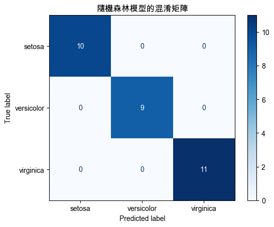
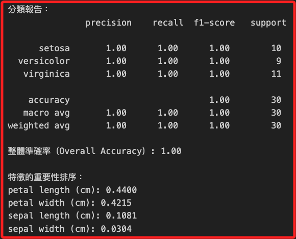
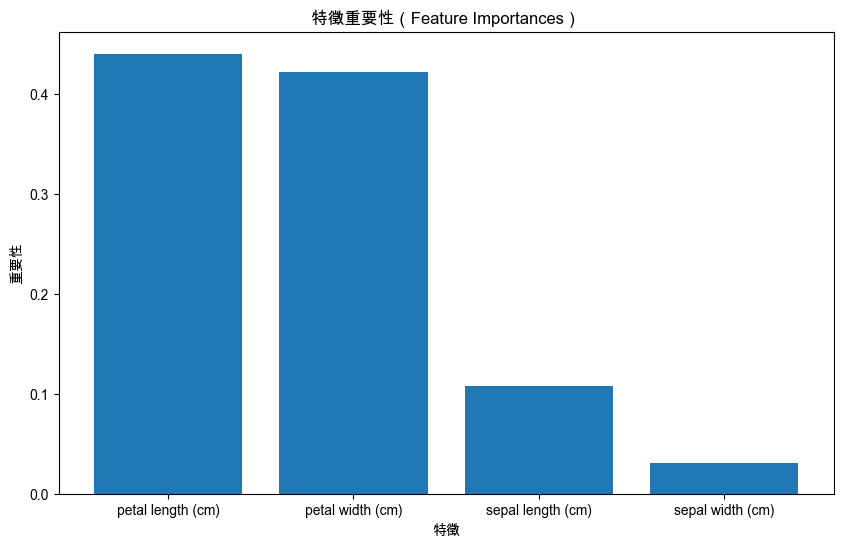

# 機器學習實作 I

_使用監督式學習算法 `Random Forest` 對 `Iris` 數據集進行分類任務_

## 說明

1. `隨機森林` 是個機器學習中的 `集成算法`，結合多個 `決策樹` 的預測來提高分類的準確性並減少過擬合，隨機森林的每棵樹都基於從訓練數據集中 `有放回地隨機抽樣` 生成，並且在每個節點分裂時隨機選擇特徵進行分裂。

2. `Iris` 數據集包含 `150` 個樣本，每個樣本有 `4` 個特徵，包含 `花萼長度、花萼寬度、花瓣長度、花瓣寬度`，目標變量是 `3` 種不同的 `鳶尾花（Setosa、Versicolour、Virginica）`。

3. 隨機森林算法與大多數的機器學習算法相同都依賴於 `人工特徵工程`，藉此能夠在較小的數據集上工作，對於參數的需求量小、訓練速度較快、計算成本較低，適用於一般的計算機環境。

## 範例

1. 以下使用 `scikit-learn` 庫中的 `RandomForestClassifier`。

```python
# 引入所需的庫
import numpy as np
import matplotlib.pyplot as plt
from sklearn.ensemble import RandomForestClassifier
from sklearn.datasets import load_iris
from sklearn.model_selection import train_test_split
from sklearn.metrics import (
    classification_report,
    confusion_matrix,
    ConfusionMatrixDisplay,
    accuracy_score
)

# 設定支持中文的字體，避免顯示錯誤
plt.rcParams['font.sans-serif'] = ['Arial Unicode MS']
plt.rcParams['axes.unicode_minus'] = False

# 加載 Iris 數據集
data = load_iris()
X = data.data
y = data.target

# 將數據集拆分為訓練集和測試集，80% 用於訓練，20% 用於測試
X_train, X_test, y_train, y_test = train_test_split(
    X, y,
    test_size=0.2,
    random_state=42
)

# 初始化隨機森林分類器，設置 100 棵樹
model = RandomForestClassifier(
    n_estimators=100,
    random_state=42
)

# 訓練模型
model.fit(X_train, y_train)

# 使用訓練好的模型進行預測
y_pred = model.predict(X_test)

# 計算混淆矩陣
cm = confusion_matrix(y_test, y_pred)

# 可視化混淆矩陣
disp = ConfusionMatrixDisplay(
    confusion_matrix=cm,
    display_labels=data.target_names
)
disp.plot(cmap=plt.cm.Blues)
plt.title('隨機森林模型的混淆矩陣')
plt.show()

# 顯示分類報告
report = classification_report(
    y_test, y_pred,
    target_names=data.target_names
)
print("分類報告：\n", report)

# 計算整體準確率
accuracy = accuracy_score(y_test, y_pred)
print(f"整體準確率（Overall Accuracy）: {accuracy:.2f}")

# 顯示特徵的重要性
feature_importances = model.feature_importances_
indices = np.argsort(feature_importances)[::-1]
print("\n特徵的重要性排序：")
for f in range(X.shape[1]):
    print(
        f"{data.feature_names[indices[f]]}:"
        f" {feature_importances[indices[f]]:.4f}"
    )

# 可視化特徵重要性
plt.figure(figsize=(10, 6))
plt.title("特徵重要性（Feature Importances）")
plt.bar(
    range(X.shape[1]),
    feature_importances[indices], align="center"
)
plt.xticks(
    range(X.shape[1]),
    [data.feature_names[i] for i in indices]
)
plt.xlabel("特徵")
plt.ylabel("重要性")
plt.show()
```

2. 混淆矩陣。



3. 報表顯示，三個類別的 `精確率` 均為 `1.00`，代表著模型預測這些類別的數據點都是正確的；`召回率` 也都是 `1.00`，表示模型能夠正確識別所有的該類別數據點。



4. 隨機森林模型的解釋性良好，可直觀地通過 `特徵重要性` 對模型的決策過程進行理解；適用於結構化數據的分類和回歸問題，如金融預測、醫療診斷等，尤其適合數據特徵相對固定且數據集大小適中的應用。



