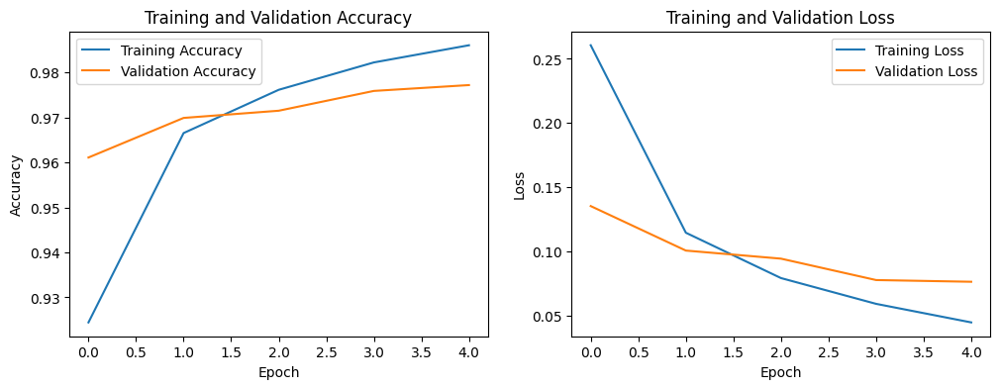
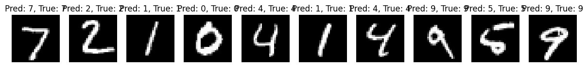

# 深度學習

_從簡單的範例開始，使用 `Keras` 構建一個 `多層感知機（MLP, Multi-Layer Perceptron）` 來解決分類問題_

<br>

## 說明

1. 在以下在範例中，將使用基於 `TensorFlow` 的高階 API 的 `Keras` 來構建一個 `MLP` 模型，該模型將被訓練來分類 `手寫數字 MNIST數據集`，這個數據集包含了 `28x28` 像素的手寫數字圖片（0-9）共 `10` 個類別。

<br>

2. 安裝必要套件，其中 `TensorFlow` 包含了 `Keras`，這是深度學習的框架，而 `Matplotlib` 用於數據可視化的庫。

    ```bash
    pip install tensorflow matplotlib
    ```

<br>

## 範例

1. 代碼。

    ```python
    # 導入必要庫
    import tensorflow as tf
    # 模型構建函數，用於建構逐層堆疊的神經網路模型
    from tensorflow.keras.models import Sequential
    # Dense 層是全連接層
    # Flatten 層用於將多維輸入展平為一維向量
    from tensorflow.keras.layers import Dense, Flatten
    # 數據集
    from tensorflow.keras.datasets import mnist
    import matplotlib.pyplot as plt

    # 加載MNIST數據集
    (X_train, y_train), (X_test, y_test) = mnist.load_data()

    # 數據預處理
    # 將像素值歸一化到0-1之間，並確保數據類型為float32
    X_train = X_train.astype('float32') / 255.0
    # 將像素值歸一化到0-1之間，並確保數據類型為float32
    X_test = X_test.astype('float32') / 255.0


    # 構建MLP模型
    model = Sequential([
        # 將28x28的圖片攤平為784維的向量
        Flatten(input_shape=(28, 28)),
        # 第一個全連接層，有128個神經元，使用ReLU激活函數
        Dense(128, activation='relu'),
        # 輸出層，有10個神經元（對應10個類別），使用Softmax激活函數
        Dense(10, activation='softmax')
    ])

    # 編譯模型
    model.compile(
        optimizer='adam',
        loss='sparse_categorical_crossentropy',
        metrics=['accuracy']
    )

    # 訓練模型
    history = model.fit(
        X_train, y_train,
        epochs=5,
        validation_data=(X_test, y_test)
    )

    # 可視化訓練過程
    def plot_training_history(history):
        plt.figure(figsize=(12, 4))

        # 準確率圖
        plt.subplot(1, 2, 1)
        plt.plot(
            history.history['accuracy'],
            label='Training Accuracy'
        )
        plt.plot(
            history.history['val_accuracy'],
            label='Validation Accuracy'
        )
        plt.title('Training and Validation Accuracy')
        plt.xlabel('Epoch')
        plt.ylabel('Accuracy')
        plt.legend()

        # 損失圖
        plt.subplot(1, 2, 2)
        plt.plot(
            history.history['loss'],
            label='Training Loss'
        )
        plt.plot(
            history.history['val_loss'],
            label='Validation Loss'
        )
        plt.title('Training and Validation Loss')
        plt.xlabel('Epoch')
        plt.ylabel('Loss')
        plt.legend()

        plt.show()

    # 調用函數可視化訓練歷史
    plot_training_history(history)

    # 評估模型
    test_loss, test_acc = model.evaluate(
        X_test, y_test, verbose=2
    )
    print(f"Test Accuracy: {test_acc * 100:.2f}%")

    # 可視化部分測試數據的預測結果
    def plot_sample_predictions(
        model, X_test, y_test, num_samples=10):
        # 獲取模型的預測結果
        predictions = model.predict(X_test)
        plt.figure(figsize=(15, 5))

        for i in range(num_samples):
            plt.subplot(1, num_samples, i + 1)
            # 顯示手寫數字圖像
            plt.imshow(X_test[i], cmap='gray')
            plt.title(f"Pred: {predictions[i].argmax()}, True: {y_test[i]}")  # 顯示預測標籤和真實標籤
            plt.axis('off')

        plt.show()

    # 調用函數可視化測試數據的預測結果
    plot_sample_predictions(model, X_test, y_test)
    ```

<br>

2. 會先看到訓練的過程。

    

<br>

3. 訓練結果。

    

<br>

4. 判斷，中間僅出現一次錯誤。

    

<br>

## 代碼詳細說明

1. 在加載數據部分，使用 `mnist.load_data()` 來加載 MNIST 數據集，這個數據集已經包含在 Keras 中。將數據集的像素值進行歸一化（0-255 轉換到 0-1），以便於神經網絡更快地收斂。

<br>

2. 模型構建部分，使用 `Sequential` 模型來構建一個簡單的多層感知機（MLP）。第一層是 `Flatten` 層，將28x28的圖片展平為784維的向量。第二層是隱藏層（`Dense`），有128個神經元，激活函數使用 ReLU。最後一層是輸出層，有10個神經元（對應於0-9的手寫數字類別），激活函數使用 Softmax。

<br>

3. 模型的編譯使用了 Adam 優化器。使用 `sparse_categorical_crossentropy` 作為損失函數，適合多類別分類問題。設定評估指標為準確率（`accuracy`）。

<br>

4. 模型訓練使用 `fit()` 函數進行模型訓練，並記錄訓練歷史。

5. 在可視化分析部分，準確率和損失圖展示模型在訓練和驗證數據集上的準確率和損失隨著訓練輪數（epochs）的變化。如果訓練和驗證準確率持續增長且最終接近，並且損失減小，則模型訓練效果較好。

<br>

___

_END_