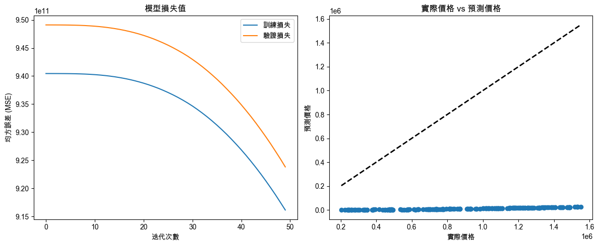

# 深度學習

_房價預測_

<br>

## 準備工作

1. 安裝必要套件。

    ```bash
    pip install pandas
    ```

<br>

2. 若在可視化時要使用中文，可先確認系統中有哪些可用的中文字體，使用以下代碼列出所有可用的字體，然後選擇一個支持中文的字體名稱進行設置。

    ```python
    import matplotlib.font_manager as fm

    # 列出所有可用字體
    for font in fm.findSystemFonts(fontpaths=None, fontext='ttf'):
        print(fm.FontProperties(fname=font).get_name())
    ```

<br>

3. 若修正顯示錯誤後，可嘗試刪除 Matplotlib 的字體緩存並重新運行程序。

    ```python
    import matplotlib as mpl
    mpl.font_manager._rebuild()
    # 然後重新運行您的代碼
    ```

<br>

4. 依據查詢結果，這裡嘗試使用。

    ```python
    # 使用支持中文的字體
    plt.rcParams['font.sans-serif'] = ['Arial Unicode MS']
    # 用來正常顯示負號
    plt.rcParams['axes.unicode_minus'] = False
    ```

<br>

## 範例與說明

1. 這個範例使用神經網絡訓練模型，該模型能夠根據輸入的特徵如房屋面積、房間數量、地點等來預測房屋的價格。

<br>

2. 範例使用深度學習框架 Keras 來實現，並使用 Matplotlib 庫進行結果的可視化。

    ```python
    import numpy as np
    import pandas as pd
    from sklearn.model_selection import train_test_split
    from sklearn.preprocessing import StandardScaler
    from tensorflow.keras.models import Sequential
    from tensorflow.keras.layers import Dense
    import matplotlib.pyplot as plt

    # 使用支持中文的字體
    plt.rcParams['font.sans-serif'] = ['Arial Unicode MS']
    # 用來正常顯示負號
    plt.rcParams['axes.unicode_minus'] = False

    # 生成假數據（房屋面積、房間數量和價格）
    np.random.seed(42)
    # 房屋面積（平方英尺）
    house_size = np.random.randint(500, 5000, 1000)
    # 房間數量
    num_rooms = np.random.randint(1, 10, 1000)
    # 房價
    price = house_size * 300 + num_rooms * 10000 + np.random.randint(
        -10000, 10000, 1000
    )

    # 數據整理為 DataFrame 格式
    df = pd.DataFrame({
        'HouseSize': house_size,
        'NumRooms': num_rooms,
        'Price': price
    })

    # 將特徵（X）和目標變數（y）分開
    X = df[['HouseSize', 'NumRooms']]
    y = df['Price']

    # 將數據分為訓練集和測試集
    X_train, X_test, y_train, y_test = train_test_split(
        X, y,
        test_size=0.2,
        random_state=42
    )

    # 特徵標準化
    scaler = StandardScaler()
    X_train_scaled = scaler.fit_transform(X_train)
    X_test_scaled = scaler.transform(X_test)

    # 構建神經網絡模型
    model = Sequential()
    # 第一個隱藏層
    model.add(Dense(64, input_dim=2, activation='relu'))
    # 第二個隱藏層
    model.add(Dense(32, activation='relu'))
    # 輸出層
    model.add(Dense(1, activation='linear'))

    # 編譯模型
    model.compile(
        optimizer='adam', loss='mean_squared_error'
    )

    # 訓練模型
    history = model.fit(
        X_train_scaled, y_train,
        epochs=50, batch_size=32,
        validation_data=(X_test_scaled, y_test)
    )

    # 預測測試集中的房價
    y_pred = model.predict(X_test_scaled)

    # 可視化模型的訓練過程
    plt.figure(figsize=(12, 5))

    # 損失值（Loss）可視化
    plt.subplot(1, 2, 1)
    plt.plot(
        history.history['loss'], label='訓練損失'
    )
    plt.plot(
        history.history['val_loss'], label='驗證損失'
    )
    plt.title('模型損失值')
    plt.xlabel('迭代次數')
    plt.ylabel('均方誤差 (MSE)')
    plt.legend()

    # 實際價格與預測價格對比圖
    plt.subplot(1, 2, 2)
    plt.scatter(y_test, y_pred)
    plt.title('實際價格 vs 預測價格')
    plt.xlabel('實際價格')
    plt.ylabel('預測價格')
    plt.plot(
        [y_test.min(), y_test.max()],
        [y_test.min(), y_test.max()],
        'k--', lw=2
    )

    plt.tight_layout()
    plt.show()

    # 評估模型性能
    mse = model.evaluate(X_test_scaled, y_test)
    print(f'測試集上的均方誤差（MSE）：{mse:.2f}')
    ```

    

<br>

3. 以上範例先是生成了模擬數據，包含房屋面積、房間數量以及房價，使用 `pandas` 將數據整理為 `DataFrame` 格式，並將特徵和目標變數分開。

<br>

4. 接著使用 `train_test_split` 將數據集分為訓練集和測試集，這樣可以在模型訓練後評估其性能。

<br>

5. 使用 `StandardScaler` 進行特徵標準化，這在深度學習中是常見的預處理步驟，有助於加快模型收斂速度。

<br>

6. 使用 Keras 的 `Sequential` 模型構建一個簡單的多層感知器（MLP）神經網絡，在這個範例中定義兩個隱藏層和一個線性輸出的輸出層，模型設置的損失函數為均方誤差（MSE），優化器為 Adam。

<br>

___

_END_
