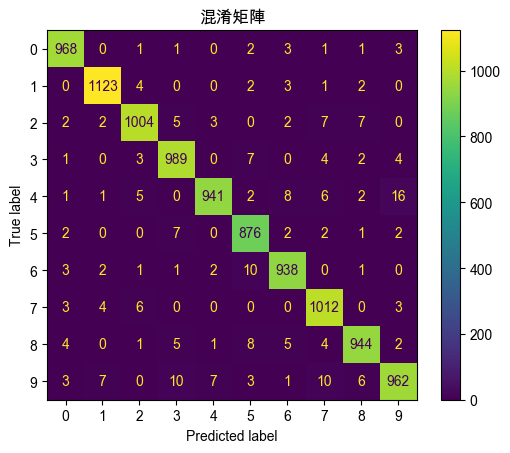

# ANN（Artificial Neural Network, 人工神經網絡）

## 說明

1. 深度學習的基本架構，模仿生物神經元的運作方式，用於識別數據中的模式和進行預測。

2. ANN 由 `輸入層、隱藏層和輸出層` 組成，每一層中的神經元與下一層的神經元相連接，這些連接具有權重，通過訓練數據來調整這些權重，以最小化預測錯誤。

## 範例程式碼

1. 以下範例使用 Keras 庫來建立人工神經網絡，用於對二分類數據集如二元邏輯操作進行分類。

```python
import numpy as np
import matplotlib.pyplot as plt
from tensorflow.keras.models import Sequential
from tensorflow.keras.layers import Dense
from sklearn.model_selection import train_test_split
from sklearn.metrics import (
    confusion_matrix, ConfusionMatrixDisplay
)

# 生成二元邏輯操作 XOR 的假數據
# 輸入數據
X = np.array([[0, 0], [0, 1], [1, 0], [1, 1]])
# XOR 操作的輸出
y = np.array([[0], [1], [1], [0]])

# 將數據分為訓練集和測試集
X_train, X_test, y_train, y_test = train_test_split(
    X, y, test_size=0.5, random_state=42
)

# 建立 ANN 模型
model = Sequential()
# 第一個隱藏層，4個神經元，ReLU 激活函數
model.add(Dense(4, input_dim=2, activation='relu'))
# 輸出層，1個神經元，Sigmoid 激活函數
model.add(Dense(1, activation='sigmoid'))

# 編譯模型
model.compile(
    loss='binary_crossentropy',
    optimizer='adam',
    metrics=['accuracy']
)

# 訓練模型
history = model.fit(
    X_train, y_train,
    epochs=100,
    batch_size=1,
    verbose=1,
    validation_data=(X_test, y_test)
)

# 預測測試集
y_pred = model.predict(X_test)
# 將預測結果轉為二元格式
y_pred_binary = (y_pred > 0.5).astype(int)

# 可視化訓練過程中的準確率和損失
plt.figure(figsize=(12, 5))

# 準確率（Accuracy）可視化
plt.subplot(1, 2, 1)
plt.plot(history.history['accuracy'], label='訓練準確率')
plt.plot(history.history['val_accuracy'], label='驗證準確率')
plt.title('模型準確率')
plt.xlabel('迭代次數')
plt.ylabel('準確率')
plt.legend()

# 損失值（Loss）可視化
plt.subplot(1, 2, 2)
plt.plot(history.history['loss'], label='訓練損失')
plt.plot(history.history['val_loss'], label='驗證損失')
plt.title('模型損失值')
plt.xlabel('迭代次數')
plt.ylabel('損失值')
plt.legend()

plt.tight_layout()
plt.show()

# 混淆矩陣可視化
cm = confusion_matrix(y_test, y_pred_binary)
disp = ConfusionMatrixDisplay(confusion_matrix=cm)
disp.plot()
plt.title('混淆矩陣')
plt.show()

# 評估模型性能
test_loss, test_acc = model.evaluate(X_test, y_test)
print(f'測試集上的準確率：{test_acc:.2f}')
```

2. 模型準確率和損失值變化，X軸表示迭代次數，也就是訓練的回合數 `Epoch`，Y軸表示準確率；藍色線條表示訓練集的準確率，橙色線條表示驗證集的準確率；以結果來說，訓練集的準確率在第一個 epoch 後迅速達到 1.0，這表明模型在訓練集上表現完美，另外驗證集的準確率保持在 0.5，表明模型在驗證集上未能正確學習或存在過擬合（overfitting）現象，這是因為訓練數據和驗證數據的分佈可能不同或模型複雜度不足。


3. 混淆矩陣。



### 代碼說明與註解：

1. 數據生成與分割：
   - 生成 XOR 操作的假數據，用於二分類問題。輸入數據為二進制組合，輸出為 XOR 結果。
   - 使用 `train_test_split` 將數據集分為訓練集和測試集。

2. 建立 ANN 模型：
   - 使用 Keras 的 `Sequential` 模型構建簡單的人工神經網絡。
   - 添加一個隱藏層，包含 4 個神經元，使用 ReLU 激活函數。
   - 輸出層使用 Sigmoid 激活函數，適用於二分類問題。

3. 模型編譯與訓練：
   - 編譯模型時使用 `adam` 優化器和 `binary_crossentropy` 損失函數。
   - 訓練模型並保存訓練過程中的準確率和損失值。

4. 結果可視化：
   - 使用 Matplotlib 繪製訓練過程中的準確率和損失值變化圖，直觀了解模型的收斂情況。
   - 使用混淆矩陣可視化模型預測的效果，觀察模型的分類準確性。

5. 模型評估：
   - 使用測試集評估模型性能，並輸出準確率作為評估指標。

### 總結

這個範例展示了如何使用人工神經網絡（ANN）進行二分類問題的處理，並重點在於結果的可視化，幫助理解模型在不同迭代過程中的性能變化。人工神經網絡是深度學習的基礎結構，適用於多種數據類型和問題類型，包括回歸、分類和多類別分類等。