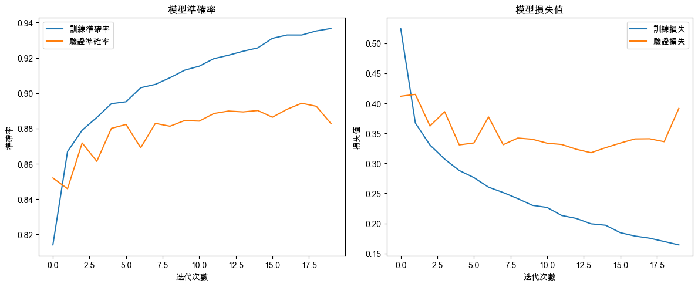
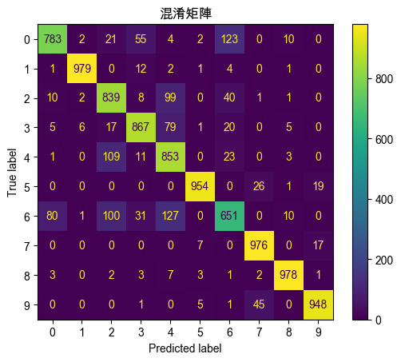

#  DNN

_Deep Neural Network, 深度神經網絡_

<br>

## 說明

1. 以下範例使用 Fashion-MNIST 數據集來訓練一個 DNN 模型，進行服飾圖片的分類任務。

    ```python
    import numpy as np
    import matplotlib.pyplot as plt
    from tensorflow.keras.models import Sequential
    from tensorflow.keras.layers import Dense, Flatten
    from tensorflow.keras.utils import to_categorical
    from tensorflow.keras.datasets import fashion_mnist
    from sklearn.metrics import (
        confusion_matrix, ConfusionMatrixDisplay
    )

    # 設定支持中文的字體，避免顯示錯誤
    plt.rcParams['font.sans-serif'] = ['Arial Unicode MS']
    # 用來正常顯示負號
    plt.rcParams['axes.unicode_minus'] = False

    # 加載 Fashion-MNIST 數據集
    (X_train, y_train), (X_test, y_test) = fashion_mnist.load_data()

    # 將影像數據轉換為浮點數並進行歸一化，縮放到 0-1 範圍
    X_train = X_train.astype('float32') / 255
    X_test = X_test.astype('float32') / 255

    # 將類別標籤進行 One-hot 編碼，轉換為二進位矩陣
    y_train = to_categorical(y_train, 10)
    y_test = to_categorical(y_test, 10)

    # 建立 DNN 模型
    model = Sequential()

    # 展平層，將 2D 影像數據展平為 1D 向量
    model.add(Flatten(input_shape=(28, 28)))

    # 第一個隱藏層，256 個神經元，ReLU 激活函數
    model.add(Dense(256, activation='relu'))

    # 第二個隱藏層，128 個神經元，ReLU 激活函數
    model.add(Dense(128, activation='relu'))

    # 第三個隱藏層，64 個神經元，ReLU 激活函數
    model.add(Dense(64, activation='relu'))

    # 輸出層，10 個神經元，Softmax 激活函數，對應 10 個類別
    model.add(Dense(10, activation='softmax'))

    # 編譯模型，使用 Adam 優化器和類別交叉熵損失函數
    model.compile(
        loss='categorical_crossentropy', 
        optimizer='adam', 
        metrics=['accuracy']
    )

    # 訓練模型，進行 20 次迭代（epochs），每批處理 128 個樣本
    history = model.fit(
        X_train, y_train, 
        epochs=20, 
        batch_size=128, 
        verbose=1, 
        validation_data=(X_test, y_test)
    )

    # 使用測試集進行預測
    y_pred = model.predict(X_test)

    # 將預測結果轉為類別索引
    y_pred_classes = np.argmax(y_pred, axis=1)
    # 將真實標籤轉為類別索引
    y_true = np.argmax(y_test, axis=1)

    # 建立圖形框架，設定大小
    plt.figure(figsize=(12, 5))

    # 可視化準確率（Accuracy）
    plt.subplot(1, 2, 1)
    plt.plot(history.history['accuracy'], label='訓練準確率')
    plt.plot(history.history['val_accuracy'], label='驗證準確率')
    plt.title('模型準確率')
    plt.xlabel('迭代次數')
    plt.ylabel('準確率')
    plt.legend()

    # 可視化損失值（Loss）
    plt.subplot(1, 2, 2)
    plt.plot(history.history['loss'], label='訓練損失')
    plt.plot(history.history['val_loss'], label='驗證損失')
    plt.title('模型損失值')
    plt.xlabel('迭代次數')
    plt.ylabel('損失值')
    plt.legend()

    # 自動調整子圖參數，使圖像填充整個圖形區域
    plt.tight_layout()
    plt.show()

    # 生成混淆矩陣，並進行可視化
    cm = confusion_matrix(y_true, y_pred_classes)
    disp = ConfusionMatrixDisplay(confusion_matrix=cm)
    disp.plot()
    plt.title('混淆矩陣')
    plt.show()

    # 使用測試集評估模型性能，輸出準確率
    test_loss, test_acc = model.evaluate(X_test, y_test)
    print(f'測試集上的準確率：{test_acc:.2f}')
    ```

<br>

2. 結果。

    

<br>

3. 混淆矩陣。

    

<br>

___

_END_