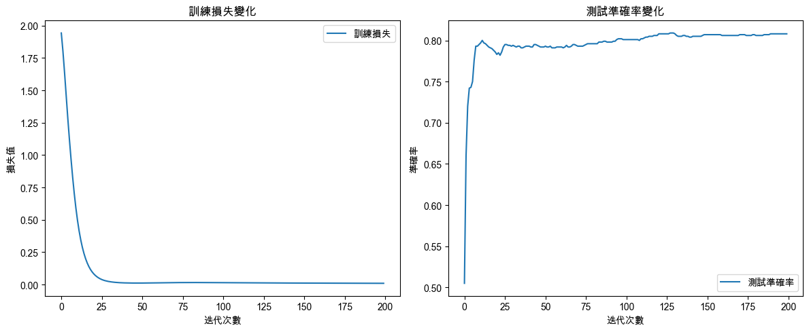
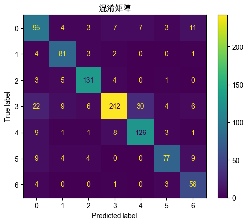

# GNN

_Graph Neural Network，圖神經網絡_ 

<br>

## 說明

1. 以下範例使用 Cora 引文網絡數據集訓練 GNN 模型並進行圖節點分類，數據集為科學論文之間的引文關係，其中包含 2708 篇科學論文（節點），這些論文之間有 5429 個引文關係（邊），並且每篇論文屬於七個類別之一，目標是預測每篇論文的類別。

<br>

2. 使用 `PyTorch Geometric` 庫構建簡單的 `GCN（Graph Convolutional Network）` 模型，這是一種常用的 `GNN` 變體，模型包含兩個 `卷積層`，第一層將節點特徵轉換為 16 維特徵向量，第二層輸出為數據集中的類別數量（7 類）。

<br>

3. 要實現 GNN 需要使用專門的深度學習庫，如 PyTorch Geometric（`torch_geometric`），這需要先安裝相關套件。

    ```bash
    pip install torch torchvision torchaudio torch_geometric
    ```

<br>

4. 編譯模型使用交叉熵損失函數，這適用於多分類問題，另外優化器使用 `Adam`。

<br>

# 範例

1. 程式碼。

    ```python
    import torch
    import torch.nn as nn
    import torch.optim as optim
    from torch_geometric.datasets import Planetoid
    from torch_geometric.nn import GCNConv
    import matplotlib.pyplot as plt
    from sklearn.metrics import (
        confusion_matrix, ConfusionMatrixDisplay
    )

    # 設定支持中文的字體，避免顯示錯誤
    plt.rcParams['font.sans-serif'] = ['Arial Unicode MS']
    # 用來正常顯示負號
    plt.rcParams['axes.unicode_minus'] = False

    # 加載 Cora 數據集
    dataset = Planetoid(root='/tmp/Cora', name='Cora')

    # 設定 GPU 或 CPU
    device = torch.device(
        'cuda' if torch.cuda.is_available() else 'cpu'
    )

    # 數據集
    data = dataset[0].to(device)

    # 定義 GCN 模型類別
    class GCN(nn.Module):
        def __init__(self):
            super(GCN, self).__init__()
            # 第一層 GCNConv，16 個輸出通道，ReLU 激活函數
            self.conv1 = GCNConv(
                dataset.num_node_features, 
                16
            )
            # 第二層 GCNConv，數據集類別數量個輸出通道（共 7 個類別）
            self.conv2 = GCNConv(
                16, 
                dataset.num_classes
            )

        def forward(self, data):
            # 取得數據中的 x 和邊
            x, edge_index = data.x, data.edge_index
            
            # 第一層卷積運算，並進行 ReLU 激活
            x = self.conv1(x, edge_index)
            x = torch.relu(x)
            
            # 第二層卷積運算
            x = self.conv2(x, edge_index)

            # 返回輸出結果
            return x

    # 初始化 GCN 模型
    model = GCN().to(device)

    # 使用 Adam 優化器
    optimizer = optim.Adam(
        model.parameters(), 
        lr=0.01, 
        weight_decay=5e-4
    )

    # 使用交叉熵損失函數
    criterion = nn.CrossEntropyLoss()

    # 訓練和驗證函數
    def train():
        # 設置模型為訓練模式
        model.train()
        # 清零梯度
        optimizer.zero_grad()
        # 前向傳播
        out = model(data)
        # 計算損失
        loss = criterion(
            out[data.train_mask], 
            data.y[data.train_mask]
        )
        # 反向傳播
        loss.backward()
        # 更新參數
        optimizer.step()
        return loss.item()

    def test():
        # 設置模型為評估模式
        model.eval()
        # 前向傳播
        out = model(data)
        # 取得預測結果
        pred = out.argmax(dim=1)
        # 計算正確預測數
        correct = (
            pred[data.test_mask] == data.y[data.test_mask]
        ).sum()
        # 計算準確率
        acc = int(correct) / int(data.test_mask.sum())
        return acc

    # 訓練模型
    train_losses = []
    test_accuracies = []

    # 進行 200 次迭代（epochs）
    for epoch in range(200):
        # 訓練模型
        loss = train()
        # 測試模型
        acc = test()
        # 保存訓練損失
        train_losses.append(loss)
        # 保存測試準確率
        test_accuracies.append(acc)

    # 可視化訓練過程中的損失和準確率變化
    plt.figure(figsize=(12, 5))

    # 可視化訓練損失
    plt.subplot(1, 2, 1)
    plt.plot(train_losses, label='訓練損失')
    plt.title('訓練損失變化')
    plt.xlabel('迭代次數')
    plt.ylabel('損失值')
    plt.legend()

    # 可視化測試準確率
    plt.subplot(1, 2, 2)
    plt.plot(test_accuracies, label='測試準確率')
    plt.title('測試準確率變化')
    plt.xlabel('迭代次數')
    plt.ylabel('準確率')
    plt.legend()

    # 自動調整子圖參數，使圖像填充整個圖形區域
    plt.tight_layout()
    plt.show()

    # 使用測試集進行預測並生成混淆矩陣
    # 設置模型為評估模式
    model.eval()
    # 前向傳播
    out = model(data)
    # 取得預測結果
    pred = out.argmax(dim=1)
    # 混淆矩陣
    cm = confusion_matrix(
        data.y[data.test_mask].cpu(),
        pred[data.test_mask].cpu()
    )

    # 混淆矩陣可視化
    disp = ConfusionMatrixDisplay(
        confusion_matrix=cm, 
        display_labels=dataset[0].y.unique().numpy()
    )
    disp.plot()
    plt.title('混淆矩陣')
    plt.show()

    # 輸出最終的測試集準確率
    final_acc = test()
    print(f'測試集上的準確率：{final_acc:.2f}')
    ```

<br>

2. 結果：測試集上的準確率 `0.81`。

    

<br>

3. 混淆矩陣。

    

<br>

___

_END_