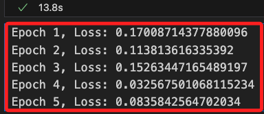
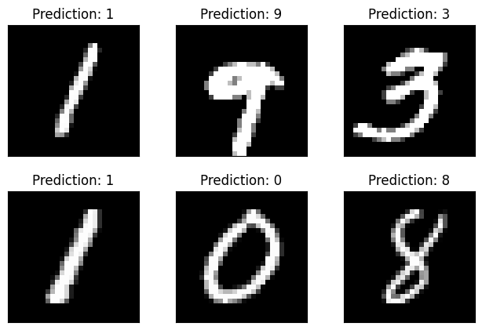

# SNN

_Spiking Neural Networks_

<br>

## 說明

1. SNN 是一種受大腦神經元啟發的神經網絡類型，它模擬了生物神經元的脈衝發放行為，這與傳統的人工神經網絡不同。

<br>

2. SNN 被認為具有更高的生物可解釋性和更低的能耗，適合於實時計算和低功耗設備。

<br>

## 操作步驟

1. SNN 需要專用框架，以下將使用 NEST 或 Brian2 等神經網絡模擬器，其中會使用 `Brian2` 進行基於 `Spiking Neural Networks` 的分類任務。以下是安裝 `brian2` 和 `torchvision` 等庫的指令。

<br>

2. 因版本相容性問題，先降級 `setuptools`。

    ```bash
    pip install setuptools==59.5.0
    ```

<br>

3. 安裝 Brian2 和其他依賴項，

    ```bash
    pip install --upgrade brian2 torchvision
    ```

<br>

## 範例

1. 以下範例實現一個 `脈衝神經網絡（Simple SNN）` 來處理 `MNIST 數據集`。

    ```python
    import numpy as np
    import matplotlib.pyplot as plt
    import torch
    from torch import nn
    from torch.utils.data import DataLoader
    from torchvision import datasets, transforms

    # 設定參數
    # 每批訓練數據的大小
    batch_size = 64
    # 學習率
    learning_rate = 1e-3
    # 訓練的回合數
    epochs = 5

    # 使用 PyTorch 下載和加載 MNIST 數據集
    train_data = datasets.MNIST(
        # 數據集儲存路徑
        root='data',
        # 加載訓練集
        train=True,
        # 將數據轉換為 Tensor 格式
        transform=transforms.ToTensor(),
        # 若數據集不存在，則下載
        download=True,
    )

    # 將數據集載入 DataLoader 中，方便訓練時批量處理
    train_loader = DataLoader(
        dataset=train_data,
        batch_size=batch_size,
        shuffle=True
    )

    # 定義簡單的脈衝神經網絡模型
    class SimpleSNN(nn.Module):
        def __init__(self):
            super(SimpleSNN, self).__init__()
            # 第一層，全連接層，將 28x28 的輸入映射到 512 維
            self.fc1 = nn.Linear(28 * 28, 512)
            # 第二層，全連接層，將 512 維映射到 10 維（對應 10 個數字類別）
            self.fc2 = nn.Linear(512, 10)
        
        def forward(self, x):
            # 展平輸入數據，將 2D 圖像展平為 1D 向量
            x = torch.flatten(x, 1)
            # 第一層激活函數使用 ReLU
            x = torch.relu(self.fc1(x))
            # 輸出層，未使用激活函數，因為後面會使用交叉熵損失函數
            x = self.fc2(x)
            return x

    # 初始化模型、損失函數和優化器
    # 初始化神經網絡模型
    model = SimpleSNN()
    # 使用交叉熵作為損失函數
    criterion = nn.CrossEntropyLoss()
    # 使用 Adam 優化器
    optimizer = torch.optim.Adam(
        model.parameters(), lr=learning_rate
    )

    # 訓練模型
    for epoch in range(epochs):
        for data, target in train_loader:
            # 清零優化器的梯度
            optimizer.zero_grad()
            # 前向傳播
            output = model(data)
            # 計算損失
            loss = criterion(output, target)
            # 反向傳播，計算梯度
            loss.backward()
            # 更新參數
            optimizer.step()
            # 打印每個 epoch 的損失
        print(f'Epoch {epoch+1}, Loss: {loss.item()}')

    # 可視化結果
    # 枚舉數據集中的批次
    examples = enumerate(train_loader)
    # 取一個批次的數據
    batch_idx, (example_data, example_targets) = next(examples)

    # 在不進行梯度計算的上下文中
    with torch.no_grad():
        # 前向傳播得到預測結果
        output = model(example_data)

    # 設置可視化圖形
    fig = plt.figure()
    # 顯示前 6 個圖像及其預測結果
    for i in range(6):
        # 在 2x3 網格中顯示圖像
        plt.subplot(2, 3, i + 1)
        # 自動調整子圖參數，使之填充整個圖形
        plt.tight_layout()
        # 顯示灰度圖像
        plt.imshow(
            example_data[i][0],
            cmap='gray',interpolation='none'
        )
        # 標題顯示預測的結果
        plt.title(
            f"Prediction: {output.data.max(1, keepdim=True)[1][i].item()}"
        )
        # 隱藏 x 軸刻度
        plt.xticks([])
        # 隱藏 y 軸刻度
        plt.yticks([])
    # 顯示圖形
    plt.show()
    ```

<br>

2. 結果。

    

<br>

3. 顯示如下。

    

<br>

__

_END_