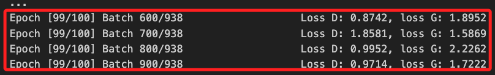
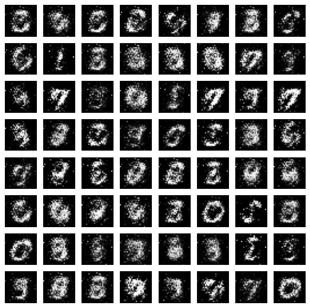

# GAN

_Generative Adversarial Network，GAN 是一種深度學習模型，用於生成逼真的數據；核心概念是通過一個 `生成器（Generator）` 和一個 `辨別器（Discriminator）` 之間的對抗性訓練，使生成器能夠建立難以區分於真實數據的假數據。_

<br>

## GAN 的應用領域

1. 圖像生成和風格轉換：生成逼真的圖像或將一種圖像風格轉換為另一種風格，如將素描轉換為油畫風格。

<br>

2. 圖像超分辨率：提高圖像的解析度，使低分辨率圖像變得清晰。

<br>

3. 文本到圖像合成：根據描述性的文本生成對應的圖像。

<br>

4. 數據增強：在醫學影像、語音數據等領域，用於生成更多樣本來增強數據集。

<br>

5. 虛擬石徑和遊戲開發：建立虛擬環境中逼真的物體或場景。

<br>

6. 音頻生成：生成音樂、語音等音頻數據，用於音樂創作和語音合成。

<br>

## 說明

1. 以下使用 `PyTorch` 和 `MNIST 資料集` 來實作訓練一個簡單的 GAN，並生成類似手寫數字的圖像。

<br>

2. 程式碼。

    ```python
    import numpy as np
    import matplotlib.pyplot as plt
    from brian2 import *
    from torchvision import datasets, transforms
    from torch.utils.data import DataLoader, Subset
    # 引入 PyTorch 庫
    import torch
    # 引入神經網絡模塊
    import torch.nn as nn
    # 引入優化器模塊
    import torch.optim as optim
    # 引入用於圖像保存的工具
    from torchvision.utils import save_image
    # 引入 os 模塊以操作文件系統
    import os

    # 檢查並建立目錄
    os.makedirs("images", exist_ok=True)

    # 設定支持中文的字體，避免顯示錯誤
    plt.rcParams['font.sans-serif'] = ['Arial Unicode MS']
    plt.rcParams['axes.unicode_minus'] = False

    # 設定仿真參數
    start_scope()

    tau = 10 * ms
    v_rest = -65 * mV
    v_reset = -65 * mV
    v_thresh = -50 * mV
    refractory_period = 5 * ms
    R = 1 * Mohm
    # 減少輸入脈衝的持續時間
    input_duration = 50 * ms
    # 每個赫茲轉換為多少納安培
    spike_to_current = 1 * nA

    # MNIST 數據集預處理
    transform = transforms.Compose([
        transforms.ToTensor(),
        transforms.Lambda(lambda x: x.view(-1))
    ])

    mnist_train = datasets.MNIST(root='./data', train=True, transform=transform, download=True)

    # 使用數據子集
    # 只使用前 1000 個樣本
    mnist_subset = Subset(mnist_train, range(1000))
    data_loader = DataLoader(
        mnist_subset, batch_size=1, shuffle=True
    )

    # 定義神經元模型的微分方程
    eqs = '''
    dv/dt = (v_rest - v) / tau + (R * I) / tau : volt (unless refractory)
    I : amp  # 電流作為外部輸入
    '''

    # 建立神經元組
    neuron_group = NeuronGroup(
        784, model=eqs, threshold='v > v_thresh', 
        reset='v = v_reset', 
        refractory=refractory_period, 
        method='exact'
    )

    # 設置初始膜電位
    neuron_group.v = v_rest

    # 建立監視器
    state_monitor = StateMonitor(neuron_group, 'v', record=True)
    spike_monitor = SpikeMonitor(neuron_group)

    # 訓練神經網絡
    for epoch in range(1):  # 訓練一個 epoch
        for i, (images, labels) in enumerate(data_loader):
            # 展平圖像，確保它是 784 維的向量
            images = images.view(-1).numpy()

            # 將圖像數據轉換為脈衝頻率
            # 假設最大像素值為 1，轉換為脈衝頻率
            spike_rates = images * 50 * Hz
            
            # 將脈衝頻率轉換為電流 (確保結果的單位是 amp)
            input_currents = spike_rates * spike_to_current / Hz
            
            # 設置外部電流
            neuron_group.I = input_currents
            
            # 運行 SNN 模擬
            run(input_duration)

            if i % 10 == 0:
                print(f'訓練樣本 {i}, 標籤: {labels.item()}')

            neuron_group.v = v_rest

        # 每個 epoch 保存一些生成的圖像
        save_image(
            fake_imgs.view(fake_imgs.size(0), 1, 28, 28),
            f"images/{epoch}.png",
            normalize=True,
        )

        print(f'Epoch {epoch+1} 完成')

    # 可視化結果
    plt.figure(figsize=(12, 6))

    plt.subplot(121)
    plt.title('神經元膜電位隨時間變化')
    plt.xlabel('時間 (ms)')
    plt.ylabel('膜電位 (mV)')
    for i in range(10):
        plt.plot(
            state_monitor.t/ms, 
            state_monitor.v[i]/mV, 
            label=f'神經元 {i+1}'
        )
    plt.legend()

    plt.subplot(122)
    plt.title('神經元脈衝發放')
    plt.xlabel('時間 (ms)')
    plt.ylabel('神經元索引')
    plt.plot(spike_monitor.t/ms, spike_monitor.i, 'ok')

    plt.tight_layout()
    plt.show()
    ```

<br>

2. 運行結果。

    

<br>

3. 圖形顯示。

    

<br>

## 代碼說明

1. 使用 `torchvision` 載入 MNIST 數據集並進行標準化處理，將圖像像素值標準化到 `[-1, 1]` 範圍內，這有助於訓練的穩定性。

<br>

2. 定義生成器（`Generator`）是將隨機生成的潛在向量轉換為假圖像的模型。

<br>

3. 定義辨別器（`Discriminator`）是區分真實圖像和生成的假圖像的模型。

<br>

4. 損失函數使用二元交叉熵損失函數來評估辨別器和生成器的性能。

<br>

5. 優化器使用 Adam 優化器來更新生成器和辨別器的權重。

<br>

6. 在訓練迭代中，首先更新辨別器，然後更新生成器。對於辨別器，計算辨別真實圖像和假圖像的損失，並進行梯度更新。對於生成器，生成假圖像並計算辨別器對假圖像的損失，目的是騙過辨別器，使其認為假圖像為真實。

<br>

___

_END_