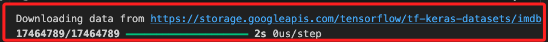
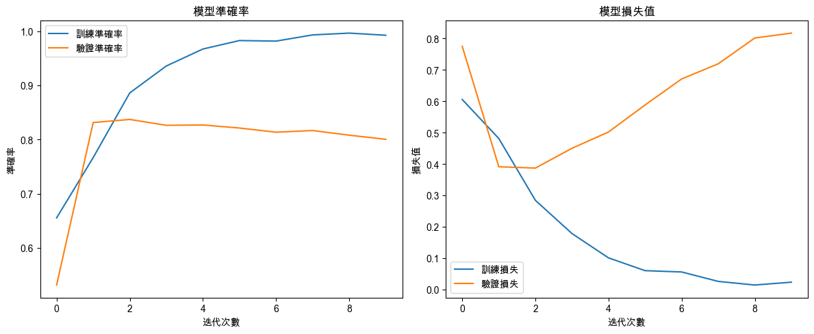
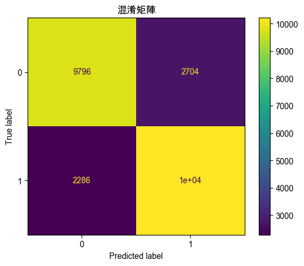

# RNN

_Recurrent Neural Network，循環神經網絡_

<br>

## 說明

1. 以下範例使用 IMDb 電影評論數據集訓練一個 `RNN 模型` 進行 `文本情感分類`，這是一個序列數據的分類任務。

<br>

2. IMDb 數據集包含 `50,000` 條標記為正面或負面的電影評論，這是一個常用的文本分類數據集。這個範例程式碼重點在於可視化訓練過程和模型性能。

    ```python
    import numpy as np
    import matplotlib.pyplot as plt
    from tensorflow.keras.models import Sequential
    from tensorflow.keras.layers import Embedding, SimpleRNN, Dense
    from tensorflow.keras.preprocessing.sequence import pad_sequences
    from tensorflow.keras.datasets import imdb
    from sklearn.metrics import (
        confusion_matrix, ConfusionMatrixDisplay
    )

    # 設定支持中文的字體，避免顯示錯誤
    plt.rcParams['font.sans-serif'] = ['Arial Unicode MS']
    # 用來正常顯示負號
    plt.rcParams['axes.unicode_minus'] = False

    # 設定隨機數種子
    np.random.seed(42)

    # 定義最大單詞數和最大評論長度
    # 最大單詞數量
    max_features = 10000
    # 每個評論的最大長度
    maxlen = 200

    # 加載 IMDb 數據集，僅保留最常見的 max_features 個單詞
    (X_train, y_train), (X_test, y_test) = imdb.load_data(
        num_words=max_features
    )

    # 將評論轉換為固定長度的序列，如果不足則填充，超過則截斷
    X_train = pad_sequences(X_train, maxlen=maxlen)
    X_test = pad_sequences(X_test, maxlen=maxlen)

    # 建立 RNN 模型
    model = Sequential()

    # 嵌入層，將單詞編碼轉換為密集向量表示
    model.add(
        Embedding(
            max_features,
            32,
            input_length=maxlen
        )
    )

    # 添加 SimpleRNN 層，使用 32 個單元
    model.add(SimpleRNN(32, activation='tanh'))

    # 輸出層，使用 Sigmoid 激活函數進行二元分類
    model.add(Dense(1, activation='sigmoid'))

    # 編譯模型，使用二元交叉熵損失函數和 Adam 優化器
    model.compile(
        optimizer='adam', 
        loss='binary_crossentropy', 
        metrics=['accuracy']
    )

    # 訓練模型，進行 10 次迭代（epochs），每批處理 64 個樣本
    history = model.fit(
        X_train, y_train, 
        epochs=10, batch_size=64, 
        validation_data=(X_test, y_test)
    )

    # 使用測試集進行預測
    y_pred = model.predict(X_test)

    # 將預測結果轉為二進位類別（0 或 1）
    y_pred_classes = (y_pred > 0.5).astype("int32")

    # 建立圖形框架，設定大小
    plt.figure(figsize=(12, 5))

    # 可視化準確率（Accuracy）
    plt.subplot(1, 2, 1)
    plt.plot(history.history['accuracy'], label='訓練準確率')
    plt.plot(history.history['val_accuracy'], label='驗證準確率')
    plt.title('模型準確率')
    plt.xlabel('迭代次數')
    plt.ylabel('準確率')
    plt.legend()

    # 可視化損失值（Loss）
    plt.subplot(1, 2, 2)
    plt.plot(history.history['loss'], label='訓練損失')
    plt.plot(history.history['val_loss'], label='驗證損失')
    plt.title('模型損失值')
    plt.xlabel('迭代次數')
    plt.ylabel('損失值')
    plt.legend()

    # 自動調整子圖參數，使圖像填充整個圖形區域
    plt.tight_layout()
    plt.show()

    # 生成混淆矩陣，並進行可視化
    cm = confusion_matrix(y_test, y_pred_classes)
    disp = ConfusionMatrixDisplay(confusion_matrix=cm)
    disp.plot()
    plt.title('混淆矩陣')
    plt.show()

    # 使用測試集評估模型性能，輸出準確率
    test_loss, test_acc = model.evaluate(X_test, y_test)
    print(f'測試集上的準確率：{test_acc:.2f}')
    ```

<br>

3. 運行後會先下載模型。

    

<br>

4. 接著會進行 10 Epoch 訓練，完成時顯示準確率及損失數據，accuracy：0.7990、loss：0.8243。

    

<br>

5. 混淆矩陣如下。

    

<br>

## 補充說明

1. 加載 IMDb 電影評論數據集時僅保留最常見的 `max_features` 個單詞，這樣可以減少稀有單詞對模型的影響，並使用 `pad_sequences` 將評論轉換為固定長度的序列，確保所有評論具有相同的長度（`maxlen`），這是 RNN 模型的要求。

<br>

2. 使用 Keras 的 `Sequential` 模型構建 RNN，先使用 `Embedding` 層將單詞編碼轉換為密集向量表示，再添加 `SimpleRNN` 層，這是基本的循環神經網絡層，用於捕捉文本中的時序信息，最後的輸出層使用 1 個神經元和 Sigmoid 激活函數，進行二元分類。

<br>

3. 編譯模型時使用 `binary_crossentropy` 損失函數，這是二元分類問題的標準損失函數，使用 `adam` 優化器來優化模型。

<br>

___

_END_