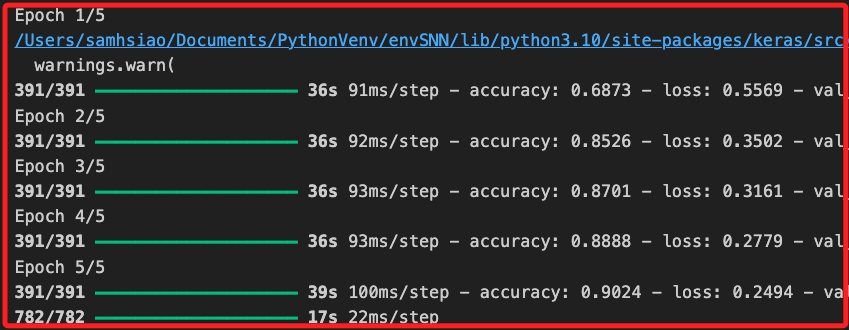
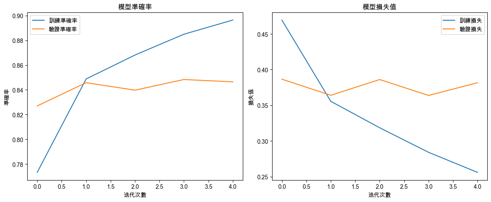
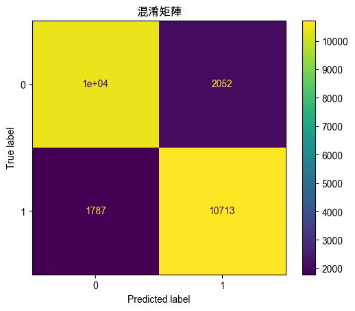

# LSTM

_Long Short-Term Memory，長短期記憶_

<br>

## 說明

1. `LSTM` 是 RNN 的一種特例，能夠學習 `長期依賴` 的問題，它通過引入門控機制，克服了標準 RNN 在處理長序列時容易出現的 `梯度消失` 和 `梯度爆炸` 問題，因此特別適合於處理和預測 `基於時間序列` 的數據。

<br>

2. LSTM 的架構包含三個 `閘門（Gate）`，分別是 `輸入門（Input Gate）`、`遺忘門（Forget Gate）`、`輸出門（Output Gate）`，這些門控通過選擇性地讓訊息進入或流出記憶單元，來控制每個時間步的記憶和忘記程度，這樣的結構使得 LSTM 能夠捕捉數據中的長期依賴關係。

<br>

3. 在具體的工作上，`遺忘閘` 會根據當前輸入和上一個隱藏狀態決定應該忘記多少過去的訊息；`輸入閘` 決定應該將多少當前輸入的訊息存入細胞狀態中；`輸出門` 決定當前輸出的隱藏狀態應該包含多少當前細胞狀態的訊息。

<br>

## 範例程式碼

1. 安裝套件。

    ```bash
    pip install tensorflow
    ```

<br>

2. 以下範例使用 `IMDB 影評數據集` 來訓練一個簡單的 LSTM 模型，用於 `情感分析`。

    ```python
    import numpy as np
    import matplotlib.pyplot as plt
    from tensorflow.keras.models import Sequential
    from tensorflow.keras.layers import (
        LSTM, Dense, Embedding, SpatialDropout1D
    )
    from tensorflow.keras.preprocessing.sequence import pad_sequences
    from tensorflow.keras.datasets import imdb
    from sklearn.metrics import (
        confusion_matrix, ConfusionMatrixDisplay
    )

    # 設定支持中文的字體，避免顯示錯誤
    plt.rcParams['font.sans-serif'] = ['Arial Unicode MS']
    plt.rcParams['axes.unicode_minus'] = False

    # 設定參數
    # 嵌入層最多使用的單詞數
    max_features = 5000
    # 序列的最大長度
    max_len = 100

    # 加載 IMDB 數據集
    (X_train, y_train), (X_test, y_test) = imdb.load_data(
        num_words=max_features
    )

    # 將序列填充到相同的長度
    X_train = pad_sequences(X_train, maxlen=max_len)
    X_test = pad_sequences(X_test, maxlen=max_len)

    # 建立 LSTM 模型
    model = Sequential()
    # 嵌入層
    model.add(
        Embedding(max_features, 128, input_length=max_len)
    )
    # 隨機丟棄層，用於防止過擬合
    model.add(SpatialDropout1D(0.2))
    # LSTM 層
    model.add(LSTM(100, dropout=0.2, recurrent_dropout=0.2))
    # 輸出層
    model.add(Dense(1, activation='sigmoid'))

    # 編譯模型
    model.compile(
        loss='binary_crossentropy',
        optimizer='adam', 
        metrics=['accuracy']
    )

    # 訓練模型
    history = model.fit(
        X_train, y_train, 
        epochs=5, 
        batch_size=64, 
        verbose=1, 
        validation_data=(X_test, y_test)
    )

    # 預測測試集
    y_pred = (model.predict(X_test) > 0.5).astype("int32").flatten()

    # 可視化訓練過程中的準確率和損失
    plt.figure(figsize=(12, 5))

    # 準確率（Accuracy）可視化
    plt.subplot(1, 2, 1)
    plt.plot(
        history.history['accuracy'], label='訓練準確率'
    )
    plt.plot(
        history.history['val_accuracy'], label='驗證準確率'
    )
    plt.title('模型準確率')
    plt.xlabel('迭代次數')
    plt.ylabel('準確率')
    plt.legend()

    # 損失值（Loss）可視化
    plt.subplot(1, 2, 2)
    plt.plot(
        history.history['loss'], label='訓練損失'
    )
    plt.plot(
        history.history['val_loss'], label='驗證損失'
    )
    plt.title('模型損失值')
    plt.xlabel('迭代次數')
    plt.ylabel('損失值')
    plt.legend()

    plt.tight_layout()
    plt.show()

    # 混淆矩陣可視化
    cm = confusion_matrix(y_test, y_pred)
    disp = ConfusionMatrixDisplay(confusion_matrix=cm)
    disp.plot()
    plt.title('混淆矩陣')
    plt.show()

    # 評估模型性能
    test_loss, test_acc = model.evaluate(X_test, y_test)
    print(f'測試集上的準確率：{test_acc:.2f}')
    ```

<br>

3. 訓練過程。

    

<br>

4. 輸出訓練結果，隨著訓練迭代次數（Epochs）的增加，訓練集的準確率逐漸提高，最終達到了接近 90% 的準確率；驗證集的準確率在初始階段有提高，但隨後達到了穩定狀態，大約保持在 84% 左右。

    

<br>

5. 輸出混淆矩陣上，TP 為 10,713、TN 為10,000+，accuracy 為 0.8429，整體表現表明模型在訓練數據上的擬合良好，但在驗證數據上性能稍差，可能存在輕微的過擬合現象。

    

<br>

## 運作說明

1. 首先會進行數據預處理，將 IMDB 影評數據集中的文本數據轉換為整數序列，這些整數對應於數據集中單詞的索引，然後使用 `pad_sequences` 函數將每個序列填充到相同的長度，確保模型能夠批量處理數據。

<br>

2. 在 LSTM 模型架構部分，第一個嵌入層（Embedding Layer）會將每個單詞的索引轉換為固定大小的向量，這些向量在模型訓練過程中進行學習；接著在空間丟棄層（SpatialDropout1D）會隨機丟棄一些嵌入層的輸出，有助於防止過擬合；然後在 LSTM 層中具有 100 個單元的 LSTM 層，具備 dropout 和 recurrent_dropout 功能，進一步防止過擬合；最終在輸出層有單個神經元，使用 `sigmoid` 激活函數，輸出在 [0,1] 之間的概率，用於二分類。

<br>

___

_END_
