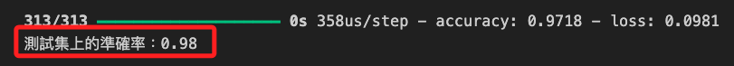

# ANN

_Artificial Neural Network，人工神經網絡_

<br>

## 說明

1. 深度學習的基本架構，模仿生物神經元的運作方式，用於識別數據中的模式和進行預測。

<br>

2. ANN 由 `輸入層`、`隱藏層`、`輸出層` 組成，每一層中的神經元與下一層的神經元相連接，這些連接具有 `權重`，通過訓練數據來調整這些權重，以最小化預測錯誤。

<br>

## 範例程式碼

1. 這個範例使用 MNIST 數據集來訓練一個簡單的 ANN 模型。

   ```python
   import numpy as np
   import matplotlib.pyplot as plt
   from tensorflow.keras.models import Sequential
   from tensorflow.keras.layers import Dense, Flatten
   from tensorflow.keras.utils import to_categorical
   from tensorflow.keras.datasets import mnist
   from sklearn.metrics import (
      confusion_matrix, ConfusionMatrixDisplay
   )

   # 使用支持中文的字體
   plt.rcParams['font.sans-serif'] = ['Arial Unicode MS']
   # 用來正常顯示負號
   plt.rcParams['axes.unicode_minus'] = False

   # 加載 MNIST 數據集
   (X_train, y_train), (X_test, y_test) = mnist.load_data()

   # 數據預處理：將影像數據轉換為浮點數並歸一化
   X_train = X_train.astype('float32') / 255
   X_test = X_test.astype('float32') / 255

   # 將類別標籤進行 One-hot 編碼
   y_train = to_categorical(y_train, 10)
   y_test = to_categorical(y_test, 10)

   # 建立 ANN 模型
   model = Sequential()
   # 展平層，用於將 2D 影像展平為 1D 向量
   model.add(Flatten(input_shape=(28, 28)))
   # 第一個隱藏層，128 個神經元，ReLU 激活函數
   model.add(Dense(128, activation='relu'))
   # 第二個隱藏層，64 個神經元，ReLU 激活函數
   model.add(Dense(64, activation='relu'))
   # 輸出層，10 個神經元，Softmax 激活函數
   model.add(Dense(10, activation='softmax'))

   # 編譯模型
   model.compile(
      loss='categorical_crossentropy',
      optimizer='adam', metrics=['accuracy']
   )

   # 訓練模型
   history = model.fit(
      X_train, y_train, 
      epochs=10, 
      batch_size=128, 
      verbose=1, 
      validation_data=(X_test, y_test)
   )

   # 預測測試集
   y_pred = model.predict(X_test)
   # 將預測結果轉為類別
   y_pred_classes = np.argmax(y_pred, axis=1)
   # 將真實標籤轉為類別
   y_true = np.argmax(y_test, axis=1)

   # 可視化訓練過程中的準確率和損失
   plt.figure(figsize=(12, 5))

   # 準確率（Accuracy）可視化
   plt.subplot(1, 2, 1)
   plt.plot(history.history['accuracy'], label='訓練準確率')
   plt.plot(history.history['val_accuracy'], label='驗證準確率')
   plt.title('模型準確率')
   plt.xlabel('迭代次數')
   plt.ylabel('準確率')
   plt.legend()

   # 損失值（Loss）可視化
   plt.subplot(1, 2, 2)
   plt.plot(history.history['loss'], label='訓練損失')
   plt.plot(history.history['val_loss'], label='驗證損失')
   plt.title('模型損失值')
   plt.xlabel('迭代次數')
   plt.ylabel('損失值')
   plt.legend()

   plt.tight_layout()
   plt.show()

   # 混淆矩陣可視化
   cm = confusion_matrix(y_true, y_pred_classes)
   disp = ConfusionMatrixDisplay(confusion_matrix=cm)
   disp.plot()
   plt.title('混淆矩陣')
   plt.show()

   # 評估模型性能
   test_loss, test_acc = model.evaluate(X_test, y_test)
   print(f'測試集上的準確率：{test_acc:.2f}')
   ```

<br>

2. 模型準確率和損失值變化，X軸表示迭代次數，也就是訓練的回合數 `Epoch`，Y軸表示準確率；藍色線條表示訓練集的準確率，橙色線條表示驗證集的準確率。

   

<br>

3. 混淆矩陣。

   

<br>

4. 結果。

   

<br>

___

_END_
