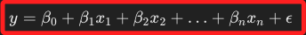
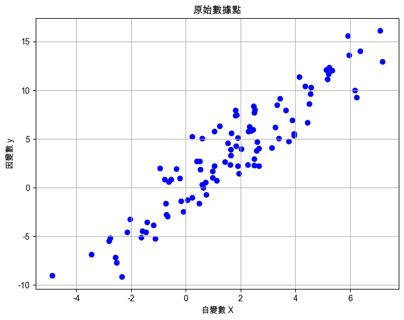
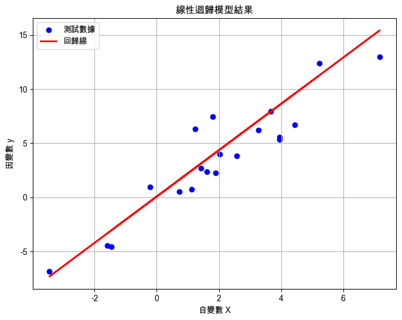
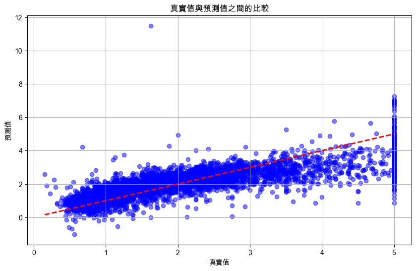
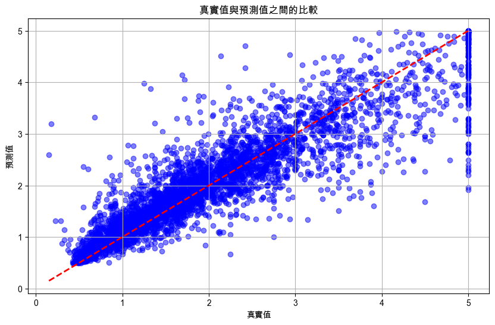
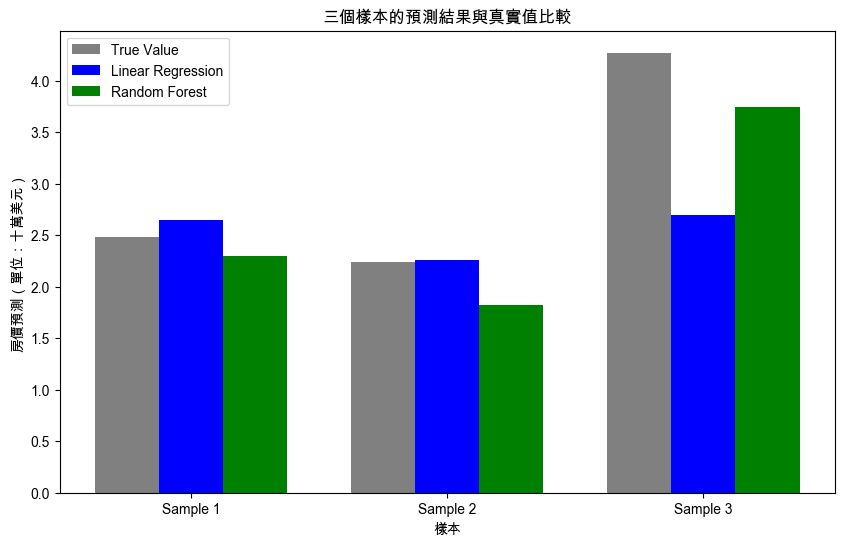

# 線性迴歸

_Linear Regression，是機器學習中的監督學習算法，可用於建立輸入特徵與目標變數之間的線性關係，算法的目標是通過找到最佳擬合線後，將預測值與真實值之間的誤差縮到最小；以下用加州房價資料集作為內容，並以迴歸分析進行預測，然後對比隨機森林在相同數據集上的表現。_

<br>

## 說明

1. 在數學上，線性迴歸的模型可以表示如下。

    

<br>

2. 相關變數定義如下。

    

<br>

## 範例

1. 以下使用 `scikit-learn` 庫來實現線性迴歸。

    ```python
    # 引入所需的庫
    import numpy as np
    import matplotlib.pyplot as plt
    from sklearn.model_selection import train_test_split
    from sklearn.linear_model import LinearRegression
    from sklearn.metrics import mean_squared_error, r2_score

    # 生成一些範例數據
    # 設定隨機種子，使結果可重現
    np.random.seed(0)
    # 生成 100 個隨機點
    # 特徵 (自變數)
    X = 2.5 * np.random.randn(100) + 1.5
    # 目標變數 (因變數)
    y = 2 * X + np.random.randn(100) * 2

    # 可視化原始數據
    plt.figure(figsize=(8, 6))
    plt.scatter(X, y, color='blue')
    plt.title('原始數據點')
    plt.xlabel('自變數 X')
    plt.ylabel('因變數 y')
    plt.grid(True)
    plt.show()

    # 將數據轉換為正確的形狀
    # 將 X 轉換為二維數組
    X = X.reshape(-1, 1)

    # 分割數據集為訓練集和測試集
    X_train, X_test, y_train, y_test = train_test_split(
        X, y, test_size=0.2, random_state=0
    )

    # 初始化線性迴歸模型
    model = LinearRegression()

    # 訓練模型
    model.fit(X_train, y_train)

    # 使用模型進行預測
    y_pred = model.predict(X_test)

    # 計算模型的性能指標
    # 均方誤差
    mse = mean_squared_error(y_test, y_pred)
    # 決定係數 (R^2)
    r2 = r2_score(y_test, y_pred)

    print(f"均方誤差（MSE）: {mse:.2f}")
    print(f"決定係數（R^2 Score）: {r2:.2f}")

    # 可視化迴歸線和測試數據
    plt.figure(figsize=(8, 6))
    plt.scatter(
        X_test, y_test, color='blue', label='測試數據'
    )
    plt.plot(
        X_test, y_pred, color='red', linewidth=2, label='迴歸線'
    )
    plt.title('線性迴歸模型結果')
    plt.xlabel('自變數 X')
    plt.ylabel('因變數 y')
    plt.legend()
    plt.grid(True)
    plt.show()
    ```

<br>

2. 原始數據的分佈。

    

<br>

3. 分析結果，其中均方誤差（MSE）3.92，這數值越小越好，表示模型預測值與實際值之間的誤差越小；決定係數（R^2 Score）0.84，這數值越接近 1 越好，表示模型對數據的解釋能力越強。

    

<br>

## 進階範例

_使用加州房價數據集（California Housing Dataset）進行迴歸分析，這個數據集該包含了影響房價的多種特徵，例如房間數、人口數、收入等；特別注意，過往常用的 `Boston Housing Dataset` 已被標記為非倫理數據集，因為它包含了不適當的社會經濟屬性，故建議使用較為現代的加州房價數據集。_

<br>

1. 使用`scikit-learn` 庫中的加州房價數據集來演示線性迴歸的應用。

    ```python
    # 引入所需的庫
    import numpy as np
    import matplotlib.pyplot as plt
    from sklearn.datasets import fetch_california_housing
    from sklearn.model_selection import train_test_split
    from sklearn.linear_model import LinearRegression
    from sklearn.metrics import mean_squared_error, r2_score

    # 設定支持中文的字體，避免顯示錯誤
    plt.rcParams['font.sans-serif'] = ['Arial Unicode MS']
    # 用來正常顯示負號
    plt.rcParams['axes.unicode_minus'] = False

    # 加載加州房價數據集
    data = fetch_california_housing()
    X = data.data
    y = data.target

    # 查看數據集描述
    print(data.DESCR)

    # 分割數據集為訓練集和測試集，80% 訓練，20% 測試
    X_train, X_test, y_train, y_test = train_test_split(
        X, y, 
        test_size=0.2, 
        random_state=42
    )

    # 初始化線性迴歸模型
    model = LinearRegression()

    # 訓練模型
    model.fit(X_train, y_train)

    # 使用模型進行預測
    y_pred = model.predict(X_test)

    # 計算模型的性能指標
    # 均方誤差
    mse = mean_squared_error(y_test, y_pred)
    # 決定係數 (R^2)
    r2 = r2_score(y_test, y_pred)

    print(f"均方誤差（MSE）: {mse:.2f}")
    print(f"決定係數（R^2 Score）: {r2:.2f}")

    # 可視化部分真實值與預測值的比較
    plt.figure(figsize=(10, 6))
    plt.scatter(
        y_test, y_pred, 
        color='blue', 
        alpha=0.5
    )
    plt.plot(
        [min(y_test), max(y_test)], 
        [min(y_test), max(y_test)], 
        'r--', linewidth=2
    )
    plt.xlabel('真實值')
    plt.ylabel('預測值')
    plt.title('真實值與預測值之間的比較')
    plt.grid(True)
    plt.show()
    ```

<br>

2. 省略文字輸出，以下是圖形輸出部分；其中藍色點代表模型的預測值對比真實值，紅色虛線表示理想的預測情況（預測值等於真實值），如果大部分的藍色點都接近紅色虛線，則表示模型的預測效果較好。

    

<br>

3. 嘗試從測試集中提取一筆指定的資料進行推論。

    ```python
    # 單筆數據進行推論
    # 假設我們從 X_test 中取一筆數據進行測
    # # 提取第一筆測試數據並調整形狀試
    single_data = X_test[10].reshape(1, -1)
    # 使用訓練好的模型進行預測
    single_pred = model.predict(single_data)

    print(f"對於單筆數據的預測值: {single_pred[0]:.2f}")
    print(f"對於單筆數據的真實值: {y_test[0]:.2f}")
    ```

<br>

4. 輸出結果如下，可以看出模型對這一筆數據的預測值（0.94）和真實值（0.48）之間存在較大的差距；可以使用更多的特徵工程或其他非線性模型（如決策樹、隨機森林等）來提高預測精度，這將在後續講義中繼續拓展優化。

    ```bash
    對於單筆數據的預測值: 0.94
    對於單筆數據的真實值: 0.48
    ```

<br>

## 使用隨機森林

1. 要實現更精確的預測，可使用更複雜的模型，以下將以隨機森林進行訓練，因為它可以更好地處理非線性關係，並且通常在大多數迴歸任務中表現良好。

    ```python
    # 引入所需的庫
    import numpy as np
    import matplotlib.pyplot as plt
    from sklearn.datasets import fetch_california_housing
    from sklearn.model_selection import train_test_split
    from sklearn.ensemble import RandomForestRegressor
    from sklearn.preprocessing import StandardScaler
    from sklearn.metrics import mean_squared_error, r2_score

    # 設定支持中文的字體，避免顯示錯誤
    plt.rcParams['font.sans-serif'] = ['Arial Unicode MS']
    plt.rcParams['axes.unicode_minus'] = False

    # 加載加州房價數據集
    data = fetch_california_housing()
    X = data.data
    y = data.target

    # 查看數據集描述
    print(data.DESCR)

    # 對數據進行標準化
    scaler = StandardScaler()
    X_scaled = scaler.fit_transform(X)

    # 分割數據集為訓練集和測試集，80% 訓練，20% 測試
    X_train, X_test, y_train, y_test = train_test_split(
        X_scaled, y, 
        test_size=0.2, 
        random_state=42
    )

    # 初始化隨機森林回歸模型
    model = RandomForestRegressor(
        n_estimators=100, random_state=42
    )

    # 訓練模型
    model.fit(X_train, y_train)

    # 使用模型進行預測
    y_pred = model.predict(X_test)

    # 計算模型的性能指標
    # 均方誤差
    mse = mean_squared_error(y_test, y_pred)
    # 決定係數 (R^2)
    r2 = r2_score(y_test, y_pred)

    print(f"均方誤差（MSE）: {mse:.2f}")
    print(f"決定係數（R^2 Score）: {r2:.2f}")

    # 可視化部分真實值與預測值的比較
    plt.figure(figsize=(10, 6))
    plt.scatter(
        y_test, y_pred, 
        color='blue', 
        alpha=0.5
    )
    plt.plot(
        [min(y_test), max(y_test)], 
        [min(y_test), max(y_test)], 
        'r--', linewidth=2
    )
    plt.xlabel('真實值')
    plt.ylabel('預測值')
    plt.title('真實值與預測值之間的比較')
    plt.grid(True)
    plt.show()
    ```

<br>

2. 模型計算結果的 `均方誤差（MSE）` 為 `0.26`，`決定係數（R^2 Score）` 為 `0.80`。

    

<br>

## 模型比較

1. 從資料集中隨機選取三個樣本，並分別使用線性回歸和隨機森林模型進行預測，然後與真實值進行比較；隨機部分使用 `np.random.choice` 決定索引，但特別注意，這樣每次運行代碼都會得報不同的選擇結果。

    ```python
    # 引入所需的庫
    import numpy as np
    import matplotlib.pyplot as plt
    from sklearn.datasets import fetch_california_housing
    from sklearn.model_selection import train_test_split
    from sklearn.linear_model import LinearRegression
    from sklearn.ensemble import RandomForestRegressor
    from sklearn.preprocessing import StandardScaler
    from sklearn.metrics import mean_squared_error, r2_score

    # 設定支持中文的字體，避免顯示錯誤
    plt.rcParams['font.sans-serif'] = ['Arial Unicode MS']
    plt.rcParams['axes.unicode_minus'] = False

    # 加載加州房價數據集
    data = fetch_california_housing()
    X = data.data
    y = data.target

    # 查看數據集描述
    print(data.DESCR)

    # 對數據進行標準化
    scaler = StandardScaler()
    X_scaled = scaler.fit_transform(X)

    # 分割數據集為訓練集和測試集，80% 訓練，20% 測試
    X_train, X_test, y_train, y_test = train_test_split(
        X_scaled, y, 
        test_size=0.2, 
        random_state=42
    )

    # 初始化線性迴歸模型
    linear_model = LinearRegression()
    # 訓練模型
    linear_model.fit(X_train, y_train)

    # 初始化隨機森林回歸模型
    rf_model = RandomForestRegressor(
        n_estimators=100, 
        random_state=42
    )
    # 訓練模型
    rf_model.fit(X_train, y_train)

    # 隨機選取三個測試樣本的索引
    random_indices = np.random.choice(
        X_test.shape[0], 3, replace=False
    )

    # 存儲每個樣本的真實值和預測結果
    results = []

    for idx in random_indices:
        # 提取測試樣本，重塑為2D數組
        single_test_sample = X_test[idx].reshape(1, -1)

        # 使用線性回歸模型進行預測
        linear_pred = linear_model.predict(single_test_sample)[0]

        # 使用隨機森林回歸模型進行預測
        rf_pred = rf_model.predict(single_test_sample)[0]

        # 真實值
        true_value = y_test[idx]

        # 存儲結果
        results.append((true_value, linear_pred, rf_pred))

    # 可視化比較三個樣本的預測結果與真實值
    labels = [f"Sample {i+1}" for i in range(3)]
    true_values = [res[0] for res in results]
    linear_preds = [res[1] for res in results]
    rf_preds = [res[2] for res in results]

    x = np.arange(len(labels))
    width = 0.25

    plt.figure(figsize=(10, 6))
    plt.bar(
        x - width, true_values, width, label='True Value', color='gray'
    )
    plt.bar(
        x, linear_preds, width, label='Linear Regression', color='blue'
    )
    plt.bar(
        x + width, rf_preds, width, label='Random Forest', color='green'
    )

    plt.xlabel('樣本')
    plt.ylabel('房價預測（單位：十萬美元）')
    plt.title('三個樣本的預測結果與真實值比較')
    plt.xticks(x, labels)
    plt.legend()
    plt.show()

    # 輸出結果
    for i, res in enumerate(results):
        print(f"樣本 {i+1} 的真實房價: {res[0]:.2f}")
        print(f"線性回歸模型預測值: {res[1]:.2f}")
        print(f"隨機森林模型預測值: {res[2]:.2f}\n")
    ```

<br>

2. 分析結果如下，可知不同的模型在不同數據和特徵組合上表現會有所不同，其中回歸模型假設數據特徵之間存在線性關係，因此在數據特徵和目標變量之間存在線性關係的情況下，線性回歸可能會提供更準確的預測；而隨機森林模型擅長處理複雜的非線性關係和特徵之間的相互作用，當數據特徵之間存在複雜的非線性關係時，隨機森林通常會比線性回歸表現更好。

    

<br>

___

_END_