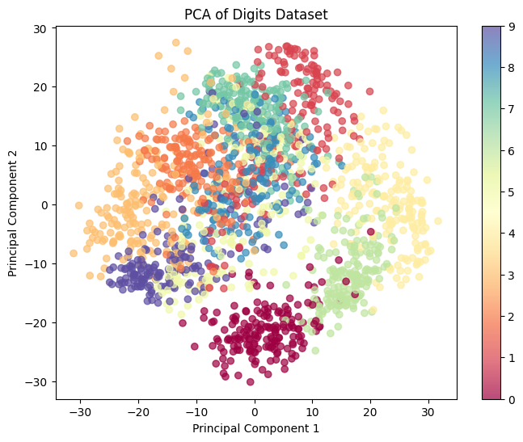

# PCA

_主成分分析，Principal Component Analysis；用於數據降維和可視化的算法_

<br>

## 說明

1. PCA 是一種統計方法和算法，主要目的是通過對數據進行 `線性變換`，找到一組新的 `正交坐標軸`，這個軸就是 `主成分`，並按數據的方差大小排序。

<br>

2. PCA 通過找到數據的最大方差方向來降維，同時最小化訊息損失，本質上是一個用於數據降維的數學方法，所以特別注意，PCA 跟分類或回歸這樣的有監督學習的算法不同，它是作為數據處理的一部分來輔助機器學習。

<br>

3. 延續前一點；PCA 用於降維的線性變換技術，可將高維數據投影到低維空間，同時保留數據中的最大變異性，通過識別數據中變異性最大的方向（主成分），在降維的過程中去除掉那些對數據整體變化影響較小的特徵。這不僅有助於簡化數據集、減少計算量，還有助於降低噪聲、避免過擬合。

<br>

## 範例

_PCA 進行降維的步驟_

<br>

1. 以下對 `Scikit-learn` 中的 `digits` 數據集使用 PCA 進行降維，這個數據集是一個迷你的手寫數字數據集，包含 `1797` 個樣本，樣本是 `8x8` 像素的灰度圖像，每個樣本有 `64` 個特徵（8x8像素），而每個數字（0-9）都有約 `180` 個樣本，這些特徵可以被看作 `64` 維的數據，將使用 `PCA` 將其降維至 `2` 維，以便進行可視化。

    ```python
    import numpy as np
    import matplotlib.pyplot as plt
    from sklearn.datasets import load_digits
    from sklearn.decomposition import PCA

    # 加載手寫數字數據集
    digits = load_digits()
    X, y = digits.data, digits.target

    # 查看數據集的大小和形狀
    # (1797, 64)
    print("數據集特徵矩陣形狀:", X.shape)
    # (1797,)
    print("數據集目標向量形狀:", y.shape)

    # 初始化 PCA，設定將數據降至2維
    pca = PCA(n_components=2)

    # 將數據集進行降維
    X_pca = pca.fit_transform(X)
    # (1797, 2)
    print("降維後的數據形狀:", X_pca.shape)

    # 將數據集從 `64` 維降至 `2` 維，以便進行可視化
    # 繪製 PCA 降維後的數據
    plt.figure(figsize=(8, 6))
    scatter = plt.scatter(
        X_pca[:, 0], X_pca[:, 1], 
        c=y, cmap='Spectral', alpha=0.7
    )
    plt.colorbar(scatter)
    plt.title('PCA of Digits Dataset')
    plt.xlabel('Principal Component 1')
    plt.ylabel('Principal Component 2')
    plt.show()
    ```

<br>

2. 輸出資訊。

    

<br>

3. 圖片中展示使用 `PCA` 對 `Digits 數據集` 進行降維後的結果，降維後的兩個新特徵稱為主成分，這些主成分是從原始特徵中線性組合而來，並且保留了數據中最大的變異性；圖中的 colorbar 顯示了不同顏色和數字之間的對應關係，可透過顏色聚集來觀察分類結果。

    

<br>

___

_END_