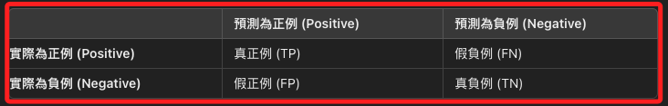
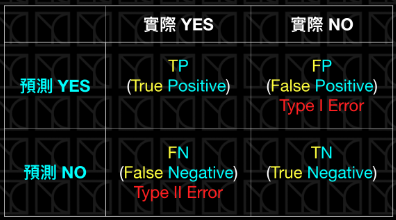

# 混淆矩陣（Confusion Matrix）

_[網路截圖](https://ithelp.ithome.com.tw/articles/10254593)_


<br>

## 說明

1. 混淆矩陣是用於評估 `分類模型` 性能的一種工具，特別適用於 `二元分類` 和 `多類分類` 問題。

<br>

2. 混淆矩陣提供了真實類別與模型預測類別之間的比較，並能夠展示模型在哪些類別上表現良好，在哪些類別上容易出錯。

<br>

3. 混淆矩陣是一個方陣，其中橫軸表示模型的 `預測標籤（Predicted Label）`，縱軸表示 `真實標籤（True Label）`；所稱的 `橫軸` 就是 `row`、列，縱軸就是 `column`、欄，矩陣中的每個元素代表的是該分類的樣本數量。

<br>

4. 在一開始的混淆矩陣圖片中，第一象限與第三象限中有關於 `型一誤` 與 `型二誤` 的描述，這在許多文章或是書籍都會見到，但是在機器學習領域的混淆矩陣中，並沒有嚴格定義型一誤和型二誤，這些術語的使用更多的是借用了統計學的概念，用來描述錯誤類型以便對結果進行解釋和分析，更多是非學術定義中流行的描述方式，而不是機器學習領域的嚴格定義，特別注意，避免錯誤理解與不當描述。

<br>

## 混淆矩陣的結構

_對於二元分類問題，混淆矩陣通常是 2x2 的矩陣，結構如下_



1. TP（True Positive，真正例）：模型正確地將正例分類為正例。

<br>

2. TN（True Negative，真負例）：模型正確地將負例分類為負例。

<br>

3. FP（False Positive，假正例）：模型錯誤地將負例分類為正例，概念類似於統計學的 `Type I Error`，虛無假設為真卻拒絕虛無假設，也就是被判定為正例，但實際是無效果的，也就是偽陽性。

<br>

4. FN（False Negative，假負例）：模型錯誤地將正例分類為負例，概念類似於統計學的 `Type II Error`，無法拒絕錯誤的虛無假設，也就是被判定為負例，但實際上是正例，也就是偽陰性。

<br>

## 混淆矩陣的使用

1. 混淆矩陣可以用來計算多種性能指標，如 `準確率（Accuracy）`、`精確率（Precision）`、`召回率（Recall）`、`F1分數（F1-Score）` 等。

<br>

2. 以下範例使用 Keras 提供的 MNIST 數據集來演示如何構建一個簡單的 `人工神經網絡（ANN）` 模型，並使用 `混淆矩陣` 來評估模型的性能，這是一個相對較為複雜得多維度矩陣，可用於處理多分類問題。

    ```python
    import numpy as np
    import matplotlib.pyplot as plt
    from tensorflow.keras.models import Sequential
    from tensorflow.keras.layers import Dense, Flatten
    from tensorflow.keras.utils import to_categorical
    from tensorflow.keras.datasets import mnist
    from sklearn.metrics import confusion_matrix, ConfusionMatrixDisplay

    # 加載 MNIST 數據集
    (X_train, y_train), (X_test, y_test) = mnist.load_data()

    # 數據預處理：將影像數據轉換為浮點數並歸一化
    X_train = X_train.astype('float32') / 255
    X_test = X_test.astype('float32') / 255

    # 將類別標籤進行 One-hot 編碼
    y_train = to_categorical(y_train, 10)
    y_test = to_categorical(y_test, 10)

    # 建立簡單的 ANN 模型
    model = Sequential()
    # 展平層
    model.add(Flatten(input_shape=(28, 28)))
    # 第一個隱藏層
    model.add(Dense(128, activation='relu'))
    # 輸出層
    model.add(Dense(10, activation='softmax'))

    # 編譯模型
    model.compile(
        loss='categorical_crossentropy', 
        optimizer='adam', 
        metrics=['accuracy']
    )

    # 訓練模型
    model.fit(
        X_train, y_train, 
        epochs=10, 
        batch_size=128, 
        verbose=1, 
        validation_data=(X_test, y_test)
    )

    # 使用測試集進行預測
    y_pred = model.predict(X_test)

    # 將預測結果轉為類別索引
    y_pred_classes = np.argmax(y_pred, axis=1)
    # 將真實標籤轉為類別索引
    y_true = np.argmax(y_test, axis=1)

    # 生成混淆矩陣
    cm = confusion_matrix(y_true, y_pred_classes)

    # 可視化混淆矩陣
    disp = ConfusionMatrixDisplay(confusion_matrix=cm)
    disp.plot()
    plt.title('混淆矩陣')
    plt.show()
    ```

<br>

3. 以上代碼可輸出以下 `10x10` 的混淆矩陣，與前面介紹的相同，橫向列表示模型的預測標籤、縱向行代表。

    

<br>

## 混淆矩陣的優點

1. 能夠顯示模型在不同類別上的具體表現。

<br>

2. 幫助識別分類錯誤的類別，這有助於調整模型或數據處理流程。

<br>

3. 能夠計算其他重要的分類指標，如 `精確率（Precision）`、`召回率（Recall）` 和 `F1 分數（F1-Score）`。

<br>

## 統計學的誤差矩陣與機器學習的混淆誤差

_特別注意，兩個領域在型一誤與型二誤的位置是不同的_

<br>

1. 統計。

    

<br>

2. 機器學習。

    

<br>

___

_END_